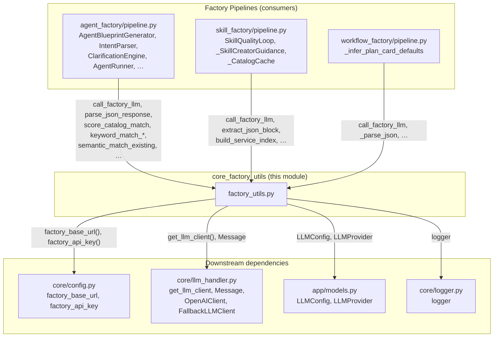
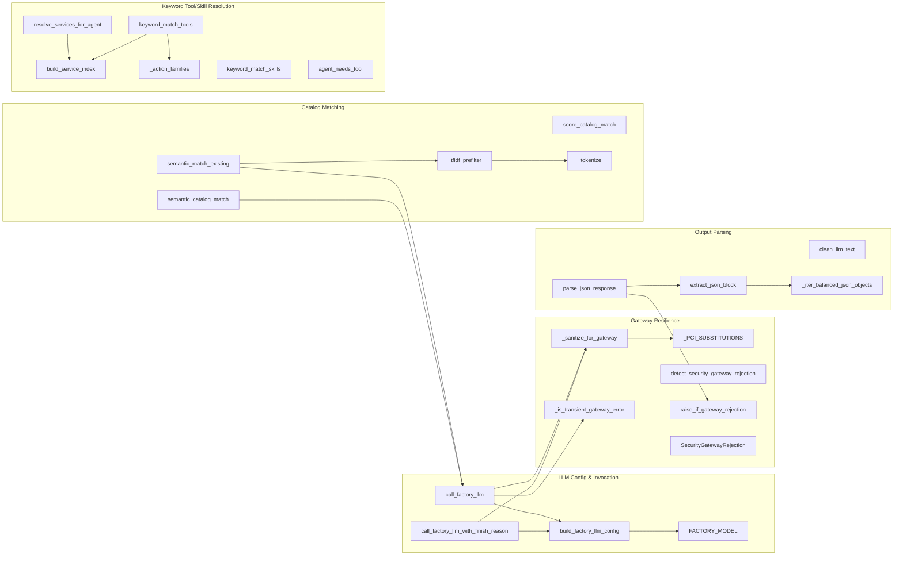
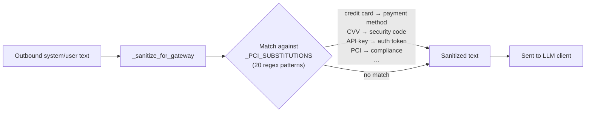
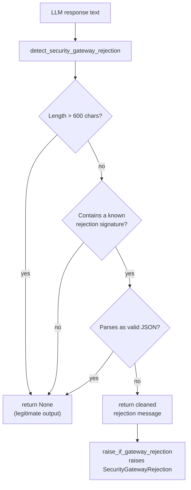
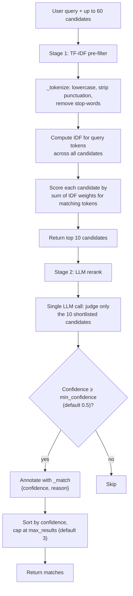
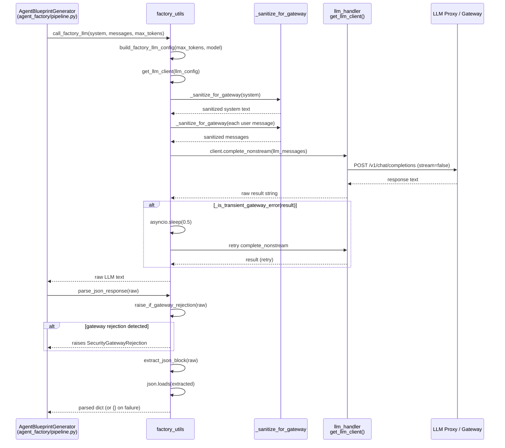

# core_factory_utils

> Shared LLM plumbing, JSON extraction, and catalog-matching utilities consumed by every ABStudio factory pipeline (Agent, Workflow, Skill).

## Introduction

`app/core/factory_utils.py` is the single consolidation point for logic that was previously duplicated across the three factory pipelines. Rather than each factory re-implementing LLM configuration, gateway-error handling, JSON parsing, and tool/skill matching, they all delegate to this module. The module is intentionally framework-agnostic — it knows nothing about agents, workflows, or skills as domain objects; it operates on plain dicts, strings, and message lists.

The module's responsibilities fall into five layers:

| Layer | Key functions | Purpose |
|-------|--------------|---------|
| **LLM configuration & invocation** | `build_factory_llm_config`, `call_factory_llm`, `call_factory_llm_with_finish_reason` | Resolve the model, build an `LLMConfig`, and execute the call through the project's `llm_handler` client. |
| **Gateway resilience** | `_sanitize_for_gateway`, `_is_transient_gateway_error`, `detect_security_gateway_rejection`, `raise_if_gateway_rejection` | Replace PCI-trigger words, detect transient blips (retry once), and surface content-filter blocks as actionable errors. |
| **LLM output parsing** | `clean_llm_text`, `extract_json_block`, `_iter_balanced_json_objects`, `parse_json_response` | Strip reasoning tags / fences / quotes and isolate the largest valid JSON object from a mixed-prose reply. |
| **Catalog matching** | `score_catalog_match`, `semantic_catalog_match`, `semantic_match_existing`, `_tfidf_prefilter` | Score string matches, fall back to LLM semantic matching for gaps, and detect near-duplicate existing items. |
| **Keyword tool/skill resolution** | `build_service_index`, `keyword_match_tools`, `keyword_match_skills`, `resolve_services_for_agent`, `agent_needs_tool` | Derive a per-service keyword index from the live catalog and match agents to tools/skills without an LLM call. |

---

## Architecture

### Module position in the system



### Internal component map



---

## Detailed component documentation

### 1. LLM configuration & invocation

#### `FACTORY_MODEL`

A module-level constant resolved at import time from the environment:

```
FACTORY_MODEL = os.getenv("FACTORY_MODEL", os.getenv("LOCAL_LLM_MODEL", "claude-sonnet-4-6"))
```

This is the single source of truth for which model the factory layer uses. The `AgentAssembler` stamps it onto every assembled agent's `model` field, and `AgentRunner` falls back to it when an agent row has no explicit model.

#### `build_factory_llm_config(max_tokens, temperature, model)`

Constructs an `LLMConfig` (from `app/models.py`) with `provider=LLMProvider.CUSTOM`. The `base_url` and `api_key` are resolved through `app.core.config.factory_base_url()` and `factory_api_key()`, which themselves cascade through `FACTORY_BASE_URL` → `LLM_PROXY_URL` → `LOCAL_LLM_BASE_URL` → `localhost:11434/v1`. This delegation ensures the factory layer hits `${LLM_PROXY_URL}/v1` in SIT/prod rather than falling through to a local Ollama that doesn't exist there.

> See [core_config](../infrastructure/core_config.md) for the full resolution chain of `factory_base_url` and `factory_api_key`.

#### `call_factory_llm(system, messages, max_tokens, model, temperature, response_format) -> str`

The primary LLM call wrapper used by every factory. Key behaviours:

1. **PCI sanitization** — all outbound `system` and `user` text is run through `_sanitize_for_gateway` before being sent. Assistant prefill (e.g. `"{"`) is left untouched.
2. **Non-streaming preference** — when the client supports `complete_nonstream`, factory calls use it. Some gateways return `"Error generating response"` (a 200 with no real content) on the streaming endpoint for large-generation requests, while the same request succeeds on the non-streaming endpoint. Factory calls wait for a full JSON blob and gain nothing from streaming. Override with `FACTORY_LLM_FORCE_STREAM=1`.
3. **Transient-error retry** — if the result matches the gateway's transient-failure sentinel (`"error generating response"` in a short body), the call is retried once after a 0.5s delay. This is far cheaper than letting a factory step fail and regenerate an entire 8000-token draft.
4. **Timing logging** — when `FACTORY_LLM_TIMING != "0"` (default on), logs elapsed wall-clock, model, token cap, and output size so slow pipeline stages are visible without a profiler.

#### `call_factory_llm_with_finish_reason(...) -> tuple[str, str]`

Identical to `call_factory_llm` but delegates to `client.complete_with_finish_reason` and returns `(text, finish_reason)`. The `finish_reason` is one of `"stop"`, `"length"`, `"tool_calls"`, `"content_filter"`, or `""` when the provider omits it.

This is the only function exported as a "core component" of this module. It is used by `SwarmOrchestrator._call_llm` to authoritatively detect a `max_tokens` cap hit instead of guessing from response shape. All other callers should keep using `call_factory_llm`.

> See [core_llm_handler](../models/core_llm_handler.md) for the `OpenAIClient`, `FallbackLLMClient`, and `Message` classes that execute the actual HTTP call.

---

### 2. Gateway resilience

The NPCI content gateway sits between the factory and the upstream LLM provider. It has two failure modes that this module handles:

#### PCI trigger-word sanitization



`_PCI_SUBSTITUTIONS` is a list of 20 `(compiled_regex, replacement)` pairs covering financial/PCI terms (`credit card`, `debit card`, `card number`, `CVV`, `PAN`, `card holder`, `expiry date`), credential-adjacent terms (`API key`, `secret key`, `access token`, `password`, `SSN`), and sensitive action phrases (`exfiltrate`, `scrape`, `hack`, `exploit`, `PCI`, `PCI-DSS`). The substitutions are semantically equivalent so the LLM still understands the intent.

#### Transient-error detection

`_is_transient_gateway_error(text)` returns `True` when the response body is empty or is a short string (< 120 chars) containing the sentinel `"error generating response"`. The strict length check ensures legitimate model output that merely mentions the phrase inside a longer answer is never mistaken for a failure.

#### Security gateway rejection detection



`_GATEWAY_REJECTION_SIGNATURES` is a tuple of 18 lowercase substrings (`"request blocked"`, `"blocked by"`, `"pci violation"`, `"policy violation"`, `"content filtered"`, `"guardrail"`, `"moderation"`, `"safety filter"`, etc.). The heuristic requires **both** a signature hit **and** the response not being valid JSON — gateway rejections are always short, broken text, while real LLM JSON output that legitimately uses some of these words (e.g. an agent named "Policy Violation Detector") would parse as JSON and be treated as legitimate.

`SecurityGatewayRejection(ValueError)` is raised by `raise_if_gateway_rejection(text, context=...)`. Callers that catch this can surface a user-actionable error without retrying (retrying a blocked request is wasted latency). The factory pipelines let this propagate to the user rather than silently degrading to `{}`.

---

### 3. LLM output parsing

#### `clean_llm_text(raw) -> str`

Strips three common LLM output artifacts:
1. **Reasoning tags** — removes `</think>...` blocks emitted by reasoning models (Qwen3, DeepSeek-R1).
2. **Markdown code fences** — if the text is wrapped in `` ``` `` fences, extracts the inner content.
3. **Wrapping quotes** — strips surrounding `"` or `'` if the entire string is quoted.

#### `extract_json_block(raw) -> str`

Isolates the largest valid JSON object inside an LLM reply. This is critical because large models frequently mix prose with literal braces before the actual JSON payload (e.g. mentioning `{classifier, summarizer}` in an explanation).

```mermaid
flowchart TD
    A["Raw LLM text"] --> B{"```json or ```<br/>fence exists?"}
    B -->|"yes"| C["Extract fenced content<br/>as first candidate"]
    B -->|"no"| D["Use raw text<br/>as candidate"]
    C --> E["Also add raw text<br/>as second candidate"]
    D --> E
    E --> F["_iter_balanced_json_objects<br/>for each candidate"]
    F --> G{"For each balanced {...}<br/>span: json.loads succeeds?"}
    G -->|"yes"| H["Track longest<br/>parseable span"]
    G -->|"no"| I["Skip span"]
    H --> J{"Found at least<br/>one valid span?"}
    J -->|"yes"| K["Return longest span"]
    J -->|"no"| L["Return raw text<br/>(caller's json.loads<br/>surfaces the real error)"]
```

`_iter_balanced_json_objects(text)` is the core scanner. It walks each `{` in the text, tracks brace depth while ignoring braces inside string literals (handling `\"` and `\\` escape sequences), and yields each balanced `{...}` substring. The caller validates each span with `json.loads` and keeps the longest one that parses.

#### `parse_json_response(text) -> dict`

The top-level JSON parser used by all factories. Pipeline:
1. `raise_if_gateway_rejection(text)` — propagates `SecurityGatewayRejection` if the response is a gateway block.
2. `extract_json_block(text.strip())` — isolates the JSON.
3. `json.loads` — returns `{}` on `JSONDecodeError` (with a warning log).

---

### 4. Catalog matching

#### `score_catalog_match(requested, item) -> float`

Deterministic string-matching scorer (no LLM call). Returns a float from 0.0 to 1.0:

| Condition | Score |
|-----------|-------|
| Exact name match (normalized) | 1.0 |
| `requested` is a substring of `name` or vice versa | 0.9 |
| All significant words (> 3 chars) in `requested` appear in `name` or `description` | 0.85 |
| ≥ 60% of `requested` words match | 0.5 + ratio × 0.3 |
| Otherwise | 0.0 |

`MATCH_THRESHOLD = 0.8` is the cutoff used by `ToolSkillMatcher._rank` (agent factory) and the workflow factory's equivalent matcher. Both delegate to this single implementation.

#### `semantic_catalog_match(unmatched, catalog) -> list[dict]`

LLM-powered fallback for capability gaps that string matching misses. Makes a **single** LLM call regardless of how many gaps there are. The system prompt instructs the model to map each requested capability to the closest catalog entry, returning `{"matches": [{"requested": ..., "catalog_name": ...}]}`. Only matches whose `catalog_name` exists in the actual catalog are returned. Fails safe (returns `[]`) on any error.

Used by `ToolSkillMatcher._semantic_match` in the agent factory.

#### `semantic_match_existing(query, candidates, max_results, min_confidence) -> list[dict]`

Detects whether a user's "create with AI" request is already covered by an existing workflow, agent, or skill. Uses a two-stage approach:



**Configuration (env-overridable):**

| Env var | Default | Purpose |
|---------|---------|---------|
| `FACTORY_EXISTING_MATCH_MIN_CONFIDENCE` | 0.5 | Confidence floor for surfacing a match |
| `FACTORY_EXISTING_MATCH_MAX_CANDIDATES` | 60 | Hard cap on candidates sent to the LLM |
| `FACTORY_EXISTING_MATCH_TIMEOUT_S` | 30 | LLM call timeout; on timeout returns `[]` (fail safe) |
| `FACTORY_MATCH_PREFILTER_TOP_N` | 10 | TF-IDF shortlist size |

Fails safe on any error (LLM unavailable, unparseable output, gateway block, timeout) — returns `[]` so the factory silently proceeds to build new rather than erroring the whole chat turn.

---

### 5. Keyword tool/skill resolution

This layer provides LLM-free tool/skill matching using a dynamically derived service index, so it covers every current and future catalog service with zero hardcoding.

#### `build_service_index(available_tools) -> dict`

Derives a per-service index from the live tool catalog:

```
{
  "gitlab": {"keywords": {"gitlab", "merge", "request", "code", "review", ...}, "tools": [...]},
  "jira":   {"keywords": {"jira", "sprint", "ticket", "backlog", ...}, "tools": [...]},
  ...
}
```

Keywords are drawn from the service name plus every tool's name and description, with stop-words and action verbs removed (via `_SERVICE_INDEX_STOPWORDS`). A small hand-tuned seed (`_SERVICE_ALIASES` for gitlab/jira) is merged on top for precision. Pure in-memory over the already-cached catalog — the `_CatalogCache` in `skill_factory/pipeline.py` caches the derived index on the 60s catalog TTL.

#### `keyword_match_tools(agent_name, agent_instructions, available_tools, ...) -> list[str]`

Matches tools to an agent using the service index. Scoring logic:

1. **Service matching** — a service matches when the agent's search text explicitly names it or shares ≥ 1 derived keyword.
2. **Action-family scoring** — tools are scored by whether their action family (read/create/update/delete, derived via `_action_families`) matches the agent's. A "Fetcher" (read) agent gets `get_issue` rather than `add_comment`. Family match: +3; family conflict (agent is read-only, tool is write): -2; no overlap: 0.
3. **Topical noun overlap** — secondary tiebreaker: tool name/description words that appear in the agent's instructions.

Returns up to `max_per_service` (default 3) names per matched service, capped at 3 total.

#### `keyword_match_skills(agent_name, agent_instructions, available_skills, max_skills) -> list[str]`

Matches skills by checking if the agent's name (and optionally instructions) mention a known keyword from `SKILL_KEYWORDS` (e.g. `"excel"` → `"xlsx"`, `"powerpoint"` → `"pptx"`, `"pdf"` → `"pdf"`). Returns up to `max_skills` (default 2) matched skill names.

#### `resolve_services_for_agent(agent_name, agent_instructions, service_index) -> list[str]`

Returns catalog services whose keywords the agent's job mentions, ordered by match strength. Callers use the result shape:
- **1 service** → assign silently
- **2+ services** → ambiguous, ask the user
- **0 services** → capability likely missing, report it

Direct service-name mentions (e.g. "Jira REST API") are authoritative and suppress weaker keyword-only guesses.

#### `agent_needs_tool(agent_name, agent_instructions) -> bool`

Heuristic determining whether an agent's job requires an external action (a tool). Conservative on both sides:
- **Unambiguous external verbs** (`fetch`, `send`, `notify`, `analyse`, `review`, `read`, `inspect`, etc.) → `True`
- **Ambiguous verbs** (`create`, `write`, `update`, `delete`) → `True` only when paired with an external-target noun (`issue`, `ticket`, `channel`, `record`, `pr`, `mr`, etc.)
- **"intake" or "look up" phrasing** → `True`
- **Pure reasoning jobs** (summarize, classify, draft a reply) → `False`

---

## Data flow: a factory LLM call end-to-end



---

## Consumer interaction map

```mermaid
graph TB
    subgraph "agent_factory/pipeline.py"
        IP["IntentParser"]
        CE["ClarificationEngine"]
        ABG["AgentBlueprintGenerator"]
        CA["CapabilityAudit"]
        TSM["ToolSkillMatcher"]
        DSG["DynamicSkillGenerator"]
        DTG["DynamicToolGenerator"]
        AR["AgentRunner"]
        AA["AgentAssembler"]
    end

    subgraph "skill_factory/pipeline.py"
        SQL["SkillQualityLoop"]
        SCG["_SkillCreatorGuidance"]
        CC["_CatalogCache"]
    end

    subgraph "workflow_factory/pipeline.py"
        IPC["_infer_plan_card_defaults"]
    end

    subgraph "factory_utils.py"
        CFL["call_factory_llm"]
        PJR["parse_json_response"]
        EJB["extract_json_block"]
        SCM["score_catalog_match"]
        SEMCAT["semantic_catalog_match"]
        SEMEX["semantic_match_existing"]
        KMT["keyword_match_tools"]
        KMS["keyword_match_skills"]
        BSI["build_service_index"]
        RIGR["raise_if_gateway_rejection"]
        SGR["SecurityGatewayRejection"]
    end

    IP --> CFL
    IP --> PJR
    IP --> RIGR
    CE --> CFL
    CE --> PJR
    ABG --> CFL
    ABG --> EJB
    CA --> SCM
    TSM --> SCM
    TSM --> SEMCAT
    DSG --> CFL
    DTG --> CFL
    AR --> CFL
    AA --> KMT
    AA --> KMS

    SQL --> CFL
    SQL --> PJR
    SCG --> CFL
    CC --> BSI

    IPC --> CFL
    IPC --> PJR
    IPC --> SGR
```



---

## Environment variables

| Variable | Default | Effect |
|----------|---------|--------|
| `FACTORY_MODEL` | `claude-sonnet-4-6` (or `LOCAL_LLM_MODEL`) | Model used by all factory LLM calls |
| `FACTORY_BASE_URL` | (cascades to `LLM_PROXY_URL` → `LOCAL_LLM_BASE_URL` → `localhost:11434/v1`) | Base URL for the OpenAI-compatible endpoint |
| `FACTORY_API_KEY` | (cascades to `LOCAL_LLM_API_KEY` → `LLM_PROXY_TOKEN` → `"not-needed"`) | API key for the endpoint |
| `FACTORY_LLM_TIMING` | `1` | Set to `0` to silence per-call timing logs |
| `FACTORY_LLM_FORCE_STREAM` | `0` | Set to `1` to force the streaming path instead of non-streaming |
| `FACTORY_EXISTING_MATCH_MIN_CONFIDENCE` | `0.5` | Confidence floor for `semantic_match_existing` |
| `FACTORY_EXISTING_MATCH_MAX_CANDIDATES` | `60` | Hard cap on candidates sent to the LLM |
| `FACTORY_EXISTING_MATCH_TIMEOUT_S` | `30` | Timeout for the existing-match LLM call |
| `FACTORY_MATCH_PREFILTER_TOP_N` | `10` | TF-IDF shortlist size for `semantic_match_existing` |

---

## Related modules

- [core_config](../infrastructure/core_config.md) — `factory_base_url()` and `factory_api_key()` resolution chain, `LLM_PROXY_URL` routing.
- [core_llm_handler](../models/core_llm_handler.md) — `OpenAIClient`, `FallbackLLMClient`, `Message`, `get_llm_client()`, and the `complete` / `complete_nonstream` / `complete_with_finish_reason` methods that execute the actual HTTP call.
- [agent_factory_pipeline](../agents/agent_factory_pipeline.md) — `AgentBlueprintGenerator`, `IntentParser`, `ClarificationEngine`, `CapabilityAudit`, `ToolSkillMatcher`, `AgentRunner`, `AgentAssembler`, `DynamicSkillGenerator`, `DynamicToolGenerator`.
- [skill_factory_pipeline](../agents/skill_factory_pipeline.md) — `SkillQualityLoop`, `_SkillCreatorGuidance`, `_CatalogCache` (caches the `build_service_index` result on the catalog TTL).
- [workflow_factory_pipeline](../workflows/workflow_factory_pipeline.md) — `_infer_plan_card_defaults` and the workflow factory's tool/skill assignment logic.
- [app_models](../models/app_models.md) — `LLMConfig` and `LLMProvider` data models.
