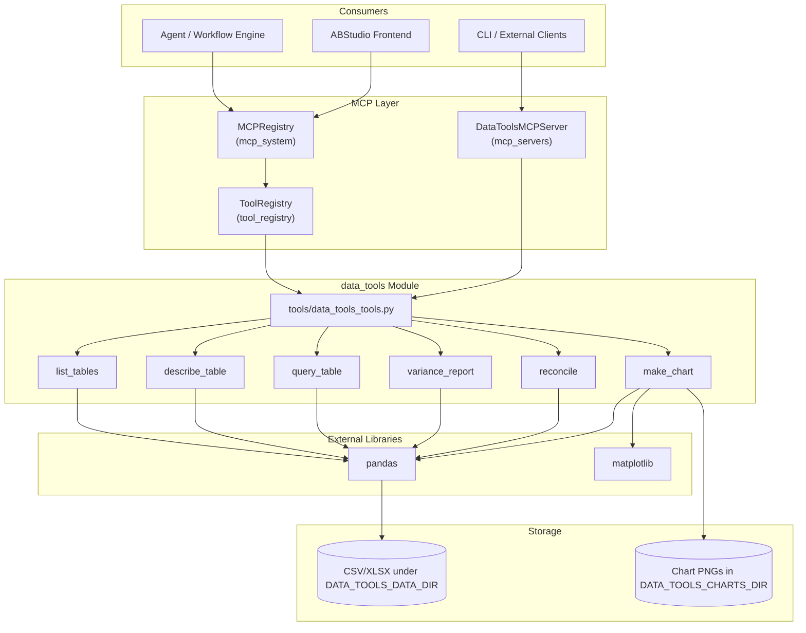
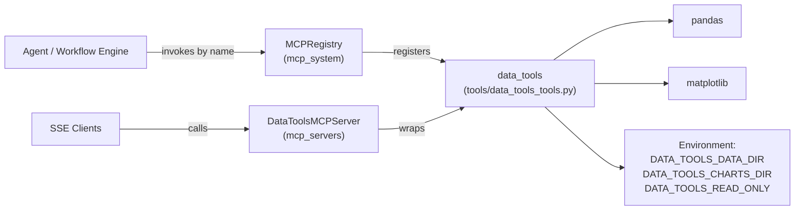
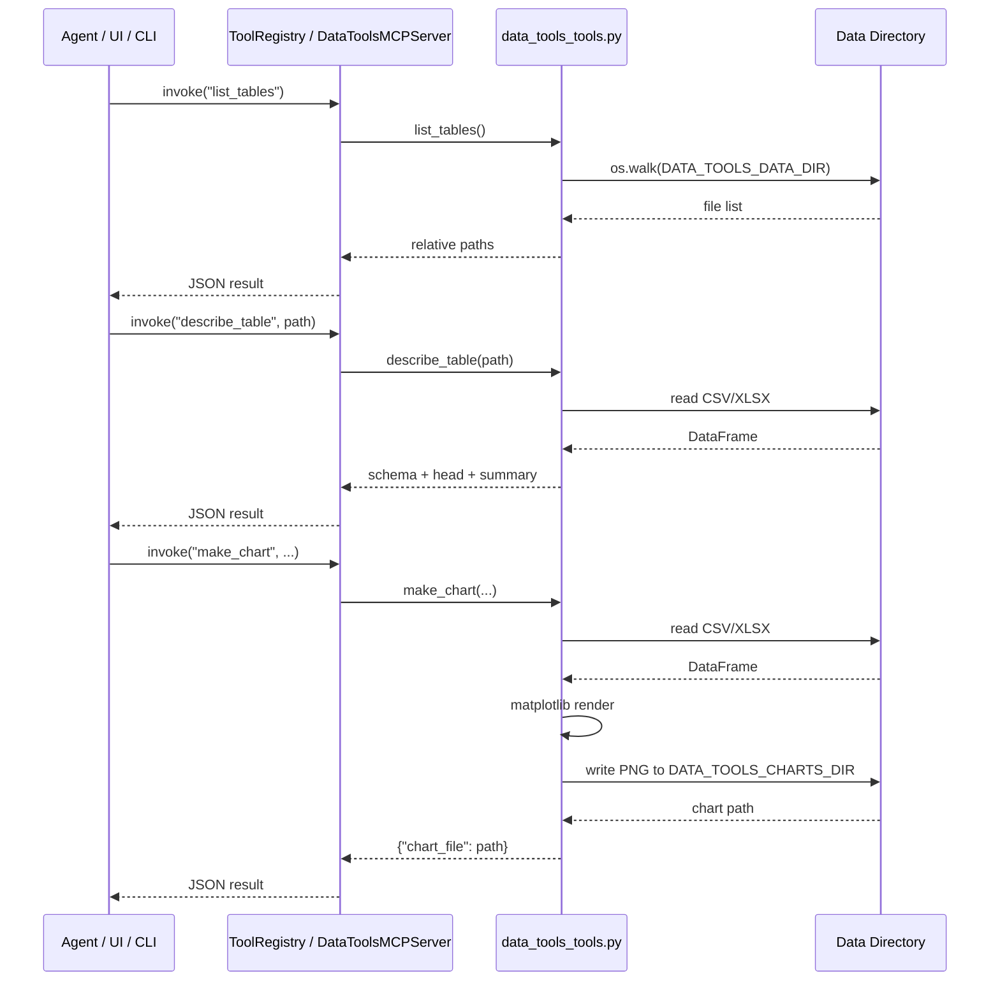
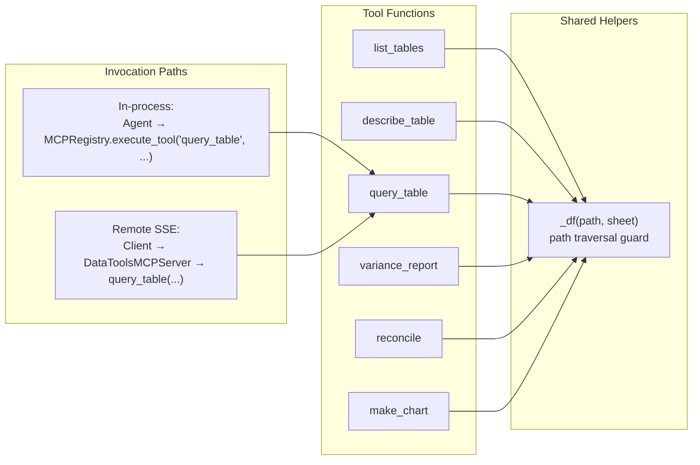
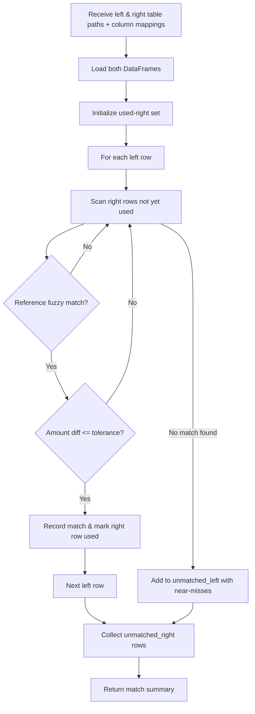
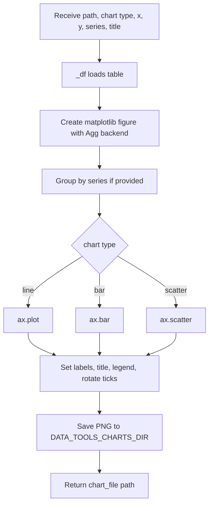

# data_tools Module

## Brief Introduction

The `data_tools` module provides a read-only, tabular-analysis toolkit for the NPCI Agentic Platform. It operates on CSV/XLSX sources located under a configured data root and exposes six MCP tools: table discovery, schema inspection, pandas-style querying, budget-variance reporting, fuzzy transaction reconciliation, and chart generation. The module is designed to be invoked both directly (via the in-process `ToolRegistry`) and remotely (via the `DataToolsMCPServer` over SSE).

Supported use cases include UC-69 (reconciliation), UC-70 (budget variance), UC-83/UC-84 (survey and VoC analysis), UC-90/UC-91 (data analysis and dashboard generation), and UC-97 (churn-risk scoring).

---

## Core Responsibilities

| Capability | Description |
|------------|-------------|
| **Discovery** | List all CSV/XLSX tabular sources under `DATA_TOOLS_DATA_DIR`. |
| **Inspection** | Return column types, row counts, sample rows, and numeric summaries. |
| **Querying** | Apply pandas filter expressions, grouping, and aggregation. |
| **Variance Analysis** | Compare budget vs. actual columns and flag rows exceeding a threshold. |
| **Reconciliation** | Fuzzy-match two transaction tables by reference and amount tolerance. |
| **Visualization** | Render line, bar, or scatter charts to a configured charts outbox. |

All input data access is read-only. The only writes performed are chart PNGs emitted to `DATA_TOOLS_CHARTS_DIR`.

---

## Architecture



### Component Roles

- **`tools/data_tools_tools.py`** — Pure Python implementations of the six tabular-analysis tools. Contains no HTTP or framework logic.
- **`DataToolsMCPServer`** — Wraps the six functions as MCP tools with JSON schemas and exposes them over SSE. See [mcp_servers](../mcp/mcp_servers.md) for server mechanics.
- **`MCPRegistry` / `ToolRegistry`** — Bootstrap the tools at platform startup so agents and workflows can invoke them by name. See [mcp_system](../mcp/mcp_system.md) and [tool_registry](../tool_registry.md).
- **`pandas` / `matplotlib`** — Data manipulation and chart rendering. Matplotlib is forced to the `Agg` backend for headless execution.

---

## Dependencies



### Internal Module References

| Related Module | Relationship |
|----------------|--------------|
| [mcp_system](../mcp/mcp_system.md) | `MCPRegistry._register_tools()` imports and registers all six `data_tools` functions into the platform-wide `ToolRegistry`. |
| [mcp_servers](../mcp/mcp_servers.md) | `DataToolsMCPServer` exposes the same six functions as MCP-over-SSE tools. |
| [tool_registry](../tool_registry.md) | Stores `ToolDefinition` records, executes tools, and captures timing/errors. |
| [shared_integrations](shared_integrations.md) | `data_tools` is one tool family within the broader integration toolset (alongside `document_tools`, `calendar_tools`, etc.). |

---

## Data Flow



---

## Component Interaction



Every tool delegates file loading to `_df()`, which:

1. Joins the relative `path` with `DATA_TOOLS_DATA_DIR`.
2. Normalizes the path and rejects any path that escapes the data root.
3. Dispatches to `pd.read_csv()` or `pd.read_excel()` based on extension, using the `xlrd` engine for legacy `.xls` files.

---

## Tool Reference

### `list_tables() -> List[str]`

Recursively discovers CSV, XLSX, and XLS files under `DATA_TOOLS_DATA_DIR` and returns their paths relative to the data root.

### `describe_table(path: str, sheet: str = "") -> dict`

Returns:

- `columns`: mapping of column name to pandas dtype string.
- `rows`: total row count.
- `head`: first five rows as records.
- `numeric_summary`: `DataFrame.describe()` output for numeric columns.

### `query_table(path, filter_expr, group_by, aggregate, sheet, limit) -> List[dict]`

Supports pandas-style filter expressions (e.g., `"dept == 'HR' and amount > 100"`), comma-separated `group_by` columns, and aggregate functions (`sum`, `mean`, `count`). Results are rounded to three decimals and capped by `limit` (default 100).

### `variance_report(path, budget_col, actual_col, label_col, flag_pct, sheet) -> List[dict]`

Computes `(actual - budget) / budget * 100` per row and flags rows whose absolute variance percentage meets or exceeds `flag_pct` (default 5%). Marked with `pci_audit=True` in the MCP server wrapper.

### `reconcile(left_path, right_path, amount_col_left, amount_col_right, ref_col_left, ref_col_right, tolerance) -> dict`

Performs a one-sided fuzzy match:

- A row matches if the right-hand reference contains the left-hand reference (or vice versa) **and** the amount difference is within `tolerance`.
- Returns counts of matched rows plus `unmatched_left` (with near-miss candidates) and `unmatched_right`.

Marked with `pci_audit=True` in the MCP server wrapper.

### `make_chart(path, chart, x, y, series, title, sheet) -> dict`

Renders a `line`, `bar`, or `scatter` chart using matplotlib. Optional `series` column produces grouped series. The PNG is written to `DATA_TOOLS_CHARTS_DIR` and the file path is returned.

---

## Process Flows

### Variance Report

```mermaid
flowchart TD
    A[Receive path, budget_col, actual_col, label_col, flag_pct] --> B[_df loads table]
    B --> C[Drop rows with null budget/actual]
    C --> D[For each row compute variance %]
    D --> E{abs(variance %) >= flag_pct?}
    E -->|Yes| F[flagged = true]
    E -->|No| G[flagged = false]
    F & G --> H[Return list of variance records]
```

### Reconciliation



### Chart Generation



---

## Configuration

| Environment Variable | Default | Purpose |
|----------------------|---------|---------|
| `DATA_TOOLS_DATA_DIR` | `/data/tables` | Root directory for tabular sources. |
| `DATA_TOOLS_CHARTS_DIR` | `/data/mcp_outbox/charts` | Output directory for rendered chart PNGs. |
| `DATA_TOOLS_READ_ONLY` | `true` | Informational tag; the module never mutates input data. |

---

## Security & Safety Notes

- **Path traversal guard**: `_df()` rejects any resolved path that escapes `DATA_TOOLS_DATA_DIR`.
- **Read-only inputs**: The tools only read CSV/XLSX files; they do not write, delete, or modify source data.
- **PCI audit**: `variance_report` and `reconcile` are marked `pci_audit=True` in the MCP server, routing them through the platform audit pipeline.
- **Headless rendering**: Matplotlib is configured with `matplotlib.use("Agg")` before `pyplot` import to avoid display dependencies in server environments.

---

## How It Fits into the System

`data_tools` is a member of the platform's non-engineering MCP tool family. It is dual-registered:

1. **In-process** via `MCPRegistry._register_tools()` so agents, workflows, and the ABStudio backend can call the tools by name with no network hop.
2. **Remote** via `DataToolsMCPServer` so external MCP clients can consume the same capabilities over SSE.

Agents typically combine `data_tools` with [mcp_system](../mcp/mcp_system.md) orchestration, [tool_registry](../mcp/mcp_system.md) execution, and [shared_integrations](shared_integrations.md) sibling tools such as `document_tools` (for extracting source documents) and `doc_generator` (for writing analysis reports).
