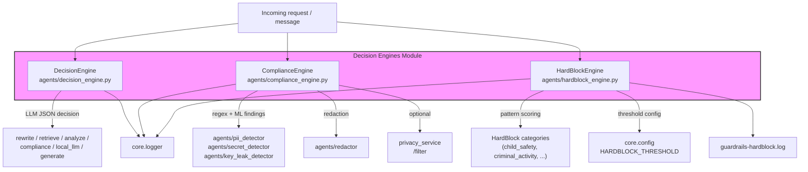
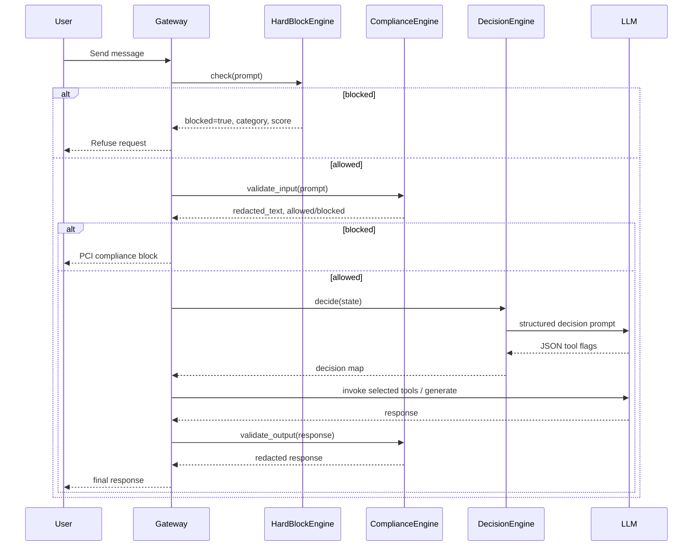

# Decision Engines

The `decision_engines` module is part of the shared agent framework under `shared_core.agent_system`. It provides deterministic and LLM-assisted guardrails that decide what an agent should do next, and whether user or model content is safe to process. The module sits between incoming requests and the rest of the agent runtime, enforcing policy before expensive LLM calls are made.

## Purpose

- **Route agent reasoning**: Decide which capabilities (rewrite, retrieve, analyze, compliance, local LLM, generate) an autonomous assistant should invoke for a given question and context.
- **Protect sensitive data**: Detect, redact, and optionally block PCI/PII and secret-bearing content in both inputs and outputs.
- **Enforce safety guardrails**: Block high-risk prompts across criminal justice, social scoring, child safety, malware, weapons, unauthorized access, and other prohibited categories using deterministic pattern matching.

## Architecture Overview

The module is intentionally split into three focused engines:

| Engine | Responsibility | See also |
|--------|----------------|----------|
| `DecisionEngine` | LLM-based routing of agent tool selection | [decision_engines_core](decision_engines_core.md) |
| `ComplianceEngine` | PCI/PII/secret detection, redaction, and blocking | [decision_engines_compliance](../security/decision_engines_compliance.md) |
| `HardBlockEngine` | Deterministic AI-safety hard blocks with weighted scoring | [decision_engines_hardblock](../storage/decision_engines_hardblock.md) |

## High-Level Functionality

### Decision Routing

`DecisionEngine.decide(state)` builds a structured prompt that asks an LLM to return a JSON object indicating which of six tools should be used. The engine parses the JSON and falls back to a safe default (`retrieve` + `generate`) if parsing fails. This keeps agent orchestration simple and stateless.

### Compliance Validation

`ComplianceEngine` runs a multi-layer pipeline:

1. **Regex detectors** for PII (PAN, Aadhaar, mobile, email, UPI, account numbers, IFSC, IP), PCI (CVV, expiry, PIN block), and secrets (AWS keys, JWT, API keys, private keys, certificates, SSH keys).
2. **ML privacy filter** (`privacy_service`) for natural-language text that regex may miss, with result caching by content hash.
3. **Redaction** via `agents/redactor`, with per-type masking rules.
4. **Blocking** when any configured type is set to `block` action.

Output validation redacts but never blocks, ensuring model responses are sanitized before reaching users.

### HardBlock Safety Gate

`HardBlockEngine.check(text)` scores text against 19 prohibited categories using weighted regex patterns. A prompt is blocked only when the computed score reaches `HARDBLOCK_THRESHOLD` (default 0.75). Context multipliers dampen tool results and code fences while boosting short prompts and multi-category hits. `child_safety` is weighted to always block.

## Data Flow

## Integration with the Rest of the System

- **Agent orchestration**: `DecisionEngine` is consumed by agent runners and ReAct-style loops to pick the next action. See [agent_orchestration](../agents/agent_orchestration.md) and [reaction_engines](reaction_engines.md).
- **Security & privacy**: `ComplianceEngine` works with the dedicated detector modules in `agents/` and the standalone `privacy_service`. See [security_privacy](../security/security_privacy.md) and [privacy_service](../security/privacy_service.md).
- **Guardrails**: `HardBlockEngine` complements the runtime guardrails in `guardrails/runtime_guardrails.py`. See [guardrails](../security/guardrails.md).
- **Observability**: All engines log through `core.logger`; `HardBlockEngine` also writes a dedicated audit log. See [core_infrastructure](../infrastructure/core_infrastructure.md).

## Configuration & Tuning

| Setting | Location | Purpose |
|---------|----------|---------|
| `COMPLIANCE_CONFIG` / `config/compliance_config.json` | `ComplianceEngine` | Per-type `enabled` and `action` (`redact` / `block` / `off`) |
| `PRIVACY_SVC_URL` | `ComplianceEngine` | URL of the ML privacy filter service |
| `COMPLIANCE_ML_CACHE_SIZE` / `COMPLIANCE_ML_CACHE` | `ComplianceEngine` | ML result LRU cache |
| `COMPLIANCE_AUDIT_LOG` | `ComplianceEngine` | Append-only audit log path |
| `HARDBLOCK_THRESHOLD` | `core.config` | Score threshold for hard blocks |

## Sub-Module Documentation

- [decision_engines_core](decision_engines_core.md) — `DecisionEngine` LLM-based tool routing.
- [decision_engines_compliance](../security/decision_engines_compliance.md) — `ComplianceEngine` PCI/PII/secret detection and redaction.
- [decision_engines_hardblock](../storage/decision_engines_hardblock.md) — `HardBlockEngine` deterministic safety guardrails.
