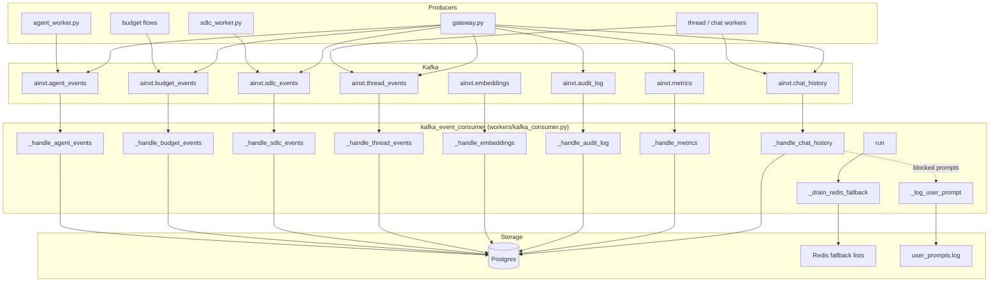
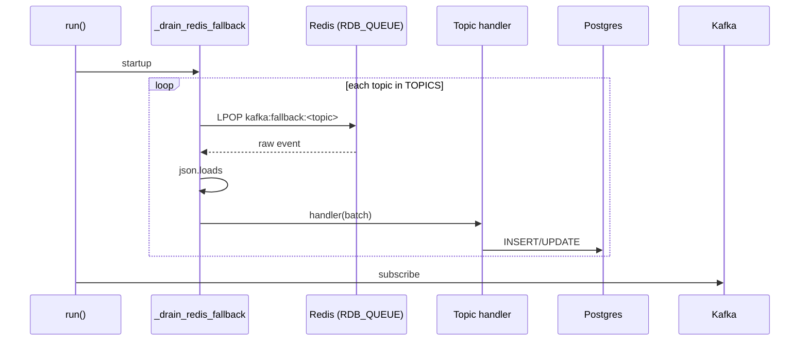
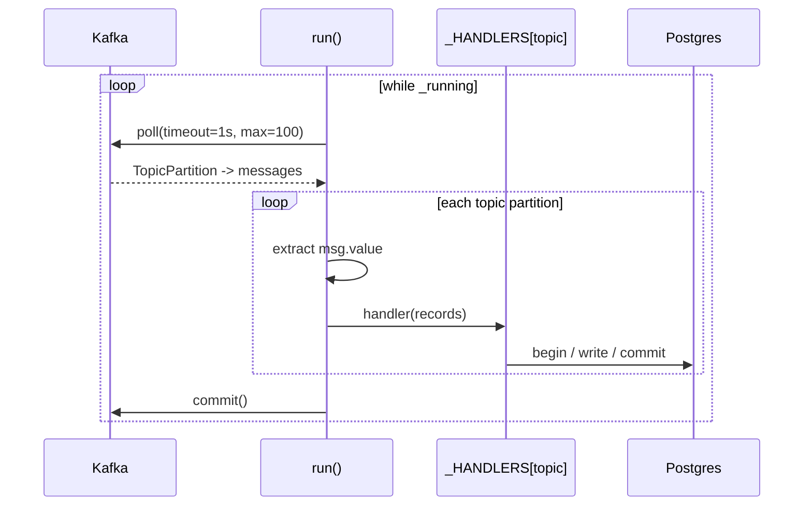

# kafka_event_consumer

The `kafka_event_consumer` module is a durable, Postgres bulk-writer service that consumes asynchronous events from Kafka and persists them into the relational database. It decouples high-throughput write paths—chat history, model usage metrics, audit logs, SDLC run events, agent conversations, thread messages, embedding metadata updates, and budget increments—from the synchronous request path, improving gateway latency and write reliability.

The consumer is implemented in `workers/kafka_consumer.py` and is started as a subprocess by the worker orchestration layer (`workers/start_workers.py --kafka`). It drains a Redis fallback queue on startup to recover events produced while Kafka was unavailable, then polls Kafka topics in batches and commits offsets only after successful Postgres writes.

---

## Architecture



### Component Overview

| Component | Responsibility |
|-----------|----------------|
| `run` | Main consumer loop: signal handling, Kafka connection, batch polling, dispatch to topic handlers, offset commit. |
| `_drain_redis_fallback` | On startup, replays events that were written to Redis fallback lists while Kafka was down. |
| `_handle_chat_history` | Upserts `Chat` rows and inserts `ChatMessage` pairs; logs compliance-blocked prompts. |
| `_handle_metrics` | Bulk-inserts `ModelUsage` rows from token/cost events. |
| `_handle_audit_log` | Bulk-inserts `RAGAccessLog` rows for RAG access audits. |
| `_handle_embeddings` | Updates `content_hash` / metadata on `DocumentEmbedding` rows. |
| `_handle_thread_events` | Inserts `ThreadMessage` rows and bumps parent `Thread.updated_at`. |
| `_handle_sdlc_events` | Persists `SDLCRun` creates and state transitions; deduplicates `SDLCRunEvent` rows via `dedupe_key`. |
| `_handle_budget_events` | Applies project budget increments and fires inbox alerts at 80% / 100% thresholds. |
| `_handle_agent_events` | Persists agent conversation turns via `PostgresMemory` and records `ModelUsage`. |
| `_log_user_prompt` | Writes compliance-blocked user prompts to `log/app/user_prompts.log`. |

---

## Data Flow

### 1. Startup Recovery

Before subscribing to Kafka, the consumer calls `_drain_redis_fallback()`. Producers across the platform write events to `kafka:fallback:<topic>` Redis lists (DB 5, the queue KV database) when Kafka is unreachable. The consumer pops these lists and routes each batch through the same handlers used for live Kafka messages, ensuring at-least-once delivery semantics.



### 2. Kafka Poll → Handler → Commit

The consumer uses `kafka-python` with `enable_auto_commit=False`. Each poll returns up to `BATCH_SIZE` (100) records per topic partition. Records are grouped by topic, passed to the matching handler, and offsets are committed only after all handlers finish. This gives each handler a chance to perform its own transaction rollback on error without advancing Kafka offsets.



---

## Topic Handlers

### `ainxt.chat_history`

Handled by `_handle_chat_history`. Supports two event shapes:

1. **Legacy single message** — `role` + `content` → inserts one `ChatMessage`.
2. **Full chat turn** — `question` + `answer` → upserts the `Chat` row and inserts two `ChatMessage` rows (user + assistant).

The full-turn path also:
- Logs compliance-blocked prompts via `_log_user_prompt` to `user_prompts.log`.
- Skips DB persistence when `compliance_blocked=True`.
- Preserves `client_source` for channel isolation (e.g., `office` for Buddy turns).
- Allows the producer to pin `user_message_id` / `assistant_message_id` so streaming clients and Postgres share the same IDs.

See also: [chat_router.md](../api/chat_router.md), [gateway.md](../models/gateway.md)

### `ainxt.metrics`

Handled by `_handle_metrics`. Bulk-inserts `ModelUsage` rows. Accepts both `input_tokens`/`output_tokens` and legacy `prompt_tokens`/`completion_tokens` field names. Validates that `user_id` is a valid UUID before inserting.

See also: [core_telemetry.md](../core_telemetry.md)

### `ainxt.audit_log`

Handled by `_handle_audit_log`. Filters for `event_type == "rag_access"` and inserts `RAGAccessLog` rows capturing user, role, org, query hash, chunk, repo, file path, classification, grant/deny, and session.

See also: [core_governance.md](../sdlc/core_governance.md)

### `ainxt.embeddings`

Handled by `_handle_embeddings`. Updates `content_hash` on existing `DocumentEmbedding` rows by `chunk_id`. This is used to backfill or refresh embedding metadata without re-inserting vectors.

See also: [embedding_service.md](../knowledge/embedding_service.md), [knowledge_graph_worker.md](../knowledge_graph_worker.md)

### `ainxt.thread_events`

Handled by `_handle_thread_events`. Processes `message_added` events by inserting `ThreadMessage` rows and updating `Thread.updated_at` for every touched thread.

See also: [threads_router.md](../api/threads_router.md)

### `ainxt.sdlc_events`

Handled by `_handle_sdlc_events`. Persists three event types:

- `run_created` — idempotent upsert of an `SDLCRun` row.
- `run_state_changed` — updates the `SDLCRun` state, stage, branch, PR info, error, and context. Does **not** insert an event row.
- `run_event_appended` — inserts into `sdlc_run_events` with `INSERT ... ON CONFLICT (dedupe_key) DO NOTHING` to suppress duplicates from Kafka replay or concurrent fallback inserts.

See also: [sdlc_worker.md](../sdlc_worker.md), [sdlc_router.md](../api/sdlc_router.md)

### `ainxt.budget_events`

Handled by `_handle_budget_events`. On `project_budget_incremented`, increments `ProjectRecord.budget_used_usd` and publishes an inbox alert when usage crosses 80% or 100% of the project limit.

See also: [budget_router.md](../api/budget_router.md)

### `ainxt.agent_events`

Handled by `_handle_agent_events`. On `conversation_turn` events:
- Saves user and assistant messages to the `conversations` table via `PostgresMemory`.
- Inserts a `ModelUsage` row for the turn.

See also: [agent_worker.md](../agent_worker.md), [agents_router.md](../api/agents_router.md)

---

## Compliance Prompt Logging

The consumer maintains a dedicated JSON-lines logger, `ainxt.user_prompts`, writing to `log/app/user_prompts.log`. Each compliance-blocked user prompt is logged with:

- `timestamp`, `user_id`, `user_name`, `login_id`, `chat_id`, `request_id`
- `prompt` — raw user text
- `compliance_blocked` — always `True`
- `block_reason`, `block_policy`, `block_category`
- `confidence_score` — normalized to `[0.0, 1.0]`

This log is independent of the main application log and is intended for compliance monitoring and audit review.

---

## Operational Characteristics

| Property | Value | Notes |
|----------|-------|-------|
| Consumer group | `ainxt-postgres-writer` | Single logical writer group; only one consumer instance should run per partition set. |
| Auto offset reset | `earliest` | Replays from the beginning when no committed offset exists. |
| Auto commit | disabled | Offsets committed only after handlers succeed. |
| Batch size | 100 records | Per topic, per poll. |
| Poll timeout | 1 second | Keeps shutdown responsive. |
| Session timeout | 30 s | Tuned for moderate batch processing latency. |
| Heartbeat interval | 10 s | Standard 1/3 ratio. |

---

## Deployment

The consumer is started by the worker orchestrator:

```bash
python workers/start_workers.py --kafka
```

`start_workers.py` spawns `_run_kafka_consumer()` in a daemon thread, which launches `workers/kafka_consumer.py` as a subprocess and restarts it if it exits. A systemd unit is also available at `deploy/ainxt-kafka-consumer.service`.

See also: [worker_orchestration.md](../workers/worker_orchestration.md)

---

## Dependencies

- **Kafka broker** configured via `core.config.KAFKA_BOOTSTRAP`.
- **Postgres** via `db.database.SessionLocal` / `VectorSessionLocal` and SQLAlchemy models in `db.models`.
- **Redis fallback** via `core.kv.get_kv(RDB_QUEUE, decode_responses=True)`.
- **CKMS boot** via `core.ckms.load_at_boot` to decrypt DB credentials before imports.
- **Logging** via `core.logger` and a dedicated `SizeAndTimeRotatingFileHandler`.
- **Memory persistence** via `memory.postgres_memory.PostgresMemory` for agent events.
- **Inbox alerts** via `store.inbox_store.publish_inbox_item` for budget thresholds.

---

## Error Handling

- Each handler opens its own SQLAlchemy session, rolls back on exception, and closes the session.
- Handler errors are logged but do not crash the consumer; Kafka offsets are not committed for the failed batch, so the batch will be re-polled.
- Kafka connection errors and import failures (`kafka-python` missing) are fatal and logged before exit.
- Redis fallback drain errors are logged but non-fatal.

---

## Related Modules

- [gateway.md](../models/gateway.md) — primary producer of chat, metrics, audit, and SDLC events.
- [worker_orchestration.md](../workers/worker_orchestration.md) — starts and supervises the consumer.
- [sdlc_worker.md](../sdlc_worker.md) — produces SDLC run events.
- [agent_worker.md](../agent_worker.md) — produces agent conversation events.
- [chat_router.md](../api/chat_router.md) / [chat_worker.md](../chat_worker.md) — produce chat history events.
- [budget_router.md](../api/budget_router.md) — produces budget events.
- [core_telemetry.md](../core_telemetry.md) — produces metrics events.
- [embedding_service.md](../knowledge/embedding_service.md) — produces embedding metadata events.
- [threads_router.md](../api/threads_router.md) — produces thread events.
