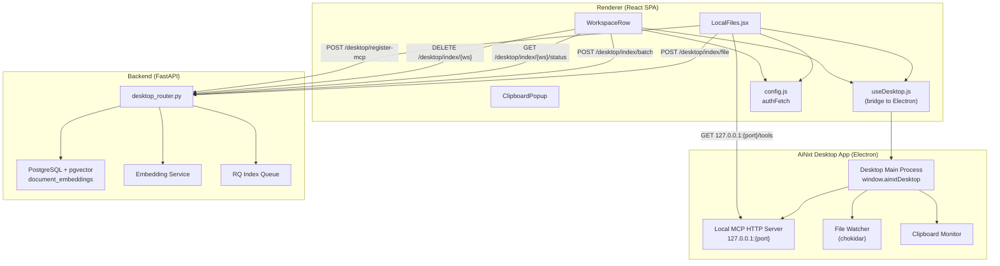
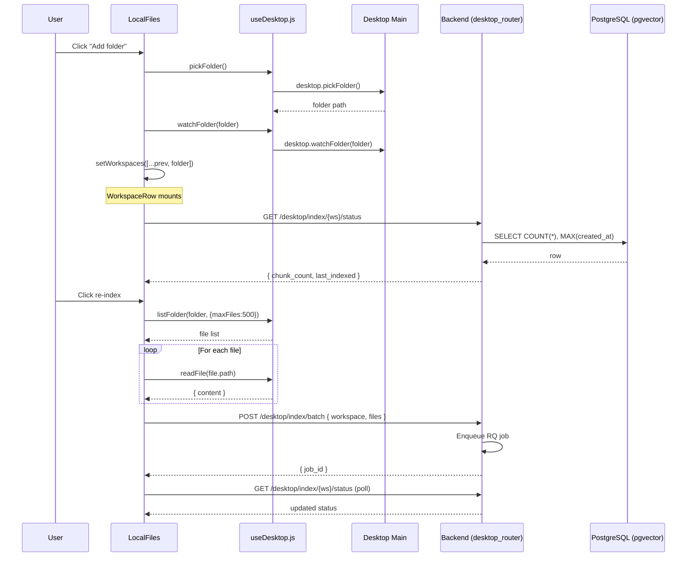
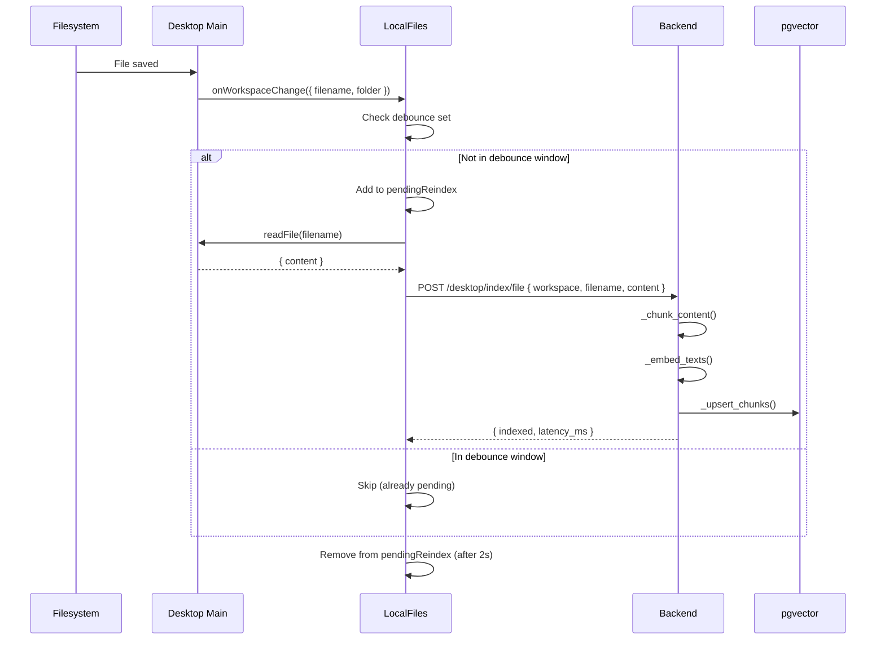
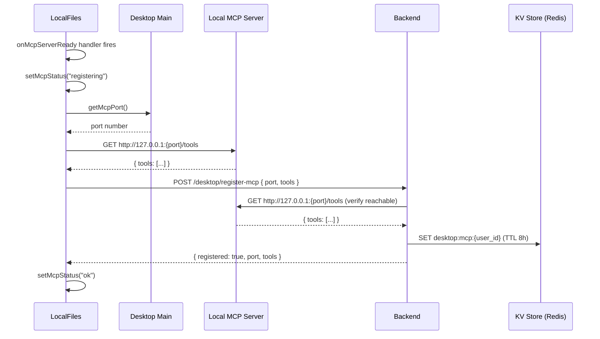
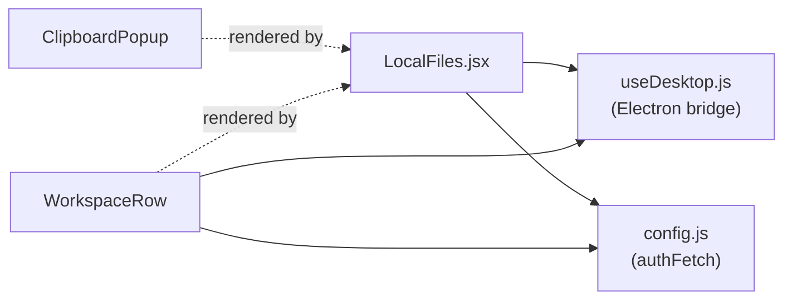
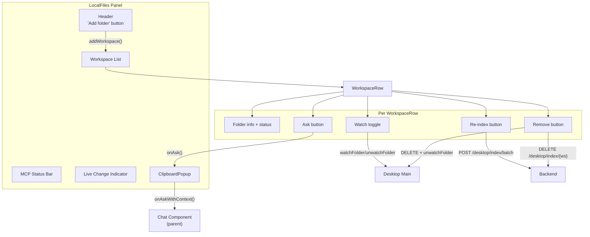
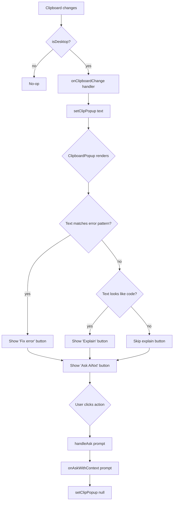

# Local Files Module

## Introduction

The **Local Files** module is a frontend React component (`ai-ui/src/components/LocalFiles.jsx`) that provides users of the AiNxt desktop application with a local workspace management interface. It enables users to add local folders as searchable workspaces, index their file contents for AI-powered retrieval, watch folders for live file changes, register a local MCP (Model Context Protocol) server with the backend, and receive intelligent clipboard-capture suggestions — all from a single panel within the AiNxt web UI.

The module is exclusively available when running inside the AiNxt Electron desktop app. In a standard browser context, it renders a graceful fallback prompting the user to download the desktop application.

---

## Architecture Overview



### Key Architectural Decisions

| Decision | Rationale |
|---|---|
| **Desktop-only gating** | File system access, folder watching, and clipboard monitoring require Electron's native APIs. The `isDesktop` flag from `useDesktop.js` gates all functionality. |
| **Renderer-side MCP registration** | The MCP server runs in the desktop main process, but registration with the backend is done from the renderer using cookie-based `authFetch` so the user's existing web session is reused. |
| **Debounced incremental re-indexing** | File-change events are debounced per-file (2s window) to avoid redundant API calls during rapid saves. |
| **Batch vs. inline indexing** | Full folder re-indexing uses a background RQ job (`/desktop/index/batch`); single-file incremental updates are synchronous (`/desktop/index/file`). |

---

## Component Reference

### `LocalFiles` (default export)

The main panel component. Orchestrates all five operational phases of the local files feature.

**Props:**

| Prop | Type | Description |
|---|---|---|
| `onAskWithContext` | `(prompt: string) => void` | Callback invoked when the user clicks "Ask AiNxt" from the clipboard popup or a workspace row. Typically routes the prompt into the Chat component. |

**State:**

| State | Description |
|---|---|
| `workspaces` | Array of folder paths currently added as workspaces. |
| `clipPopup` | Clipboard text captured for the intelligent popup; `null` when dismissed. |
| `mcpStatus` | MCP registration lifecycle: `null` → `"registering"` → `"ok"` / `"error"`. |
| `mcpError` | Error message if MCP registration fails. |
| `recentChange` | Filename of the most recently changed file (shown in a transient banner). |
| `pendingReindex` | `useRef(Set)` tracking filenames within the debounce window to prevent duplicate re-index calls. |

**Lifecycle Effects (5 phases):**

1. **Phase 1 — Load persisted workspaces:** On mount, calls `getWatchedFolders()` to restore previously added folders from the desktop app's persistent store.
2. **Phase 2 — Workspace file change listener:** Subscribes to `onWorkspaceChange`. When a file changes, reads its content via `readFile()` and POSTs it to `/desktop/index/file` for incremental re-indexing. Includes per-file 2-second debounce.
3. **Phase 3 — Clipboard change listener:** Subscribes to `onClipboardChange`. Sets `clipPopup` state to trigger the `ClipboardPopup` component.
4. **Phase 4 — Shortcut context listener:** Subscribes to `onShortcutContext` (triggered by `Cmd+Shift+A`). If clipboard content is substantial (>10 chars), surfaces it as a suggestion popup.
5. **Phase 5 — MCP server registration:** Subscribes to `onMcpServerReady` and also attempts immediate registration. Fetches the tool list from the local MCP server, then registers with the backend via `POST /desktop/register-mcp`.

---

### `WorkspaceRow`

Renders a single workspace folder with its indexing status and action buttons.

**Props:**

| Prop | Type | Description |
|---|---|---|
| `folder` | `string` | Absolute path to the workspace folder. |
| `onRemove` | `(folder: string) => void` | Callback to remove the workspace from the parent's list. |
| `onAsk` | `(prompt: string) => void` | Callback for the "Ask about this workspace" action. |

**Internal State:**

| State | Description |
|---|---|
| `status` | `{ chunk_count, last_indexed }` fetched from `GET /desktop/index/{workspace}/status`. |
| `indexing` | Boolean indicating an active re-index operation. |
| `watching` | Boolean indicating whether the folder watcher is active. |
| `error` | Error message from the last re-index attempt. |

**Actions:**

| Action | Function | Description |
|---|---|---|
| Re-index | `reindex()` | Lists all supported files (max 500) via `listFolder()`, reads each file's content via `readFile()`, and POSTs the batch to `/desktop/index/batch`. |
| Toggle watch | `toggleWatch()` | Calls `watchFolder()` or `unwatchFolder()` on the desktop bridge. |
| Remove | `remove()` | Unwatches the folder, sends `DELETE /desktop/index/{workspace}` to remove all vectors, and calls `onRemove`. |
| Ask | `onAsk()` | Triggers the parent's `handleAsk` with a workspace-scoped prompt. |

---

### `ClipboardPopup`

A floating popup that appears when clipboard content is captured, offering context-aware quick actions.

**Props:**

| Prop | Type | Description |
|---|---|---|
| `text` | `string \| null` | The captured clipboard text. When `null`, the popup is not rendered. |
| `onAsk` | `(prompt: string) => void` | Callback for all action buttons. |
| `onDismiss` | `() => void` | Callback to close the popup. |

**Intelligent Action Buttons:**

The popup inspects the clipboard text and conditionally renders action buttons:

| Condition | Button | Prompt Sent |
|---|---|---|
| Matches `/error:\|exception\|failed\|traceback/i` | "Fix error" (red) | `Fix this error:\n{text}` |
| Starts with `{` or contains `def ` / `function ` | "Explain" (indigo) | `Explain this code:\n{text}` |
| Always | "Ask AiNxt" (indigo) | `{text}` (raw) |

---

## Data Flow

### Workspace Lifecycle



### Live File Change Re-indexing



### MCP Server Registration



---

## Dependencies

### Internal Dependencies



| Dependency | Module | Purpose |
|---|---|---|
| `useDesktop.js` | [ai_ui_frontend_hooks](../ui/ai_ui_frontend_hooks.md) | Electron bridge: `isDesktop`, `pickFolder`, `listFolder`, `readFile`, `watchFolder`, `unwatchFolder`, `getWatchedFolders`, `onWorkspaceChange`/`offWorkspaceChange`, `onClipboardChange`/`offClipboardChange`, `onShortcutContext`/`offShortcutContext`, `getMcpPort`, `onMcpServerReady` |
| `config.js` | [config](../infrastructure/config.md) | `authFetch` — authenticated HTTP wrapper that attaches JWT cookie credentials and correlation IDs |

### Backend Dependencies

| Endpoint | Method | Backend Module | Description |
|---|---|---|---|
| `/desktop/index/file` | POST | [desktop_router](../api/desktop_router.md) | Inline single-file indexing (incremental) |
| `/desktop/index/batch` | POST | [desktop_router](../api/desktop_router.md) | Batch indexing via RQ background job |
| `/desktop/index/{workspace}` | DELETE | [desktop_router](../api/desktop_router.md) | Remove all vectors for a workspace |
| `/desktop/index/{workspace}/status` | GET | [desktop_router](../api/desktop_router.md) | Chunk count and last-indexed timestamp |
| `/desktop/register-mcp` | POST | [desktop_router](../api/desktop_router.md) | Register local MCP server with backend |

### External Dependencies

| Package | Usage |
|---|---|
| `react` | `useState`, `useEffect`, `useRef`, `useCallback` hooks |
| `lucide-react` | Icons: `Folder`, `FolderOpen`, `Eye`, `EyeOff`, `Trash2`, `RefreshCw`, `FileText`, `Clipboard`, `Zap`, `AlertCircle`, `CheckCircle` |

---

## Component Interaction Diagram



---

## Process Flows

### Adding a Workspace

```mermaid
flowchart TD
    A[User clicks 'Add folder'] --> B{pickFolder()}
    B -->|null| Z[No folder selected — abort]
    B -->|path| C{Already in workspaces?}
    C -->|yes| Z
    C -->|no| D[watchFolder folder]
    D --> E[setWorkspaces append]
    E --> F[WorkspaceRow mounts]
    F --> G[GET /desktop/index/{ws}/status]
    G --> H{Has chunks?}
    H -->|yes| I[Display chunk count + last indexed]
    H -->|no| J[Display 'not indexed yet']
```

### Clipboard Intelligence Flow



---

## API Contract

### Frontend → Backend Requests

All requests use `authFetch` from `config.js`, which attaches:
- `credentials: 'include'` (httpOnly JWT cookie)
- `x-client-request-id` header (correlation ID)
- `cache: 'no-store'`

| Endpoint | Method | Body | Response | Used By |
|---|---|---|---|---|
| `/desktop/index/file` | POST | `{ workspace, filename, content }` | `{ indexed, workspace, repo, filename, latency_ms }` | `LocalFiles` (Phase 2 watcher) |
| `/desktop/index/batch` | POST | `{ workspace, files: [{filename, content}] }` | `{ job_id, workspace, file_count }` | `WorkspaceRow.reindex()` |
| `/desktop/index/{workspace}` | DELETE | — | `{ deleted_chunks, workspace, repo }` | `WorkspaceRow.remove()` |
| `/desktop/index/{workspace}/status` | GET | — | `{ workspace, repo, chunk_count, last_indexed }` | `WorkspaceRow.loadStatus()` |
| `/desktop/register-mcp` | POST | `{ port, tools }` | `{ registered, port, tools }` | `LocalFiles` (Phase 5) |

### Frontend → Local MCP Server

| Endpoint | Method | Response | Used By |
|---|---|---|---|
| `http://127.0.0.1:{port}/tools` | GET | `{ tools: [...] }` | `LocalFiles` (Phase 5 — fetch tool list before registration) |

---

## Desktop Bridge Interface

The `useDesktop.js` hook acts as a bridge between the React renderer and the Electron main process. It detects the desktop environment via `window.ainxtDesktop?.isDesktop` and exposes the following functions used by this module:

| Function | Phase | Description |
|---|---|---|
| `isDesktop` | All | Boolean flag gating all desktop features |
| `pickFolder()` | 1 | Opens native folder picker dialog |
| `listFolder(dir, opts)` | 1 | Lists supported files in a directory (max 500) |
| `readFile(filePath)` | 1, 2 | Reads file content as UTF-8 text |
| `watchFolder(dir)` | 1 | Starts filesystem watcher on a folder |
| `unwatchFolder(dir)` | 1 | Stops filesystem watcher |
| `getWatchedFolders()` | 1 | Returns persisted list of watched folders |
| `onWorkspaceChange(cb)` / `offWorkspaceChange(cb)` | 2 | Subscribe/unsubscribe to file change events |
| `onClipboardChange(cb)` / `offClipboardChange(cb)` | 3 | Subscribe/unsubscribe to clipboard changes |
| `onShortcutContext(cb)` / `offShortcutContext(cb)` | 4 | Subscribe/unsubscribe to shortcut context events |
| `getMcpPort()` | 5 | Returns the port of the local MCP server |
| `onMcpServerReady(cb)` | 5 | Callback when local MCP server is ready |

> For full documentation of the desktop bridge, see [ai_ui_frontend_hooks](../ui/ai_ui_frontend_hooks.md).

---

## Error Handling

| Scenario | Behavior |
|---|---|
| Not in desktop app | Renders fallback message: "Local Files requires the AiNxt desktop app." |
| Re-index finds no supported files | `WorkspaceRow` displays "No supported files found" error. |
| Re-index API call fails | `WorkspaceRow` displays the error message from the exception. |
| MCP server not started | `getMcpPort()` returns `null`; MCP status shows error with message. |
| MCP registration fails | Status bar shows yellow error with the HTTP status or exception message. |
| File change re-index fails | Silently caught (non-critical); no user-facing error. |
| Status fetch fails | `WorkspaceRow` shows "not indexed yet" (status remains `null`). |

---

## Security Considerations

- **Authentication:** All backend requests go through `authFetch`, which includes the user's httpOnly JWT cookie. The backend's `desktop_router.py` enforces `get_current_user` dependency on every endpoint.
- **MCP server verification:** The backend verifies the local MCP server is reachable at `127.0.0.1:{port}` before accepting registration, preventing registration of unreachable or spoofed servers.
- **MCP registry TTL:** Registered MCP entries expire after 8 hours (`_MCP_TTL = 28800`), requiring periodic re-registration.
- **File size limit:** Inline file indexing is capped at 512 KB (`MAX_FILE_SIZE = 524288`) to prevent oversized payloads.
- **Batch limit:** Batch indexing is limited to 500 files per request.
- **Workspace isolation:** Each workspace's vectors are stored under a repo name prefixed with `desktop_` and scoped to the user's department via RLS.

---

## Related Modules

| Module | Relationship |
|---|---|
| [ai_ui_frontend_hooks](../ui/ai_ui_frontend_hooks.md) | Provides the `useDesktop.js` Electron bridge used for all desktop interactions |
| [config](../infrastructure/config.md) | Provides `authFetch` for authenticated API calls |
| [desktop_router](../api/desktop_router.md) | Backend router handling all `/desktop/*` endpoints |
| [chat](../chat/chat.md) | Parent component that receives `onAskWithContext` prompts from clipboard and workspace actions |
| [sidebar](../sidebar.md) | Navigation entry point that renders the LocalFiles panel |
