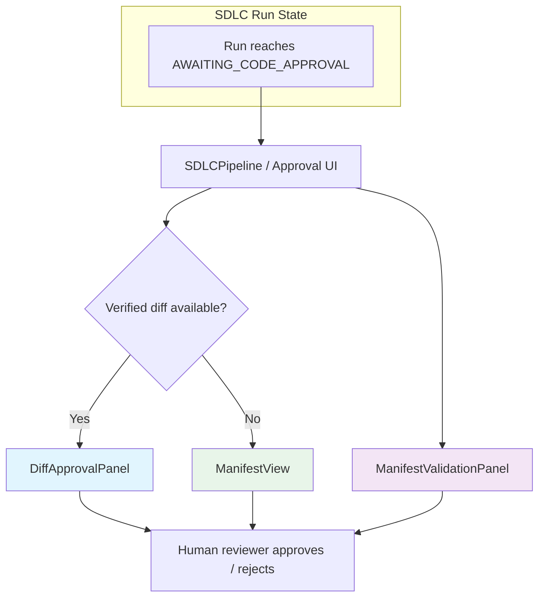
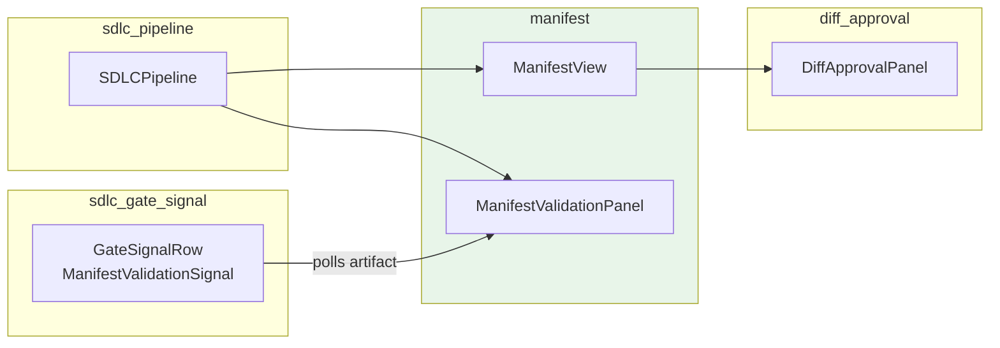
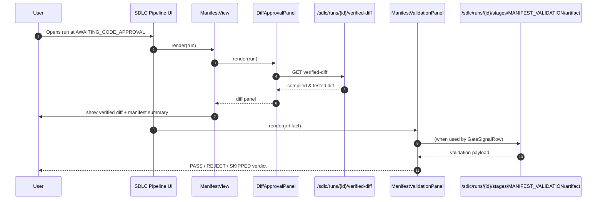

# Manifest Module

The **Manifest** module is a focused frontend UI package within `ai-ui` that renders the **change manifest** and **manifest validation results** during the SDLC (Software Development Life Cycle) approval gate. It is displayed when a run reaches the `AWAITING_CODE_APPROVAL` state (legacy name `AWAITING_DESIGN_APPROVAL`) and gives human reviewers a structured, human-readable summary of what files will be created, modified, or deleted before they approve the change.

The module follows a **shift-left review** philosophy: when a pre-gate verified diff is available, the reviewer is first presented with the real compiled-and-tested diff, while the manifest remains as a high-level summary of intent.

---

## Architecture Overview



The module is intentionally small and cohesive. It contains only two public components:

| Component | Responsibility |
|-----------|----------------|
| `ManifestView` | Renders the high-level change manifest: file paths, change types (CREATE / MODIFY / DELETE), descriptions, affected functions, and optional code specs. |
| `ManifestValidationPanel` | Renders the result of the `MANIFEST_VALIDATION` sub-check, including structural checks and optional OpenAI cross-validation. |

Both components are **presentational** (stateless with respect to business logic) and receive their data through the `run` or `artifact` props passed by the parent SDLC UI.

---

## Module Boundaries



- **`ManifestView`** depends on [`DiffApprovalPanel`](../sdlc/diff_approval.md) to show the verified diff before the manifest summary.
- **`ManifestValidationPanel`** is consumed by the SDLC pipeline UI and is also polled by [`GateSignalRow`](../sdlc/sdlc_gate_signal.md) to render a compact pass/reject badge.
- The module does **not** own the backend validation logic; it only visualizes the artifact produced by the SDLC validation stage.

---

## Core Components

### `ManifestView`

**File:** `ai-ui/src/components/ManifestView.jsx`

`ManifestView` is the main entry point for the manifest UI. It receives an SDLC `run` object and renders:

1. **Verified diff first** — if available, the [`DiffApprovalPanel`](../sdlc/diff_approval.md) is rendered above the manifest summary so the reviewer sees the actual compiled and tested change.
2. **Change manifest summary** — a card listing all file-level changes grouped by operation:
   - Files to modify (`file_changes`)
   - Files to create (`new_files_needed`)
   - Files to delete (`files_to_delete`)
3. **Validation status badge** — shows whether the manifest passed cross-provider validation (`manifest_validation_pass`).

The component is defensive: if no file changes are present, it returns only the verified diff panel.

#### Internal helpers

| Helper | Purpose |
|--------|---------|
| `TypeBadge` | Renders a colored pill for `CREATE`, `MODIFY`, or `DELETE`. |
| `FilePath` | Displays a file path with a hover-to-copy button. |
| `FileCard` | Renders a single file change, including optional function name, description, and collapsible code spec. |
| `copy` | Copies the file path to the clipboard and shows a transient checkmark. |

#### Data contract

The component reads from `run.context.design`:

```javascript
{
  file_changes: [{ path, change_type, change_description, affected_function, new_code }],
  new_files_needed: [{ path, description }],
  files_to_delete: [/* paths or objects */],
}
```

It also reads `run.context.manifest_validation_pass` to display the validation badge.

---

### `ManifestValidationPanel`

**File:** `ai-ui/src/components/ManifestValidationPanel.jsx`

`ManifestValidationPanel` visualizes the artifact produced by the `MANIFEST_VALIDATION` SDLC sub-check. It is shown:

- Inside the **PLAN drawer** during planning.
- As a **compact banner** when a run is `SUSPENDED` at `PLAN` with a manifest-validation-failure reason.

The panel reports an overall `PASS` / `REJECT` verdict derived from:

- `passed` — explicit verdict if present.
- Otherwise: `struct_pass !== false && openai_pass !== false`.

#### Validation sections

| Section | Meaning |
|---------|---------|
| **Structural Checks** | Verifies that all referenced file paths and components actually exist in the codebase. |
| **OpenAI Cross-Validation** | Optional second-opinion check for hallucinated paths, missing components, and out-of-scope violations. May be skipped for simple changes or when compliance-blocked. |

#### Internal helpers

| Helper | Purpose |
|--------|---------|
| `CollapsibleList` | Renders a toggleable list of issues (errors or warnings). |

#### Data contract

```javascript
{
  passed: boolean | undefined,
  struct_pass: boolean,
  openai_pass: boolean | null,
  struct_failures: string[],
  openai_issues: string[],
  hallucinated_paths: string[],
  missing_components: string[],
  oos_violations: string[],
  skipped_reason: string,
  issues: string[],
}
```

A `null` or `undefined` `openai_pass` means the cross-check was **skipped**, not failed.

---

## Data Flow



---

## Visual Design Conventions

The module uses a consistent Tailwind-based visual language:

| Element | Style |
|---------|-------|
| `CREATE` badge | Green background (`bg-green-100 text-green-700`) |
| `MODIFY` badge | Blue background (`bg-blue-100 text-blue-700`) |
| `DELETE` badge | Red background (`bg-red-100 text-red-700`) |
| Validation PASS | Green check + `bg-green-100` badge |
| Validation REJECT | Red X + `bg-red-100` badge |
| Validation SKIPPED | Gray circle + `bg-gray-100` badge |
| Code spec / diff | Dark monospace block (`bg-gray-900 text-gray-100`) |

---

## Integration Points

| Related Module | Relationship |
|----------------|--------------|
| [`diff_approval`](../sdlc/diff_approval.md) | `ManifestView` embeds `DiffApprovalPanel` to show the real compiled diff before the high-level manifest. |
| [`sdlc_pipeline`](../sdlc/sdlc_pipeline.md) | Hosts the SDLC run UI and passes the `run` object into `ManifestView` and `ManifestValidationPanel`. |
| [`sdlc_gate_signal`](../sdlc/sdlc_gate_signal.md) | `ManifestValidationSignal` polls the manifest-validation artifact and renders a compact status badge. |
| [`sdlc_governance_review`](../sdlc/sdlc_governance_review.md) | May surface manifest validation findings during governance review. |

---

## When to Modify This Module

You should update the Manifest module when:

- The **change manifest data model** changes (e.g., new fields in `file_changes`, `new_files_needed`, or `files_to_delete`).
- New **change types** are introduced beyond `CREATE`, `MODIFY`, and `DELETE`.
- The **manifest validation artifact** schema changes (e.g., new check categories).
- The **visual presentation** of the manifest or validation results needs to change.

You should **not** modify this module for:

- Backend validation logic — that belongs to the SDLC worker / backend.
- Diff computation — that belongs to [`diff_approval`](../sdlc/diff_approval.md) and the backend verified-diff endpoint.
- General approval actions (approve / reject / request changes) — those are owned by the parent SDLC pipeline UI.

---

## Files

| File | Description |
|------|-------------|
| `ai-ui/src/components/ManifestView.jsx` | Main manifest summary component and its internal helpers. |
| `ai-ui/src/components/ManifestValidationPanel.jsx` | Manifest validation result panel and collapsible issue lists. |
