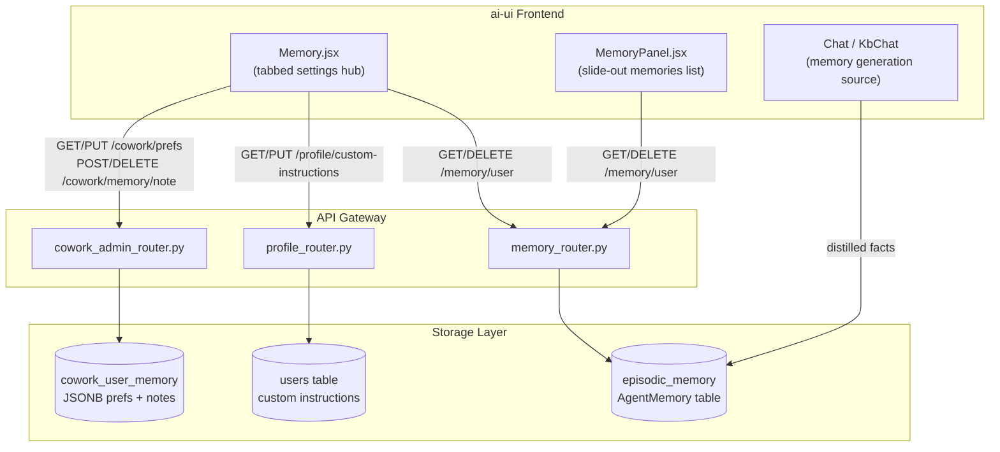
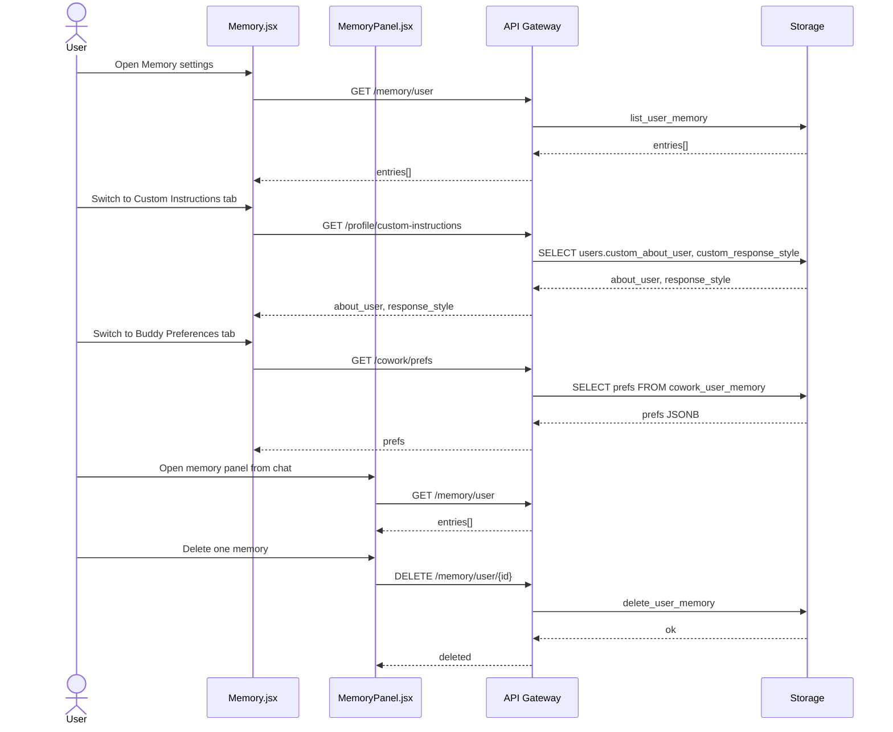
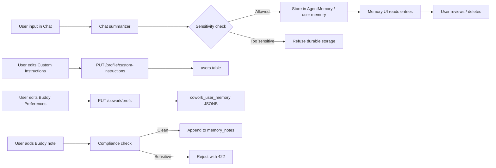

# Memory Module

The **Memory module** is the frontend surface that lets end-users view, manage, and curate what the AiNxt platform remembers about them across sessions. It unifies three previously scattered personalization concepts into a single settings hub:

1. **Cross-chat memories** – distilled facts extracted from user conversations.
2. **Custom instructions** – user-provided persona and response-style guidance.
3. **Buddy preferences** – durable Cowork/office-mode defaults such as tone, role, email signature, and aliases.

The module is implemented in the `ai-ui` React frontend and is backed by a combination of platform routers and storage layers. It is intentionally separate from **Agent Builder** personas, which are governed, shared artifacts with their own lifecycle (DRAFT → APPROVED → PRODUCTION).

---

## Core Components

| Component | File | Responsibility |
|-----------|------|----------------|
| `Memory` | `ai-ui/src/components/Memory.jsx` | Full-page tabbed settings hub for memories, custom instructions, and Buddy preferences. |
| `MemoryPanel` | `ai-ui/src/components/MemoryPanel.jsx` | Slide-out panel that lists cross-chat memories and allows per-entry or bulk deletion. |
| `Meter` | `ai-ui/src/components/Memory.jsx` | Character-usage indicator used for text fields with backend-enforced caps. |
| `AliasEditor` | `ai-ui/src/components/Memory.jsx` | Reusable key/value editor for team and channel aliases. |

---

## Architecture

### Component Interaction

---

## Functional Areas

### 1. Cross-Chat Memories

Cross-chat memories are short, durable facts distilled from user conversations (for example, role, team, or recurring preferences). They are read-only in the UI; creation happens automatically via the chat summarization pipeline.

- **List**: `GET /memory/user` returns the caller's memory entries, newest first.
- **Delete one**: `DELETE /memory/user/{id}` removes a single entry.
- **Clear all**: `DELETE /memory/user` removes every entry for the caller.

The `MemoryPanel` component provides a compact slide-out view of the same data, accessible from chat surfaces. The full `Memory` page adds a refresh action and bulk clear.

> See [chat.md](../chat/chat.md) for how memories are generated from conversation turns and [memory_system.md](memory_system.md) for the backend episodic-memory implementation.

### 2. Custom Instructions

Custom instructions let users describe themselves and their preferred response style. These values are injected into the system context for future messages.

- **Fields**:
  - `about_user` – background, role, domain expertise.
  - `response_style` – formatting, tone, and citation preferences.
- **Limits**: Each field is capped at 4,000 characters (`CI_MAX`), enforced both in the UI (`maxLength`) and on the backend.
- **Endpoints**:
  - `GET /profile/custom-instructions`
  - `PUT /profile/custom-instructions`

> See [profile.md](profile.md) for the broader user-profile system.

### 3. Buddy Preferences

Buddy preferences are durable Cowork/office-mode settings stored as JSONB in `cowork_user_memory`.

| Preference | Type | Purpose |
|------------|------|---------|
| `tone` | string | Default response tone (`formal`, `concise`, `friendly`, `detailed`). |
| `role` | string | User's role, e.g., "Engineering Manager". |
| `email_signature` | string | Signature appended to drafted emails. |
| `default_doc_format` | string | Preferred output format (`docx`, `pdf`, `md`). |
| `team_aliases` | object | Alias → team/person mappings. |
| `channel_aliases` | object | Alias → `#channel` mappings. |
| `memory_notes` | array | FIFO-capped durable facts (max 40 notes, 400 chars each). |

- **Endpoints**:
  - `GET /cowork/prefs`
  - `PUT /cowork/prefs`
  - `POST /cowork/memory/note`
  - `DELETE /cowork/memory/note?note={text}`

Notes added by the user pass through the same compliance gate used by the agent's `remember` tool; sensitive content such as secrets or PII is refused.

> See [cowork.md](../cowork.md) for the Cowork desktop agent and office-mode features.

---

## Data Flow

---

## Security, Privacy, and Compliance

The Memory module implements a **right-to-not-persist-secrets** guarantee:

- **Sensitivity gating**: The backend `MemoryService` refuses to write content to durable/cross-chat storage when its sensitivity exceeds the configured floor (e.g., `confidential` or `restricted`).
- **PII/secret scan**: Buddy notes are run through `_compliance_check` before persistence.
- **Scoped access**: All user-memory endpoints require authentication and operate only on the caller's own records.
- **Size caps**: UI meters and backend truncation prevent unbounded storage.

> See [auth.md](../security/auth.md) for authentication and [governance.md](../sdlc/governance.md) for compliance policies.

---

## Integration with the Broader System

| System | Integration Point | Description |
|--------|-------------------|-------------|
| **Chat / KbChat** | Memory generation source | Conversation summaries produce cross-chat memory entries. |
| **Profile** | Custom instructions | Stored in the `users` table alongside other profile fields. |
| **Cowork / Desktop Agent** | Buddy preferences | `build_memory_prompt` injects prefs and notes into the Cowork system prompt. |
| **Memory Router** | Cross-chat memory CRUD | `memory_router.py` exposes `/memory/user` endpoints backed by `episodic_memory`. |
| **Agent Builder** | Excluded by design | Per-agent system prompts are governed shared artifacts, not personal memory. |

---

## Key Design Decisions

1. **Unified hub**: Three previously separate surfaces (memories, custom instructions, Buddy prefs) are combined into one tabbed page to reduce user confusion.
2. **Read-only memories**: Users can delete but not create memories manually, ensuring facts are derived from actual conversation context.
3. **Agent persona separation**: Agent-level system prompts remain in Agent Builder because they are shared, versioned, and governance-controlled.
4. **JSONB for Buddy prefs**: Flexible schema for evolving preference keys without migrations; server-side JSONB merge prevents concurrent writes from clobbering each other.
5. **FIFO-capped notes**: Prevents unbounded growth of durable memory while keeping the most recent facts.

---

## Related Documentation

- [chat.md](../chat/chat.md) – Chat and memory generation.
- [profile.md](profile.md) – User profiles and custom instructions.
- [cowork.md](../cowork.md) – Cowork desktop agent and office mode.
- [memory_system.md](memory_system.md) – Backend memory stores (`episodic_memory`, `CoworkMemory`, `MemoryService`).
- [auth.md](../security/auth.md) – Authentication and user scoping.
- [governance.md](../sdlc/governance.md) – Compliance and sensitivity policies.
