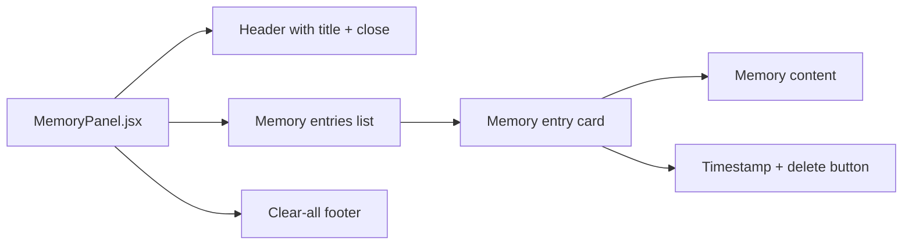
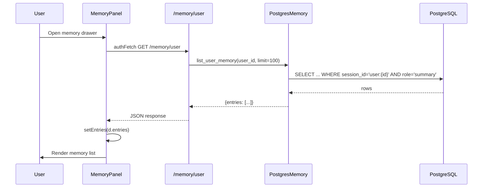
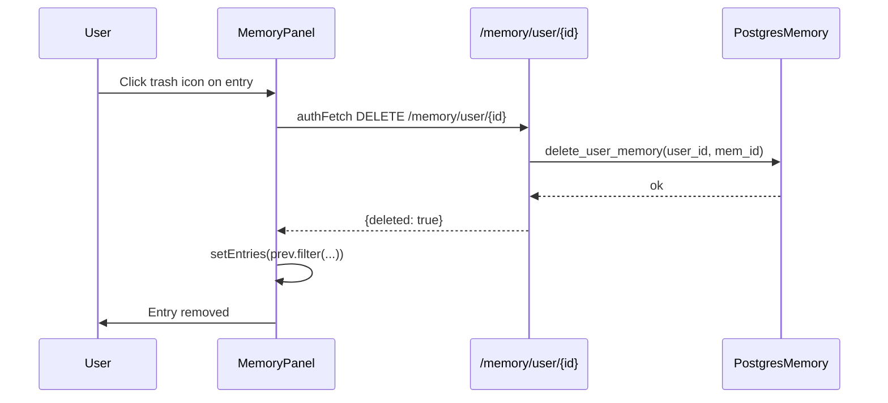
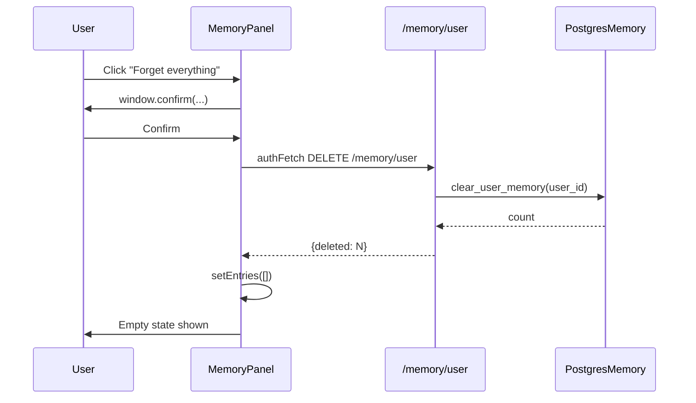
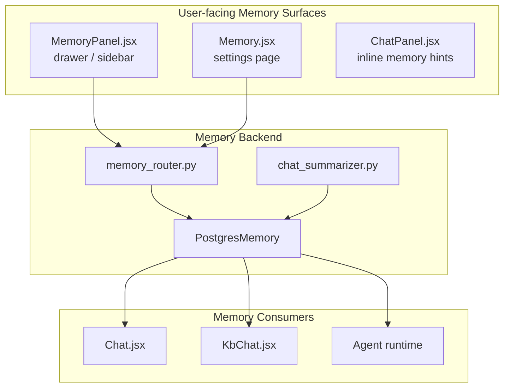
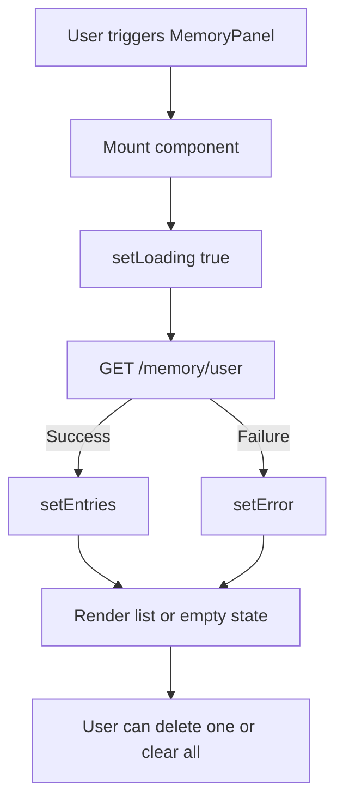

# Memory Panel Module

## Brief Introduction

The **Memory Panel** module is a React UI component that provides users with a ChatGPT-style "Memories" drawer. It displays the durable, cross-chat facts that the platform has distilled and saved about the user, and allows the user to review, delete individual entries, or clear all memories. The panel is a lightweight, read-mostly management surface that complements the richer [Memory](memory.md) settings page.

---

## Purpose and Core Functionality

`MemoryPanel.jsx` renders a slide-over drawer that:

1. **Lists user memories** fetched from the backend (`GET /memory/user`).
2. **Displays each memory** with its content and creation timestamp.
3. **Deletes a single memory** on demand (`DELETE /memory/user/{id}`).
4. **Clears all memories** after explicit confirmation (`DELETE /memory/user`).

The component is intentionally simple: it does not create or edit memories directly. Memory creation is driven by the chat pipeline (see [chat](../chat/chat.md) / [kb_chat](../knowledge/kb_chat.md)) via the backend summarizer.

---

## Architecture

```mermaid
graph TD
    subgraph "Frontend (ai-ui)"
        A[User] -->|Opens drawer| B[MemoryPanel]
        B -->|authFetch GET /memory/user| C[config.js API client]
        B -->|DELETE /memory/user/{id}| C
        B -->|DELETE /memory/user| C
    end

    subgraph "Backend (shared_api_routers)"
        C --> D[memory_router.py]
        D --> E[get_user_memory_entries]
        D --> F[delete_user_memory_entry]
        D --> G[clear_user_memory_entries]
    end

    subgraph "Memory Store"
        E --> H[PostgresMemory.list_user_memory]
        F --> I[PostgresMemory.delete_user_memory]
        G --> J[PostgresMemory.clear_user_memory]
        H --> K[(conversations table<br/>role='summary')]
        I --> K
        J --> K
    end

    subgraph "Memory Producers"
        L[Chat / KB Chat] -->|should_store_memory| M[chat_summarizer.py]
        M -->|save_user_memory| H
    end
```

---

## Component Structure



### Core Components

| Component | File | Responsibility |
|-----------|------|----------------|
| `MemoryPanel` | `ai-ui/src/components/MemoryPanel.jsx` | Main drawer component. Manages loading, error, and entry state. |
| `clearAll` | `ai-ui/src/components/MemoryPanel.jsx` | Handler that confirms and clears all user memories. |

### Local State

| State | Type | Purpose |
|-------|------|---------|
| `entries` | `Array` | List of memory entries returned by the backend. |
| `loading` | `boolean` | Initial fetch indicator. |
| `error` | `string` | Error message if the fetch fails. |
| `busyId` | `string \| null` | Tracks which entry is being deleted. |
| `clearing` | `boolean` | Tracks the global clear-all operation. |

---

## Data Flow

### Loading Memories



### Deleting a Single Memory



### Clearing All Memories



---

## API Integration

The component uses `authFetch` from [`config.js`](../infrastructure/config.md) (the same authenticated fetch helper used across `ai-ui`).

| Method | Endpoint | Backend Handler | Purpose |
|--------|----------|-----------------|---------|
| `GET` | `/memory/user` | `get_user_memory_entries` | List the caller's cross-chat memories. |
| `DELETE` | `/memory/user/{id}` | `delete_user_memory_entry` | Delete one memory entry. |
| `DELETE` | `/memory/user` | `clear_user_memory_entries` | Delete all memory entries for the user. |

The backend stores memories in the `conversations` table using a synthetic session key of `user:{user_id}` and `role='summary'`. This design reuses the existing conversation schema without requiring a dedicated memory table migration.

---

## How It Fits into the System

The Memory Panel is one of several surfaces that expose the platform's durable memory layer to users:



- **MemoryPanel** is the quick-access drawer for reviewing and forgetting memories.
- **[Memory](memory.md)** is the full settings page that also manages custom instructions and cowork preferences.
- **[chat_summarizer.py](memory_system.md)** decides which facts are worth persisting across chats.
- **Chat / KB Chat** retrieve relevant memories at inference time to maintain cross-turn context.

---

## Dependencies

### Direct Dependencies

| Dependency | Module | Role |
|------------|--------|------|
| `authFetch`, `API_BASE` | [`config.js`](../infrastructure/config.md) | Authenticated HTTP client and backend base URL. |
| `useEffect`, `useState` | React | Component state and lifecycle. |
| `Brain`, `Trash2`, `X`, `AlertTriangle` | `lucide-react` | UI icons. |

### Backend Dependencies

| Dependency | Module | Role |
|------------|--------|------|
| `memory_router.py` | [`shared_api_routers`](../api/shared_api_routers.md) | Exposes `/memory/user` endpoints. |
| `PostgresMemory` | [`memory_system`](memory_system.md) | Persists and retrieves user memory rows. |
| `chat_summarizer.py` | [`memory_system`](memory_system.md) | Produces memory summaries from chat turns. |

---

## Process Flow: Opening the Panel



---

## Error Handling and Edge Cases

- **Fetch failure**: The component displays a red inline alert with the error message and stops showing the loading spinner.
- **Empty state**: When the user has no memories, a friendly explanation is shown describing how memories are created automatically.
- **Delete failure**: Errors are swallowed; the UI simply stops showing the busy indicator. The entry remains visible.
- **Clear-all confirmation**: A browser `confirm` dialog prevents accidental data loss.
- **Concurrent operations**: `busyId` and `clearing` flags disable relevant buttons while operations are in flight.

---

## Security and Privacy Notes

- All endpoints require an authenticated user. The backend extracts `user_id` from the current session and scopes every query to `session_id = 'user:{user_id}'`.
- A user can only view, delete, or clear their own memories.
- The panel supports the platform's "right to be forgotten" guarantee: users can remove individual facts or wipe their entire cross-chat memory profile.

---

## Related Documentation

- [memory.md](memory.md) — Full memory settings page (custom instructions, cowork preferences, saved notes).
- [memory_system.md](memory_system.md) — Backend memory service, Postgres storage, and summarization pipeline.
- [chat.md](../chat/chat.md) — Main chat UI that consumes and produces memories.
- [kb_chat.md](../knowledge/kb_chat.md) — Knowledge-base chat that also interacts with user memory.
- [config.md](../infrastructure/config.md) — `authFetch` and API configuration used by this component.
- [shared_api_routers.md](../api/shared_api_routers.md) — Backend router layer including `memory_router.py`.
