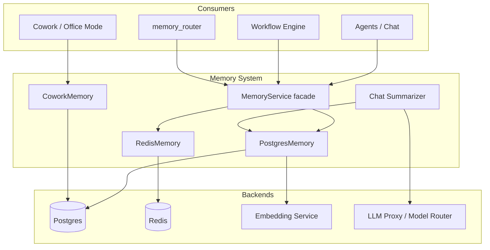
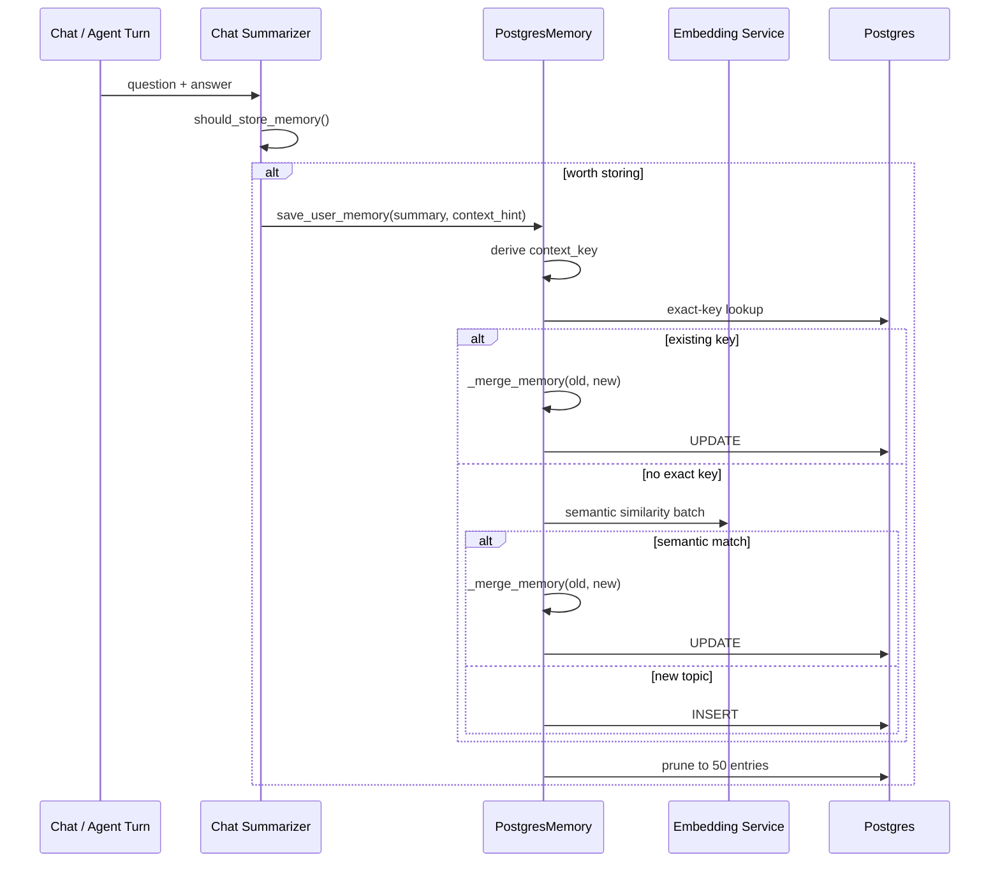
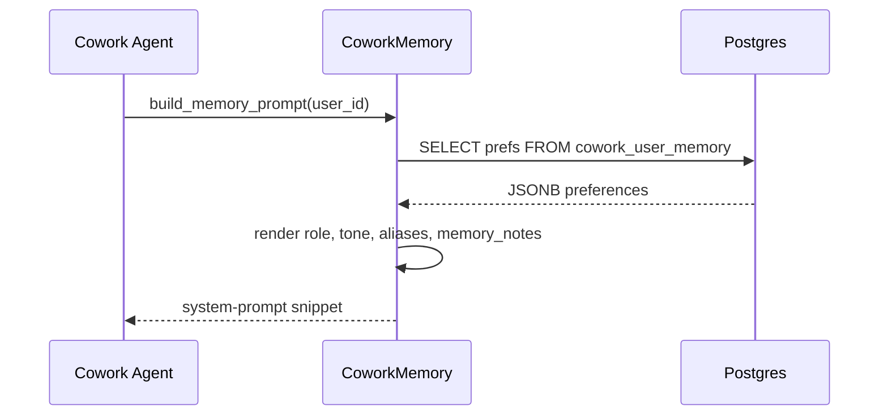

# Memory System

The **memory_system** module provides durable, scoped, and sensitivity-aware memory services for the AI platform. It unifies multiple storage backends under a single facade, enabling agents, chats, workflows, and Cowork sessions to remember context across turns while respecting data classification and privacy constraints.

## Purpose

- Persist conversation history, agent runs, and workflow executions.
- Enable cross-chat user memory with semantic merging and topic clustering.
- Provide fast, TTL-backed session memory for active interactions.
- Store Cowork personalization preferences and agent-remembered facts.
- Enforce a sensitivity gate so confidential or restricted content never leaks into durable cross-chat memory.

## Architecture Overview

The module exposes two usage patterns:

1. **Direct store APIs** — `PostgresMemory`, `RedisMemory`, and `CoworkMemory` are used by code paths that need backend-specific behavior (e.g., semantic memory merging, TTL session lists, Cowork prompt rendering).
2. **Unified facade** — `MemoryService` provides a single `read`/`write`/`forget` surface with scope and sensitivity controls, consumed by routers and agents that should not depend on a specific backend.

## Scopes

| Scope | Backend | Lifetime | Use Case |
|-------|---------|----------|----------|
| `SESSION` | Redis | TTL (7 days) | Per-chat conversation history |
| `WORKING` | Redis | TTL (3 days) | Agent runs and workflow execution state |
| `DURABLE` | Postgres | Indefinite (pruned to 50/user) | Cross-chat user memory summaries |
| `ORG` | Postgres | Indefinite | Cowork personalization preferences |

## Sensitivity Gate

`MemoryService` enforces a right-to-not-persist guarantee. Content tagged `confidential` or `restricted` is refused for `DURABLE` scope when the domain profile's `max_sensitivity_to_store` floor is `internal` or lower. This prevents secrets, PANs, or sensitive corporate data from entering long-term cross-chat memory.

## Sub-modules

- [memory_system_chat_summarizer](../chat/memory_system_chat_summarizer.md) — Rolling per-chat summaries and LLM-based memory filtering.
- [memory_system_cowork_memory](../buddy/memory_system_cowork_memory.md) — Cowork personalization preferences and durable agent-remembered facts.
- [memory_system_postgres_memory](../memory_system_postgres_memory.md) — Persistent Postgres memory for conversations, agent runs, workflows, and cross-chat summaries.
- [memory_system_redis_memory](../memory_system_redis_memory.md) — Fast TTL-backed Redis memory for sessions, runs, and workflows.
- [memory_system_service](../memory_system_service.md) — Unified `MemoryService` facade and sensitivity gate.

## Data Flow

### Cross-Chat Memory Write

### Cowork Prompt Injection

## Integration with Other Modules

- **model_routing** — `chat_summarizer` and `PostgresMemory._merge_memory` call `models.model_router` for cheap/simple model generation.
- **embedding_service** — `PostgresMemory` uses the embedding service for semantic memory matching and tool-sequence hints.
- **database** — `PostgresMemory` and `CoworkMemory` use `db.database` (SQLAlchemy pooled engine) and `db.models` (`AgentMemory`, `ChatMessage`).
- **kv_store** — `RedisMemory` uses `core.kv.get_kv` for Redis abstraction.
- **shared_api_routers** — `routers/memory_router.py` exposes memory read/write/clear/search endpoints and delegates to the stores.
- **workers** — `workers/memory_maintenance_worker.py` calls `PostgresMemory.expire_stale_memories` and `decay_importance_scores`.

## Operational Notes

- `PostgresMemory` bootstraps its schema on first connect (`_SCHEMA_SQL`), including the `memory_entries` quality-ranked table.
- `RedisMemory` relies on the global KV factory for connection pooling; host/port constructor args are kept for backward compatibility.
- `CoworkMemory` is stateless over the shared SQLAlchemy engine pool and safe for thousands of concurrent FastAPI threads.
- All memory writes are best-effort: failures are logged and swallowed so a turn is never hard-failed by memory storage.
