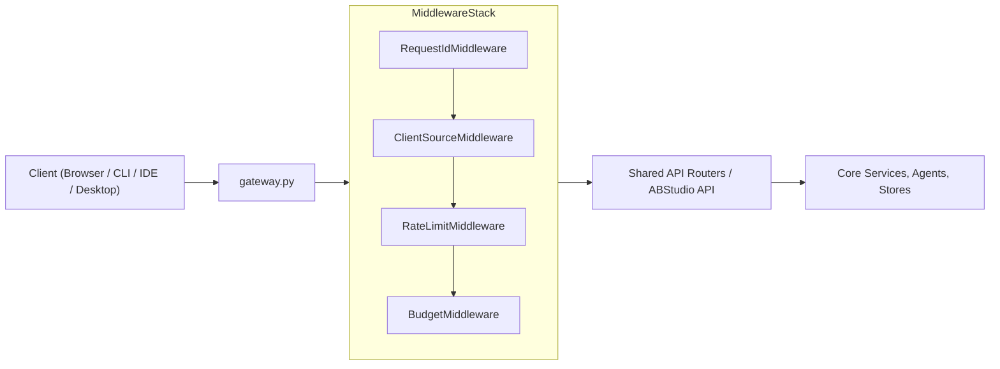
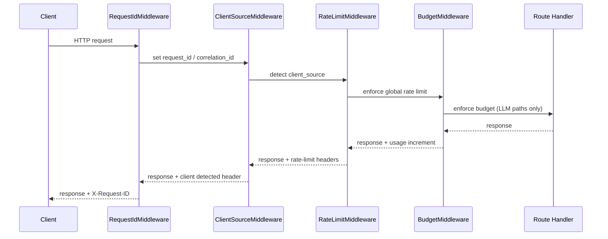
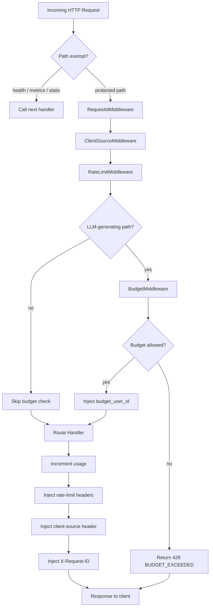

# Middleware Layer

The **middleware** module provides the cross-cutting request-processing layer that sits in front of the platform's HTTP routers. It is implemented as a stack of Starlette `BaseHTTPMiddleware` classes and is registered early in the gateway lifecycle so that every request is tagged, throttled, and budget-checked before it reaches business logic.

## Purpose

- Give every request a stable, observable identity (`request_id`).
- Detect which client surface is calling the platform (`platform`, `cli`, `ide-*`, `desktop`, `api`, `browser-agent`).
- Enforce global rate limits per user and per IP to mitigate abuse and DoS.
- Enforce per-user cost budgets on LLM-generating endpoints.

These concerns are intentionally kept out of individual route handlers so that security, observability, and governance policies are applied consistently across all API surfaces.

## Where It Fits

The middleware stack is mounted inside the main FastAPI/Starlette application in `gateway.py` (see [gateway.md](../models/gateway.md)). It runs before any router is matched, which means every path—including the OpenAI-compatible compatibility endpoints, IDE endpoints, and ABStudio API routes—receives the same treatment.

## Middleware Stack Order

The recommended registration order is:

1. **RequestIdMiddleware** — establishes correlation identity first so downstream middleware and handlers can log with a stable `request_id`.
2. **ClientSourceMiddleware** — tags the request with the client surface and resets per-request logger context.
3. **RateLimitMiddleware** — applies global sliding-window throttling using the resolved identity.
4. **BudgetMiddleware** — checks cost budgets only on LLM-generating endpoints.

## Sub-modules

The middleware layer is split into four focused sub-modules. Each one owns a single cross-cutting concern and is documented in its own file.

| Sub-module | File | Concern |
|------------|------|---------|
| Request ID Middleware | `middleware/request_id_middleware.py` | Stable request correlation and logger context |
| Client Source Middleware | `middleware/client_source_middleware.py` | Client surface detection and attribution |
| Rate Limit Middleware | `middleware/rate_limit_middleware.py` | Global sliding-window request throttling |
| Budget Middleware | `middleware/budget_middleware.py` | Per-user cost budget enforcement on LLM endpoints |

### Request ID Middleware

Ensures every request carries a stable `request_id` from entry to exit. The ID is read from `x-client-request-id` or `x-request-id`, or generated as a UUID4, then bound to the thread-local logger context. The same ID is echoed back in the `X-Request-ID` response header.

See [middleware_request_id.md](middleware_request_id.md) for detailed behaviour, header priority, and logger integration.

### Client Source Middleware

Detects which client surface originated the request and exposes a canonical `client_source` value. Detection uses the `X-AiNxt-Surface` header, the `X-AiNxt-Client` header, `User-Agent` heuristics, and the `/ide/*` path prefix. The detected value is stored in `request.state.client_source`, added to logger context, and returned in `x-ainxt-client-detected`.

See [middleware_client_source.md](../clients/middleware_client_source.md) for the detection order, canonical values, and special handling for the desktop app and browser-automation extension.

### Rate Limit Middleware

Provides the last-resort global throttling layer. It resolves the caller to a user ID (via JWT or API key) or falls back to IP, then enforces per-user and per-IP sliding-window limits backed by Redis. It also records 4xx responses for behaviour-anomaly detection and injects `X-RateLimit-*` headers into every response.

See [middleware_rate_limit.md](../middleware_rate_limit.md) for limit configuration, exempt paths, identity resolution, and header semantics.

### Budget Middleware

Enforces per-user total cost budgets on LLM-generating endpoints such as `/ask`, `/projects/`, `/ide/chat`, and OpenAI-compatible chat completions. It resolves the user from JWT, API key (with a short in-process cache), or `X-User-Id`, skips the check for in-house/non-cloud models, and blocks requests that would exceed the user's allocated spend.

See [middleware_budget.md](../middleware_budget.md) for enforced paths, model-hint logic, identity resolution caching, and the budget-exceeded response format.

## Shared Dependencies

The middleware layer relies on several platform modules that are documented separately:

- **[core_infrastructure.md](../infrastructure/core_infrastructure.md)** — `core.logger` for request-scoped logging and `core.rate_limiter` for sliding-window enforcement.
- **[auth.md](../security/auth.md)** — `auth.jwt_handler.decode_token` and `auth.api_key_auth` for identity resolution from Bearer tokens and platform API keys.
- **[store_layer.md](../storage/store_layer.md)** — `store.budget_store` and `store.inbox_store` for budget checks and budget-alert notifications.

## Design Principles

- **Fail-open by default**: Budget and rate-limit middleware log warnings and allow the request through when their backing stores are unavailable, so a transient Redis or DB outage does not hard-down the platform.
- **Identity reuse**: Both `RateLimitMiddleware` and `BudgetMiddleware` resolve identity from the same sources (JWT → API key → fallback header), keeping the auth surface consistent.
- **Minimal per-request overhead**: `BudgetMiddleware` caches API-key-to-user mappings in-process for five minutes to avoid repeated database lookups from IDE plugins.
- **Observability first**: Every middleware binds context to the thread-local logger so that downstream log lines automatically include `request_id` and `client_source`.

## Mermaid: End-to-End Request Flow

