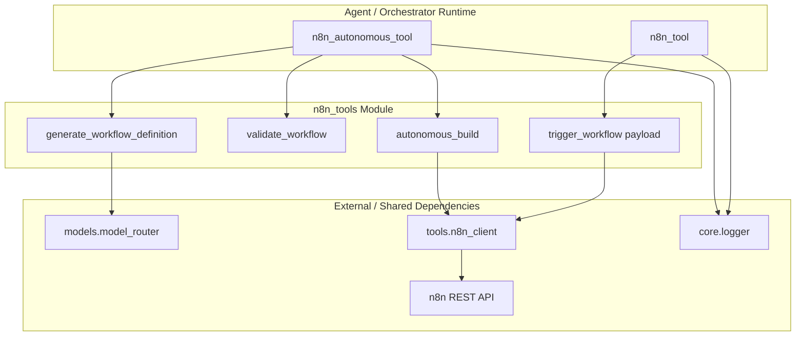
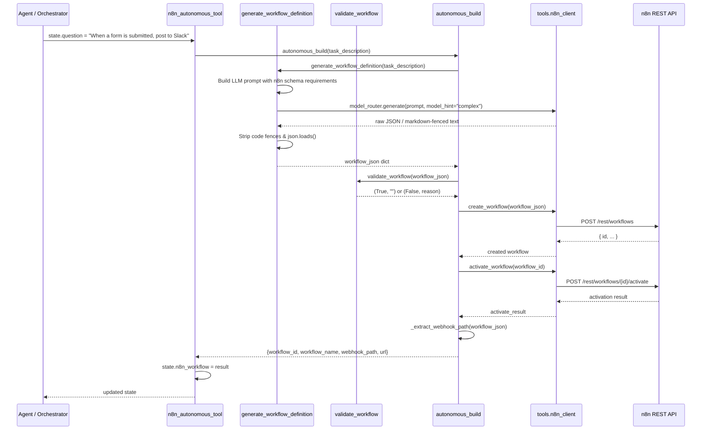
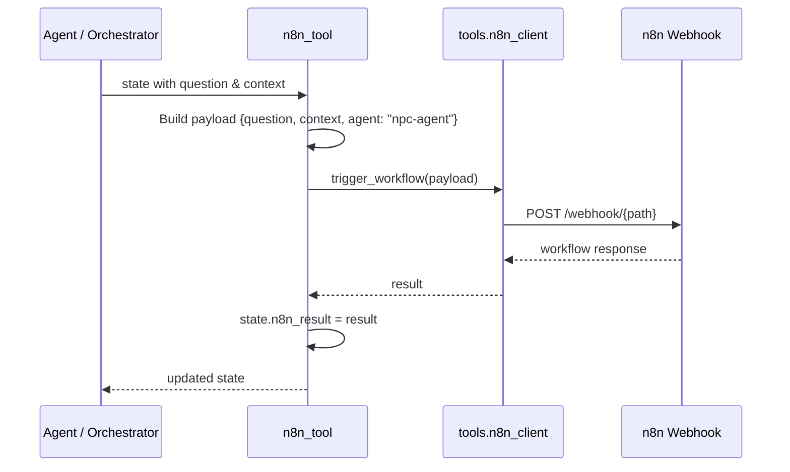
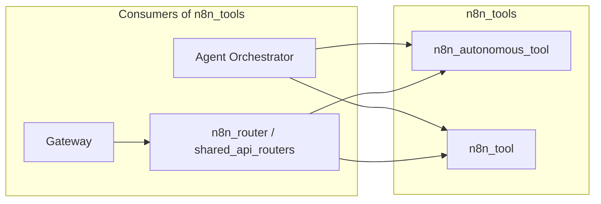

# n8n Tools Module

## Overview

The `n8n_tools` module provides agent-facing integrations with [n8n](https://n8n.io/) — a workflow automation platform. It exposes two complementary capabilities within the broader `shared_integrations` layer:

1. **Autonomous Workflow Builder** (`n8n_autonomous_tool`) — Generates, validates, deploys, and activates n8n workflows from a plain-English task description using an LLM.
2. **Workflow Trigger** (`n8n_tool`) — Sends a structured payload to an existing n8n webhook workflow and captures the result.

These tools allow AI agents in the system to both **create** new n8n automations on demand and **invoke** already-deployed ones, bridging natural-language intent with n8n's JSON-based workflow engine.

---

## Architecture



### Component Responsibilities

| Component | File | Responsibility |
|-----------|------|----------------|
| `n8n_autonomous_tool` | `tools/n8n_autonomous_builder.py` | Orchestrator-compatible entry point that reads `state.question`, runs the full autonomous build pipeline, and stores the result in `state.n8n_workflow`. |
| `generate_workflow_definition` | `tools/n8n_autonomous_builder.py` | Uses the LLM router (`model_hint="complex"`) to produce a valid n8n workflow JSON from a task description. |
| `validate_workflow` | `tools/n8n_autonomous_builder.py` | Performs structural checks: non-empty node list, presence of a Webhook trigger, and valid connection references. |
| `autonomous_build` | `tools/n8n_autonomous_builder.py` | End-to-end pipeline: generate → validate → create → activate → return metadata (`workflow_id`, `webhook_path`, `url`). |
| `n8n_tool` | `tools/n8n_tool.py` | Simple trigger wrapper that sends `{question, context, agent}` to an existing n8n workflow via `trigger_workflow`. |
| `tools.n8n_client` | *(referenced, not in module tree)* | Shared client expected to provide `create_workflow`, `activate_workflow`, and `trigger_workflow` functions that call the n8n REST API. |

---

## Data Flow

### Autonomous Build Flow



### Trigger Flow



---

## Core Components

### `n8n_autonomous_tool`

**File:** `tools/n8n_autonomous_builder.py`

**Purpose:** Adapter that lets the agent orchestrator invoke the autonomous n8n builder using the standard `state` object pattern.

**Behavior:**
- Reads `state.question` as the task description.
- Calls `autonomous_build(task)`.
- On success, stores the build metadata in `state.n8n_workflow`.
- On failure, stores `{"error": <message>}` in `state.n8n_workflow`.
- Always returns the mutated `state`.

**State side effects:**
- `state.n8n_workflow` is set.

### `autonomous_build`

**File:** `tools/n8n_autonomous_builder.py`

**Purpose:** End-to-end pipeline for turning a plain-English task into a live n8n workflow.

**Steps:**
1. Generate workflow JSON via the LLM.
2. Assign a deterministic name (`ainxt-auto-<uuid8>`) if missing.
3. Validate the generated structure.
4. Create the workflow through `tools.n8n_client.create_workflow`.
5. Activate the workflow through `tools.n8n_client.activate_workflow`.
6. Extract the webhook path and construct the public webhook URL.

**Returns:**
```python
{
    "workflow_id":   str,
    "workflow_name": str,
    "webhook_path":  str,
    "url":           str | None
}
```

**Error handling:**
- Raises `ValueError` if the LLM output is not valid JSON.
- Raises `ValueError` if validation fails.
- Raises `RuntimeError` if workflow creation fails.
- Logs a warning (but does not fail) if activation fails.

### `generate_workflow_definition`

**File:** `tools/n8n_autonomous_builder.py`

**Purpose:** LLM-based generation of n8n-compatible workflow JSON.

**Prompt constraints enforced on the model:**
- Workflow must start with a **Webhook trigger** node.
- Must include at least one action node (e.g., HTTP Request, Code).
- Must return a response via a **Respond to Webhook** node.
- Must follow the n8n workflow JSON schema.
- Node IDs must be unique UUIDs.
- Connections must reference valid node IDs.
- Output must be **only valid JSON** (no markdown, no explanation).

**Post-processing:**
- Strips markdown code fences if the model ignores the instruction.
- Parses with `json.loads`.
- Logs and raises `ValueError` on parse failure.

### `validate_workflow`

**File:** `tools/n8n_autonomous_builder.py`

**Purpose:** Lightweight structural guard before sending generated JSON to n8n.

**Checks:**
- Workflow has at least one node.
- At least one node is a Webhook trigger (type ends with `webhook`, case-insensitive).
- Every connection target references an existing node ID.

**Returns:** `(bool, str)` — `(True, "")` on success, `(False, reason)` on failure.

### `n8n_tool`

**File:** `tools/n8n_tool.py`

**Purpose:** Minimal trigger wrapper for already-deployed n8n webhook workflows.

**Behavior:**
- Builds a payload from `state.question`, `state.context`, and a fixed `agent: "npc-agent"` field.
- Calls `trigger_workflow(payload)` from the shared `tools.n8n_client`.
- Stores the response in `state.n8n_result`.
- Returns the mutated `state`.

**State side effects:**
- `state.n8n_result` is set.

---

## Dependencies

### Internal Dependencies

| Dependency | Module / File | Role |
|------------|---------------|------|
| `core.logger` | `shared_core` / `core/logger.py` | Structured logging for build and trigger operations. |
| `models.model_router` | `shared_core` / `models/model_router.py` | Routes the workflow-generation prompt to the appropriate LLM (`model_hint="complex"`). See [shared_core.md](shared_core.md) for details on model routing. |
| `tools.n8n_client` | *(referenced, not present in module tree)* | Shared client providing `create_workflow`, `activate_workflow`, `trigger_workflow`, and `N8N_BASE_URL`. |

### External Dependencies

| Dependency | Role |
|------------|------|
| n8n REST API | Creates, activates, and receives webhook calls for n8n workflows. |
| LLM provider (via `model_router`) | Generates the workflow JSON from natural language. |

---

## Integration with the Broader System

The `n8n_tools` module sits inside `shared_integrations` alongside other connector/tool families such as `github_tools`, `jira_tools`, and `calendar_tools`. It is consumed by:

- **Agent orchestrators** that expose `n8n_autonomous_tool` and `n8n_tool` as callable tools.
- **API routers** such as `n8n_router` (in `shared_api_routers`), which provides HTTP endpoints for listing, creating, triggering, and managing n8n workflows. See [shared_api_routers.md](../api/shared_api_routers.md) and specifically the `n8n_router` sub-section.
- **Gateway** endpoints that proxy n8n operations to external callers.



---

## Error Handling & Observability

- All entry points log invocation and results via `core.logger`.
- `n8n_autonomous_tool` catches exceptions and stores them in `state.n8n_workflow["error"]` so the orchestrator can continue gracefully.
- Validation failures are logged with the specific reason (missing nodes, missing webhook, dangling connection).
- Activation failures are logged as warnings; the workflow is still considered created and its metadata is returned.

---

## Notes & Assumptions

- `tools/n8n_client.py` is referenced by both files but is **not included in the provided module tree**. It is assumed to be a shared integration client that handles authentication, base URL resolution, and HTTP calls to the n8n instance.
- The autonomous builder relies on the LLM to produce syntactically correct n8n JSON. The validation layer is intentionally lightweight and does not deeply validate n8n-specific parameter schemas.
- Webhook path extraction assumes the trigger node type name ends with `webhook` and that the path is stored under `parameters.path`.
