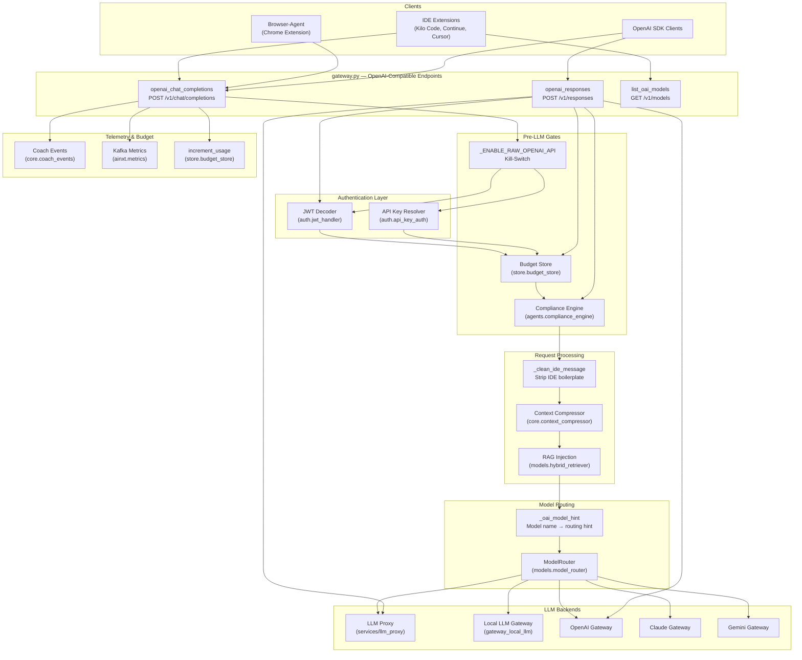
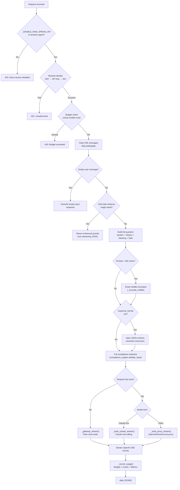
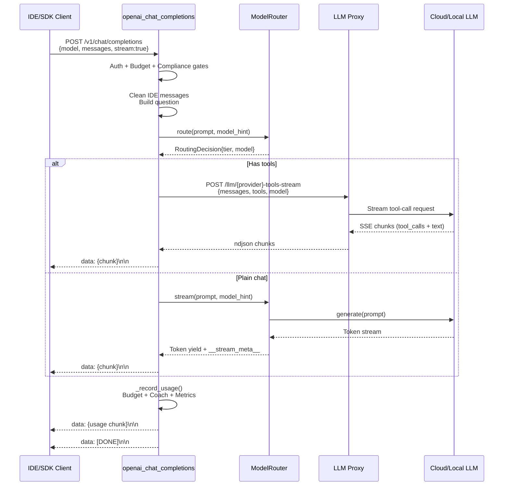
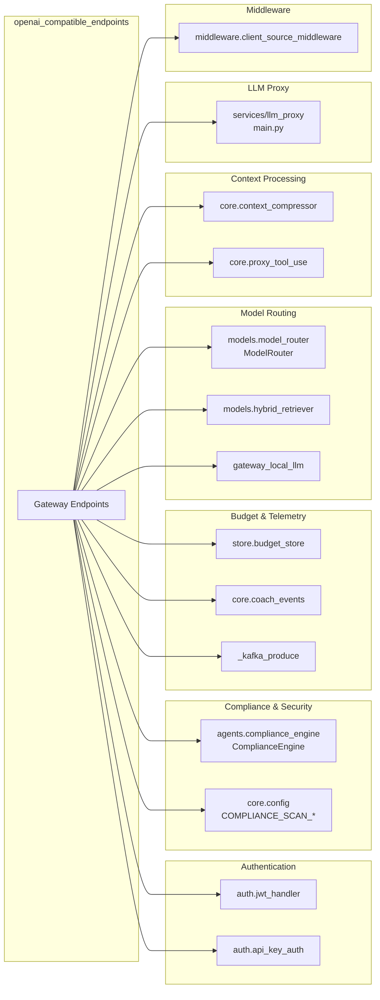

# OpenAI-Compatible Endpoints

## Overview

The **OpenAI-Compatible Endpoints** module provides a set of API routes within the `gateway.py` service that expose the platform's LLM orchestration capabilities through the standard OpenAI API surface. This allows third-party IDE extensions (Kilo Code, Continue.dev, Cursor), browser-automation agents, and any OpenAI-SDK client to connect to the platform with zero code changes — simply by pointing the base URL at the gateway.

The module implements three primary endpoints:

| Endpoint | Method | Purpose |
|---|---|---|
| `/v1/chat/completions` | POST | OpenAI Chat Completions API — streaming + non-streaming, with tool-calling support |
| `/v1/responses` | POST | OpenAI Responses API — routes deep-research models (o4-mini-deep-research, o3-deep-research) |
| `/v1/models` | GET | Lists available models in OpenAI `{"object":"list","data":[...]}` format |

All endpoints enforce authentication (JWT or platform API key), budget gating, and PCI/DSS compliance scanning before any LLM call is made. Responses are streamed back as standard OpenAI Server-Sent Events (`data: {...}\n\n` / `data: [DONE]`).

---

## Architecture



---

## Core Components

### Request Models

#### `_OAIMessage`

A Pydantic model representing a single message in the OpenAI chat format. It accepts content as either a plain string or an array of content-part objects (text, image_url), matching the OpenAI specification. The `text()` helper method extracts plain-text content regardless of the input format, joining text parts with newlines.

**Fields:**
- `role` — message role (`system`, `user`, `assistant`, `tool`)
- `content` — `Union[str, List[Any], None]` — supports multimodal content arrays
- `tool_calls` — optional list of tool-call objects (assistant messages)
- `tool_call_id` — optional tool-call identifier (tool messages)
- `name` — optional tool name

#### `_OAIChatRequest`

The Pydantic model for `POST /v1/chat/completions`. Mirrors the OpenAI Chat Completions request schema.

**Fields:**
- `model` — model identifier (defaults to `_OPENAI_CODING`)
- `messages` — `List[_OAIMessage]`
- `stream` — whether to stream the response (default `True`)
- `max_tokens`, `temperature` — optional generation parameters
- `tools`, `tool_choice` — tool/function-calling fields passed through for agent mode
- `response_format` — structured output specification (`json_schema` or `json_object`)
- `session_id` — optional session identifier for Coach thread grouping

#### `_OAIResponsesRequest`

The Pydantic model for `POST /v1/responses`. Supports the OpenAI Responses API format used by deep-research models.

**Fields:**
- `model` — model identifier (e.g. `o4-mini-deep-research`)
- `input` — `Union[str, List[Any]]` — prompt text or multi-turn message list
- `stream` — streaming flag (default `True`)
- `tools` — required for deep-research models
- `max_output_tokens`, `temperature` — optional generation parameters

---

### `list_oai_models()`

**Endpoint:** `GET /v1/models`

Returns the list of available models in the standard OpenAI format (`{"object": "list", "data": [...]}`) so IDE extensions can populate their model pickers. The list includes:

- **Cloud models:** GPT-5.4 variants (Coding, Latest, Simple, Tera, Luna), Claude variants (Sonnet, Haiku, Opus, Opus 4.8, Opus 5, Sonnet 5), Gemini variants (Text, Coding Lite, Image)
- **Local models:** In-house hosted models from the local LLM gateway, prefixed with `local:`

Model visibility is controlled by feature flags (`_ENABLE_OPUS`, `_ENABLE_CLI_OPUS_48`, `_ENABLE_CLI_OPUS_5`, `_ENABLE_SONNET_5`, `_ENABLE_GPT56_TERA`, `_ENABLE_GPT56_LUNA`). Deep-research models are intentionally excluded — they are only accessible via `/v1/responses`.

---

### `openai_chat_completions()`

**Endpoint:** `POST /v1/chat/completions`

The primary endpoint that translates OpenAI-format requests into the platform's full LLM orchestration pipeline. This is the most complex component in the module, handling authentication, budget enforcement, compliance scanning, IDE prompt cleaning, model routing, tool-call proxying, and response streaming.

#### Request Processing Flow



#### Authentication

Identity is resolved from the `Authorization: Bearer <token>` header through a two-step process:

1. **JWT decode** — `auth.jwt_handler.decode_token()` extracts the `sub` claim
2. **API key fallback** — `auth.api_key_auth.is_api_key()` + `resolve_api_key()` resolves platform API keys

No anonymous access is permitted — a 401 is returned if neither method resolves a user ID.

#### Kill-Switch

The `_ENABLE_RAW_OPENAI_API` flag (default OFF) blocks direct access from curl/SDK/IDE/CLI callers. When disabled, only browser-agent traffic (identified via `X-AiNxt-Client: browser-agent` header, parsed by `ClientSourceMiddleware`) is exempted. Managed endpoints (`/ainxt/v1/api/{slug}/v1/chat/completions`) and `GET /v1/models` are unaffected.

#### Budget Gating

Budget is checked for cloud API models only. In-house models (those not starting with known cloud prefixes like `gpt-`, `claude-`, `gemini-`) bypass the budget check entirely. When budget is exhausted, a 429 response is returned along with a Coach event and inbox notification. See [budget_manager](../models/budget_manager.md) for budget management details.

#### IDE Prompt Cleaning

The `_clean_ide_message()` function strips and compresses IDE-injected boilerplate that inflates prompt size:

- **Removed entirely:** `<environment_details>`, `<repo_map>`, `<file_list>` blocks (the platform has its own codebase index)
- **Unwrapped:** `<task>`, `<attempt_completion>`, `<result>`, `<feedback>` tags — inner text preserved
- **Compressed:** `<file_content>` blocks > 4K chars are head+tail truncated via `compress_ide_tool_result()`

The `_resolve_system()` function detects Kilo Code's bloated system prompt (identified by tool-name fingerprints like `read_file`, `write_to_file`) and replaces it with a minimal system string.

#### Response Steering

A `_CHAT_STEERING` prefix is injected into every prompt to calibrate model behavior:
- Match response length to request complexity
- Never invent meaning for placeholder tokens
- Do not over-refuse simple recall/arithmetic questions
- Never deny facts the user stated earlier in the conversation
- Resolve conflicting instructions sensibly

#### Structured Output Support

When `response_format` is set (`json_schema` or `json_object`), a critical instruction is appended to the prompt directing the LLM to output only raw JSON. For non-streaming responses, markdown code fences are stripped from the output before returning.

#### Tool-Calling Modes

When the request includes `tools`, the endpoint routes to one of three streaming generators based on the model hint:

| Generator | Trigger | Backend |
|---|---|---|
| `_tools_claude_stream()` | Model hint is `claude`, `solution`, `haiku`, or passthrough Claude hints | LLM Proxy `/llm/claude-tools-stream` |
| `_tools_proxy_stream()` | Model hint is `gemini`, `deep`, `mini`, `local`, or image-bearing passthrough | LLM Proxy `/llm/openai-tools-stream` or `/llm/gemini-tools-stream`, or direct local LLM |
| `_gateway_stream()` | No tools in request | ModelRouter direct gateway dispatch |

**Claude tool-calling** converts OpenAI tool/message format ↔ Anthropic format, including `tool_use`/`tool_result` block conversion. It routes through the LLM proxy's Claude tools-stream endpoint.

**Proxy tool-calling** forwards OpenAI-format messages and tools to the LLM proxy's OpenAI or Gemini tools-stream endpoints. For local models (`local:` prefix), it routes directly to the local LLM's OpenAI-compatible endpoint.

**Plain chat mode** uses the `ModelRouter` to route the prompt to the appropriate gateway (OpenAI, Claude, Gemini, or Local) based on complexity classification and model hints. RAG context injection is performed for codebase-related queries.

#### Browser-Agent Passthrough Lane

When `request.state.client_source == "browser-agent"`, a special passthrough lane is activated:

- System prompts are forwarded **verbatim** (not cleaned or replaced)
- User content (including image_url parts) is forwarded **as-is**
- Tool results are **not compressed** (full DOM snapshots retained)
- RAG injection is **skipped** (detected via both the header and a prompt-shape heuristic `looks_like_browser_agent_prompt()`)
- A scan ledger (`_pt_scan_ledger`) caches compliance scan results to avoid re-scanning identical messages across turns
- Image-bearing turns are steered to the OpenAI proxy (Claude stream drops image_url parts)

#### Compliance Gates

Two compliance gates run before any LLM call:

1. **Gate 1 — Current user message:** `compliance_engine.validate_input(last_user)` scans the raw (pre-mask) last user message. Blocked types return an error chunk.
2. **Gate 2 — Conversation history:** `_build_oai_messages()` or `_build_passthrough_messages()` scans all user and tool messages in history (gated by `COMPLIANCE_SCAN_HISTORY` and `COMPLIANCE_SCAN_TOOL_RESULTS` config flags, both default OFF).

See [shared_core](shared_core.md) for ComplianceEngine details.

#### Usage Tracking

The `_record_usage()` closure runs after every response (streaming or non-streaming) and:

1. Estimates token counts (from actual usage data when available, otherwise word-count heuristic)
2. Calculates cost via `_estimate_cost()` (local models are always $0)
3. Increments budget usage via `store.budget_store.increment_usage()`
4. Emits a Kafka `ainxt.metrics` event with full cost/latency breakdown
5. Emits a Coach event via `core.coach_events.emit_coach_event()`
6. Logs a comprehensive summary with before/after budget state

#### Concurrency Control

A semaphore (`_LLM_SEMAPHORE` with `_SEM_ACQUIRE_TIMEOUT`) limits concurrent LLM calls. If the semaphore cannot be acquired, a 503 (non-streaming) or a "Server busy" SSE chunk (streaming) is returned.

---

### `openai_responses()`

**Endpoint:** `POST /v1/responses`

Implements the OpenAI Responses API, primarily used for deep-research models (`o4-mini-deep-research`, `o3-deep-research`). These models require the `tools` parameter (at minimum `web_search_preview`).

**Processing flow:**
1. Authentication (same JWT/API-key flow as chat completions)
2. Validate that `tools` is provided for deep-research models (422 if missing)
3. Compliance scan on input (current turn always; history gated by `COMPLIANCE_SCAN_HISTORY`)
4. Budget gate
5. Route to LLM proxy `/llm/responses` (when `LLM_PROXY_URL` is set) or direct OpenAI gateway
6. Stream SSE events (`response.output_text.delta`, `response.completed`, `[DONE]`)
7. Increment budget usage after completion

---

## Data Flow: Streaming Response



---

## Dependencies



### Key Dependency Details

| Dependency | Role |
|---|---|
| **`models.model_router.ModelRouter`** | Routes prompts to the correct LLM gateway based on model hints, complexity classification, vision detection, and privacy floors. See [model_routing](../models/model_routing.md). |
| **`agents.compliance_engine.ComplianceEngine`** | Scans input for PCI/PII/secrets. Redacts configured types and blocks configured block-types. See [shared_core](shared_core.md). |
| **`store.budget_store`** | Enforces per-user cost budgets. `check_budget()` gates cloud model access; `increment_usage()` records spend. See [budget_manager](../models/budget_manager.md). |
| **`core.context_compressor`** | Compresses IDE-injected boilerplate: `compress_ide_tool_result()` for individual file reads, `compress_ide_messages()` for session-level history, `_truncate_middle()` for prompt-level truncation. |
| **`core.proxy_tool_use.llm_proxy_headers()`** | Builds authenticated headers (X-Internal-Token) for LLM proxy calls. |
| **`middleware.client_source_middleware`** | Detects client source (IDE, browser-agent, CLI, API) from request headers, enabling the passthrough lane. |
| **`services/llm_proxy`** | Centralized LLM proxy service that holds all cloud API keys and forwards requests to OpenAI/Anthropic/Google. See [llm_proxy_main](../models/llm_proxy_main.md). |
| **`gateway_local_llm`** | In-house LLM gateway for locally hosted models (zero-cost, privacy-preserving). |
| **`core.coach_events`** | Emits practice events for the AI Coach system, tracking prompt quality and usage patterns. |

---

## Model Hint Resolution

The `_oai_model_hint()` function translates OpenAI-style model names into internal routing hints:

| Model Name Pattern | Routing Hint | Destination |
|---|---|---|
| `local:*` | `local` | In-house LLM (direct, zero-cost) |
| `gpt-*`, `openai/*` | `deep` / `medium` / `mini` | OpenAI gateway via proxy |
| `claude-*`, `anthropic/*` | `claude` / `haiku` / `solution` / `opus-*` | Claude gateway via proxy |
| `gemini-*`, `google/*` | `gemini` | Gemini gateway via proxy |
| *(no match)* | `None` | ModelRouter auto-routes by complexity |

---

## Configuration Flags

| Flag | Default | Effect |
|---|---|---|
| `_ENABLE_RAW_OPENAI_API` | OFF | Blocks direct access to `/v1/chat/completions` from non-browser-agent clients |
| `_ENABLE_OPUS` | varies | Gates Claude Opus model availability |
| `_ENABLE_CLI_OPUS_48` | varies | Gates Claude Opus 4.8 (CLI/IDE only) |
| `_ENABLE_CLI_OPUS_5` | varies | Gates Claude Opus 5 (CLI/IDE opt-in) |
| `_ENABLE_SONNET_5` | varies | Gates Claude Sonnet 5 (all channels) |
| `_ENABLE_GPT56_TERA` | varies | Gates GPT-5.6 Tera |
| `_ENABLE_GPT56_LUNA` | varies | Gates GPT-5.6 Luna |
| `COMPLIANCE_SCAN_HISTORY` | OFF | Enables ML compliance scanning of conversation history |
| `COMPLIANCE_SCAN_TOOL_RESULTS` | OFF | Enables ML compliance scanning of tool results |
| `_PT_ENFORCE_SCAN` | varies | Forces compliance scanning in passthrough lane |
| `_PT_SCAN_LEDGER_ENABLED` | varies | Enables scan-result caching for passthrough lane |
| `LLM_PROXY_URL` | env | Base URL for the LLM proxy service |
| `LLM_PROXY_TOKEN` | env | Pre-shared secret for LLM proxy authentication |

---

## Response Formats

### Streaming (SSE)

Standard OpenAI Server-Sent Events format:

```
data: {"id":"chatcmpl-xxx","object":"chat.completion.chunk","created":...,"model":"...","choices":[{"index":0,"delta":{"role":"assistant","content":""},"finish_reason":null}]}

data: {"id":"chatcmpl-xxx","object":"chat.completion.chunk","created":...,"model":"...","choices":[{"index":0,"delta":{"content":"Hello"},"finish_reason":null}]}

data: {"id":"chatcmpl-xxx","object":"chat.completion.chunk","created":...,"model":"...","choices":[{"index":0,"delta":{},"finish_reason":"stop"}]}

data: {"id":"chatcmpl-xxx","object":"chat.completion.chunk","created":...,"model":"...","choices":[],"usage":{"prompt_tokens":...,"completion_tokens":...,"total_tokens":...}}

data: [DONE]
```

### Non-Streaming (JSON)

```json
{
  "id": "chatcmpl-xxx",
  "object": "chat.completion",
  "created": 1234567890,
  "model": "gpt-5.4",
  "choices": [{
    "index": 0,
    "message": {"role": "assistant", "content": "..."},
    "finish_reason": "stop"
  }],
  "usage": {"prompt_tokens": 100, "completion_tokens": 50, "total_tokens": 150}
}
```

---

## Error Responses

All errors follow the OpenAI error format:

| Status | Code | Condition |
|---|---|---|
| 401 | `unauthorized` | No valid JWT or API key |
| 403 | `direct_access_disabled` | Kill-switch active, non-browser-agent client |
| 422 | `missing_tools` | Deep-research model requested without tools |
| 429 | `BUDGET_EXCEEDED` | User budget exhausted |
| 503 | — | Semaphore timeout (server busy) |

---

## Related Documentation

- [chat_and_messaging](../chat/chat_and_messaging.md) — The platform's primary `/ask` streaming endpoint and chat history persistence
- [model_routing](../models/model_routing.md) — ModelRouter, tier classification, gateway dispatch, and fallback chains
- [shared_core](shared_core.md) — ComplianceEngine, context compression, and core infrastructure
- [budget_manager](../models/budget_manager.md) — Budget enforcement, usage tracking, and allocation management
- [llm_proxy_main](../models/llm_proxy_main.md) — Centralized LLM proxy service holding all cloud API keys
- [messages_compat_router](../api/messages_compat_router.md) — Anthropic Messages API compatibility endpoint
- [endpoint_proxy_router](../api/endpoint_proxy_router.md) — Managed endpoint proxy for per-team OpenAI-compatible endpoints
