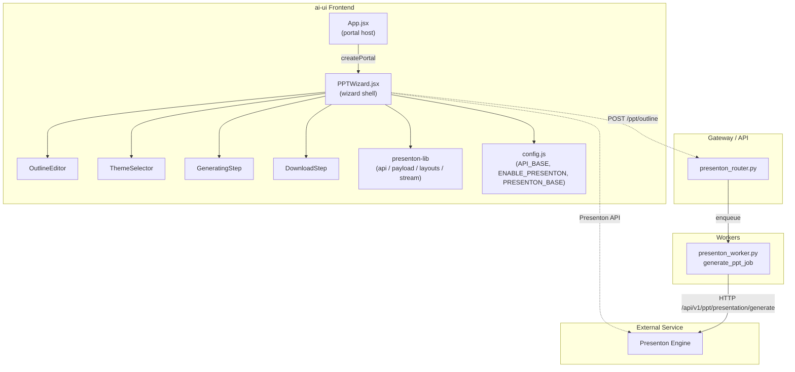
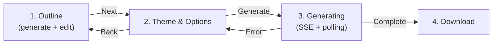
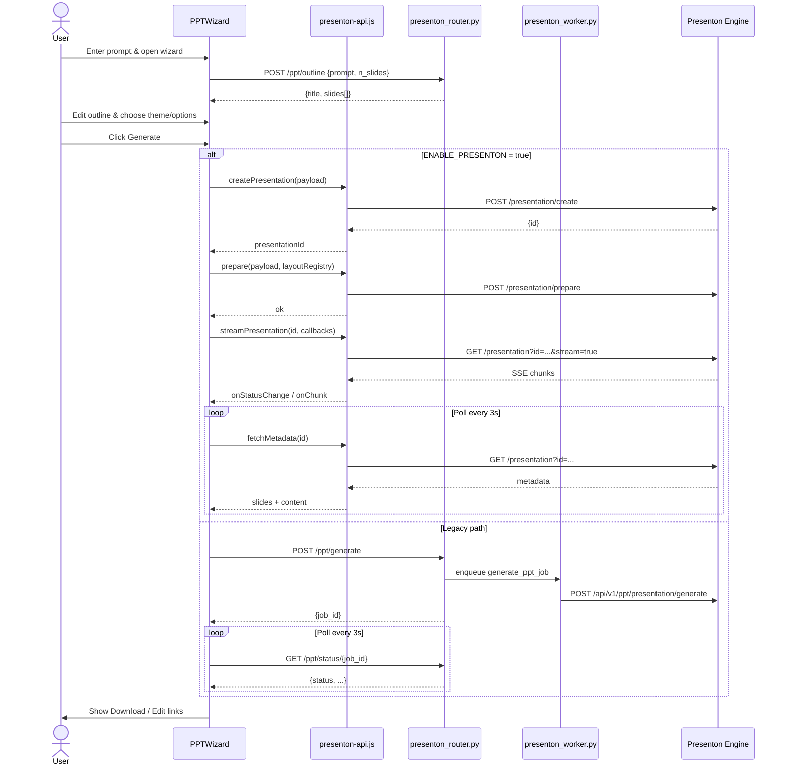
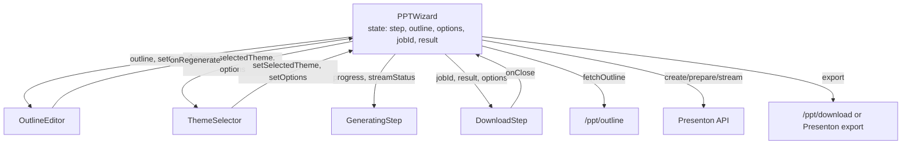

# PPT Wizard Module

## Brief Introduction

The **PPT Wizard** is a full-screen, multi-step React modal that guides users through creating AI-generated presentations. It is the primary user-facing interface for the **Presenton** presentation engine within the AiNxt platform. The wizard takes a natural-language prompt, produces an editable slide outline, lets the user choose a theme and export options, orchestrates generation, and finally provides download and edit links.

It is rendered as a React portal from the main application shell so it sits above all other UI chrome, and it is designed to work both with the modern Presenton service and a legacy backend generation path.

---

## Purpose and Core Functionality

The module’s responsibilities are:

1. **Outline generation** — Call the backend to turn a user prompt into a structured slide outline (`title` + `slides[]` with bullets, optional charts, and optional stats).
2. **Outline editing** — Let the user review, reorder, add, remove, and edit slides and bullets before generation.
3. **Theme and option selection** — Choose a visual theme, slide count, tone, language, verbosity, table-of-contents inclusion, and export format (`pptx` or `pdf`).
4. **Generation orchestration** — Create a presentation in Presenton, prepare slide layouts, start an SSE generation stream, and poll until all slides have content.
5. **Download / edit** — Export the finished deck and offer a link to open it in the Presenton editor.

The wizard is intentionally decoupled from the chat surface: it receives `prompt`, `chatId`, `user`, and `onClose`/`onComplete` callbacks, so it can be launched from chat messages, the dashboard, or any other trigger.

---

## Architecture

### Component Breakdown

| Component | File | Responsibility |
|-----------|------|----------------|
| `PPTWizard` | `PPTWizard.jsx` | Top-level state machine, portal rendering, lifecycle (outline fetch, generation, polling, cleanup). |
| `OutlineEditor` | `PPTWizard.jsx` | Step 1 UI: editable title, slide list, bullets, reorder/add/remove. |
| `ThemeSelector` | `PPTWizard.jsx` | Step 2 UI: theme grid, slide count, tone, language, verbosity, TOC, export format. |
| `GeneratingStep` | `PPTWizard.jsx` | Step 3 UI: progress spinner, heuristic progress bar, stream status messaging. |
| `DownloadStep` | `PPTWizard.jsx` | Step 4 UI: download button, Presenton editor link, error display. |
| `StepProgress` | `PPTWizard.jsx` | Header progress dots for the four wizard steps. |
| `addSlide` / `handleDownload` / `onKey` / `handleGenerate` | `PPTWizard.jsx` | Local action handlers and keyboard shortcuts. |

---

## Wizard Step Flow

### Step 1 — Outline

- On mount, `fetchOutline` posts `{ prompt, n_slides }` to `/ppt/outline`.
- The backend ([presenton_router.md](../api/presenton_router.md)) uses a large language model to produce JSON: `{ title, slides: [{ title, bullets, chart?, stats? }] }`.
- The user can edit the title, each slide title, bullets, reorder slides, add/remove slides, and regenerate the outline.

### Step 2 — Theme & Options

- Themes are loaded from the local `presenton-layout-registry.ts` ([presenton_lib.md](presenton_lib.md)) and merged with fallback metadata.
- The user selects:
  - **Theme** (`general`, `swift`, etc.)
  - **Slide count** (5–15)
  - **Tone** (professional, educational, casual, sales_pitch, funny)
  - **Language** (English, Hindi, Tamil, Telugu, Kannada, Malayalam, Bengali, Gujarati)
  - **Verbosity** (concise, standard, text-heavy)
  - **Table of contents** toggle
  - **Export format** (`pptx` or `pdf`)

### Step 3 — Generating

When Presenton is enabled (`ENABLE_PRESENTON`):

1. `createPresentation` — create the deck in Presenton.
2. `prepare` — send the outline + selected theme layout from the local registry.
3. `streamPresentation` — open an SSE stream for real-time generation updates.
4. Poll `fetchMetadata` every 3 seconds until every slide has non-empty content or an error/timeout occurs.

When Presenton is disabled, the legacy path posts to `/ppt/generate` and polls `/ppt/status/{job_id}`.

### Step 4 — Download

- Calls `updatePresentation` with the final metadata.
- Calls `exportPresentation` with the chosen format.
- Triggers a browser download of the resulting blob.
- Shows an **Edit in Presenton** link when `ENABLE_PRESENTON` is true.

---

## Data Flow

---

## Component Interaction

---

## Dependencies

The PPT Wizard relies on the following modules. Refer to their dedicated documentation for deeper detail:

- **[presenton_lib.md](presenton_lib.md)** — `presenton-api.js`, `presenton-layout-registry.ts`, `presenton-layouts.ts`, `presenton-payload.js`, and `presenton-stream.js`. These handle all Presenton HTTP calls, layout mapping, payload construction, and SSE reading.
- **[ppt_chat.md](../chat/ppt_chat.md)** — `PPTChatMessage` and `PPTChatMessageRenderer`, which render progress and completion messages when the wizard is invoked from chat.
- **[presenton_router.md](../api/presenton_router.md)** — FastAPI router exposing `/ppt/outline`, `/ppt/generate`, `/ppt/status/{job_id}`, `/ppt/download/{job_id}`, and `/ppt/themes`.
- **[presenton_worker.md](../presenton_worker.md)** — RQ worker that calls the Presenton engine for the legacy queued path.
- **[doc_generator.md](../documents/doc_generator.md)** — `slides_to_pptx` and related helpers used for simple PPTX rendering.
- **[llm_proxy_main.md](../models/llm_proxy_main.md)** — LLM proxy service that may be used for image generation and other model calls supporting presentation creation.

---

## Key Design Decisions

1. **Portal rendering** — The wizard is mounted with `createPortal` to `document.body` so it can overlay the entire application without being constrained by parent stacking contexts.
2. **Dual-path backend support** — `ENABLE_PRESENTON` flag switches between direct Presenton API integration and the legacy gateway/worker flow, allowing staged rollouts.
3. **Local layout registry** — Theme data and slide layouts are sourced from `presenton-layout-registry.ts` to avoid extra network round-trips and to support offline theme browsing.
4. **Resilient polling** — The polling loop tolerates up to 10 consecutive errors and runs for a maximum of 10 minutes before surfacing a timeout to the user.
5. **Abort support** — Each generation creates an `AbortController`, allowing future cancellation of in-flight Presenton streams.
6. **Keyboard UX** — Pressing `Escape` closes the wizard; the modal backdrop also closes on click.

---

## Integration Points

| Integration | How it is used |
|-------------|----------------|
| `App.jsx` | Hosts the wizard portal and passes `prompt`, `chatId`, `user`, `onClose`, `onComplete`. |
| `config.js` | Provides `API_BASE`, `authFetch`, `ENABLE_PRESENTON`, and `PRESENTON_BASE`. |
| `presenton-api.js` | Direct Presenton HTTP client used when `ENABLE_PRESENTON` is true. |
| `presenton-layout-registry.ts` | Supplies theme definitions and slide layout schemas. |
| `presenton-payload.js` | Builds `create`, `prepare`, and `export` payloads. |
| `presenton-stream.js` | Reads SSE streams from Presenton. |
| `presenton_router.py` | Legacy/outline backend: `/ppt/outline`, `/ppt/generate`, `/ppt/status`, `/ppt/download`. |
| `presenton_worker.py` | RQ worker that talks to Presenton for legacy queued jobs. |

---

## Error Handling

- **Outline generation failure** — Shows an error state with a **Try again** button that re-invokes `fetchOutline`.
- **Generation failure** — Displays the error in Step 3 and offers a **Go back and retry** button returning to Step 2.
- **Download failure** — Surfaces the error inline in `DownloadStep` without closing the wizard.
- **Polling resilience** — Transient network errors are logged and retried; only sustained failures stop polling.

---

## Notes for Maintainers

- The `FALLBACK_THEMES` array must stay in sync with `LAYOUT_GROUPS` in `presenton-layout-registry.ts`.
- The legacy `/ppt/*` routes are still used for outline generation even when Presenton is enabled.
- Slide content heuristics in `buildSlideContent` map outline bullets/stats/charts to Presenton layout fields; adding new layouts requires updating both the registry and the payload builder.
- The wizard stores the last presentation id in `localStorage` under `presenton_presentation_id` for debugging and recovery.
