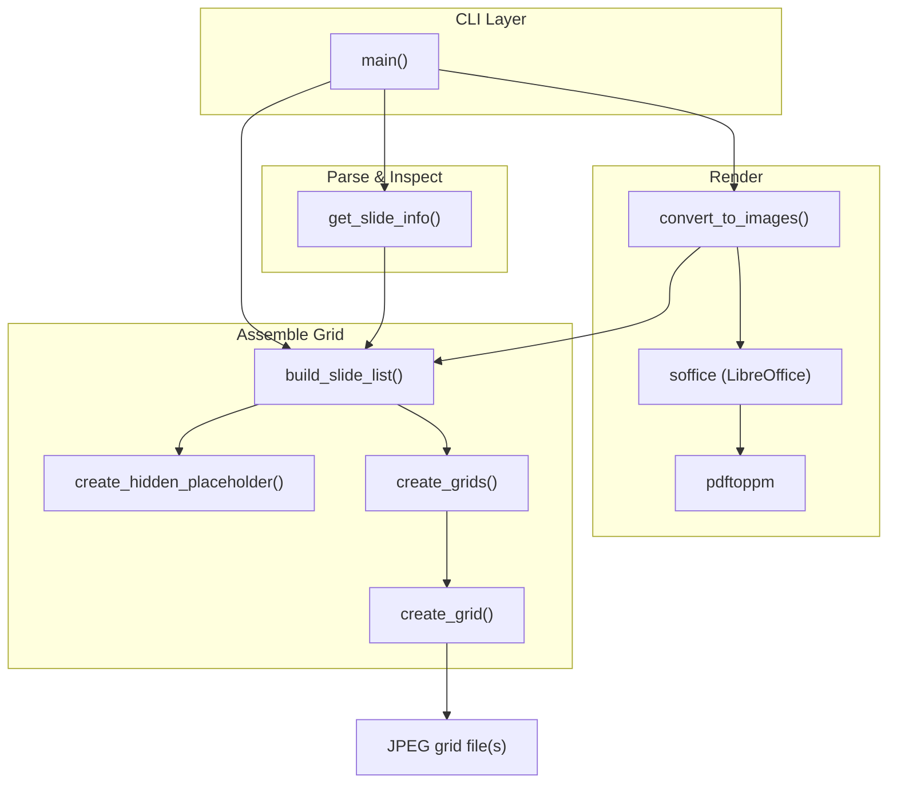
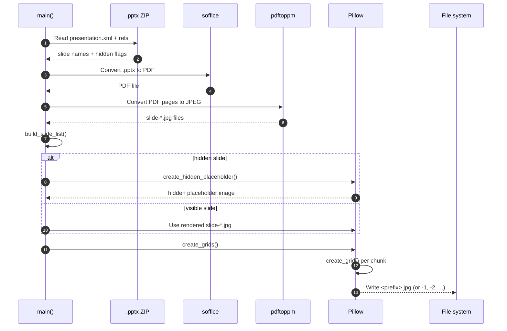
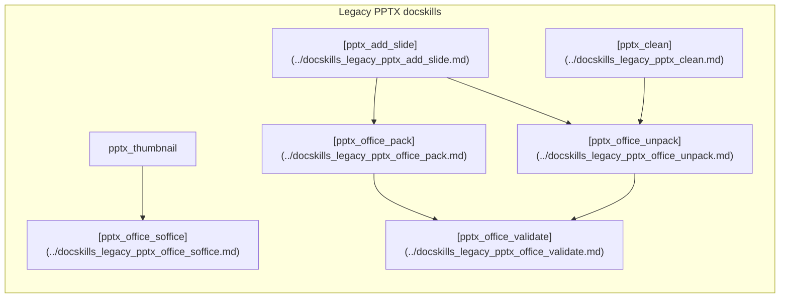

# pptx_thumbnail

## Brief Introduction

`pptx_thumbnail` is a command-line utility in the legacy Anthropic docskills PPTX toolkit. It generates labeled JPEG thumbnail grids from PowerPoint (`.pptx`) files, providing a quick visual overview of all slides including hidden ones. The tool is typically used during document inspection, debugging, and automated reporting workflows where a compact visual summary of a deck is required.

---

## Module Purpose and Core Functionality

The module reads a `.pptx` file, renders each visible slide to an image, and arranges the results into one or more grid images. Hidden slides are represented by a placeholder pattern rather than being rendered, so reviewers can see that a slide exists but is suppressed.

### Key capabilities

| Capability | Description |
|------------|-------------|
| Slide enumeration | Parses `ppt/presentation.xml` and `ppt/_rels/presentation.xml.rels` to discover slide XML files and their hidden/visible state. |
| PDF-based rendering | Uses LibreOffice (`soffice`) to convert the deck to PDF, then `pdftoppm` to produce JPEG images at a configurable DPI. |
| Hidden-slide placeholders | Generates a crossed-out placeholder image for any slide marked `show="0"`. |
| Grid layout | Arranges thumbnails into a configurable number of columns with labels, padding, and borders. |
| Large-deck chunking | Splits very large decks into multiple grid images when the slide count exceeds the per-grid maximum. |
| CLI interface | Accepts input file, output prefix, and column count as arguments. |

### Output

- One or more JPEG files named `<output_prefix>.jpg` (or `<output_prefix>-1.jpg`, `<output_prefix>-2.jpg`, etc. when chunking is required).
- Each thumbnail is labeled with its source slide XML name (for example, `slide1.xml`), with hidden slides annotated as `slideN.xml (hidden)`.

---

## Architecture and Component Relationships

`pptx_thumbnail` is a single-file script with a small set of focused functions. The architecture is intentionally simple: a CLI entry point orchestrates a linear pipeline of parse -> render -> assemble -> write.

### Component overview



### Component responsibilities

| Component | Responsibility |
|-----------|----------------|
| `main()` | Parses CLI arguments, validates the input file, coordinates the pipeline, and reports output paths. |
| `get_slide_info()` | Opens the `.pptx` as a ZIP archive and reads the Open XML relationship/presentation files to build an ordered list of slide names and hidden flags. |
| `convert_to_images()` | Converts the `.pptx` to a temporary PDF via `soffice`, then converts each PDF page to a JPEG via `pdftoppm`. Returns the list of image paths in slide order. |
| `build_slide_list()` | Merges the parsed slide metadata with the rendered images. For hidden slides it generates a placeholder image; for visible slides it pairs the next rendered image with the slide name. |
| `create_hidden_placeholder()` | Draws a gray crossed-out placeholder on a blank canvas sized to match the rendered slide dimensions. |
| `create_grids()` | Chunks the full slide list into pages and delegates per-page grid rendering to `create_grid()`. |
| `create_grid()` | Uses Pillow to draw labels, paste thumbnails, add borders, and produce a single grid image. |

---

## Data Flow



1. **Metadata extraction** - `get_slide_info()` reads the Open XML package to determine how many slides exist, their XML file names, and which are hidden.
2. **Rendering** - `convert_to_images()` shells out to `soffice` for PDF conversion and `pdftoppm` for rasterization. The environment for `soffice` is prepared by the shared helper [`get_soffice_env()`](../docskills_legacy_pptx_office_soffice.md).
3. **Slide list assembly** - `build_slide_list()` walks the metadata in presentation order. Hidden slides get a placeholder; visible slides consume the next rendered JPEG.
4. **Grid generation** - `create_grids()` pages the slides and `create_grid()` draws each page with labels, padding, and borders.
5. **Persistence** - Final JPEG(s) are written to disk with the requested output prefix.

---

## Configuration and Constants

The module uses a small set of module-level constants to control the output style:

| Constant | Default | Purpose |
|----------|---------|---------|
| `THUMBNAIL_WIDTH` | 300 px | Width of each thumbnail in the grid. |
| `CONVERSION_DPI` | 100 | DPI passed to `pdftoppm` when rasterizing the PDF. |
| `MAX_COLS` | 6 | Hard upper bound for the `--cols` argument. |
| `DEFAULT_COLS` | 3 | Default number of columns. |
| `JPEG_QUALITY` | 95 | JPEG quality setting for the output file. |
| `GRID_PADDING` | 20 px | Padding between grid cells. |
| `BORDER_WIDTH` | 2 px | Border width drawn around each thumbnail. |
| `FONT_SIZE_RATIO` | 0.10 | Label font size relative to thumbnail width. |
| `LABEL_PADDING_RATIO` | 0.4 | Label padding relative to font size. |

---

## How It Fits into the Overall System

`pptx_thumbnail` belongs to the legacy Anthropic docskills PPTX subsystem under `shared_skills`. It is a standalone diagnostic/utility script rather than a service endpoint, and is normally invoked directly from the shell or by automation that needs a visual summary of a PowerPoint deck.

### Position in the docskills legacy PPTX family



- **[pptx_add_slide](../docskills_legacy_pptx_add_slide.md)** and **[pptx_clean](../docskills_legacy_pptx_clean.md)** manipulate unpacked `.pptx` packages.
- **[pptx_office_soffice](../docskills_legacy_pptx_office_soffice.md)** provides the `get_soffice_env()` helper used by `pptx_thumbnail` to run LibreOffice in a headless, container-friendly way.
- **[pptx_office_pack](../docskills_legacy_pptx_office_pack.md)** and **[pptx_office_unpack](../docskills_legacy_pptx_office_unpack.md)** handle ZIP packaging of Open XML documents.
- **[pptx_office_validate](../docskills_legacy_pptx_office_validate.md)** validates package integrity after modifications.

`pptx_thumbnail` does not modify the source deck; it only reads and renders it, so it can be used safely on production files for inspection or reporting.

---

## Usage

```bash
python thumbnail.py presentation.pptx
# Creates thumbnails.jpg

python thumbnail.py presentation.pptx overview --cols 4
# Creates overview.jpg with 4 columns
```

### CLI arguments

| Argument | Required | Default | Description |
|----------|----------|---------|-------------|
| `input` | Yes | - | Path to the `.pptx` file. |
| `output_prefix` | No | `thumbnails` | Prefix for the output JPEG file name. |
| `--cols` | No | 3 | Number of columns per grid (capped at `MAX_COLS`). |

---

## Dependencies

### Python packages

- `defusedxml` - secure XML parsing for the Open XML package.
- `Pillow` - image creation, resizing, and drawing.

### External binaries

- `soffice` (LibreOffice) - converts `.pptx` to PDF.
- `pdftoppm` (Poppler) - converts PDF pages to JPEG images.

### Internal helpers

- `office.soffice.get_soffice_env()` - prepares the environment for `soffice`, including an optional socket shim for restricted environments. See [pptx_office_soffice](../docskills_legacy_pptx_office_soffice.md) for details.

---

## Error Handling

The module exits with a non-zero status and prints to `stderr` for the following conditions:

- Invalid or non-existent input file.
- Input file does not have a `.pptx` extension.
- PDF conversion by `soffice` fails.
- Image conversion by `pdftoppm` fails.
- No slides are found and no hidden slides exist.
- Any unexpected exception during processing.

---

## Notes for Maintainers

- The script assumes that visible slides in the rendered image list are in the same order as the non-hidden entries returned by `get_slide_info()`. If the PDF renderer skips or reorders slides, the labels may become misaligned.
- Hidden slides are detected by the `show="0"` attribute on `<p:sldId>` elements in `ppt/presentation.xml`.
- The placeholder size is derived from the first rendered image; if the deck contains only hidden slides, a default 1920x1080 placeholder is used.
- Large decks are split into multiple grids using a page size of `cols * (cols + 1)` slides per grid.
