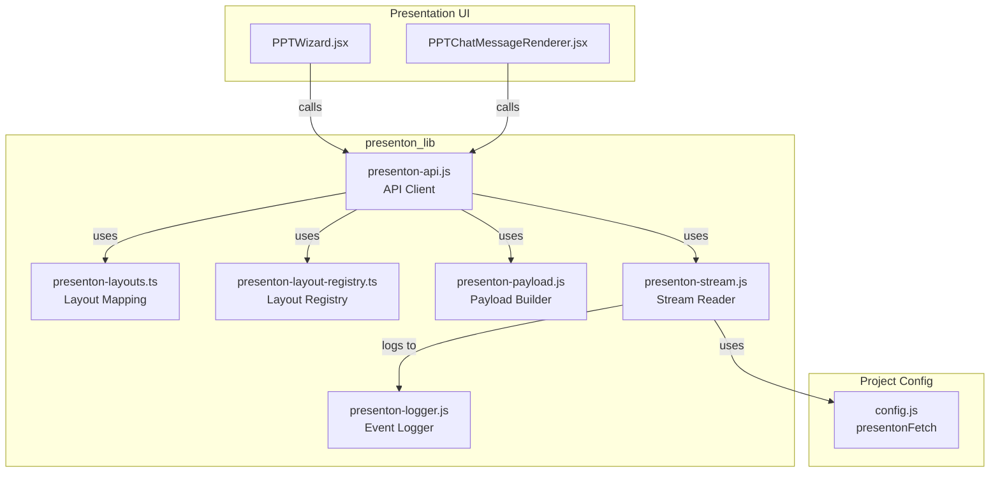
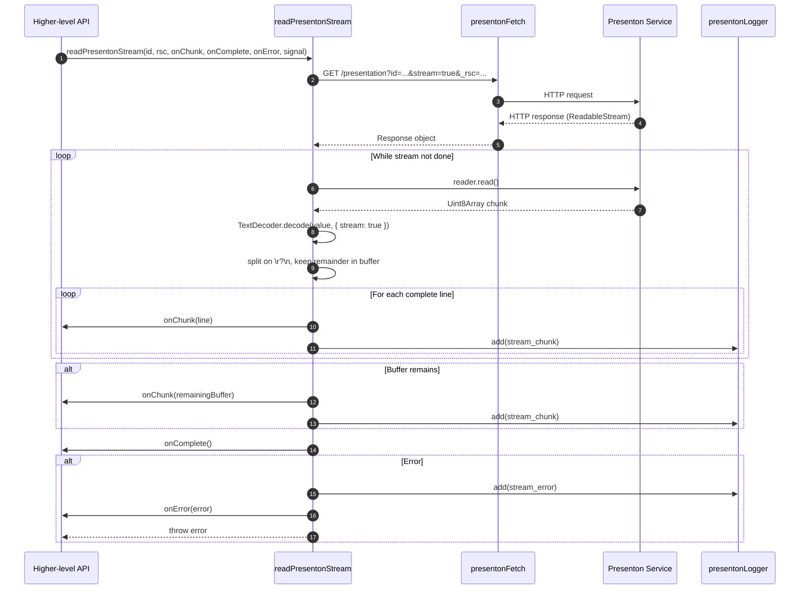

# presenton_lib_stream_reader

## Brief Introduction

The `presenton_lib_stream_reader` module is a small, focused client-side utility in the `ai-ui` frontend that consumes streaming HTTP responses from the **Presenton** presentation-generation service. It exposes a single public function, `readPresentonStream`, which reads a `ReadableStream` returned by the Presenton `/presentation` endpoint, decodes UTF-8 chunks, splits them into newline-delimited payloads, and forwards each payload to a caller-supplied callback.

This module is part of the larger [`presenton_lib`](presenton_lib.md) family, which orchestrates presentation creation, layout selection, payload building, and real-time progress tracking for the AI-powered presentation studio used by [`ppt_wizard`](ppt_wizard.md) and [`ppt_chat`](../chat/ppt_chat.md).

---

## Core Responsibility

`readPresentonStream` is the lowest-level streaming primitive in the Presenton client layer. Its job is to:

1. Open a GET request to `/presentation?id=<id>&stream=true&_rsc=<rsc>` via [`presentonFetch`](../infrastructure/config.md).
2. Validate the HTTP response.
3. Read the response body incrementally using `ReadableStream.getReader()`.
4. Decode raw bytes with `TextDecoder` in streaming mode.
5. Buffer partial lines and emit complete newline-delimited chunks to `onChunk`.
6. Flush any remaining buffered data when the stream ends.
7. Notify `onComplete` or `onError` and persist diagnostic events via [`presentonLogger`](../presenton_logger.md).

The function does **not** interpret the semantic content of chunks (e.g., slide JSON, status events, or RSC flight data). Higher-level callers such as [`streamOutlines`](../api/presenton_lib_api_client.md) and [`streamPresentation`](../api/presenton_lib_api_client.md) wrap this primitive and apply their own parsing and state management.

---

## File Location

```text
ai-ui/src/lib/presenton-stream.js
```

---

## Public API

### `readPresentonStream(presentationId, rsc, onChunk, onComplete, onError, signal)`

| Parameter | Type | Description |
|-----------|------|-------------|
| `presentationId` | `string` | Presenton presentation identifier. |
| `rsc` | `string` | RSC (React Server Component) stream identifier, e.g. `'outlines'`. |
| `onChunk` | `(chunk: string) => void` | Called for every complete line decoded from the stream. |
| `onComplete` | `() => void` | Called once after the stream is fully consumed and the buffer is flushed. |
| `onError` | `(error: Error) => void` | Called when the HTTP request fails or an unrecoverable error occurs. |
| `signal` | `AbortSignal` | Optional `AbortSignal` for cancellation. |

**Returns:** `Promise<void>`

**Throws:** The caught error is re-thrown after invoking `onError` and logging it.

---

## Architecture

### Component Diagram



### Stream Reader Internal Flow



---

## Data Flow

1. **Request Construction**  
   The stream URL is built relative to `PRESENTON_BASE` (configured in [`config.js`](../infrastructure/config.md)):
   ```javascript
   const url = `/presentation?id=${encodeURIComponent(presentationId)}&stream=true&_rsc=${rsc}`;
   ```
   [`presentonFetch`](../infrastructure/config.md) prepends `/presenton` and applies a configurable timeout.

2. **Response Validation**  
   Non-2xx responses are read as text and converted into a thrown `Error` carrying the HTTP status and body.

3. **Incremental Decoding**  
   A `ReadableStreamDefaultReader` pulls byte chunks. Each chunk is decoded with `TextDecoder('utf-8')` in streaming mode so multi-byte characters split across chunk boundaries are handled correctly.

4. **Line Buffering**  
   Decoded text is appended to a `buffer` string and split on `/\r?\n/`. The last element (potentially an incomplete line) is kept in `buffer`; complete lines are emitted.

5. **Final Flush**  
   When `reader.read()` reports `done`, any remaining text in `buffer` is emitted as a final chunk.

6. **Observability**  
   Every emitted chunk and every error is persisted by [`presentonLogger`](../presenton_logger.md) under a per-presentation `localStorage` key for client-side debugging.

---

## Dependencies

| Dependency | Module | Role |
|------------|--------|------|
| `presentonFetch` | [`config.js`](../infrastructure/config.md) | Performs the actual HTTP request with Presenton base URL and timeout handling. |
| `presentonLogger` | [`presenton-logger.js`](../presenton_logger.md) | Persists stream chunks and errors to `localStorage`. |

---

## Relationship to Other Modules

- **Parent module:** [`presenton_lib`](presenton_lib.md) — groups all Presenton client utilities.
- **API client:** [`presenton_lib_api_client`](../api/presenton_lib_api_client.md) — provides `streamOutlines`, `streamPresentation`, `streamPresentationRSC`, and `pollPresentationStatus`, all of which rely on the streaming primitive defined here.
- **Layout mapping:** [`presenton_lib_layout_mapping`](presenton_lib_layout_mapping.md) — resolves slide layout identifiers used when building presentations.
- **Layout registry:** [`presenton_lib_layout_registry`](presenton_lib_layout_registry.md) — provides JSON schemas and metadata for available slide layouts.
- **Payload builder:** [`presenton_lib_payload_builder`](../ui/presenton_lib_payload_builder.md) — constructs slide content objects that are eventually persisted and rendered.
- **Consumers:** [`ppt_wizard`](ppt_wizard.md) and [`ppt_chat`](../chat/ppt_chat.md) drive the end-to-end presentation generation UX.

---

## Error Handling

| Scenario | Behavior |
|----------|----------|
| HTTP error (non-2xx) | Reads response body, throws `Error('Stream HTTP <status>: <body>')`, calls `onError`, logs `stream_error`. |
| Chunk handler throws | Caught and logged as a warning; streaming continues. The caller's `onChunk` errors do not abort the reader. |
| Network / abort error | Calls `onError` and re-throws. The caller's `AbortSignal` is passed to `presentonFetch`, so cancellation propagates to the underlying fetch. |

---

## Design Notes

- **Single responsibility:** The module intentionally avoids parsing JSON, managing retries, or tracking presentation state. Those concerns live in [`presenton_lib_api_client`](../api/presenton_lib_api_client.md).
- **Line-oriented protocol:** The Presenton service emits newline-delimited payloads, so the reader buffers until a complete line is available.
- **Streaming `TextDecoder`:** Using `{ stream: true }` ensures correct handling of UTF-8 characters that span multiple byte chunks.
- **Resilient callbacks:** Errors inside `onChunk` are swallowed to prevent a malformed chunk from tearing down the entire stream.
- **No retry logic:** Retries, back-off, and activity timeouts are implemented by callers such as [`streamPresentation`](../api/presenton_lib_api_client.md).

---

## Example Usage

```javascript
import { readPresentonStream } from './lib/presenton-stream';

const controller = new AbortController();

readPresentonStream(
  'pres_123',
  'outlines',
  (chunk) => {
    // Each chunk is a complete line from the stream.
    try {
      const data = JSON.parse(chunk);
      console.log('Received outline update:', data);
    } catch {
      console.log('Non-JSON chunk:', chunk);
    }
  },
  () => console.log('Stream complete'),
  (err) => console.error('Stream failed:', err),
  controller.signal
);

// Cancel the stream if needed.
// controller.abort();
```

---

## Maintenance Considerations

- If the Presenton service changes its chunk delimiter, update the `/\r?\n/` split regex accordingly.
- If binary payloads are introduced, `TextDecoder` would need to be replaced or augmented with a binary framing strategy.
- The `presentonLogger` dependency is only used for diagnostics; the module remains functional if logging is disabled or `localStorage` is unavailable.
