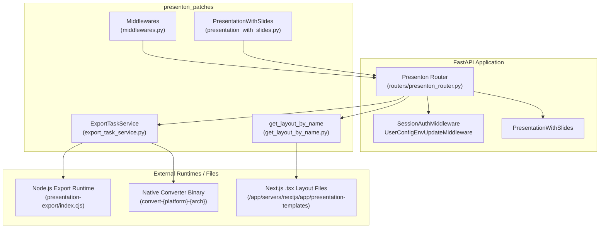
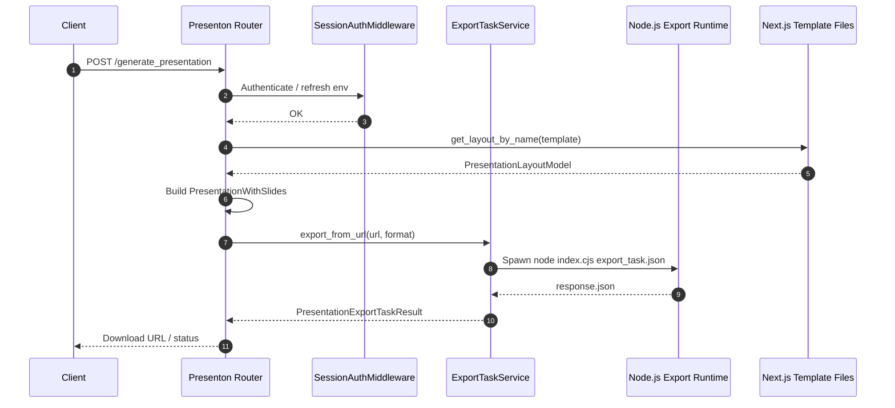

# presenton_patches

## Overview

`presenton_patches` is a small backend compatibility layer that sits between the Python FastAPI application and the JavaScript/Next.js presentation-generation stack (codenamed **Presenton**). It was introduced to bridge breaking changes between the Python service and the Next.js template/layout subsystem without modifying the upstream Next.js bundle.

The module provides four focused capabilities:

1. **Export orchestration** – runs the Node.js/Puppeteer-based presentation-export runtime to convert PPTX decks to HTML or to export a rendered deck as PDF/PPTX.
2. **Layout loading** – reads Zod-based slide-layout schemas directly from the Next.js `.tsx` source files and converts them into JSON Schema/Pydantic models that the Python layer can consume.
3. **Request middleware** – supplies session/basic-auth gating and per-request user-config environment refresh for the Presenton routes.
4. **Model normalization** – patches the `PresentationWithSlides` Pydantic model so that slide `layout` values are serialized in the `"template:layoutId"` format expected by the JavaScript `QM()` lookup.

## Architecture

### Data Flow

## Sub-modules

| Sub-module | File | Responsibility | Documentation |
|------------|------|----------------|---------------|
| Export orchestration | `export_task_service.py` | Spawns the Node.js/Puppeteer export runtime and native converter binary; handles PPTX→HTML and URL→PDF/PPTX exports. | [presenton_patches_export.md](../presenton_patches_export.md) |
| Layout loader | `get_layout_by_name.py` | Parses Next.js `.tsx` slide-layout files, extracts Zod schemas, and returns `PresentationLayoutModel`. | [presenton_patches_layouts.md](../presenton_patches_layouts.md) |
| Middleware | `middlewares.py` | Provides session/basic-auth protection and per-request user-config environment updates. | [presenton_patches_middleware.md](../presenton_patches_middleware.md) |
| Model patch | `presentation_with_slides.py` | Normalizes slide `layout` values to the `"template:layoutId"` format before serialization. | [presenton_patches_models.md](../presenton_patches_models.md) |

## Integration with the Rest of the System

- **Presenton Router**: The `presenton_router` (in `shared_api_routers`) is the primary consumer of this module. It calls `get_layout_by_name` to list available slide layouts, uses `PresentationWithSlides` to serialize generated decks, and delegates final export to `ExportTaskService`.
- **Next.js Presentation Stack**: `get_layout_by_name` reads from `/app/servers/nextjs/app/presentation-templates`, and `ExportTaskService` invokes the `presentation-export` Node.js runtime. Both are external to this module.
- **Authentication**: `SessionAuthMiddleware` reuses the shared `utils.simple_auth` helpers and is conceptually similar to the auth middleware used elsewhere in the platform. See [shared_core.md](shared_core.md) for the broader auth/RBAC subsystem.
- **Document Generation**: Export results are often consumed by the document-generation and PPT wizard flows in `ai_ui_frontend` (see [ai_ui_frontend_presenton_lib.md](../ai_ui_frontend_presenton_lib.md) and [ai_ui_frontend_ppt_wizard.md](../ai_ui_frontend_ppt_wizard.md)).

## Key Design Decisions

1. **Filesystem-first layout loading**: The original implementation called `http://localhost/api/template?group=<name>`, but that route was removed/renamed in the current Docker image. The patch reads the TypeScript/Zod source directly, avoiding a runtime dependency on a Next.js HTTP endpoint.
2. **Out-of-process export**: PPTX rendering relies on Puppeteer/Chrome and a native converter binary. `ExportTaskService` marshals a JSON task file, spawns a Node.js subprocess, and parses the JSON response.
3. **Minimal model patch**: `PresentationWithSlides` uses a `model_validator(mode="before")` to prepend the `layout_group` prefix only when it is missing, keeping the database schema unchanged while fixing the JS contract.
4. **Localhost bypass for internal services**: `SessionAuthMiddleware` allows unauthenticated requests from `127.0.0.1`, `::1`, and `localhost` so that internal pdf-maker/export services can call the API without a session token.
