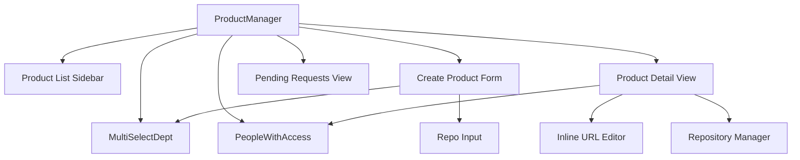
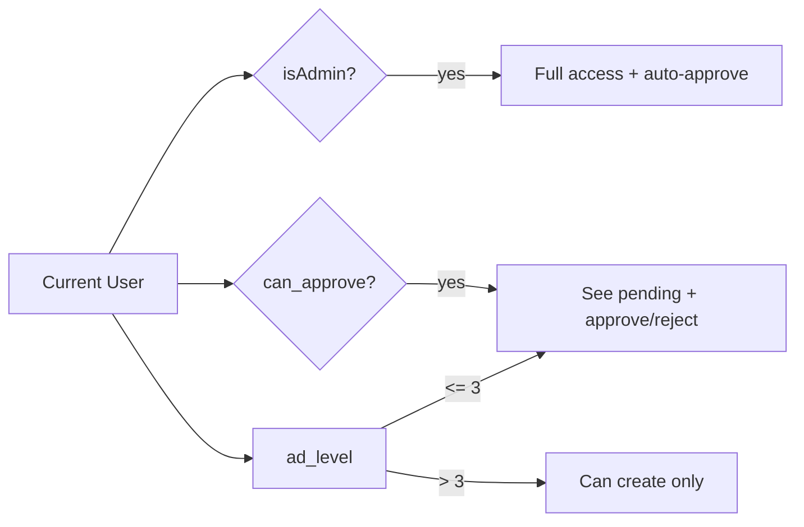
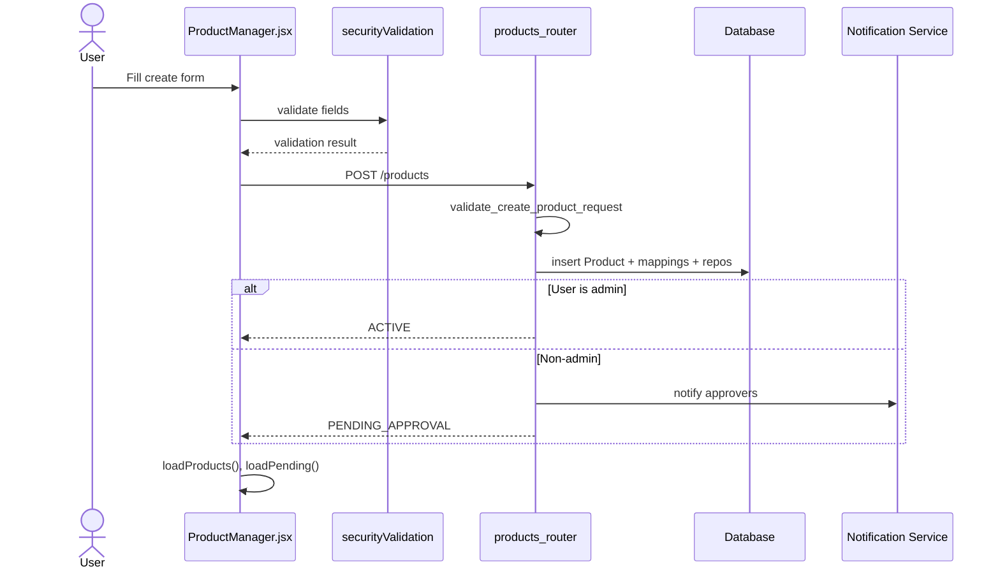
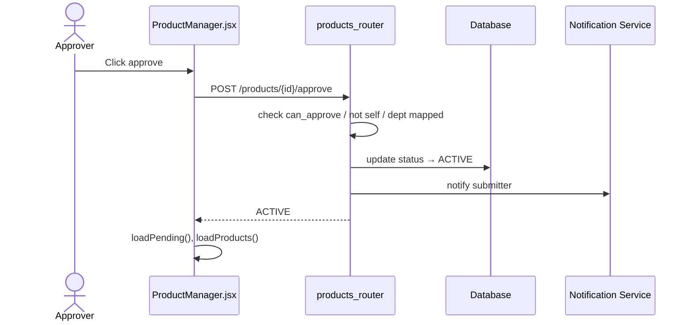
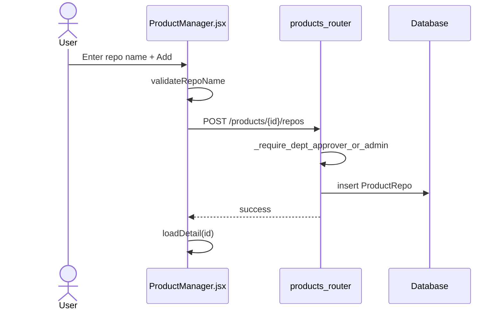
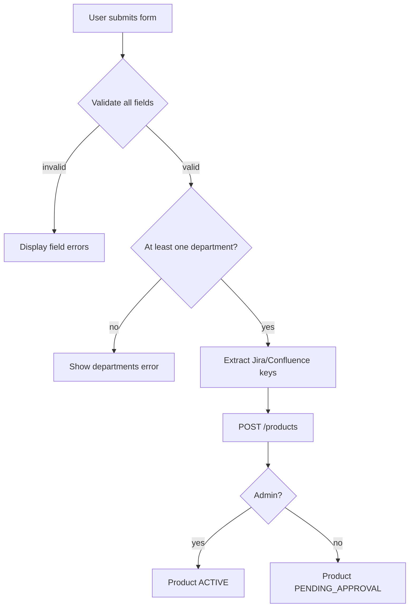

# Product Manager Module

## Brief Introduction

The **Product Manager** module provides the frontend UI for managing the product ontology in the AI platform. It allows users to create, view, edit, approve, and delete products, associate them with departments, link Jira/Confluence integrations, and attach code repositories. The module enforces a **4-eyes approval workflow**: non-admin product creation requires approval from a senior user (`ad_level ≤ 3`) in a mapped department before the product becomes active.

This module is part of the `ai_ui_frontend` application and is implemented as a React component at `ai-ui/src/components/ProductManager.jsx`.

---

## Core Functionality

### 1. Product Lifecycle Management

The module supports the full lifecycle of a product record:

| Action | UI Entry | Backend Endpoint | Access Control |
|--------|----------|------------------|----------------|
| Create product | "New Product" button | `POST /products` | All authenticated users; non-admins create as `PENDING_APPROVAL` |
| View product list | Sidebar tabs | `GET /products`, `GET /products/pending` | Scoped by department / role |
| View product detail | Click product in sidebar | `GET /products/{id}` | Requires department mapping or admin/approver role |
| Edit Jira/Confluence URLs | "Edit URLs" button | `PATCH /products/{id}` | Admin or department approver |
| Delete product | "Delete" button | `DELETE /products/{id}` | Admin or department approver |
| Approve product | Inbox / pending list | `POST /products/{id}/approve` | Admin or `ad_level ≤ 3` in mapped department; cannot approve own submission |
| Reject product | Inbox / pending list | `POST /products/{id}/reject` | Admin or `ad_level ≤ 3` in mapped department; cannot reject own submission |
| Add repository | Detail view repo input | `POST /products/{id}/repos` | Admin or department approver |
| Remove repository | Detail view repo list | `DELETE /products/{id}/repos/{repo_name}` | Admin or department approver |

### 2. Department Scoping

Products are visible only to users whose department is mapped to the product. Department mappings are stored in the `dept_product_mappings` table. The UI uses a searchable multi-select dropdown (`MultiSelectDept`) to choose departments during creation.

### 3. Integration URL Parsing

The module extracts project/space keys from Jira and Confluence URLs to normalize integration metadata:

- **`parseJiraKey(url)`**: Extracts the Jira project key from common URL patterns (e.g., `/projects/RUPAY`, `/browse/RUPAY-123`, raw key input).
- **`parseConfluenceSpace(url)`**: Extracts the Confluence space key from `/spaces/KEY` URLs or raw key input.

### 4. Access Visibility

The `PeopleWithAccess` component displays all users from the Active Directory org tree who belong to the product's mapped departments, including their approval eligibility (`can_approve`) and level.

---

## Architecture

### Component Hierarchy



### State Management

The `ProductManager` component uses React `useState` for local state:

- **`products`**: List of active products for the current user.
- **`pending`**: List of pending products visible to approvers/admins.
- **`selected`**: Currently viewed product detail.
- **`creating`**: Whether the create form is open.
- **`tab`**: Active tab — `"active"` or `"pending"`.
- **`form` / `formErrors`**: Create form state and validation errors.
- **`editForm` / `editFormErrors`**: Inline edit state for URLs.
- **`repoInput` / `repoInputError`**: Repository addition state.

### Role-Derived Permissions



---

## Dependencies

### Frontend Dependencies

| Dependency | Module | Purpose |
|------------|--------|---------|
| `authFetch` | [config](../infrastructure/config.md) | Authenticated HTTP requests with correlation ID and retry logic |
| `useToast`, `useConfirm` | [ui_dialog](../ui/ui_dialog.md) | Toast notifications and confirmation dialogs |
| `validateProductName`, `validateProductCode`, `validateDescription`, `validateURL`, `validateRepoName` | [securityValidation](../securityValidation.md) | Client-side input validation |
| `toIST`, `toISTDate` | *(utils/time)* | Time formatting for display |

### Backend Dependencies

| Dependency | Module | Purpose |
|------------|--------|---------|
| `products_router` | [shared_api_routers](../api/shared_api_routers.md) | REST API for product CRUD and approval |
| `get_current_user` | [auth](../security/auth.md) | JWT/session authentication |
| `can_approve`, `is_admin` | [rbac](../rbac.md) | Role-based access control |
| `Product`, `DeptProductMapping`, `ProductRepo` | [db/models](../db_models.md) | Database entities |

---

## Data Flow

### Product Creation Flow



### Approval Flow



### Repository Management Flow



---

## Component Interaction

### MultiSelectDept

A reusable, searchable multi-select dropdown used for department selection.

- **Props**:
  - `options`: Array of department names.
  - `selected`: Currently selected departments.
  - `onChange`: Callback when selection changes.
  - `hasErrors`: Boolean to highlight validation errors.

- **Behavior**:
  - Click to open/close dropdown.
  - Search filters available options.
  - Checkboxes toggle selection.
  - Selected items render as removable chips.
  - Closes on outside click via `useRef` + `mousedown` listener.

### PeopleWithAccess

Displays org-tree users who have access through mapped departments.

- **Props**:
  - `people`: Array of user objects `{ name, email, title, department, level, can_approve }`.

- **Behavior**:
  - Filter by name, email, title, or department.
  - Group by department with sticky headers.
  - Show approver badge and level for each user.

---

## Process Flows

### Create Product Validation



### Inline URL Edit

```mermaid
flowchart TD
    A[Approver clicks Edit URLs] --> B[Populate editForm from selected product]
    B --> C[User edits Jira/Confluence URLs]
    C --> D[Validate on blur]
    D -->|invalid| E[Show errors]
    D -->|valid| F[Extract keys]
    F --> G[PATCH /products/{id}]
    G --> H[Reload product detail]
```

---

## Security & Governance

### 4-Eyes Principle

- Non-admin users cannot approve their own product submissions.
- Department changes require re-approval.
- Approval requires `ad_level ≤ 3` or admin role.

### Input Validation

Client-side validation is performed using utilities from [securityValidation](../securityValidation.md). Server-side validation is repeated in `products_router` via `validate_create_product_request`, `validate_update_product_request`, and `validate_add_repo_request`.

### Department Gate

Non-admin approvers can only approve/reject products that include their own department in the mapping.

---

## Integration Points

### Jira / Confluence

The module normalizes integration URLs into project/space keys that can be used by other platform features such as:

- [jira_tools](../connectors/jira_tools.md)
- [confluence_tools](../connectors/confluence_tools.md)
- [indexers](../knowledge/indexers.md)
- [SDLCPipeline](../sdlc/sdlc_pipeline.md)

### Repository Linking

Linked repositories (`ProductRepo`) feed into:

- [CodebaseManager](codebase_manager.md)
- [MultiRepoApprovalView](../multi_repo_approval_view.md)
- [SDLCPipeline](../sdlc/sdlc_pipeline.md)
- [workspace_sync_worker](../workspace_sync_worker.md)

### Notifications

Approval events trigger notifications to:

- Approvers in mapped departments (on create / dept change).
- Original submitter (on approve / reject).

See [notifications](../notifications.md) and [inbox](../chat/inbox.md) for related flows.

---

## Error Handling

| Scenario | Frontend Behavior | Backend Response |
|----------|-------------------|------------------|
| Validation failure | Field-level error messages | `400 Bad Request` with field errors |
| Duplicate product code/name | Inline error toast | `409 Conflict` |
| Insufficient permissions | Disabled UI / error toast | `403 Forbidden` |
| Self-approval attempt | Error toast | `403 Forbidden` |
| Network failure | Retry via `authFetch` | N/A |

---

## Related Documentation

- [config](../infrastructure/config.md) — API base URL and authenticated fetch utilities.
- [ui_dialog](../ui/ui_dialog.md) — Toast and confirmation dialog providers.
- [securityValidation](../securityValidation.md) — Input validation utilities.
- [shared_api_routers](../api/shared_api_routers.md) — Backend REST API routers, including `products_router`.
- [auth](../security/auth.md) — Authentication and current user resolution.
- [rbac](../rbac.md) — Role-based access control (`can_approve`, `is_admin`).
- [db_models](../db_models.md) — Product, department mapping, and repository data models.
- [inbox](../chat/inbox.md) — Approval notifications and actions.
- [sdlc_pipeline](../sdlc/sdlc_pipeline.md) — Product-aware SDLC governance pipeline.
