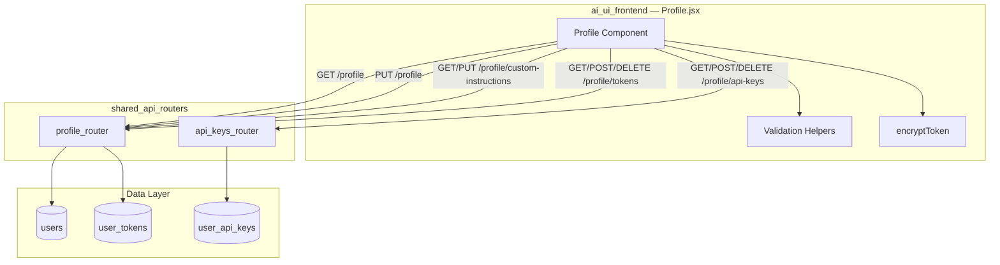
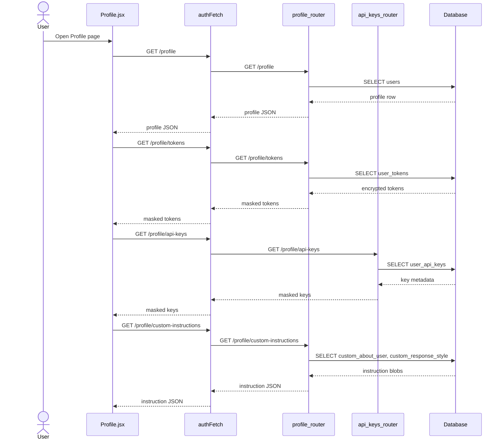
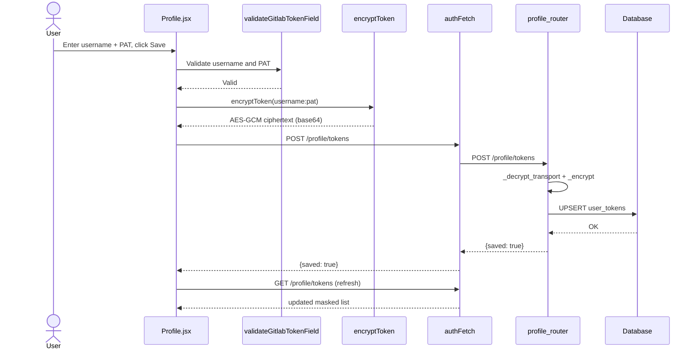
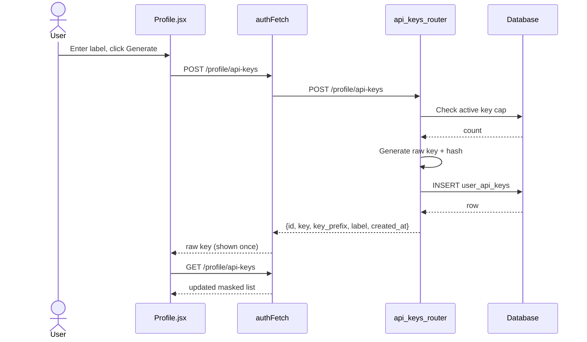
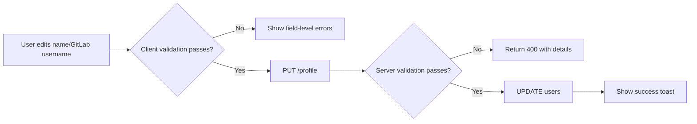

# Profile Module

The **Profile module** is the user's identity and credential hub in the AiNxt web application. It provides a single page where authenticated users can view their directory-synchronized identity, update editable fields, manage per-user custom instructions that are prepended to every chat, store encrypted third-party API tokens (e.g., GitLab, Atlassian), and generate/revoke IDE-compatible API keys.

---

## Core Functionality

| Capability | Description |
|------------|-------------|
| **Identity Card** | Displays the user's name, email, department, AD hierarchy level, job title, account status, and last-login timestamps sourced from the `users` table. |
| **Profile Editing** | Allows the user to update their display name and GitLab username. Inputs are validated for XSS, SQL injection, and allowed character sets. |
| **Custom Instructions** | Persists two free-text blobs (`about_user`, `response_style`) that are injected into every chat request to personalize model behavior. |
| **API Token Vault** | Stores encrypted third-party credentials. Currently supports GitLab (username + PAT) and Atlassian (email + API token). Tokens are encrypted in transit and at rest. |
| **IDE API Keys** | Generates OpenAI-compatible API keys for IDE plugins (e.g., Kilo Code, Cursor). Raw keys are shown only once; revoking a key immediately disables it. |

---

## Architecture

The module is implemented as a single React component in the `ai_ui_frontend` application. It communicates with the backend through the `profile_router` and `api_keys_router` under `shared_api_routers`. All HTTP calls use the authenticated `authFetch` helper, which attaches correlation IDs and credentials.

### Component Breakdown

| Component / Function | Responsibility |
|----------------------|----------------|
| `Profile` | Main React component. Loads profile, tokens, API keys, and custom instructions on mount; renders the identity card, forms, and vault UI. |
| `saveProfile` | Validates and submits `name` and `gitlab_username` updates to `PUT /profile`. |
| `saveCustomInstructions` | Persists the two custom-instruction text areas to `PUT /profile/custom-instructions`. |
| `saveToken` | Combines split credential fields (GitLab username + PAT, Atlassian email + token), encrypts the value client-side, and posts to `/profile/tokens`. |
| `generateApiKey` | Creates a new IDE API key via `POST /profile/api-keys` and reveals the raw key exactly once. |
| `revokeApiKey` | Soft-deletes an IDE API key after user confirmation. |
| `deleteToken` | Removes a stored third-party token after user confirmation. |
| `encryptToken` | Client-side AES-GCM encryption of token values using `VITE_LOGIN_ENCRYPT_KEY` before they are sent over the wire. |
| Validation helpers | `validateProfileField`, `validateTokenValue`, `validateGitlabTokenField`, `validateAtlassianTokenField` enforce allowed characters and block XSS/script injection. |

---

## Data Flows

### Initial Load

### Saving a Third-Party Token (GitLab Example)

### Generating an IDE API Key

---

## Security & Validation

The Profile module handles sensitive credentials and is therefore protected by multiple layers of validation and encryption.

### Client-Side Validation

| Field | Rules |
|-------|-------|
| Display name | Optional; if provided, only letters, spaces, dots, hyphens, and apostrophes allowed. |
| GitLab username | Optional; no spaces; only letters, numbers, dots, hyphens, and underscores. |
| API key label | Optional; validated as a product-style identifier. |
| Token values | XSS/script injection checks only; special characters are permitted because tokens legitimately contain them. |
| GitLab PAT | Must not contain a colon (prevents accidental `username:token` paste). |
| Atlassian email | Must be a valid email format. |
| Atlassian token | Must not contain both `@` and `:` (prevents accidental `email:token` paste). |

### Encryption

- **Token values** are encrypted in the browser using `AES-GCM` with a key derived from `VITE_LOGIN_ENCRYPT_KEY`. The server decrypts the transport value and re-encrypts it with its own at-rest key before persisting it in `user_tokens.encrypted_value`.
- **IDE API keys** are stored as SHA-256 hashes; the raw key is returned only once during creation and is never persisted or returned again.

### Authorization

- All backend endpoints require a valid JWT session via `get_current_user` / `_require_jwt_auth`.
- Users can only read, update, or delete their own profile, tokens, and API keys (scoped by `current_user["sub"]`).
- The `reveal_token` endpoint returns plaintext tokens only for the authenticated user and is audit-logged.

---

## Dependencies

### Frontend Dependencies

| Dependency | Module | Purpose |
|------------|--------|---------|
| `authFetch` | [config](../infrastructure/config.md) | Authenticated HTTP requests with correlation IDs and credentials. |
| `useToast`, `useConfirm` | [ui_dialog](../ui/ui_dialog.md) | Toast notifications and confirmation dialogs. |
| `validateProductName`, `validateSecurity` | [ai_ui_frontend_utils](../ui/ai_ui_frontend_utils.md) | Input validation helpers. |
| `toIST` | time utilities | Format UTC timestamps to IST for display. |

### Backend Dependencies

| Dependency | Module | Purpose |
|------------|--------|---------|
| `profile_router` | [shared_api_routers](../api/shared_api_routers.md) | CRUD endpoints for profile, tokens, and custom instructions. |
| `api_keys_router` | [shared_api_routers](../api/shared_api_routers.md) | Generation and revocation of IDE API keys. |
| `get_current_user` / `_require_jwt_auth` | [auth](../security/auth.md) | JWT authentication and authorization. |
| `users`, `user_tokens`, `user_api_keys` | [database](../storage/database.md) | Persistent storage for profile data and credentials. |

---

## Integration with the Wider System

- **Chat / KbChat**: The `about_user` and `response_style` values saved in the Profile module are injected into chat prompts by the chat backend, giving every conversation persistent user context. See [chat](../chat/chat.md) and [kb_chat](../knowledge/kb_chat.md).
- **Connectors / GitLab & Jira**: Stored GitLab and Atlassian tokens are used by connector adapters and tools to act on behalf of the user. See [connectors](../connectors/connectors.md) and [shared_integrations](shared_integrations.md).
- **Desktop App**: The desktop client can request a plaintext token reveal (audit-logged) to perform `git clone` with the user's stored GitLab PAT. See [desktop_app](../clients/desktop_app.md).
- **IDE Plugins**: IDE API keys expose an OpenAI-compatible endpoint so external editors can route completions through AiNxt. See [endpoint_proxy_router](../api/shared_api_routers.md) and [gateway](../models/gateway.md).

---

## Process Flow: Updating a Profile

---

## Notes for Maintainers

- The `Profile` component intentionally does **not** persist the updated display name in `localStorage`; the new name is reflected on the next `/auth/me` call.
- Token inputs use split fields for GitLab and Atlassian to prevent users from accidentally pasting a combined `user:token` or `email:token` string, which would fail later with an opaque 401.
- IDE API keys labeled `endpoint:*` are managed by the Endpoint Management module and cannot be revoked from the Profile page. See [endpoint_manager](endpoint_manager.md).
- Device keys labeled `desktop:*` are auto-recycled by the backend so that desktop app reinstalls do not exhaust the per-user key cap.
