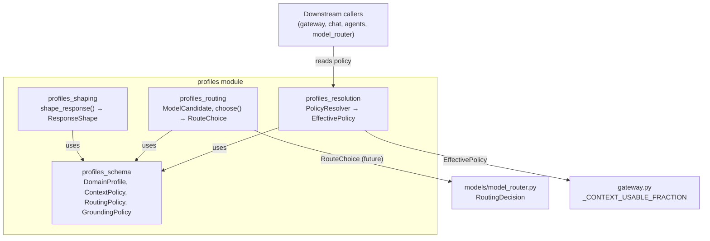

# Profiles Module

## Introduction and Purpose

The `profiles` module implements the **personalization layer** of the platform. It turns hard-coded runtime constants and implicit routing heuristics into explicit, versionable **policy-as-data** objects called *Domain Profiles*. A Domain Profile parameterizes the invariant core so the same code can serve different audiences—enterprise, regulated, coding, customer-facing—without forking the codebase.

The module is intentionally small, pure, and testable:

- It defines immutable policy value objects (`DomainProfile`, `ContextPolicy`, `RoutingPolicy`, `GroundingPolicy`).
- It resolves a profile into a flat `EffectivePolicy` that downstream code can read per request.
- It provides a constraint-filtered, weighted-score model router for choosing the best model candidate.
- It merges style signals (tone, style, expertise, emotional tone) into a deterministic `ResponseShape`.

Wave 1 of the profiles system focuses on **behavioral parity**: the default enterprise profile reproduces today's runtime constants exactly (e.g., `usable_fraction == 0.75`), so downstream consumers can migrate from inline constants to `EffectivePolicy` without changing behavior. Later waves will add org/role/user layering, retrieval/planning/tools/presentation/governance sections, and wiring into the live request path.

## Architecture Overview

The module is organized into four cohesive sub-modules:

| Sub-module | Responsibility | Key Components |
|------------|----------------|----------------|
| [profiles_schema](../storage/profiles_schema.md) | Immutable policy value objects | `DomainProfile`, `ContextPolicy`, `RoutingPolicy`, `GroundingPolicy` |
| [profiles_resolution](profiles_resolution.md) | Flatten a profile hierarchy into an effective policy | `PolicyResolver`, `EffectivePolicy` |
| [profiles_routing](profiles_routing.md) | Constraint-filtered, weighted-score model selection | `ModelCandidate`, `choose()`, `RouteChoice` |
| [profiles_shaping](profiles_shaping.md) | Most-specific-wins merge of response style signals | `shape_response()`, `ResponseShape` |

## How It Fits into the System

The profiles module sits between **static configuration** and **runtime decision-making**:

- **Upstream**: Configuration sources (platform defaults, org settings, role templates, user preferences) eventually feed into `DomainProfile` objects. Wave 1 only implements the platform-default layer; org/role/user merging is deferred.
- **Downstream**: The core runtime (gateway context sizing, model router, prompt instruction rendering) reads `EffectivePolicy`, `RouteChoice`, and `ResponseShape` instead of inline constants.
- **Fail-safe design**: Every function returns a safe default when constraints are unsatisfied (`choose()` returns `None`, `shape_response()` catches all exceptions), ensuring callers can fall back to today's behavior.

### Relationship to Other Modules

- **[model_router](../model_router.md)** (`models/model_router.py`): The live router today scores complexity only. `profiles/routing.py` is a pure, eval-gated replacement that adds privacy, cost, latency, and capability constraints. At integration time, `cost_per_1k` will be derived from `core/model_registry.MODEL_COST_PER_1M` and the privacy ladder will be aligned with `core/rag_acl.py`.
- **[gateway](../models/gateway.md)** (`gateway.py`): The gateway currently defines `_CONTEXT_USABLE_FRACTION` as an env constant. `PolicyResolver` reproduces this value (`usable_fraction == 0.75`) so the gateway can migrate to reading `EffectivePolicy` without behavior change.
- **[core/config](../infrastructure/core_config.md)** and **[core/model_registry](../infrastructure/core_infrastructure.md)**: Future waves will source cost, latency, and capability metadata from these modules rather than hand-fed values.
- **[cil](cil.md)** (`cil/policy.py` also defines `DomainProfile`): The CIL (conversational intent language) layer has its own `DomainProfile` concept. At wiring time, the two profile schemas should be reconciled so there is a single source of truth for personalization policy.

## Design Principles

1. **Pure stdlib only**: Every file in `profiles/` imports only from `profiles.schema` and the Python standard library, making it importable in bare test environments.
2. **Immutable value objects**: All policy dataclasses use `frozen=True`, enabling safe caching, hashing, and equality checks.
3. **Forward-compatible envelope**: New policy sections are appended to `DomainProfile` in later waves without breaking existing code.
4. **Most-specific-wins merge**: Resolution and shaping both use the same precedence rule—platform default < domain profile < org < role < user < per-turn—so the mental model is consistent across the module.
5. **Fail-safe defaults**: Functions never raise for policy errors; they return neutral defaults that preserve today's behavior.

## Wave Roadmap

| Wave | Scope |
|------|-------|
| Wave 1 (current) | Platform-default profile; behavioral parity with gateway constants; pure/testable routing and shaping functions. |
| Wave 2 | Org/role/user layering in `PolicyResolver`; profile inheritance via `extends`. |
| Wave 3 | Wire `choose()` into `models/model_router.py` behind a feature flag + eval gate. |
| Wave 4 | Add retrieval, planning, tools, presentation, and governance policy sections. |
