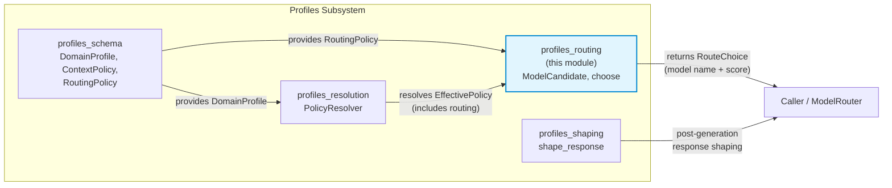
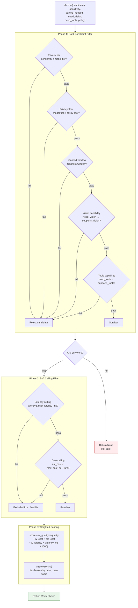
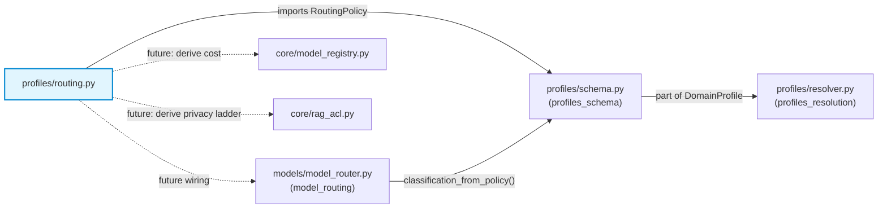
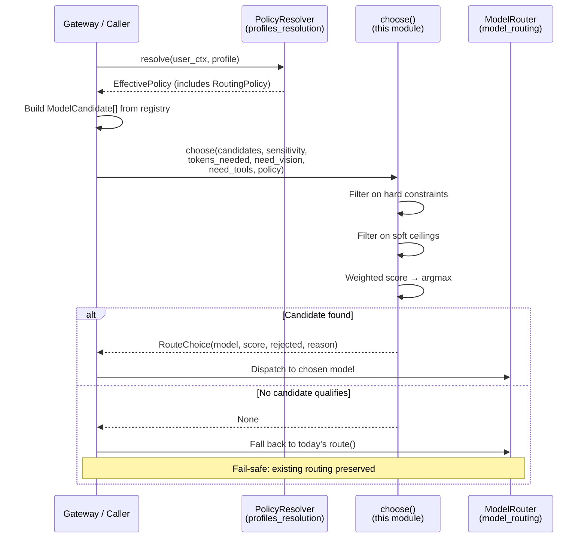

# profiles_routing

## Introduction

The `profiles_routing` module implements a **pure, constraint-filtered, weighted-score model routing decision function**. It is part of the broader `profiles` subsystem — a set of policy-driven modules that govern how LLM requests are shaped, routed, and responded to across the platform.

Unlike the live `ModelRouter` (see [model_routing](../models/model_routing.md)), which routes primarily on complexity classification with an implicit privacy floor, this module introduces a **frontier routing pattern**: candidates are first rejected on hard constraints (privacy tier, context window, capability requirements), then scored on a weighted quality–cost–latency trade-off, and the highest-scoring survivor is selected.

> **Status:** This module is standalone and testable but **not yet wired into the live router**. Adoption is a future flag+eval-gated step. The `choose()` function is designed to be **fail-safe**: it returns `None` when no candidate satisfies the constraints, allowing the caller to fall back to today's existing routing logic.

---

## Architecture

### Module Position in the Profiles Subsystem

The `profiles` subsystem is composed of four sibling modules that together form a policy-driven request pipeline:



### Relationship to the Live Model Router

The live router (`ModelRouter` in `models/model_router.py`) currently uses a complexity-classification-based approach with a hard privacy floor. The `profiles_routing` module is designed as a **drop-in replacement candidate** for the routing decision step:

```mermaid
graph TB
    subgraph "Today's Router (Live)"
        A1["Incoming Request<br/>+ data_classification"] --> A2["ModelRouter.route()"]
        A2 -->|"privacy floor check"| A3{"CONFIDENTIAL+?"}
        A3 -->|"yes"| A4["Pin to LOCAL tier"]
        A3 -->|"no"| A5["Complexity classification<br/>(LLM-backed)"]
        A5 --> A6["Context-size promotion"]
        A4 --> A7["RoutingDecision<br/>(tier, model)"]
        A6 --> A7
    end

    subgraph "Frontier Router (This Module)"
        B1["Incoming Request<br/>+ sensitivity + tokens"] --> B2["choose()"]
        B2 --> B3["Hard constraint filter<br/>(privacy, window, capability)"]
        B3 --> B4["Soft ceiling filter<br/>(latency, cost)"]
        B4 --> B5["Weighted score<br/>(quality − cost − latency)"]
        B5 --> B6["RouteChoice or None"]
        B6 -->|"None"| B7["Caller falls back<br/>to today's route"]
    end

    style A2 fill:#fff3e0,stroke:#f57c00
    style B2 fill:#e1f5fe,stroke:#0288d1,stroke-width:2px
```



---

## Core Components

### `ModelCandidate`

A frozen dataclass representing routing-relevant metadata for a single model. Each candidate carries the attributes needed to evaluate both hard constraints and soft scoring:

| Field | Type | Default | Description |
|---|---|---|---|
| `name` | `str` | *(required)* | Model identifier |
| `context_window` | `int` | `128000` | Maximum token context window |
| `privacy_tier` | `str` | `"public"` | Highest sensitivity the model may handle (`public` → `restricted`) |
| `quality` | `float` | `0.5` | Relative capability score (0.0–1.0) |
| `cost_per_1k` | `float` | `0.0` | USD per 1K tokens (0.0 for local models) |
| `latency_ms` | `int` | `0` | Typical time-to-first-token estimate |
| `supports_vision` | `bool` | `False` | Whether the model handles image inputs |
| `supports_tools` | `bool` | `True` | Whether the model supports tool/function calling |

> **Wiring Note:** At integration time, `cost_per_1k` should be derived from the single source of truth in `core/model_registry.MODEL_COST_PER_1M` (reconciling its input/output tuple into a blended scalar) rather than being hand-fed.

### `choose()`

The primary decision function. Given a list of `ModelCandidate` objects and request parameters, it returns the best-scoring model that satisfies all hard constraints, or `None` if nothing qualifies.

```python
def choose(
    candidates: List[ModelCandidate],
    *,
    sensitivity: str = "internal",
    tokens_needed: int = 0,
    need_vision: bool = False,
    need_tools: bool = False,
    policy: Optional[RoutingPolicy] = None,
) -> Optional[RouteChoice]
```

**Returns:** A `RouteChoice` dataclass with `model`, `score`, `rejected` (count of filtered-out candidates), and `reason` — or `None` when no candidate passes.

### `RouteChoice` (internal)

| Field | Type | Description |
|---|---|---|
| `model` | `str` | Name of the selected model |
| `score` | `float` | Weighted score (rounded to 6 decimals) |
| `rejected` | `int` | Number of candidates filtered out by hard constraints |
| `reason` | `str` | Human-readable summary of the winning constraints |

---

## Decision Algorithm

The `choose()` function operates in three sequential phases:



### Privacy Tiering

The module uses a four-level privacy ladder (lowercase, local to this module):

| Rank | Tier | Meaning |
|---|---|---|
| 0 | `public` | Cloud models behind the proxy; lowest sensitivity |
| 1 | `internal` | General enterprise traffic |
| 2 | `confidential` | Sensitive internal data |
| 3 | `restricted` | Local-only models that never egress; highest sensitivity |

> **Authoritative Source:** `core/rag_acl.py` maintains the platform-wide privacy ladder (uppercase, with an additional `PCI_SENSITIVE` tier). At wiring time, both ladders should be derived from that single source. The local lowercase copy exists to keep this module pure and importable in a bare test environment.

### Privacy Floor Logic

The `RoutingPolicy.privacy_floor` (from [profiles_schema](../storage/profiles_schema.md)) enforces a **minimum handling tier** for a profile, independent of the request's own sensitivity:

- If the request sensitivity is **at or above** the floor, the model's privacy tier must also be **at or above** the floor.
- If the request sensitivity is **below** the floor, the floor does not over-restrict (e.g., a `public` request to a `public` model is allowed even if the floor is `confidential`).

This mirrors the live `ModelRouter`'s privacy floor enforcement, where `CONFIDENTIAL+` data is pinned to the local model and cloud fallback is suppressed.

### Scoring Formula

```
score = (w_quality × quality) − (w_cost × estimated_cost) − (w_latency × latency_seconds)
```

Where:
- `estimated_cost = cost_per_1k × max(tokens_needed, 1) / 1000`
- `latency_seconds = latency_ms / 1000`
- Weights come from `RoutingPolicy` (defaults: `w_quality=0.6`, `w_cost=0.2`, `w_latency=0.2`)

The scoring is **deterministic**: ties are broken by candidate list order (earlier wins), then by name.

---

## Dependencies



### Direct Dependencies

| Dependency | Module | Purpose |
|---|---|---|
| `RoutingPolicy` | [profiles_schema](../storage/profiles_schema.md) | Provides scoring weights (`w_quality`, `w_cost`, `w_latency`) and hard constraints (`privacy_floor`, `max_latency_ms`, `max_cost_per_turn_usd`) |

### Future Wiring Dependencies

| Dependency | Module | Purpose |
|---|---|---|
| `ModelRouter` | [model_routing](../models/model_routing.md) | Live router that `choose()` would replace/augment; `classification_from_policy()` already bridges `RoutingPolicy` → router vocabulary |
| `MODEL_COST_PER_1M` | `core/model_registry.py` | Single source of truth for model pricing; `cost_per_1k` should be derived from here |
| Privacy ladder | `core/rag_acl.py` | Authoritative platform-wide privacy tier ordering; local copy should be reconciled at wiring time |

---

## Data Flow

The following diagram shows how `choose()` fits into a complete request lifecycle once wired:



---

## Integration Path

The module is explicitly designed for a **gradual, eval-gated adoption**:

1. **Today:** `ModelRouter.route()` uses complexity classification + privacy floor. `choose()` is not called.
2. **Flag-gated:** A feature flag enables `choose()` as an alternative routing path. When `choose()` returns `None`, the caller falls back to `route()`.
3. **Full adoption:** After eval validation, `choose()` becomes the primary routing decision, with `route()` as the fallback.

The `classification_from_policy()` function in `models/model_router.py` already provides the bridge from `RoutingPolicy.privacy_floor` to the router's `data_classification` vocabulary, demonstrating the intended integration surface.

---

## Design Principles

| Principle | Implementation |
|---|---|
| **Purity** | Only Python stdlib imports (`dataclasses`, `typing`). No database, network, or framework dependencies. Importable in a bare test environment. |
| **Fail-safe** | Returns `None` when no candidate qualifies, never raises. The caller always retains today's routing as a fallback. |
| **Determinism** | Same inputs always produce the same output. Ties broken by candidate order then name. |
| **Separation of concerns** | Hard constraints (privacy, window, capability) are non-negotiable rejections. Soft ceilings (latency, cost) prefer but don't hard-reject unless the policy sets an explicit ceiling. |
| **Single source of truth** | Privacy ladder and cost data are acknowledged as needing reconciliation with `core/rag_acl.py` and `core/model_registry.py` at wiring time. |

---

## Related Documentation

- [profiles_schema](../storage/profiles_schema.md) — `DomainProfile`, `ContextPolicy`, `RoutingPolicy` definitions
- [profiles_resolution](profiles_resolution.md) — `PolicyResolver` that resolves effective policies from profiles
- [profiles_shaping](profiles_shaping.md) — `shape_response()` for post-generation response styling
- [model_routing](../models/model_routing.md) — Live `ModelRouter` with complexity-based routing, fallback chains, and streaming dispatch
