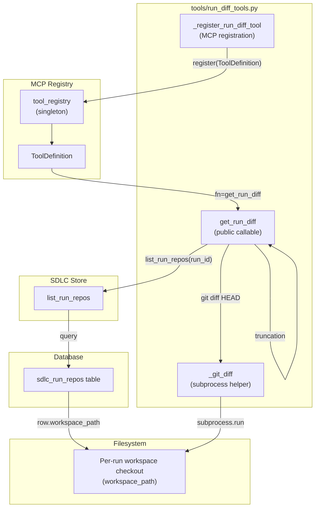
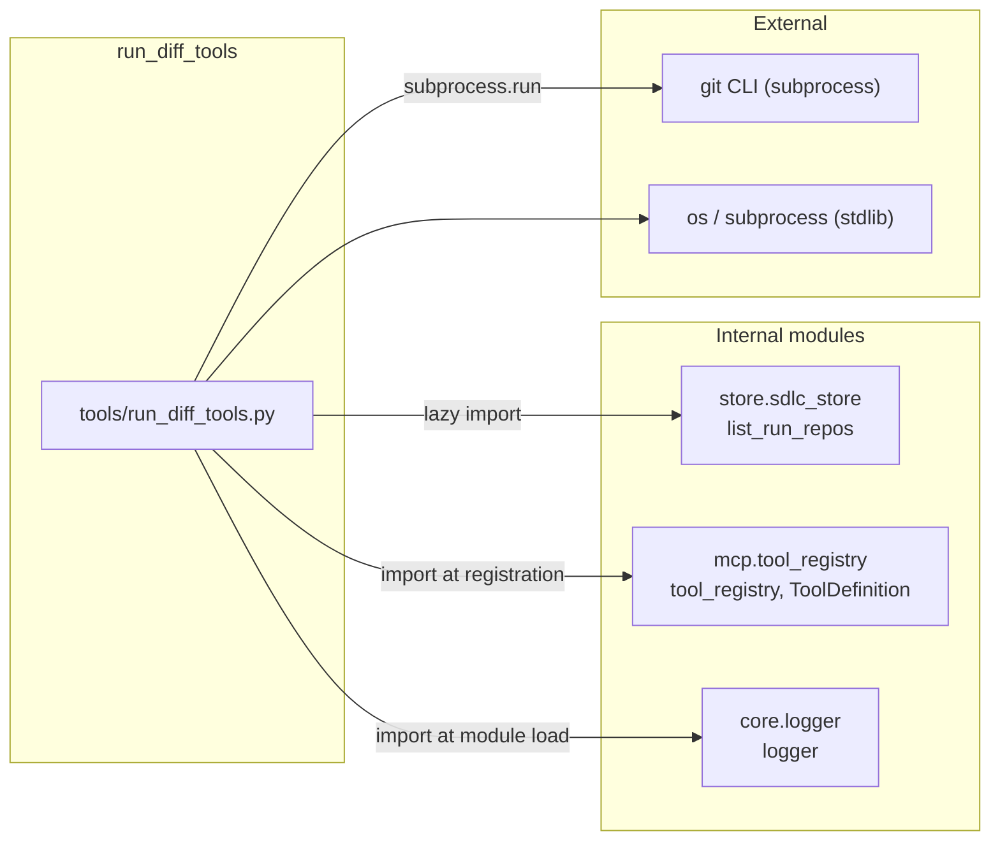
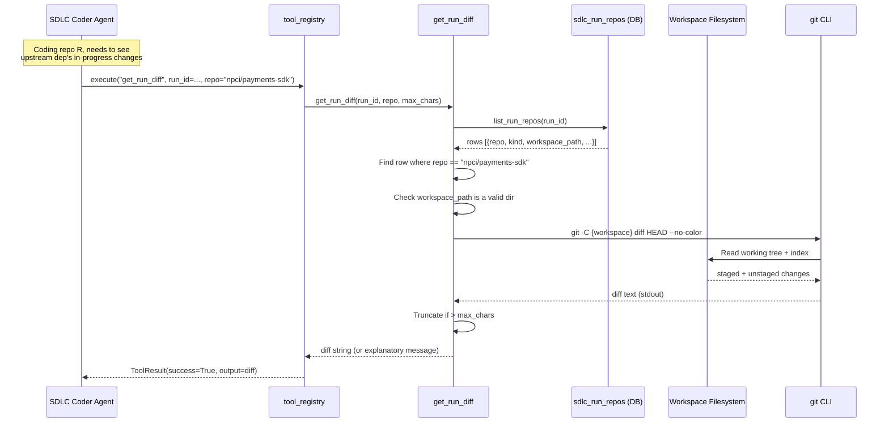
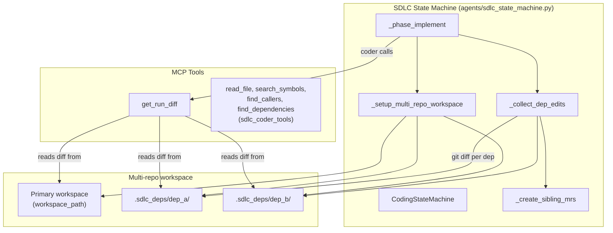
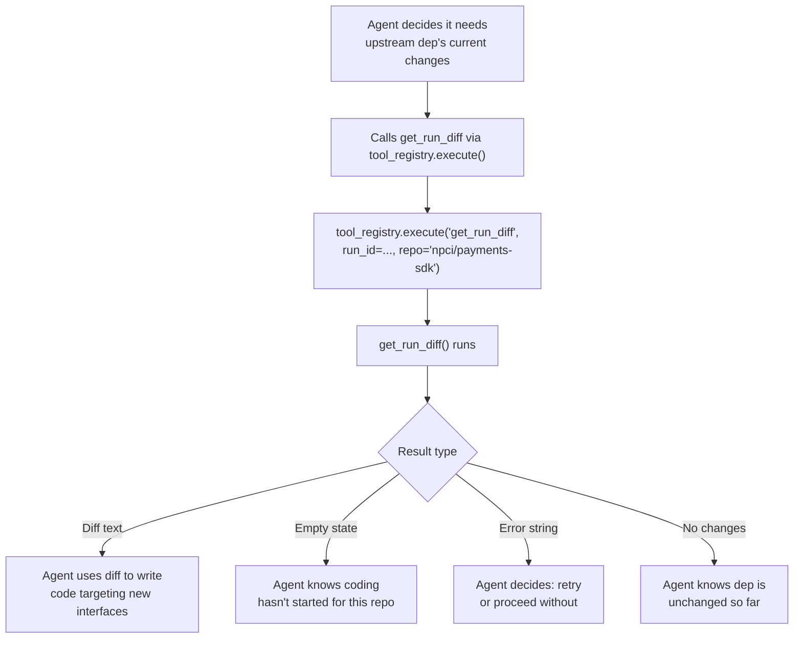

# run_diff_tools

## Introduction

The `run_diff_tools` module (`tools/run_diff_tools.py`) is a **Phase 4a multi-repo run-diff MCP tool** that lets the SDLC coding agent inspect what other repositories in the current SDLC run have already been modified — in real time, from the live workspace checkout.

It is **read-only** (no side effects on the workspace) and is registered as a platform tool with the MCP `tool_registry` so the agent can discover and invoke it by name (`get_run_diff`).

### Why this exists

When the SDLC state machine adds the per-editable-repo coder loop in Phase 4b, the coder for repo *R* needs to know what changes were already made in upstream dependencies so it can write code that consumes the new interfaces. A retrieval call only returns *indexed* code (pre-run state). `get_run_diff` returns the **in-progress** diff in a sibling repo's checkout — the ground-truth latest state inside this run.

Until Phase 4b ships, the tool returns useful output for the primary repo too (whatever's been edited in the run workspace) and a clear empty-state for repos that have no checkout yet.

---

## Architecture



### Module-level side effect

On import, `_register_run_diff_tool()` is called immediately (the last line of the module). This registers the tool with the platform `tool_registry` singleton so it is discoverable by the agent / workflow engine without any explicit initialization call. Registration failures are logged as warnings (non-fatal) so a missing registry never breaks module import.

---

## Core Components

### `get_run_diff(run_id, repo=None, max_chars=8000) -> str`

The public callable registered with the MCP registry. Returns the git diff for a repo's workspace within a given SDLC run.

**Parameters:**

| Parameter   | Type             | Description                                                                 |
|-------------|------------------|-----------------------------------------------------------------------------|
| `run_id`    | `str`            | The SDLC run ID (UUID). **Required.**                                       |
| `repo`      | `Optional[str]`  | GitLab namespace/project of the target repo. Defaults to the run's primary repo when omitted. |
| `max_chars` | `int`            | Cap on returned diff length (default 8000). Prevents context blow-up on large unstaged changes. |

**Returns:** A string — either the diff text (possibly truncated with a clear marker) or an explanatory message. **Never raises.**

**Resolution flow:**

```mermaid
flowchart TD
    A["get_run_diff(run_id, repo, max_chars)"] --> B{run_id provided?}
    B -- No --> B1["Return '[Error: run_id is required]'"]
    B -- Yes --> C["list_run_repos(run_id)"]
    C --> D{rows returned?}
    D -- No --> D1["Return: no sdlc_run_repos rows<br/>(multi-repo flag off or preflight didn't populate)"]
    D -- Yes --> E{repo specified?}
    E -- No --> F["Find primary repo (kind='primary')"]
    E -- Yes --> G["Find matching repo row"]
    F --> H{found?}
    G --> H
    H -- No --> H1["Return: repo not in run, list known repos"]
    H -- Yes --> I{workspace_path valid dir?}
    I -- No --> I1["Return: no workspace checkout<br/>(coding not started for this repo)"]
    I -- Yes --> J["_git_diff(workspace)"]
    J --> K{diff non-empty?}
    K -- No --> K1["Return: no changes yet"]
    K -- Yes --> L{len(diff) > max_chars?}
    L -- No --> M["Return full diff"]
    L -- Yes --> N["Truncate: head + tail + omission marker"]
    N --> M
```

**Key design decisions:**

1. **Never raises** — all error paths return descriptive `[Error: ...]` strings so the MCP caller (the agent loop) can decide whether to retry or move on.
2. **Lazy import** of `store.sdlc_store.list_run_repos` inside the function body — avoids circular imports and allows the tool to degrade gracefully if the store module is unavailable.
3. **Middle-truncation** — when the diff exceeds `max_chars`, the head and tail halves are preserved with a clear `[diff truncated — N chars omitted from the middle for context budget]` marker. This keeps the most informative parts (file headers at the top, recent hunks at the bottom) visible to the agent.

---

### `_git_diff(workspace) -> str`

Internal helper that runs `git diff HEAD --no-color` against the workspace directory and returns the output. Captures both staged and unstaged changes against the `HEAD` baseline.

**Error handling:**

| Condition                     | Return value                                              |
|-------------------------------|-----------------------------------------------------------|
| Non-zero exit code            | `[Error: git diff exit={code}: {stderr}]`                |
| Timeout (15s)                 | `[Error: git diff timed out]`                            |
| `git` binary not found        | `[Error: git binary not found on runtime host]`          |
| Any other exception           | `[Error: {exc}]`                                          |

Uses `subprocess.run` with `capture_output=True`, `text=True`, and a 15-second timeout. The `-C` flag sets the working directory without needing `cwd=`.

---

### `_register_run_diff_tool() -> None`

Registers the `get_run_diff` tool with the platform `tool_registry` singleton on module load.

**Registered `ToolDefinition` fields:**

| Field          | Value                                                                 |
|----------------|-----------------------------------------------------------------------|
| `name`         | `"get_run_diff"`                                                      |
| `description`  | Detailed description (see below)                                     |
| `fn`           | `get_run_diff`                                                        |
| `tags`         | `["sdlc", "multi-repo", "diff", "read-only"]`                        |
| `input_schema` | JSON schema with `run_id` (required), `repo`, `max_chars`            |
| `author`       | `"platform"`                                                          |

**Input schema:**

```json
{
  "type": "object",
  "properties": {
    "run_id":     {"type": "string", "description": "SDLC run identifier (UUID). Required."},
    "repo":       {"type": "string", "description": "GitLab namespace/project path. Defaults to primary repo."},
    "max_chars":  {"type": "integer", "description": "Cap on returned diff length. Default 8000.", "default": 8000}
  },
  "required": ["run_id"]
}
```

**Tool description (as registered):**

> Read the current git diff (vs HEAD) from the workspace of a specific repo within an in-progress SDLC run. Use when coding a downstream repo that consumes interfaces just edited in an upstream dep — `get_run_diff(repo='npci/payments-sdk')` returns the as-of-now changes in that upstream so the downstream coder can target the new shape rather than the stale indexed version.

Registration failures (e.g. `tool_registry` not importable) are caught and logged via `logger.warning` — the module still imports successfully.

---

## Dependencies



### `store.sdlc_store.list_run_repos`

The primary data source. Returns all `sdlc_run_repos` rows for a run, ordered by `build_order` then `repo`. Each row is a dict (serialized via `_run_repo_to_dict`) containing:

- `repo` — GitLab namespace/project path
- `kind` — `'primary'` | `'editable'` | `'compile-only'`
- `workspace_path` — per-repo checkout root inside the run workspace
- `ref`, `ref_sha`, `build_order`, `state`, etc.

See the [store_layer](../storage/store_layer.md) module documentation for details on the SDLC store layer.

### `mcp.tool_registry`

The central platform tool registry. `tool_registry` is a `ToolRegistry` singleton that stores `ToolDefinition` objects by name, supports tag-based discovery, and executes tools safely with timing + error capture. See the [mcp_system](../mcp/mcp_system.md) module documentation for the full registry API.

### `db.models.SDLCRunRepo`

The ORM model backing the `sdlc_run_repos` table. A single-repo run has exactly one row (`kind='primary'`). A multi-repo run has one row per repo touched (`kind='primary'` for the Jira-issue repo, `'editable'` for repos that may be patched, `'compile-only'` for read-only deps cloned only to produce a classpath). See the [database](../storage/database.md) module documentation for the full schema.

---

## Data Flow



---

## How It Fits Into the System

### SDLC Multi-Repo Pipeline

The tool is part of the **multi-repo SDLC pipeline** (Phase 4a). In a multi-repo run, the SDLC state machine (`CodingStateMachine` in `agents/sdlc_state_machine.py`) stages dependency-repo checkouts inside the primary workspace at `.sdlc_deps/{slug}/`. The coder for a downstream repo can then call `get_run_diff` to see the *as-of-now* changes an upstream editable dep has already received — rather than the stale indexed version.



### Relationship to `sdlc_coder_tools`

The SDLC coder tools (`agents/sdlc_coder_tools.py`) provide `read_file`, `search_symbols`, `find_callers`, and `find_dependencies` — all of which operate on the **local workspace checkout** (never the stale pgvector index). `get_run_diff` complements these by providing a **cross-repo diff view**: while `read_file` shows the current state of a single file, `get_run_diff` shows the *delta* (what changed vs HEAD) across an entire repo's workspace. See the [shared_core_sdlc_pipeline](../sdlc/shared_core_sdlc_pipeline.md) module documentation for the coder tools.

### Relationship to `_collect_dep_edits`

The state machine's `_collect_dep_edits()` method (in `CodingStateMachine`) performs a similar git-diff capture for each editable dep, but it does so **internally** — for compliance scanning, review visibility, and sibling MR creation. `get_run_diff` exposes this same capability to the **agent** (the LLM coder) as a callable tool, so the coder can proactively inspect upstream changes during its own coding loop rather than only after the fact.

### Read-Only Guarantee

The tool is tagged `["sdlc", "multi-repo", "diff", "read-only"]`. The `read-only` tag is significant: the `ToolRegistry.execute_parallel()` method uses `is_write_op` to separate read-only tools (parallelizable) from write ops (sequential). While `get_run_diff` does not set `is_write_op=True` (it defaults to `False`), the `read-only` tag makes its non-mutating nature explicit for discovery and audit purposes. The tool never writes to the workspace, never commits, and never modifies any state — it only reads the git diff.

---

## Process Flow: Agent Invocation



---

## Error Handling Summary

The tool is designed to **never raise** — every failure path returns a descriptive string. This is critical because the tool is invoked by an LLM agent loop, which cannot handle Python exceptions; it needs string outputs it can reason about.

| Scenario                                      | Return string                                                                                  |
|-----------------------------------------------|------------------------------------------------------------------------------------------------|
| Missing `run_id`                              | `[Error: run_id is required]`                                                                  |
| `sdlc_store` module unavailable               | `[Error: sdlc_store unavailable: {exc}]`                                                       |
| `list_run_repos` query fails                  | `[Error: list_run_repos({run_id}) failed: {exc}]`                                              |
| No `sdlc_run_repos` rows                      | `No sdlc_run_repos rows for run {run_id}. Either the multi-repo flag is off...`               |
| No primary repo recorded                      | `No primary repo recorded for run {run_id}.`                                                   |
| Requested repo not in run                     | `Repo {target!r} not in run {run_id}. Known repos: {known}`                                    |
| No workspace checkout (coding not started)    | `No workspace checkout for {target!r} in run {run_id}... Coding has not started for this repo yet.` |
| No changes in workspace                       | `No changes in {target!r} workspace yet.`                                                      |
| `git diff` non-zero exit                      | `[Error: git diff exit={code}: {stderr}]`                                                      |
| `git diff` timeout (15s)                      | `[Error: git diff timed out]`                                                                  |
| `git` binary not found                        | `[Error: git binary not found on runtime host]`                                                |
| Diff exceeds `max_chars`                      | `{head}\n...\n[diff truncated — {omitted} chars omitted from the middle for context budget]\n...\n{tail}` |

---

## Cross-References

- **[mcp_system](../mcp/mcp_system.md)** — The MCP tool registry, `ToolDefinition`, `ToolRegistry`, and tool execution infrastructure.
- **[store_layer](../storage/store_layer.md)** — The SDLC store layer including `list_run_repos`, `upsert_run_repo`, and run context management.
- **[database](../storage/database.md)** — The `SDLCRunRepo` ORM model and `sdlc_run_repos` table schema.
- **[shared_core_sdlc_pipeline](../sdlc/shared_core_sdlc_pipeline.md)** — The SDLC state machine, coder tools, and agentic loop that consume this tool.
- **[shared_integrations](shared_integrations.md)** — The broader tools collection this module belongs to (alongside `gitlab_tools`, `jira_tools`, `kb_search_tools`, etc.).
