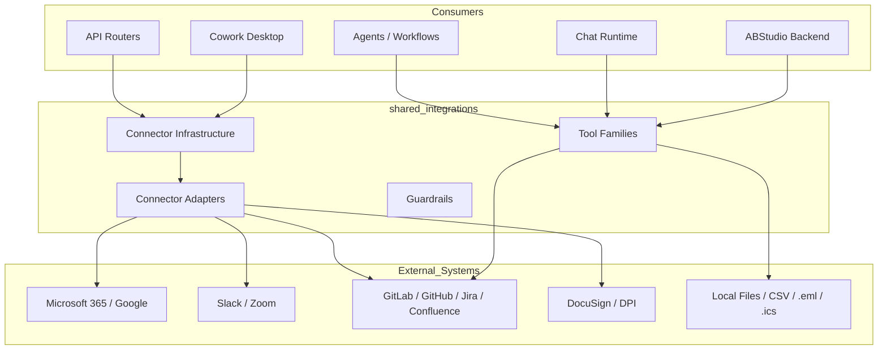
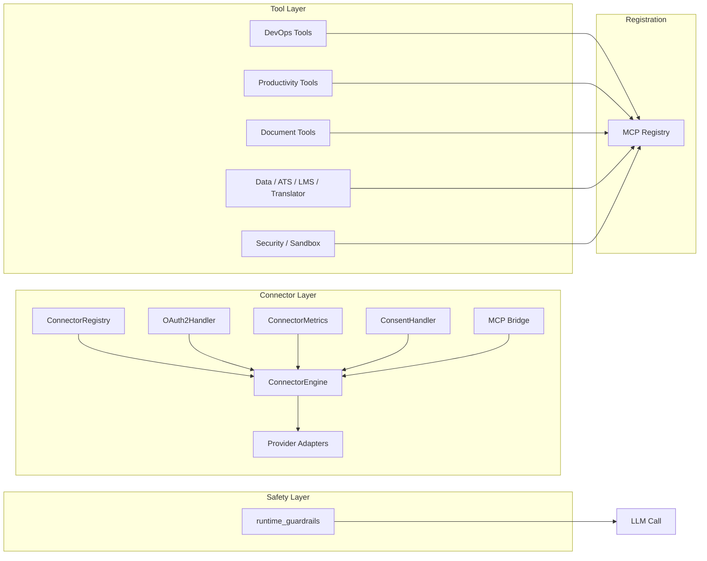
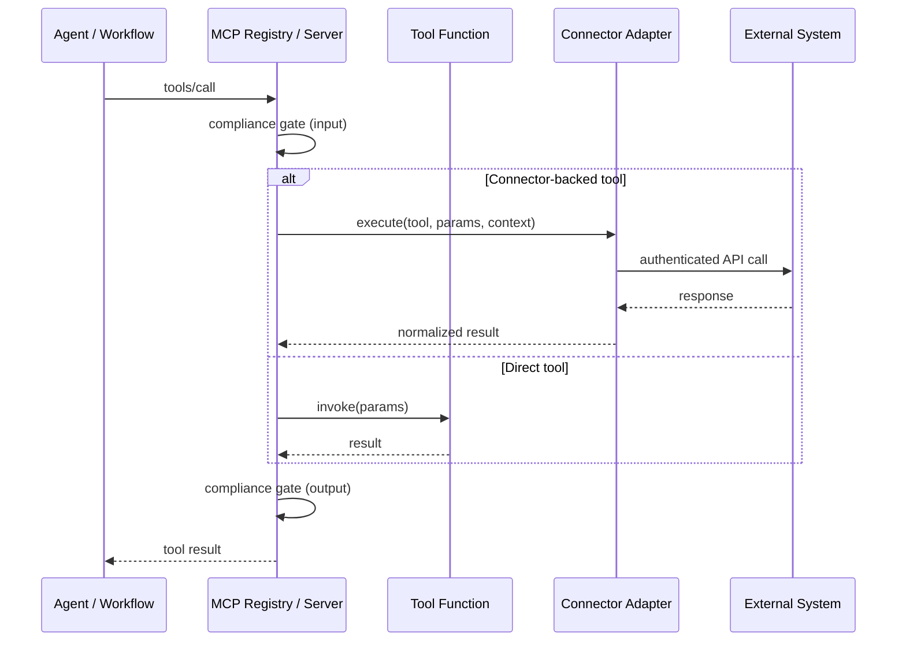

# shared_integrations Module Overview

## Purpose

The `shared_integrations` module is the unified integration and tooling layer of the AiNxt platform. It bundles all external-system adapters, connector infrastructure, runtime guardrails, and domain-specific tool implementations into a single module so that agents, workflows, chat runtimes, and API endpoints can interact with third-party services and local utilities through a consistent interface.

The module has three primary responsibilities:

1. **External system connectivity** — Provider-specific adapters and connector infrastructure for OAuth2-backed SaaS integrations (Microsoft 365, Google, Slack, GitLab, Jira, Confluence, DocuSign, Zoom, DPI sandbox, etc.).
2. **Agent-callable tools** — A large library of MCP-exposed tool functions for document processing, calendar/email operations, DevOps (GitHub/GitLab/Jira), data analysis, ATS, LMS, translation, security scanning, task tracking, and n8n workflow automation.
3. **Safety and governance** — Runtime guardrails (NeMo Guardrails keyword/LLM hardblocking) that gate user prompts before they reach the LLM, plus compliance-aware tool execution via the MCP server base class.

All tools in this module are registered into the platform's [MCP system](../mcp/mcp_system.md) and/or exposed through the connector engine, making them discoverable and invocable by agents without each agent implementing its own integration logic.

---

## Architecture

### High-level placement

### Internal organization

### Tool execution flow

---

## Core Components

| Sub-module | Responsibility | Key Documentation |
|---|---|---|
| **Connector Adapters** | Provider-specific SaaS API adapters (Microsoft 365, Google Drive, Gmail, GitLab, Jira, Confluence, Slack, Zoom, DocuSign, DPI). | [shared_integrations_connector_adapters.md](../connectors/shared_integrations_connector_adapters.md) |
| **Connector Infrastructure** | `ConnectorEngine`, `ConnectorRegistry`, `OAuth2Handler`, `ConnectorMetrics`, consent handling, and MCP bridge for connector execution. | [shared_integrations_connector_infrastructure.md](../connectors/shared_integrations_connector_infrastructure.md) |
| **Guardrails** | NeMo Guardrails-based input safety with keyword-only and full LLM evaluation modes. | [guardrails.md](../security/guardrails.md) |
| **ATS Tools** | Applicant tracking pipeline listing, resume-to-JD scoring, and stage-change proposals. | [ats_tools.md](ats_tools.md) |
| **Calendar Tools** | Read-only `.ics` calendar introspection, free-slot computation, and draft event creation. | [calendar_tools.md](../buddy/calendar_tools.md) |
| **Confluence Tools** | Thin wrapper around Confluence Cloud REST API for page read/write/search. | [confluence_tools.md](../connectors/confluence_tools.md) |
| **Data Tools** | CSV/XLSX discovery, schema inspection, pandas queries, variance reports, reconciliation, and chart generation. | [data_tools.md](data_tools.md) |
| **Doc Generator** | Multi-format document and presentation generation (DOCX, PPTX, PDF, XLSX, TXT, MD, CSV). | [doc_generator.md](../documents/doc_generator.md) |
| **Docker Execution Tool** | Sandboxed execution of arbitrary Python code inside ephemeral Docker containers. | [docker_execution_tool.md](../documents/docker_execution_tool.md) |
| **Document Tools** | Read-only text extraction and search across PDF, Office, HTML, and plain-text files. | [document_tools.md](../documents/document_tools.md) |
| **Email Tools** | Read-only `.eml` triage and draft-reply creation to an outbox. | [email_tools.md](email_tools.md) |
| **GitHub Tools** | GitHub REST API wrapper for PRs, issues, branches, files, reviews, and merges. | [github_tools.md](../connectors/github_tools.md) |
| **GitLab Tools** | Shared GitLab REST API v4 client used by SDLC, MCP, and connector paths. | [gitlab_tools.md](../connectors/gitlab_tools.md) |
| **Jira Tools** | Shared Jira Cloud REST API v3 client for issues, search, transitions, comments, and audit logging. | [jira_tools.md](../connectors/jira_tools.md) |
| **KB Search Tools** | Namespaced keyword retrieval over local document corpora. | [kb_search_tools.md](../knowledge/kb_search_tools.md) |
| **LMS Tools** | Learning catalog access and per-learner plan persistence. | [lms_tools.md](lms_tools.md) |
| **n8n Tools** | Autonomous n8n workflow generation and invocation of existing webhook workflows. | [n8n_tools.md](n8n_tools.md) |
| **Run Diff Tools** | Multi-repo git-diff inspection for in-progress SDLC runs. | [run_diff_tools.md](run_diff_tools.md) |
| **Security Scan Tools** | Unified SAST scanner orchestration (SonarQube, Checkmarx, PMD, Semgrep, Bandit, secrets) with CVSS normalization. | [security_scan_tools.md](../security/security_scan_tools.md) |
| **Task Tracker Tools** | Lightweight task CRUD with JSON-backed persistence and MCP exposure. | [task_tracker_tools.md](../buddy/task_tracker_tools.md) |
| **Translator Tools** | Glossary-aware translation toolkit with agent-driven and MT-engine modes. | [translator_tools.md](translator_tools.md) |

---

## Related Modules

- [mcp_system](../mcp/mcp_system.md) — MCP registry, bridge, and server infrastructure that exposes `shared_integrations` tools to agents.
- [shared_core](shared_core.md) — Core infrastructure (logging, circuit breakers, retry, credentials, compliance) consumed by adapters and tools.
- [shared_api_routers](../api/shared_api_routers.md) — HTTP routers that surface connector actions, document generation, and SDLC operations to clients.
- [abstudio_backend](../ui/abstudio_backend.md) — Backend APIs for catalog, agents, workflows, and templates that may bind integration tools.