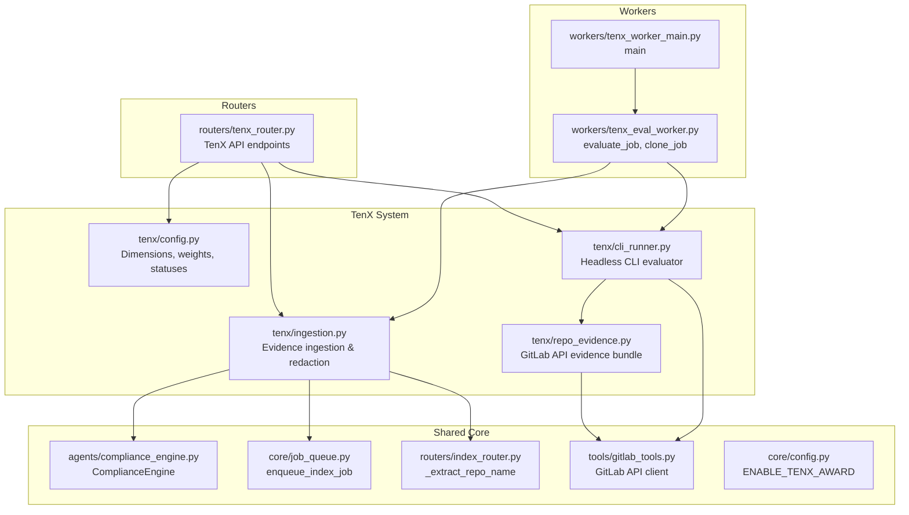
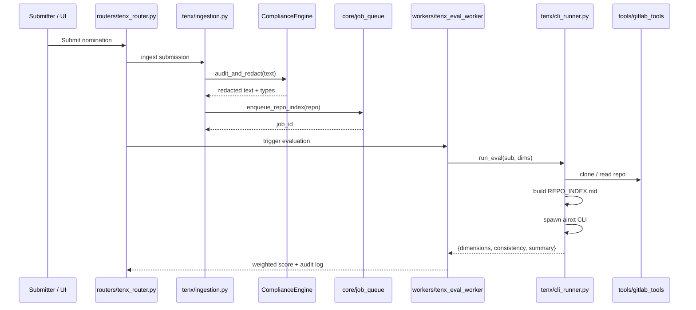

# TenX System (10x Award)

## Introduction

The **TenX System** powers the **NPCI 10x Award** — an internal recognition program that evaluates employee submissions (code projects, automations, process improvements, etc.) against a standardized rubric and awards multipliers based on merit. The module orchestrates the full evaluation lifecycle: eligibility checks, evidence ingestion, repository analysis, dimension scoring, consistency guarding, and leaderboard reporting.

The system is designed to be **fair, auditable, and secure**:
- Submissions are redacted for PII/secrets before processing.
- Code submissions are cloned and analyzed with read-only tools.
- Evaluations can run via a headless CLI evaluator or server-side agents.
- Scores are weighted, consistency-checked, and persisted for committee review.

## Architecture Overview

## High-Level Functionality

### 1. Configuration & Lifecycle (`tenx/config.py`)
Defines the canonical evaluation dimensions, per-track weights, submission statuses, eligibility rules, and consistency multipliers. This is the single source of truth for *what* is evaluated and *how* scores are combined.

See [tenx_system_configuration.md](../tenx_system_configuration.md) for details.

### 2. Evidence Ingestion (`tenx/ingestion.py`)
Handles submission intake: redacts free-text for PII/secrets, enqueues repository indexing via the shared platform pipeline, and classifies optional artifact links as machine-readable or human-verified.

See [tenx_system_evidence_ingestion.md](../tenx_system_evidence_ingestion.md) for details.

### 3. Repository Evidence (`tenx/repo_evidence.py`)
Fetches a bounded, representative evidence bundle directly from the GitLab API — file tree, languages, key files, and project stats — without requiring a full clone or RAG indexing. Formats the bundle for evaluator prompts.

See [tenx_system_evidence_ingestion.md](../tenx_system_evidence_ingestion.md) for details.

### 4. Headless CLI Evaluation (`tenx/cli_runner.py`)
Runs the `ainxt` CLI headlessly against a cloned repository to score all dimensions in a single pass. Supports persistent workspaces, self-healing clones, repo indexing, JSON-schema enforcement, and timeout protection.

See [tenx_system_evaluation_engine.md](../tenx_system_evaluation_engine.md) for details.

## Data Flow

## Module Boundaries

The TenX System does **not** implement:
- **API route handlers** — those live in `routers/tenx_router.py` (see [shared_api_routers.md](../api/shared_api_routers.md)).
- **Background worker orchestration** — evaluation jobs are executed by `workers/tenx_eval_worker.py` and `workers/tenx_worker_main.py` (see [workers.md](../workers/workers.md)).
- **LLM routing / model selection** — the CLI evaluator uses the gateway-authenticated `ainxt` binary, which relies on the shared model routing layer (see [shared_core.md](shared_core.md)).
- **Compliance redaction engine** — PII/secrets redaction is delegated to `agents/compliance_engine.py` (see [shared_core.md](shared_core.md)).
- **GitLab API client** — direct GitLab reads are delegated to `tools/gitlab_tools.py` (see [shared_integrations.md](shared_integrations.md)).
- **Repository indexing** — indexing jobs are enqueued through `core/job_queue.py` and executed by `workers/index_worker.py` (see [shared_core.md](shared_core.md) and [workers.md](../workers/workers.md)).

## Environment Variables

| Variable | Default | Purpose |
|----------|---------|---------|
| `ENABLE_TENX_AWARD` | `false` | Master feature flag. |
| `AINXT_CLI_BIN` | `ainxt` | Path to the headless `ainxt` binary (CLI eval mode). |
| `TENX_CLI_TIMEOUT` | `900` | Hard timeout (seconds) for a CLI evaluation run. |
| `TENX_WORKSPACE_DIR` | `/tmp/ainxt_tenx_workspaces` | Persistent clone/workspace root. |
| `TENX_EVAL_PASSES` | `1` | Number of evaluator passes; median score is used. |
| `TENX_MIN_AINXT_SESSIONS` | `1` | Minimum AiNxt tool sessions for eligibility. |
| `TENX_BUILD_WINDOW_DAYS` | `180` | Look-back window for AiNxt usage. |
| `TENX_ELIGIBILITY_MODE` | `enforce` | `enforce` blocks ineligible submissions; `warn` allows unverified. |

## Related Documentation

- [tenx_system_configuration.md](../tenx_system_configuration.md)
- [tenx_system_evidence_ingestion.md](../tenx_system_evidence_ingestion.md)
- [tenx_system_evaluation_engine.md](../tenx_system_evaluation_engine.md)
- [shared_api_routers.md](../api/shared_api_routers.md)
- [workers.md](../workers/workers.md)
- [shared_core.md](shared_core.md)
- [shared_integrations.md](shared_integrations.md)
