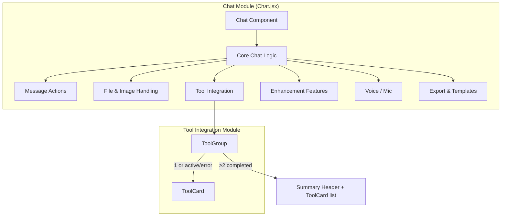
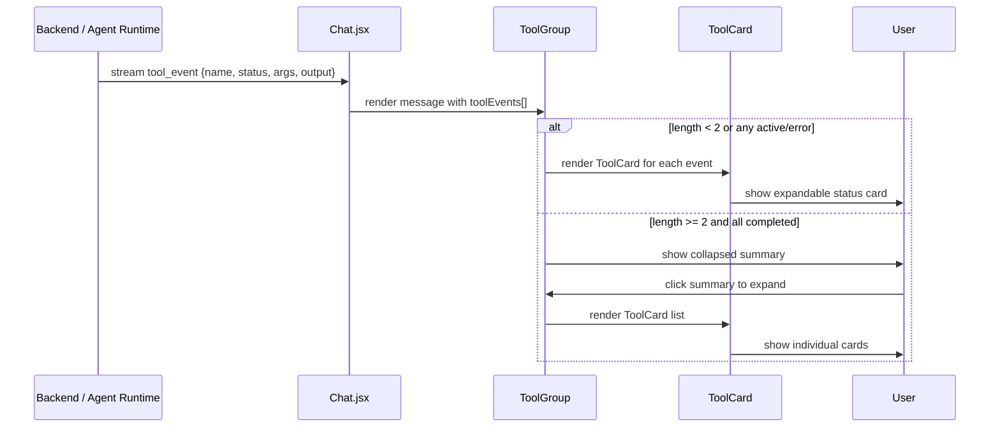
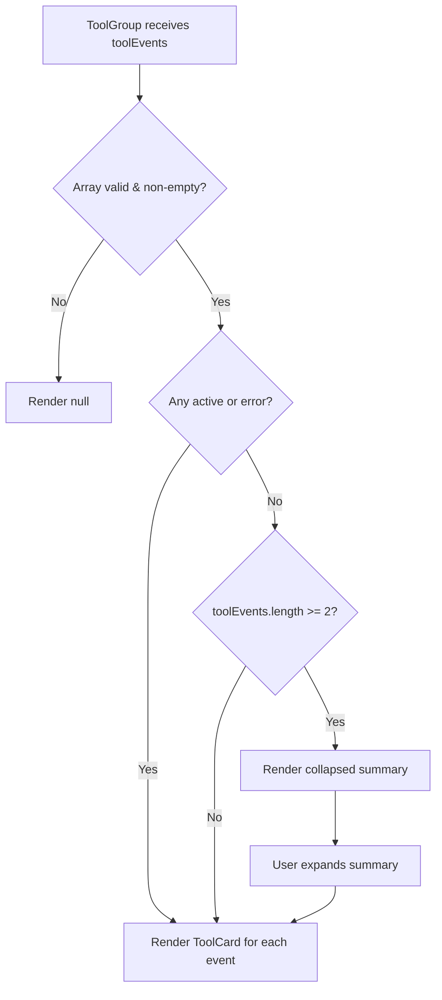
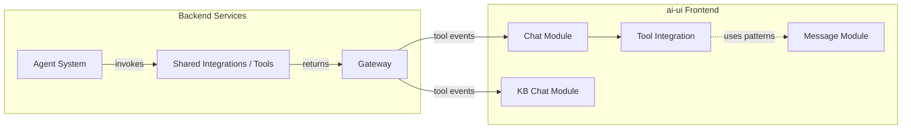

# Tool Integration Module

## Brief Introduction

The **Tool Integration** module is a focused UI sub-module of the [chat](../chat/chat.md) experience in the `ai-ui` frontend. It renders structured tool-call events inside chat messages, giving users visibility into which tools the AI invoked, their inputs, outputs, and execution status. The module consists of two tightly-coupled React components—`ToolCard` and `ToolGroup`—that turn raw `tool_event` payloads into an interactive, collapsible card interface.

This module does not execute tools itself; it only presents tool execution metadata produced by the backend/agent runtime. For the execution side, see the backend [agent_system](../agents/agent_system.md) and [shared_integrations](shared_integrations.md) modules.

---

## Module Purpose and Core Functionality

### Purpose

- Provide transparent, human-readable feedback when an AI assistant invokes external tools (e.g., search, code execution, document generation, connector actions).
- Reduce chat-message clutter by collapsing multiple successful tool calls into a single summary while surfacing errors and in-progress calls immediately.
- Keep the user informed of tool status: `running`, `success`, or `error`.

### Core Components

| Component | File | Responsibility |
|-----------|------|----------------|
| `ToolCard` | `ai-ui/src/components/Chat.jsx` | Renders one expandable card for a single `tool_event`, showing name, status, input arguments, and output. |
| `ToolGroup` | `ai-ui/src/components/Chat.jsx` | Receives an array of `toolEvents` and decides whether to render individual `ToolCard`s or collapse them behind a summary row. |

### Tool Event Shape

The components expect a `tool_event` object with the following fields:

```ts
interface ToolEvent {
  name: string;        // Tool name displayed in the header
  status: "success" | "error" | "running" | string;
  args?: object | string;  // Input arguments (rendered as JSON or plain string)
  output?: object | string; // Tool result/output
}
```

### Rendering Rules

`ToolGroup` applies these rules:

1. **Empty/null input** → render nothing.
2. **Single tool, active tools, or any error** → render each `ToolCard` directly so users see progress or failures.
3. **Two or more completed tools** → collapse them behind a summary line (`"Used N tools"`) to reduce noise.

`ToolCard` behavior:

- Status is shown as a colored dot: green for `success`, red for `error`, amber/pulsing otherwise.
- Error cards are expanded by default so failures are immediately visible.
- Inputs and outputs are rendered inside `<pre>` blocks with scrollable max heights.

---

## Architecture and Component Relationships

### Within the Chat Module

`ToolCard` and `ToolGroup` live inside the monolithic `Chat.jsx` component. They are imported/rendered as part of the message content pipeline, alongside other chat sub-features such as message actions, file/image handling, enhancement features, and voice input. The [chat](../chat/chat.md) module owns the message state, streaming, and overall layout; the tool integration module owns only the visual representation of tool events.



### Data Flow

Tool events originate from the backend/agent runtime, travel through the chat API/WebSocket stream, and are stored in the message object. When a message is rendered, `Chat.jsx` passes the `toolEvents` array to `ToolGroup`, which delegates individual cards to `ToolCard`.



### Rendering Decision Flow



---

## How It Fits into the Overall System

The tool integration UI is one of several presentation layers that make AI-agent behavior observable to end users. It sits at the intersection of:

- **Frontend chat experience** ([chat](../chat/chat.md)) – receives and displays streaming messages.
- **Backend tool execution** ([shared_integrations](shared_integrations.md), [agent_system](../agents/agent_system.md)) – produces the tool events being rendered.
- **Message rendering** ([message](../chat/message.md)) – the broader message component ecosystem that includes markdown, code blocks, images, and downloadable artifacts.

A similar pattern may be reused in knowledge-base chat ([kb_chat](../knowledge/kb_chat.md)), which also supports tool calls and attachments.

### System Context



---

## Component API

### `ToolCard`

```jsx
function ToolCard({ te }) { ... }
```

| Prop | Type | Description |
|------|------|-------------|
| `te` | `ToolEvent` | A single tool event object. |

### `ToolGroup`

```jsx
function ToolGroup({ toolEvents }) { ... }
```

| Prop | Type | Description |
|------|------|-------------|
| `toolEvents` | `ToolEvent[]` | Array of tool events to render. |

---

## Design Notes

- **Read-only presentation**: These components never call tools or mutate state. They are pure renderers.
- **Error-first UX**: Error cards are opened by default; successful multi-tool runs are collapsed by default.
- **String/object tolerance**: Both `args` and `output` can be strings or objects; the component stringifies objects with `JSON.stringify`.
- **No external state**: The components rely entirely on props passed from `Chat.jsx`, keeping them easy to test and reuse.

---

## Related Documentation

- [chat](../chat/chat.md) – Parent chat module that owns message state, streaming, and the overall chat UI.
- [message](../chat/message.md) – General message rendering including markdown, code blocks, and artifacts.
- [kb_chat](../knowledge/kb_chat.md) – Knowledge-base chat interface with similar tool-call and attachment handling.
- [agent_system](../agents/agent_system.md) – Backend agents that invoke tools and emit tool events.
- [shared_integrations](shared_integrations.md) – Backend tool implementations and connector adapters.
