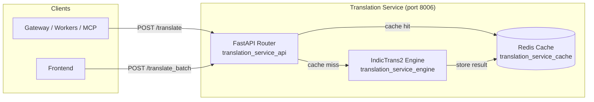
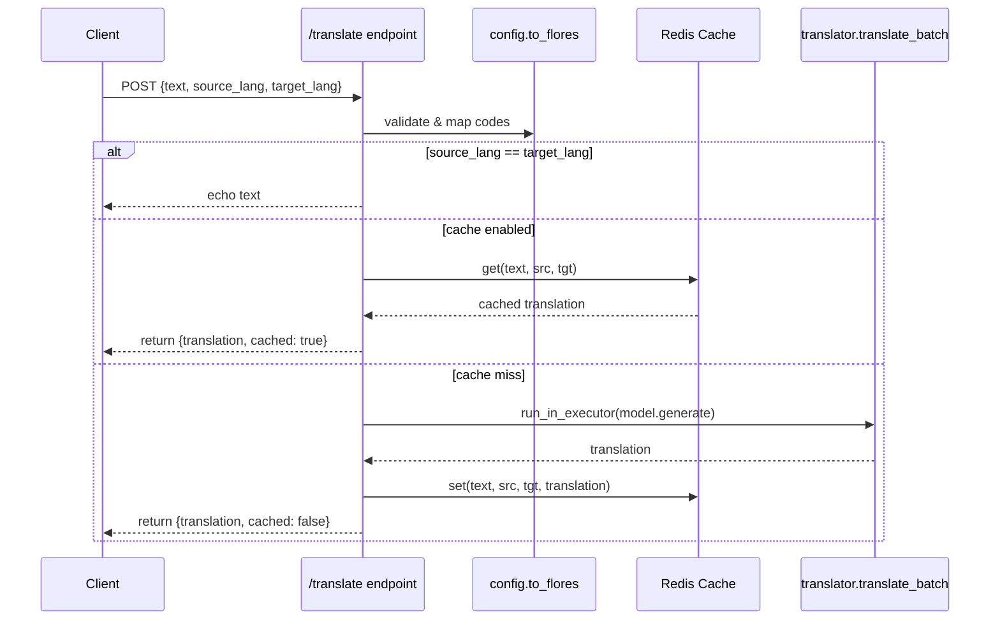
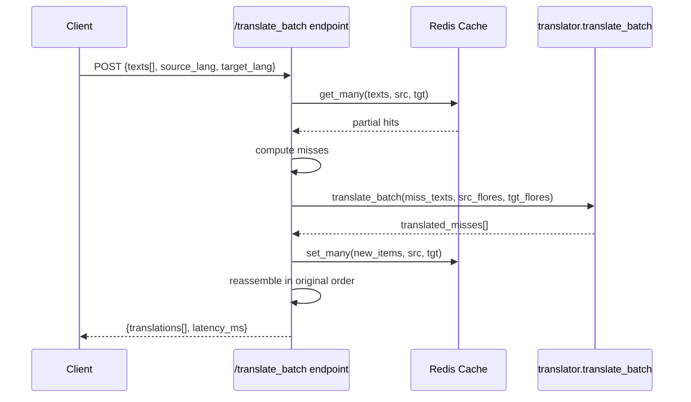

# Translation Service

## Overview

The **Translation Service** (`services/translate_svc`) is a dedicated FastAPI microservice that provides machine translation between English and 22 scheduled Indian languages. It wraps the [AI4Bharat IndicTrans2](https://ai4bharat.iitm.ac.in/indictrans2) sequence-to-sequence models and exposes both single-text and batch translation HTTP endpoints.

The service is designed as a standalone, horizontally-scalable container that other platform components (gateways, workers, MCP servers, and frontends) can call over HTTP. It emphasizes deterministic caching, low latency for repeated phrases, and safe CPU/GPU deployment patterns.

### Key responsibilities

- Translate single strings or batches of strings between supported ISO language codes.
- Cache translations in Redis (DB 9) with a 24-hour TTL to avoid redundant model inference.
- Load IndicTrans2 models at module import time (project rule: no lazy loading) and run inference in a dedicated thread pool so the async event loop stays responsive.
- Report health status including model readiness and cache connectivity.

### Supported language direction

All translations route through one of two model pairs:

- **Indic → English**: `ai4bharat/indictrans2-indic-en-*`
- **English → Indic**: `ai4bharat/indictrans2-en-indic-*`

Supported Indic ISO codes include `as`, `bn`, `brx`, `doi`, `kok`, `gu`, `hi`, `kn`, `ks_Arab`, `ks_Deva`, `mai`, `ml`, `mr`, `mni_Beng`, `mni_Mtei`, `ne`, `or`, `pa`, `sa`, `sat`, `sd_Arab`, `sd_Deva`, `ta`, `te`, `ur`, plus `en`.

---

## Architecture

### Component map

| Sub-module | File | Responsibility |
|------------|------|----------------|
| `translation_service_api` | `services/translate_svc/main.py` | FastAPI application, request/response models, endpoints, lifespan, OpenTelemetry instrumentation. |
| `translation_service_engine` | `services/translate_svc/translator.py` | IndicTrans2 model loading, `translate()` and `translate_batch()` inference, FLORES code handling. |
| `translation_service_cache` | `services/translate_svc/cache.py` | Async Redis client for single and batched translation caching. |
| *(config)* | `services/translate_svc/config.py` | Environment-driven configuration, ISO → FLORES language map, supported-code checks. |

---

## API surface

The service exposes three endpoints:

| Method | Path | Description |
|--------|------|-------------|
| `POST` | `/translate` | Translate a single text string. |
| `POST` | `/translate_batch` | Translate a list of strings in one request with batch cache optimization. |
| `GET`  | `/health` | Return model load state, Redis connectivity, device, and port. |

### Request/response models

- `TranslateRequest`: `{ text: str, source_lang: str, target_lang: str }`
- `TranslateResponse`: `{ translation: str, source_lang: str, target_lang: str, cached: bool }`
- `TranslateBatchRequest`: `{ texts: list[str], source_lang: str, target_lang: str }`
- `TranslateBatchResponse`: `{ translations: list[str], latency_ms: float }`

Language codes are ISO-639-1 style strings (e.g. `hi`, `en`, `ta`). The service maps them internally to FLORES-200 codes required by IndicTrans2.

---

## Data flow

### Single translation

### Batch translation

---

## Deployment & runtime notes

- **Port**: configurable via `TRANSLATE_SVC_PORT` (default `8006`).
- **Workers**: run with `--workers 1` only. The IndicTrans2 models are loaded at import time and their `generate()` method is not thread-safe for concurrent calls.
- **Device**: default `cpu` with 200M distilled models. For production GPU, set `TRANSLATE_DEVICE=cuda` and override model IDs to the 1B variants; the engine automatically selects `float16` on CUDA and `float32` on CPU.
- **Thread pool**: a `ThreadPoolExecutor(max_workers=2)` isolates blocking model inference from the asyncio event loop.
- **Cache**: Redis DB 9, 24-hour TTL. Cache failures are non-fatal; the service falls back to direct model inference.
- **Observability**: optional OpenTelemetry auto-instrumentation when `OTLP_ENDPOINT` is set and `ENABLE_TRACING=1`.

---

## Module boundaries

The Translation Service is intentionally narrow: it does **not** handle language detection, document formatting, or embedding. Those concerns live in other modules:

- Language detection: see [shared_core](shared_core.md) (`core/lang_detect.py`).
- General-purpose LLM proxying: see [llm_proxy](../models/llm_proxy.md).
- Document parsing and OCR: see [abstudio_backend](../ui/abstudio_backend.md) (`app/core/ocr_pipeline.py`).
- Higher-level translation tools and glossary management: see [shared_integrations](shared_integrations.md) (`tools/translator_tools.py`).

---

## Sub-module documentation

- [translation_service_api](../api/translation_service_api.md) — FastAPI endpoints, request validation, and service lifecycle.
- [translation_service_engine](translation_service_engine.md) — IndicTrans2 model wrapper and inference details.
- [translation_service_cache](translation_service_cache.md) — Redis-backed translation cache implementation.
