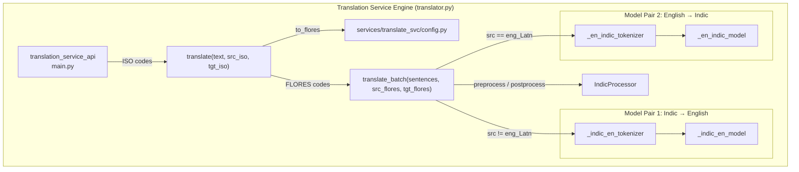
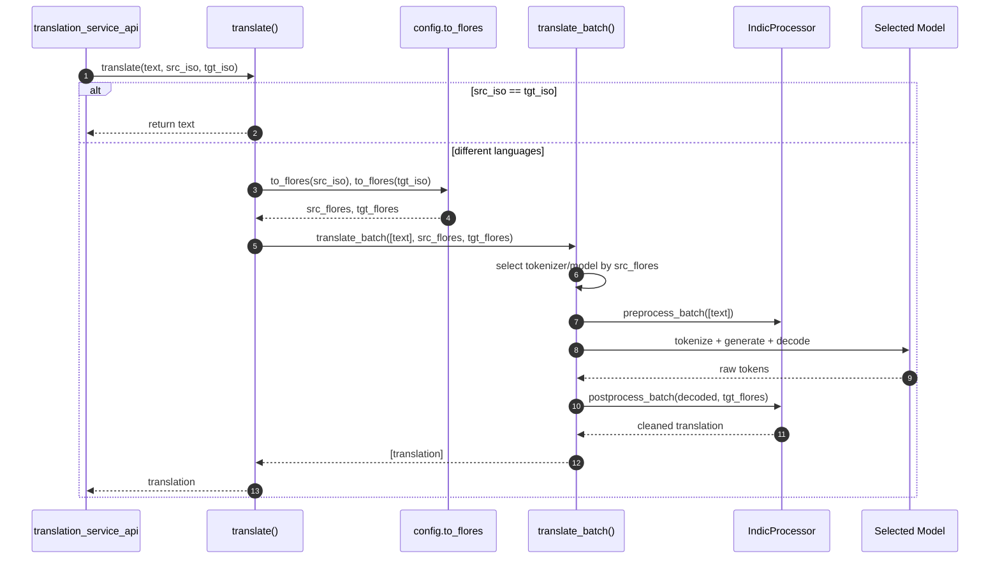
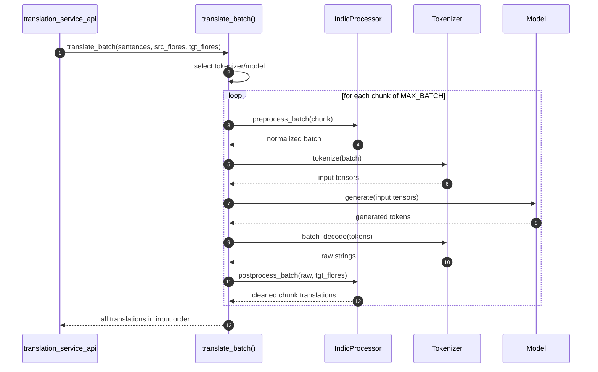
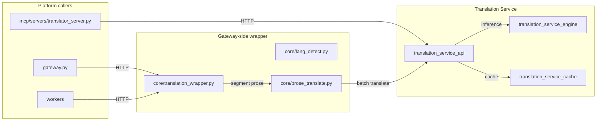

# Translation Service Engine

## Brief Introduction

The **Translation Service Engine** (`services/translate_svc/translator.py`) is the model-inference core of the [Translation Service](translation_service.md). It loads and runs the [AI4Bharat IndicTrans2](https://ai4bharat.iitm.ac.in/indictrans2) sequence-to-sequence models, exposing two simple Python functions: `translate()` for single strings and `translate_batch()` for lists of strings.

This module is intentionally thin: it does not know about HTTP, caching, or request validation. Its only job is to take pre-validated FLORES-200 language codes and raw text, run the appropriate IndicTrans2 model, and return translations in the same order as the input. All orchestration around it (HTTP endpoints, Redis cache, thread-pool dispatch) lives in [translation_service_api.md](../api/translation_service_api.md) and [translation_service_cache.md](translation_service_cache.md).

---

## Core Responsibilities

| Responsibility | Description |
| --- | --- |
| **Model loading** | Loads the `indic-en` and `en-indic` IndicTrans2 models at module import time, with dtype and device selected from environment configuration. |
| **Direction selection** | Chooses the correct model/tokenizer pair based on the source FLORES-200 code (`eng_Latn` → en-indic, anything else → indic-en). |
| **Pre/post-processing** | Uses `IndicProcessor` to normalize input for IndicTrans2 and to clean generated output. |
| **Batch inference** | Chunks long input lists to `MAX_BATCH`, tokenizes, generates, decodes, and reassembles results while preserving order. |
| **Single-text convenience** | `translate()` maps ISO codes to FLORES-200 via `config.to_flores()` and delegates to `translate_batch()`. |

---

## Architecture

### Why isolate the engine?

- **Import-time model loading** keeps startup deterministic and avoids first-request latency penalties.
- **No HTTP or cache logic** makes the engine reusable from scripts, tests, or other Python entry points.
- **Global model singletons** are shared across calls within the single Uvicorn worker; the engine itself does not manage concurrency, leaving that to the API layer's thread pool.

---

## Component Breakdown

### Module-level model singletons

At import time, `translator.py` creates four global objects plus one `IndicProcessor`:

| Object | Purpose |
| --- | --- |
| `_indic_en_tokenizer` | Tokenizer for Indic → English. |
| `_indic_en_model` | `AutoModelForSeq2SeqLM` for Indic → English. |
| `_en_indic_tokenizer` | Tokenizer for English → Indic. |
| `_en_indic_model` | `AutoModelForSeq2SeqLM` for English → Indic. |
| `_ip` | `IndicProcessor(inference=True)` for input normalization and output cleanup. |

The dtype is selected automatically:

- `torch.float16` when `TRANSLATE_DEVICE` starts with `cuda`.
- `torch.float32` otherwise (CPU; float16 on CPU-only torch is unsafe).

Models are moved to `TRANSLATE_DEVICE` and set to `.eval()` immediately after loading.

### `translate_batch(sentences, src_flores, tgt_flores)` → `list[str]`

The workhorse inference function. It expects FLORES-200 codes (e.g. `eng_Latn`, `hin_Deva`) and a list of sentences.

1. **Empty guard** — returns `[]` for empty input.
2. **Model selection** — uses the en-indic pair when `src_flores == "eng_Latn"`, otherwise the indic-en pair.
3. **Chunking** — splits `sentences` into chunks of at most `MAX_BATCH` (default 32) to avoid OOM.
4. **Preprocess** — `_ip.preprocess_batch(chunk, src_lang=src_flores, tgt_lang=tgt_flores)`.
5. **Tokenize** — `tokenizer(..., truncation=True, padding="longest", return_tensors="pt")` on the configured device.
6. **Generate** — `model.generate(..., min_length=0, max_length=256, num_beams=5, num_return_sequences=1)` under `torch.inference_mode()`.
7. **Decode** — `tokenizer.batch_decode(..., skip_special_tokens=True, clean_up_tokenization_spaces=True)`.
8. **Postprocess** — `_ip.postprocess_batch(decoded, lang=tgt_flores)`.
9. **Collect** — extends the result list in input order.

### `translate(text, src_iso, tgt_iso)` → `str`

Convenience wrapper for single strings.

1. Returns `text` unchanged if `src_iso == tgt_iso`.
2. Maps ISO codes to FLORES-200 via `config.to_flores()`.
3. Calls `translate_batch([text], src_flores, tgt_flores)` and returns the first result.

If `to_flores()` raises `ValueError` for an unsupported code, the exception propagates to the caller (the API layer converts it to an HTTP 400).

---

## Data Flow

### Single-text inference

### Batch inference with chunking

---

## Dependencies

### Internal Modules

| Module | Relationship | Link |
| --- | --- | --- |
| `services/translate_svc/config.py` | Supplies model IDs, device, `MAX_BATCH`, and `to_flores()`. | (configuration, no separate doc) |
| `core/logger.py` | Optional structured logger; falls back to stdlib `logging`. | [shared_core.md](shared_core.md) |

### External Libraries

| Library | Purpose |
| --- | --- |
| **torch** | Device placement, dtype selection, and `inference_mode()`. |
| **transformers** | `AutoModelForSeq2SeqLM` and `AutoTokenizer` for IndicTrans2. |
| **IndicTransToolkit** | `IndicProcessor` for Indic-language pre/post-processing. |

---

## Configuration

The engine reads all configuration from `services/translate_svc/config.py`:

| Environment Variable | Default | Purpose |
| --- | --- | --- |
| `INDIC_EN_MODEL` | `ai4bharat/indictrans2-indic-en-dist-200M` | Hugging Face model for Indic → English. |
| `EN_INDIC_MODEL` | `ai4bharat/indictrans2-en-indic-dist-200M` | Hugging Face model for English → Indic. |
| `TRANSLATE_DEVICE` | `cpu` | Torch device (`cpu` or `cuda`). |
| `MAX_BATCH` | `32` | Maximum sentences per `generate()` call. |

> **Production GPU note:** Set `TRANSLATE_DEVICE=cuda` and override both model IDs to the 1B variants. The engine automatically uses `float16` on CUDA, which halves VRAM usage and improves throughput.

---

## Supported Languages

The engine itself accepts FLORES-200 codes. The ISO → FLORES mapping is handled by `config.to_flores()` and covers the same 26 codes documented in [translation_service_api.md](../api/translation_service_api.md):

`as`, `bn`, `brx`, `doi`, `kok`, `gu`, `hi`, `kn`, `ks_Arab`, `ks_Deva`, `mai`, `ml`, `mr`, `mni_Beng`, `mni_Mtei`, `ne`, `or`, `pa`, `sa`, `sat`, `sd_Arab`, `sd_Deva`, `ta`, `te`, `ur`, `en`.

---

## Error Handling

| Scenario | Behavior |
| --- | --- |
| Unsupported ISO code in `translate()` | `ValueError` propagated from `config.to_flores()`. |
| Empty batch input | Returns `[]` immediately. |
| Model/generate failure | Exception bubbles up to the API layer, which logs and returns HTTP 500. |

The engine does not interact with Redis or HTTP directly, so it has no cache-failure handling of its own.

---

## How It Fits into the Overall System

The Translation Service Engine is the innermost layer of the platform's English ↔ Indic translation stack:

Typical call chain:

1. A platform component (gateway, worker, MCP server) wants to translate user-facing prose.
2. It calls `core.translation_wrapper.translate_to_english()` or `translate_from_english()`.
3. `core.prose_translate.translate_prose()` segments the text so that **only natural-language prose** is sent to the translator; code, identifiers, paths, URLs, and markdown structure stay verbatim.
4. The wrapper calls `POST /translate_batch` on the Translation Service API.
5. The API checks [translation_service_cache.md](translation_service_cache.md); on a miss it dispatches the engine's `translate_batch()` in a thread pool.
6. The engine returns translations, which are cached and spliced back into the original document structure.

Related modules:

- [translation_service_api.md](../api/translation_service_api.md) — HTTP layer, request validation, and service lifecycle.
- [translation_service_cache.md](translation_service_cache.md) — Redis-backed translation cache.
- [translation_service.md](translation_service.md) — parent module overview.
- [shared_core.md](shared_core.md) — `core/translation_wrapper.py`, `core/prose_translate.py`, and `core/lang_detect.py`.
- [shared_integrations.md](shared_integrations.md) — higher-level `tools/translator_tools.py` for glossary-aware translation workflows.

---

## Operational Notes

- **Never import this module in a multi-worker or multi-threaded context expecting concurrent `generate()` calls.** The global model objects are not thread-safe; concurrency control is the API layer's responsibility.
- **Import time is load time.** Importing `services.translate_svc.translator` triggers model download/load from Hugging Face if the models are not already cached. Ensure the service has network access on first startup or pre-cache the model weights.
- **CPU vs GPU dtype** is automatic; do not set `torch_dtype` manually unless you are forking the engine.
- **Long multi-sentence strings** are translated as a single batch item in `translate()`. For best quality on long inputs, callers should pre-split into sentences and use `translate_batch()`.
