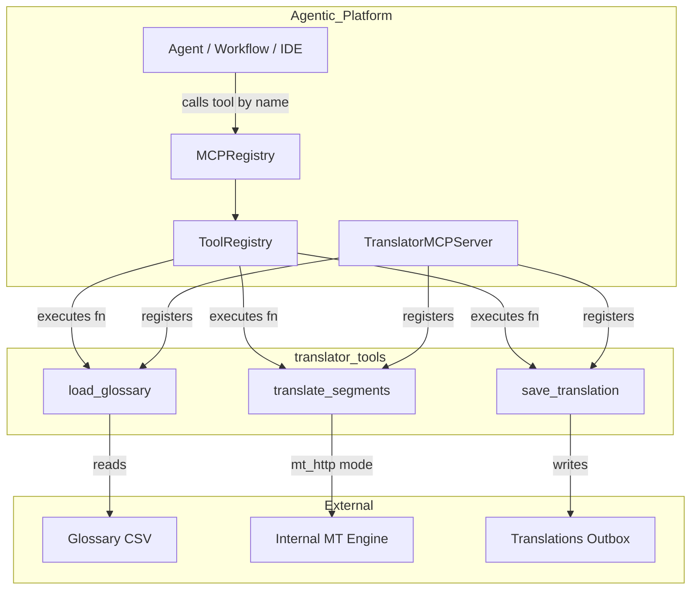
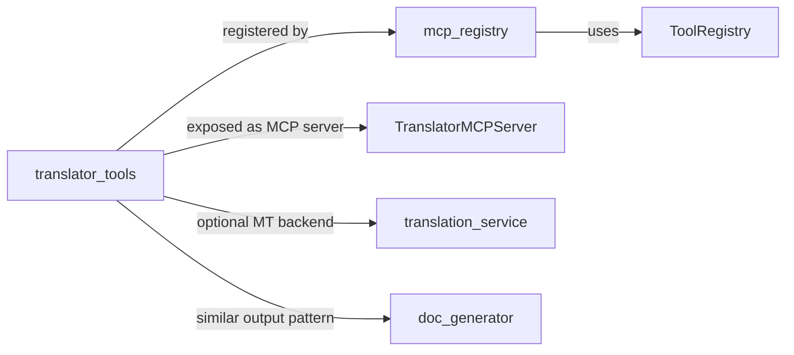
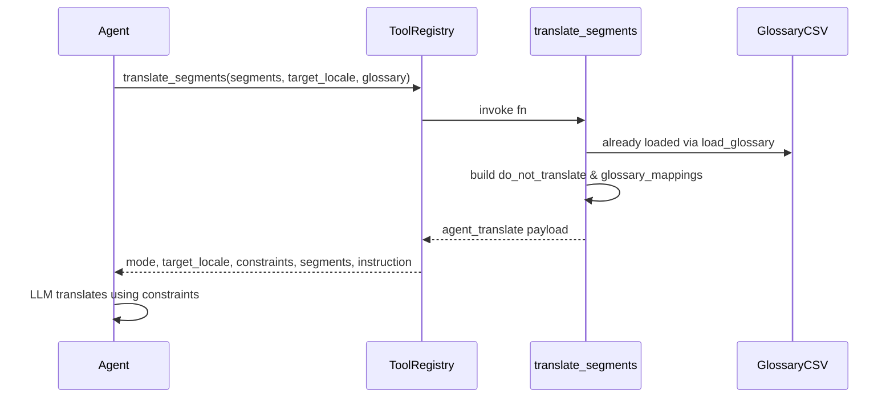
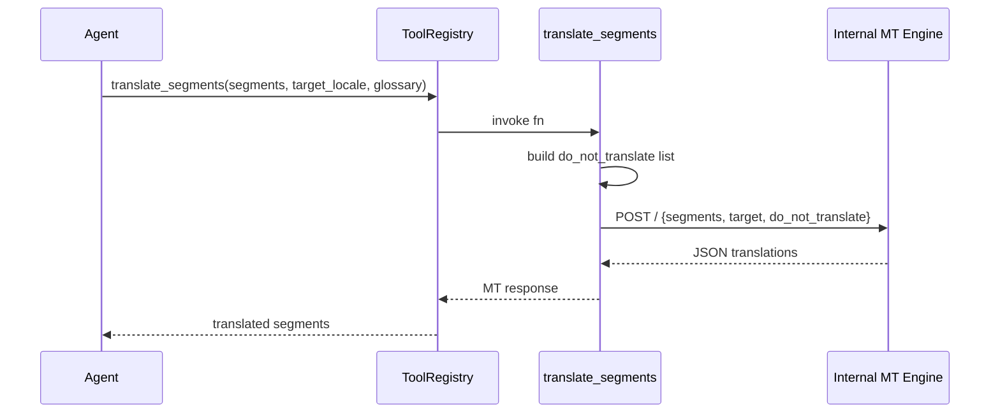
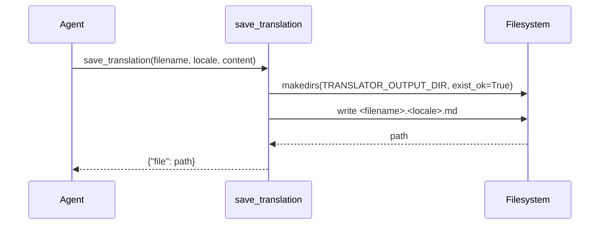
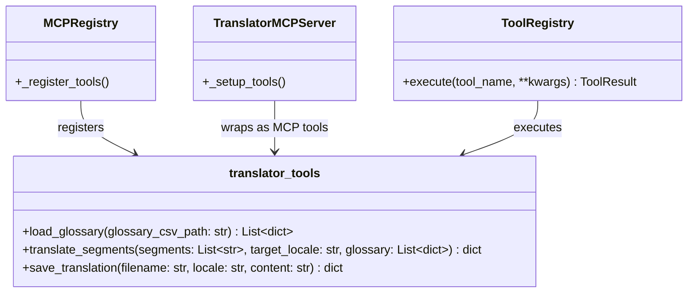

# translator_tools

## Overview

`translator_tools` is a glossary-aware translation toolkit in the NPCI Agentic Platform. It exposes three MCP tool functions — `load_glossary`, `translate_segments`, and `save_translation` — that support document translation and localization use cases (notably **UC-94**). The module is intentionally backend-agnostic: it can either annotate segments with glossary constraints and let the calling LLM perform the translation (`glossary_demo` provider), or it can forward segments to an internal machine-translation (MT) HTTP endpoint (`mt_http` provider).

The tools are registered both as platform-native tools in [`mcp_registry`](../mcp_registry.md) and as MCP server tools via [`TranslatorMCPServer`](../mcp/mcp_servers.md), so they are reachable from agents, workflows, the IDE, and external MCP clients.

---

## Core Functionality

| Function | Purpose |
|----------|---------|
| `load_glossary(glossary_csv_path)` | Load a CSV glossary containing terms, per-locale translations, and instructions (e.g., `keep`). |
| `translate_segments(segments, target_locale, glossary)` | Translate a list of text segments to a target locale while honouring glossary constraints. |
| `save_translation(filename, locale, content)` | Persist a completed translation to the configured outbox as `<filename>.<locale>.md`. |

### Provider Modes

- **`glossary_demo`** (default): Returns segments wrapped with glossary metadata and an instruction for the agent to translate. No external MT call is made.
- **`mt_http`**: POSTs segments, target locale, and a `do_not_translate` list to `TRANSLATOR_MT_ENDPOINT`, returning the MT engine response verbatim.

---

## Architecture



### Component Responsibilities

- **`load_glossary`**: Reads a CSV file using Python's `csv.DictReader`. Each row is expected to contain at least a `term` column, per-locale columns (e.g., `hi`, `ta`), and an optional `instruction` column.
- **`translate_segments`**: Builds a `do_not_translate` list from glossary rows whose instruction contains `"keep"`. Depending on the configured provider, it either returns an agent-translation payload or calls the MT engine.
- **`save_translation`**: Ensures the output directory exists and writes the translated content to a Markdown file named `<filename>.<locale>.md`.

---

## Dependencies



### Internal Dependencies

- [`mcp_registry`](../mcp_registry.md): Bootstraps `load_glossary`, `translate_segments`, and `save_translation` as platform-native tools with tags `mcp`, `translator`, and `translation`.
- [`mcp_servers`](../mcp/mcp_servers.md): `TranslatorMCPServer` wraps the same three functions as MCP server tools, including `pci_audit=True` for `save_translation`.
- [`ToolRegistry`](../mcp_registry.md): Executes the tool functions, captures timing/errors, and enforces governance gates.

### Related Translation Infrastructure

- [`translation_service`](translation_service.md): A standalone FastAPI service that provides cached NLLB-style translation via `/translate` and `/translate_batch`. `translator_tools` can delegate to it when `TRANSLATOR_MT_ENDPOINT` points to this service.
- [`core_translation_wrapper`](../infrastructure/core_infrastructure.md): Platform-wide helper for translating user input to/from English. It is separate from `translator_tools` and is used by chat and agent pipelines for runtime language normalization.

---

## Data Flow

### glossary_demo Mode



### mt_http Mode



### Saving a Translation



---

## Component Interaction



---

## Configuration

| Environment Variable | Default | Description |
|----------------------|---------|-------------|
| `TRANSLATOR_PROVIDER` | `glossary_demo` | Translation backend: `glossary_demo` or `mt_http`. |
| `TRANSLATOR_MT_ENDPOINT` | `""` | URL of the internal MT engine when `provider=mt_http`. |
| `TRANSLATOR_AUTH_TOKEN_ENV` | `TRANSLATOR_MT_TOKEN` | Name of the env var holding the bearer token for the MT engine. |
| `TRANSLATOR_OUTPUT_DIR` | `/data/mcp_outbox/translations` | Directory where `save_translation` writes files. |

---

## API Reference

### `load_glossary(glossary_csv_path: str) -> List[dict]`

Loads a glossary CSV. Expected columns include `term`, per-locale columns (e.g., `hi`, `ta`, `fr`), and an optional `instruction` column.

### `translate_segments(segments: List[str], target_locale: str, glossary: List[dict] = None) -> dict`

Translates or prepares segments for translation.

**Returns in `glossary_demo` mode:**

```json
{
  "mode": "agent_translate",
  "target_locale": "hi",
  "do_not_translate": ["NPCI", "UPI"],
  "glossary_mappings": [{"NPCI": "एनपीसीआई"}],
  "segments": [...],
  "instruction": "Translate each segment to the target locale..."
}
```

**Returns in `mt_http` mode:** the JSON response from the configured MT endpoint.

### `save_translation(filename: str, locale: str, content: str) -> dict`

Writes `content` to `<TRANSLATOR_OUTPUT_DIR>/<filename>.<locale>.md` and returns `{"file": "<path>"}`.

---

## Integration Points

- **Agent Builder / Workflows**: Agents can call `load_glossary` → `translate_segments` → `save_translation` as a pipeline to localize documents.
- **MCP Server Router**: `TranslatorMCPServer` mounts the tools at the platform's MCP SSE endpoints, making them available to external MCP clients.
- **Governance**: `save_translation` is flagged with `pci_audit=True` in the MCP server registration, ensuring write operations are audited.
- **MT Engine**: When `TRANSLATOR_PROVIDER=mt_http`, the module acts as a thin client to an internal translation service. Pointing `TRANSLATOR_MT_ENDPOINT` at [`translation_service`](translation_service.md) reuses its caching and NLLB-based model routing.

---

## How It Fits into the System

`translator_tools` sits in the **shared integrations** layer alongside other MCP-backed tool families such as [`calendar_tools`](shared_integrations.md), [`email_tools`](shared_integrations.md), and [`doc_generator`](shared_integrations.md). It is not a standalone translation service; rather, it is a **tool adapter** that brings translation capabilities into the agentic platform under a uniform MCP tool contract.

For heavy-duty, cached, model-routed translation, the platform prefers [`translation_service`](translation_service.md). For agent-driven localization with glossary constraints, `translator_tools` provides the control surface.

---

## See Also

- [`mcp_registry`](../mcp_registry.md) — platform tool/skill bootstrap and execution.
- [`translation_service`](translation_service.md) — standalone translation microservice.
- [`core_translation_wrapper`](../infrastructure/core_infrastructure.md) — runtime English normalization helpers.
- [`doc_generator`](shared_integrations.md) — generated document output patterns similar to `save_translation`.
