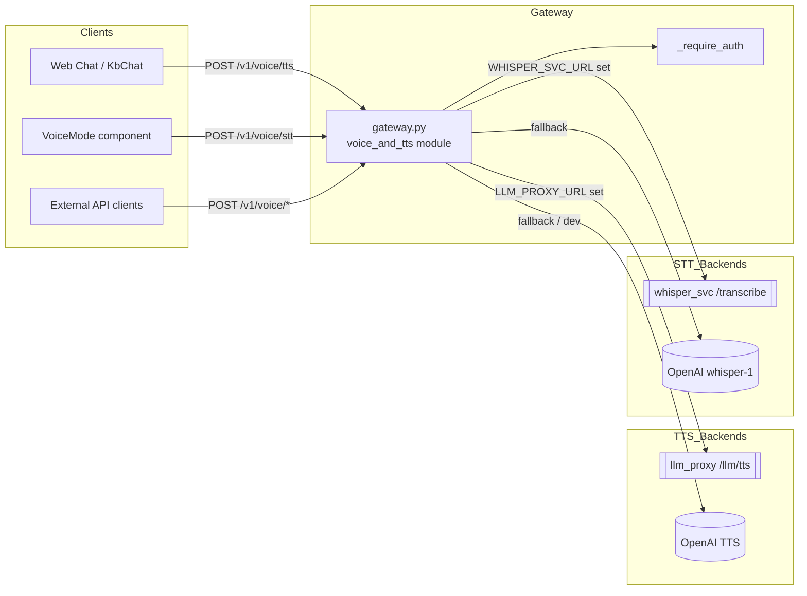
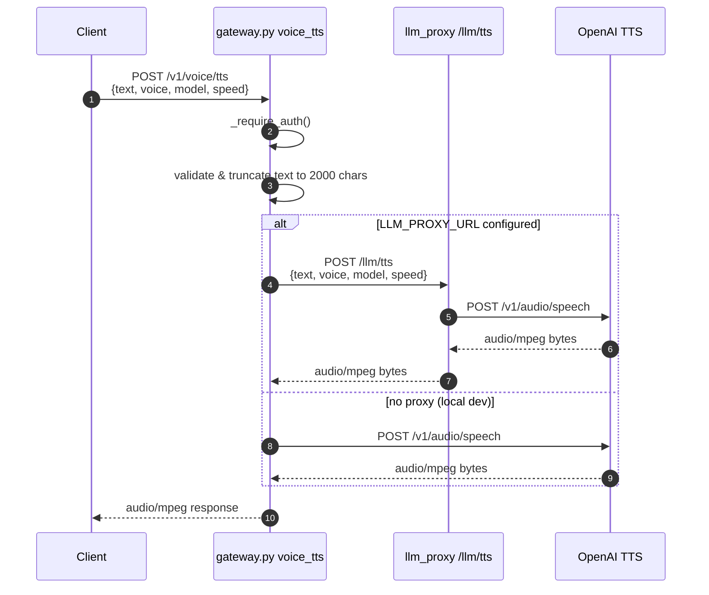
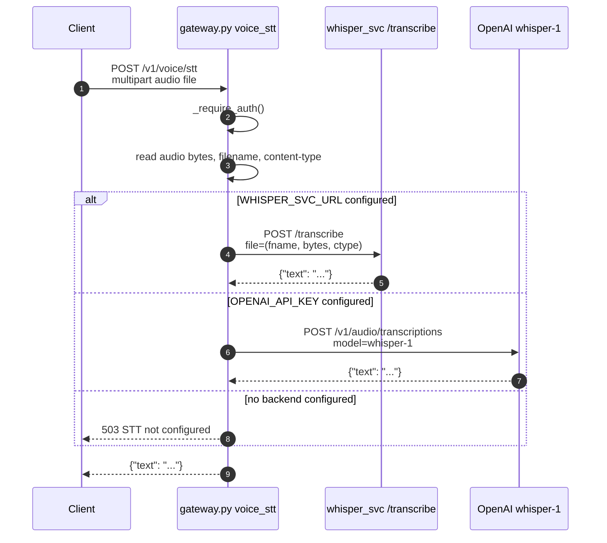
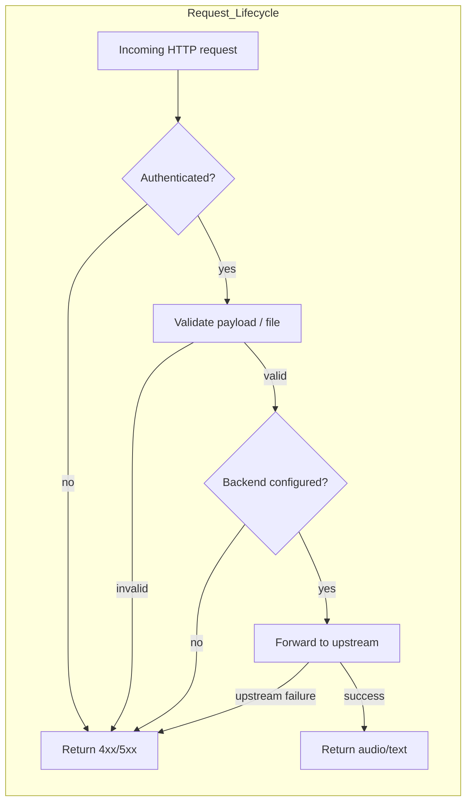

# Voice & TTS Module

## Brief Introduction

The `voice_and_tts` module exposes the platform's speech capabilities through the
main API gateway. It provides two complementary endpoints:

* **Text-to-Speech (TTS)** — converts assistant text replies into streamed
  `audio/mpeg` audio using OpenAI's TTS models.
* **Speech-to-Text (STT)** — transcribes user-uploaded audio into text using
  either a local Whisper microservice or OpenAI's `whisper-1` model.

These endpoints are intentionally thin orchestration layers in
[`gateway.py`](../models/gateway.md). They keep API keys server-side, enforce
authentication, and route requests to the appropriate backend service based on
environment configuration. The actual ML inference always runs out-of-process
(the "no-lazy-load" rule), either in the dedicated [`llm_proxy`](../models/llm_proxy.md)
service or in [`services/whisper_svc`](whisper_service.md).

---

## Core Components

All core components live in `gateway.py` under the `voice_and_tts` module
namespace.

### `_TTSRequest`

Pydantic request model for the TTS endpoint.

| Field | Type | Default | Description |
|-------|------|---------|-------------|
| `text` | `str` | — | Text to synthesize. Trimmed and capped to 2,000 characters by the handler. |
| `voice` | `str` | `"nova"` | OpenAI voice persona: `alloy`, `echo`, `fable`, `onyx`, `nova`, `shimmer`. |
| `model` | `str` | `"tts-1-hd"` | OpenAI TTS model: `tts-1` or `tts-1-hd`. |
| `speed` | `float` | `0.92` | Playback speed multiplier (0.25–4.0). Slightly slower than 1.0 sounds more natural. |

### `voice_tts`

`async def voice_tts(_req: _TTSRequest, _user=Depends(_require_auth))`

Converts text to speech and returns a binary `audio/mpeg` response.

**Routing logic:**

1. If `LLM_PROXY_URL` is configured, the request is forwarded to
   [`llm_proxy /llm/tts`](../models/llm_proxy.md#llm_tts). This is the production path
   because the proxy host has outbound internet while the gateway host may not.
2. If no proxy is configured, the gateway calls OpenAI directly using
   `OPENAI_API_KEY`. This is intended for local development only.

**Validation & limits:**

* Requires a valid authenticated user (`_require_auth`).
* `text` is stripped and limited to 2,000 characters.
* Returns `400` if text is empty, `502`/`504` for upstream errors, and `503` if
  no API key or proxy is configured.

### `voice_stt`

`async def voice_stt(file: _SttUpload = _SttFile(...), _user=Depends(_require_auth))`

Transcribes an uploaded audio file and returns `{"text": "..."}`.

**Resolution order:**

1. If `WHISPER_SVC_URL` is set, proxy the audio to the local
   [`services/whisper_svc`](whisper_service.md) microservice. This path is
   air-gap safe and keeps ML out of the gateway process.
2. Else, if `OPENAI_API_KEY` is set, call OpenAI `whisper-1` transcription.
3. Else, return `503` — the feature is unavailable but nothing else breaks.

**Supported input:**

* Any audio format accepted by the configured backend (commonly WAV, MP3, etc.).
* File is read as bytes and forwarded with its original filename and content
  type.

---

## Architecture



The gateway never performs ML inference itself. It acts as an authenticated
facade that selects the correct backend based on environment variables.

---

## Dependencies

### Upstream services

| Service | Module doc | Used by | Purpose |
|---------|-----------|---------|---------|
| `llm_proxy` | [`llm_proxy.md`](../models/llm_proxy.md) | `voice_tts` | Production TTS proxy with outbound internet access. |
| `whisper_svc` | [`whisper_service.md`](whisper_service.md) | `voice_stt` | Local, CPU-based Whisper transcription (air-gap safe). |
| OpenAI API | external | `voice_tts`, `voice_stt` | Fallback/dev provider for TTS and STT. |

### Downstream consumers

| Consumer | Module doc | Usage |
|----------|-----------|-------|
| `Chat.jsx` | [`ai_ui_frontend_chat.md`](../ai_ui_frontend_chat.md) | `handleMicToggle` captures browser speech; `sendMessageForVoice` submits transcribed text. |
| `KbChat.jsx` | [`ai_ui_frontend_kb_chat.md`](../ai_ui_frontend_kb_chat.md) | Same voice input flow in knowledge-base chat. |
| `VoiceMode.jsx` | [`ai_ui_frontend_voice_mode.md`](../ai_ui_frontend_voice_mode.md) | Dedicated full-duplex voice UI (if present). |

### Shared gateway dependencies

* [`gateway.md`](../models/gateway.md) — the host module providing routing, auth, and
  common exception handling.
* [`auth.md`](../security/auth.md) / [`shared_core.md`](shared_core.md) — identity and RBAC
  via `_require_auth`.

---

## Data Flow

### TTS flow



### STT flow



---

## Component Interaction



Both `voice_tts` and `voice_stt` follow the same lifecycle:

1. **Authenticate** via `_require_auth`.
2. **Validate** the request (text length, non-empty audio, etc.).
3. **Route** based on environment variables.
4. **Proxy** the request to the selected backend.
5. **Return** the response or a structured error.

---

## Configuration

| Environment Variable | Used by | Description |
|----------------------|---------|-------------|
| `LLM_PROXY_URL` | `voice_tts` | Base URL of the `llm_proxy` service. When set, TTS is routed through the proxy. |
| `WHISPER_SVC_URL` | `voice_stt` | Base URL of the local `whisper_svc` microservice. Preferred STT path. |
| `OPENAI_API_KEY` | `voice_tts`, `voice_stt` | Direct OpenAI access key. Used as fallback for both endpoints. |
| `HTTPS_PROXY` / `https_proxy` | `llm_proxy` | Forward proxy (e.g., Squid) used by `llm_proxy` on hosts with restricted outbound access. |

### Recommended production configuration

```bash
# gateway environment
LLM_PROXY_URL=https://llm-proxy.internal
WHISPER_SVC_URL=http://whisper-svc:8000
# OPENAI_API_KEY not required on gateway host

# llm_proxy environment
OPENAI_API_KEY=sk-...
HTTPS_PROXY=http://squid:3128
```

### Local development configuration

```bash
# gateway environment
LLM_PROXY_URL=          # unset
WHISPER_SVC_URL=        # unset
OPENAI_API_KEY=sk-...
```

---

## Error Handling

Both endpoints translate backend exceptions into HTTP status codes with
human-readable details.

| Scenario | Status | Detail |
|----------|--------|--------|
| Missing/invalid auth | 401 | Handled by `_require_auth`. |
| Empty text (TTS) or empty audio (STT) | 400 | `text is required` / `empty audio`. |
| TTS proxy unreachable | 502 | `TTS proxy unreachable — check LLM_PROXY_URL`. |
| TTS upstream HTTP error | 502 | `TTS proxy error: <status> — <body>`. |
| TTS timeout | 504 | `TTS request timed out`. |
| TTS no key/proxy | 503 | `OPENAI_API_KEY not configured`. |
| STT service failure | 502 | `STT service error`. |
| STT no backend configured | 503 | `STT not configured (set WHISPER_SVC_URL for local whisper, or OPENAI_API_KEY)`. |

All errors are logged via the gateway logger with a `[TTS]` or `whisper_svc`
prefix for observability.

---

## Security & Operational Notes

* **No client-side API keys.** OpenAI credentials are stored only in the
  `llm_proxy` or gateway environment, never returned to browsers.
* **Out-of-process ML.** The gateway does not load TTS/Whisper models; it only
  proxies bytes. This prevents model loading in the request-serving process and
  keeps the gateway lightweight.
* **Authentication required.** Both endpoints depend on `_require_auth`, so
  anonymous transcription or synthesis is not possible.
* **Timeouts.** TTS uses a 60-second client timeout; STT uses 120 seconds to
  accommodate larger audio uploads.
* **Air-gap support.** In restricted networks, set `LLM_PROXY_URL` and
  `WHISPER_SVC_URL` so the gateway host does not need direct outbound internet.

---

## How It Fits into the System

The `voice_and_tts` module is a thin but critical bridge between the AI UI and
backend speech services:

* The [`ai_ui_frontend`](../ui/ai_ui_frontend.md) chat components use browser-native
  `SpeechRecognition` for local mic input, then send the resulting text through
  the normal chat pipeline. For TTS, clients call `/v1/voice/tts` to read
  assistant replies aloud.
* The [`gateway`](../models/gateway.md) module hosts these endpoints alongside chat,
  agent, workflow, and audit routes, reusing the same auth and logging
  infrastructure.
* The [`llm_proxy`](../models/llm_proxy.md) service handles the actual OpenAI TTS call in
  production, isolating outbound traffic and API-key management.
* The [`whisper_service`](whisper_service.md) provides an on-premise STT option
  for environments that cannot send audio to OpenAI.

In short, `voice_and_tts` makes the platform's conversational interfaces
accessible through natural voice input and output without coupling the rest of
 the system to a specific speech provider.
