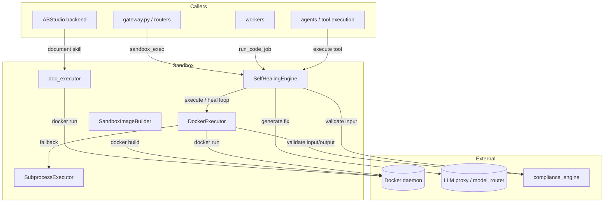
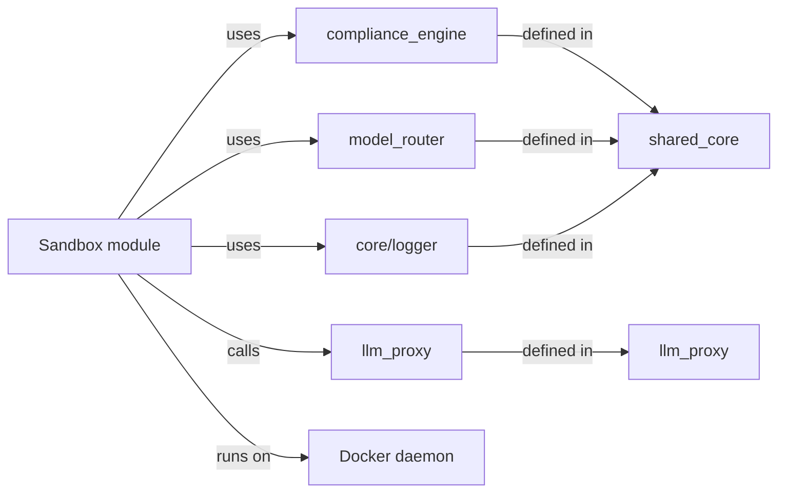

# Sandbox Module

## Introduction

The **Sandbox** module provides secure, isolated execution environments for AI-generated code, document skills, and autonomous repair workflows. It is a foundational safety layer in the AiNxt platform, ensuring that untrusted or dynamically generated artifacts—such as code snippets, document build scripts, and self-healing patches—run inside hardened containers with strict resource limits and no host access.

The module is designed around two core principles:

1. **Isolation by default**: every execution happens inside an ephemeral Docker container with disabled network access, capped CPU/memory, read-only root filesystem, and automatic cleanup.
2. **PCI compliance**: all inputs and outputs are scanned by the shared compliance engine for PII, secrets, and payment-sensitive data before and after execution.

The Sandbox module is consumed by higher-level systems such as the [gateway](gateway.md), [workers](workers.md), [agent system](shared_core.md), and [ABStudio backend](abstudio_backend.md). It does not expose user-facing APIs directly; instead, it offers reusable executor classes and helper functions that other modules call.

---

## Architecture Overview

### Execution Paths

| Path | Use Case | Isolation | Fallback |
|------|----------|-----------|----------|
| `SelfHealingEngine.execute_and_heal` | Autonomous code execution + repair | Docker | `DockerExecutor` → `SubprocessExecutor` |
| `DockerExecutor.execute` | General code execution by language | Docker | `SubprocessExecutor` (Python only) |
| `doc_executor.build` | Document skill rendering (docx/pptx/xlsx/pdf) | Docker (doc-sandbox image) | None |
| `SandboxImageBuilder.build` | Pre-build per-repo sandbox images | Docker build (network enabled) | None |

---

## Sub-modules

The Sandbox module is split into four focused sub-modules. Each is documented in its own file and linked below.

### [sandbox_docker_execution](sandbox_docker_execution.md)

Provides the primary code execution sandbox. `DockerExecutor` runs arbitrary code in ephemeral containers for 30+ supported languages, enforcing memory, CPU, network, and filesystem isolation. `SubprocessExecutor` is a production fallback for Python-only execution when Docker is unavailable. Both executors integrate with the shared [compliance engine](shared_core.md) for PCI input/output scanning.

**Key responsibilities:**
- Language-aware container execution
- Resource limits and security options
- Input/output redaction and blocking
- Fallback to subprocess execution

### [sandbox_document_execution](sandbox_document_execution.md)

Runs agent-authored document build scripts inside the `ainxt-doc-sandbox` image. Supports `docx`, `pptx`, `xlsx`, and `pdf` output formats, renders page-image previews, and can pre-generate AI images via the LLM proxy before the network-isolated build runs.

**Key responsibilities:**
- Document skill sandbox execution
- Format-specific build recipes
- Image generation and embedding
- Preview rasterization

### [sandbox_image_building](sandbox_image_building.md)

Builds per-repository Docker images during codebase indexing. Detects the project's build system (Maven, Gradle, npm, Go, Python, etc.), generates a Dockerfile with pre-downloaded dependencies, and applies NPCI-internal registry mirrors for air-gapped production deployments.

**Key responsibilities:**
- Build-system detection
- Dockerfile generation
- Internal registry configuration injection
- Image lifecycle management

### [sandbox_self_healing](sandbox_self_healing_engine.md)

Wraps `DockerExecutor` in an autonomous repair loop. When code fails to compile or run, the engine asks the [model router](shared_core.md) for a fix, strips markdown fences, and retries up to a configured maximum. Used by tool execution, workflow engine, and agent builder.

**Key responsibilities:**
- Execute-and-heal loop
- LLM-driven error repair
- PCI input validation
- Attempt tracking and final code capture

---

## Module Dependencies

The Sandbox module depends on the following other modules:

- **[shared_core](shared_core.md)** — provides `compliance_engine` (PCI/PII scanning), `model_router` (LLM routing), and `core.logger`.
- **[llm_proxy](llm_proxy.md)** — `doc_executor` calls `/llm/imagen` for AI-generated document images.
- **[gateway](gateway.md)** — exposes `sandbox_exec` via `routers/sandbox_router.py`.
- **[workers](workers.md)** — background workers such as `exec_worker.py` and `doc_worker.py` use sandbox executors.
- **[abstudio_backend](abstudio_backend.md)** — document skills and agent tooling invoke `doc_executor` and `docker_executor`.

---

## Security & Compliance

All sandbox entry points enforce the following controls:

1. **Input validation**: `compliance_engine.validate_input()` scans code and prompts for PII, secrets, and payment card data before execution. Blocked inputs are rejected with a compliance violation.
2. **Output redaction**: `compliance_engine.validate_output()` redacts sensitive data from execution output. Output is never blocked, only masked.
3. **Container isolation**: Docker runs use `--network none`, memory/CPU limits, `--read-only` root filesystems, and automatic container removal.
4. **No host filesystem access**: only a temporary bind-mounted work directory is exposed to the container.
5. **Audit logging**: compliance findings are written to a masked audit log (no raw secrets persisted).

---

## Configuration

Key environment variables used across the module:

| Variable | Default | Purpose |
|----------|---------|---------|
| `AINXT_DOC_SANDBOX_IMAGE` | `ainxt-doc-sandbox:latest` | Document sandbox image |
| `AINXT_DOC_BUILD_TIMEOUT_S` | `1800` | Document build timeout |
| `AINXT_DOC_PREVIEW_DPI` | `150` | Preview image DPI |
| `AINXT_DOC_PREVIEW_PAGES` | `20` | Max preview pages |
| `LLM_PROXY_URL` | `http://localhost:8003` | LLM proxy for image generation |
| `SANDBOX_DOCKER_REGISTRY` | — | Internal Docker registry mirror |
| `SANDBOX_MAVEN_REPO_URL` | Maven Central | Internal Maven mirror |
| `SANDBOX_NPM_REGISTRY_URL` | npmjs.org | Internal npm registry |
| `SANDBOX_GO_PROXY` | Go proxy | Internal Go proxy |
| `SANDBOX_PIP_INDEX_URL` | PyPI | Internal pip index |
| `COMPLIANCE_CONFIG` / `_CONFIG_PATH` | — | Compliance engine rules |

---

## How It Fits Into the System

The Sandbox module sits at the boundary between **orchestration** and **untrusted execution**. Higher-level modules decide *what* to run; the Sandbox module decides *how* to run it safely.

- The [gateway](gateway.md) receives `sandbox_exec` requests and forwards them to `SelfHealingEngine` or `DockerExecutor`.
- The [workers](workers.md) use the sandbox to run code jobs, document jobs, and security scans in the background.
- The [agent system](shared_core.md) uses `SelfHealingEngine` for autonomous tool execution and repair.
- [ABStudio](abstudio_backend.md) uses `doc_executor` to render document skills and `docker_executor` for tool execution.

By centralizing isolation, resource limits, and compliance scanning in one module, the platform ensures consistent security posture across all code and document execution paths.
