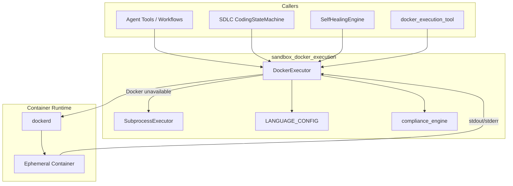
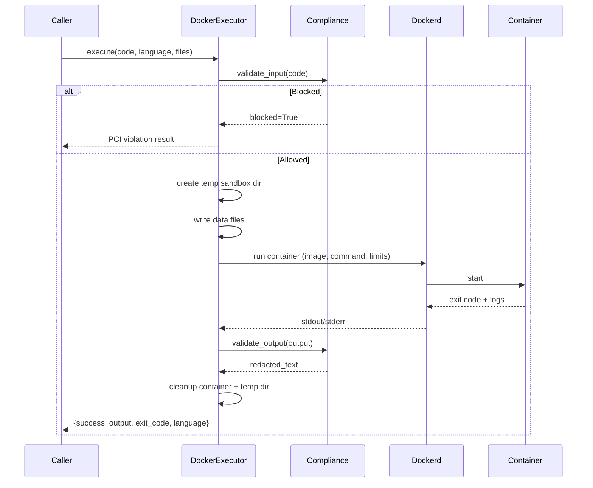
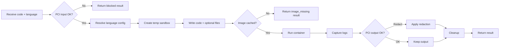

# Sandbox Docker Execution

The **sandbox_docker_execution** module provides a PCI-safe, isolated runtime for executing arbitrary code generated by AI agents. It is part of the broader [sandbox](sandbox.md) subsystem and is responsible for spinning up ephemeral Docker containers (or a subprocess fallback) to run untrusted code with strict resource, network, and filesystem constraints.

## Overview

This module lives in `sandbox/docker_executor.py` and exposes two primary executors:

- **`DockerExecutor`** — the default, full-featured sandbox that runs code inside ephemeral Docker containers.
- **`SubprocessExecutor`** — a production fallback used when the Docker daemon is unavailable; supports Python only.

Both executors are wrapped by a compliance engine that validates inputs and redacts outputs to help meet PCI/security requirements. The module is consumed by agent tooling, SDLC coding loops, and self-healing execution flows throughout the platform.

## Core Responsibilities

1. **Isolated code execution** — run AI-generated snippets in one-off containers with no host access, no network, and capped resources.
2. **Multi-language support** — supports 20+ languages via pre-defined Docker images and commands.
3. **PCI input/output validation** — block or redact sensitive data using the shared compliance_engine.
4. **Fallback execution** — degrade gracefully to a subprocess executor when Docker is unavailable.
5. **Image cache verification** — log which sandbox images are present at startup and warn operators about missing ones.

## Architecture



## Component Reference

### `DockerExecutor`

The main sandbox executor. It creates a temporary directory, writes the code file, runs a Docker container with the directory mounted to `/sandbox`, captures output, and cleans up both the container and the temp directory.

Key behaviors:

- **Lazy Docker client initialization** via `_get_client()`.
- **Image cache verification** via `verify_images()` at startup.
- **PCI input validation** before execution.
- **PCI output redaction** after execution.
- **Resource limits**: 512 MB RAM, 50% of one CPU core, no new privileges, no network by default.
- **Execution timeout**: 60 seconds.
- **Auto-removal** of containers after execution.
- **Optional data files** can be bound into `/sandbox` for data-analysis use cases.
- **Image override support** for repo-specific `ainxt-builder-*` images produced by [sandbox_image_building](sandbox_image_building.md).

### `SubprocessExecutor`

A fallback executor used when Docker is not available. It runs Python code via `python3` in a temporary directory with OS-level resource limits.

Key behaviors:

- Supports **Python only**.
- **30-second timeout**.
- **256 MB virtual memory**, **10 MB max file write**, **32 open file descriptors**.
- PCI input validation and output redaction.
- Always available; returned by `get_executor()` when Docker is unreachable.

### `LANGUAGE_CONFIG`

A dictionary mapping language identifiers to Docker image, command, and filename templates. It covers Python, shell, JavaScript/TypeScript, Java/Kotlin/Scala/Groovy, Go, Rust, C/C++, C#, Ruby, PHP, Swift, R, Elixir, Dart, Lua, Perl, and PowerShell. Aliases such as `py`, `js`, `ts`, `kt`, and `golang` are supported.

### `get_executor(language)`

Factory function that returns `DockerExecutor` when Docker is available, otherwise `SubprocessExecutor`.

## Data Flow



## Process Flow



## Dependencies

### Internal

| Dependency | Purpose |
|------------|---------|
| `core.logger` | Structured logging for execution lifecycle events. |
| `agents.compliance_engine` | PCI input validation and output redaction. |
| `sandbox.sandbox_image_builder` | Builds repo-specific images used via `image_override`. See [sandbox_image_building](sandbox_image_building.md). |
| `sandbox.self_healing_engine` | Wraps `DockerExecutor` in a retry/heal loop. See sandbox_self_healing. |
| `tools.docker_execution_tool` | Tool interface that forwards agent requests to the executor. See [docker_execution_tool](docker_execution_tool.md). |

### External

| Dependency | Purpose |
|------------|---------|
| `docker` (docker-py) | Python SDK for container lifecycle management. |
| `tempfile`, `uuid`, `shutil`, `subprocess` | Temp directory and fallback process management. |

## Integration with the System

The sandbox execution module sits at the boundary between AI-generated code and the host environment. It is used by:

- **Agent tools** — `docker_execution_tool` invokes the executor to run code produced during conversations.
- **SDLC coding agents** — `CodingStateMachine` runs syntax checks and tests inside repo-specific sandbox images.
- **Self-healing engine** — retries failing code by feeding errors back to an LLM and re-executing.
- **Workflow nodes** — workflow execution can call sandboxed tools as part of a node action.

For higher-level orchestration of these flows, see [agent_system](../agents/agent_system.md), [shared_core_sdlc_pipeline](../sdlc/shared_core_sdlc_pipeline.md), and [workflow_system](../workflows/workflow_system.md).

## Security Model

The module implements defense in depth for untrusted code:

| Layer | Control |
|-------|---------|
| Input | `compliance_engine.validate_input` blocks PCI-sensitive code. |
| Filesystem | Only a temp directory is mounted into the container; host paths are never exposed. |
| Network | Disabled by default (`network_disabled=True`). |
| Resources | Memory capped at 512 MB, CPU quota at 50% of one core. |
| Privilege | `no-new-privileges` prevents privilege escalation. |
| Lifecycle | Container is force-removed after execution. |
| Output | `compliance_engine.validate_output` redacts sensitive data. |
| Fallback | Subprocess fallback is Python-only and uses OS `resource` limits. |

## Configuration

| Constant | Default | Description |
|----------|---------|-------------|
| `EXECUTION_TIMEOUT` | 60s | Maximum wall-clock time for a container run. |
| `MEM_LIMIT` | 512m | Container memory limit. |
| `CPU_QUOTA` | 50,000 | CPU quota (50% of one core). |
| `SUBPROCESS_TIMEOUT` | 30s | Subprocess fallback timeout. |
| `DEFAULT_LANGUAGE` | python | Language used when none is specified. |

## Result Schema

Both executors return a dictionary with the following shape:

```python
{
    "success": bool,
    "output": str,      # combined stdout + stderr
    "exit_code": int,
    "language": str,
    "executor": str,    # "subprocess" when using SubprocessExecutor
    "image_missing": bool,  # optional, set by DockerExecutor
}
```

## Operational Notes

- **Image warming**: `REQUIRED_IMAGES` should be pre-pulled in production to avoid first-use latency. The module logs warnings for missing images at startup but does not block startup.
- **Offline environments**: If the registry is unreachable, the executor skips runs for missing images and returns `image_missing=True` rather than attempting a pull that will fail.
- **Data files**: The `files` parameter accepts a mapping of filenames to string or bytes content. Filenames are sanitized to basenames and restricted to alphanumeric, dot, dash, and underscore characters.
- **No host Docker in Docker**: The gateway and workers run under `pm2` on the host; only the code snippet runs inside a container.

## Related Documentation

- [sandbox](sandbox.md) — parent module overview.
- [sandbox_image_building](sandbox_image_building.md) — repo-specific sandbox image builder.
- sandbox_self_healing — automatic retry/heal wrapper.
- [sandbox_document_execution](sandbox_document_execution.md) — document generation executor.
- [docker_execution_tool](docker_execution_tool.md) — agent-facing tool interface.
- compliance_engine — PCI input/output validation.
- [shared_core_sdlc_pipeline](../sdlc/shared_core_sdlc_pipeline.md) — SDLC coding loop consumer.
