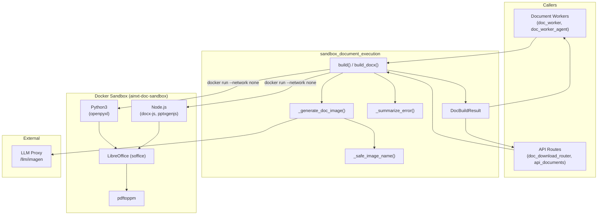
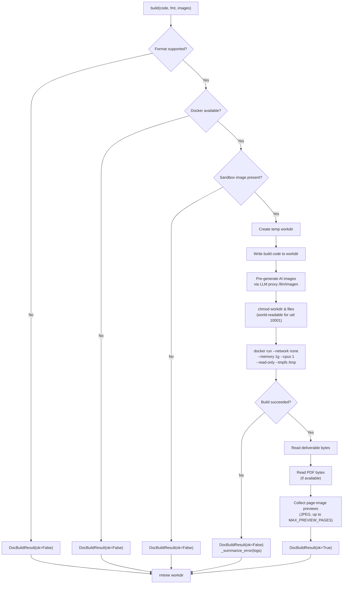
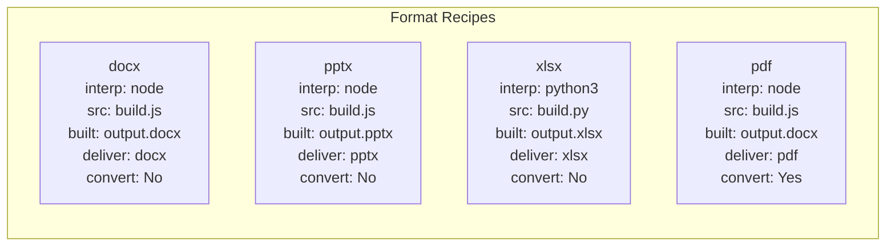
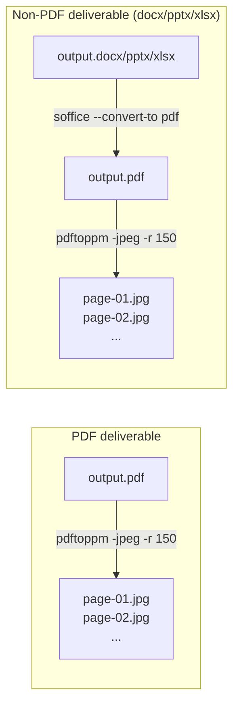
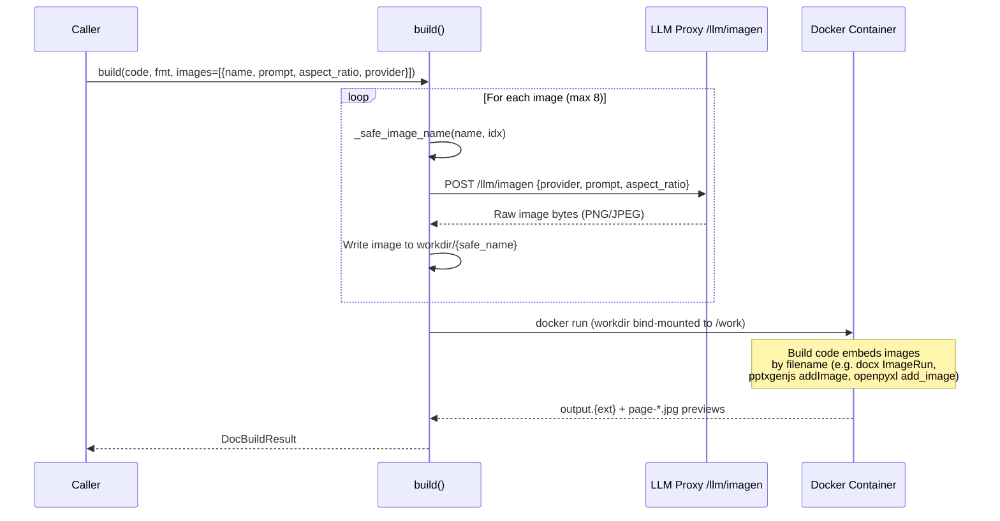
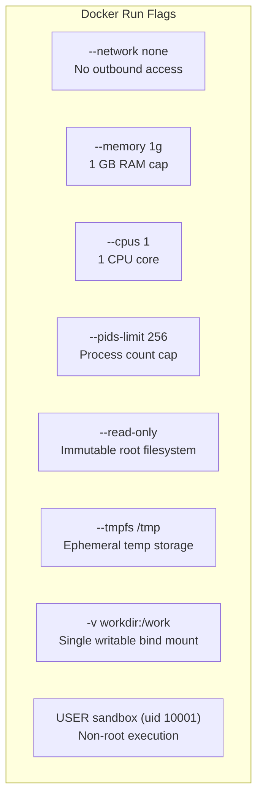
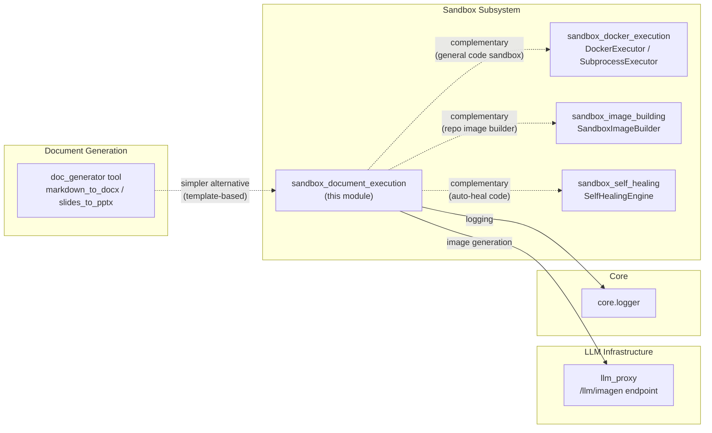
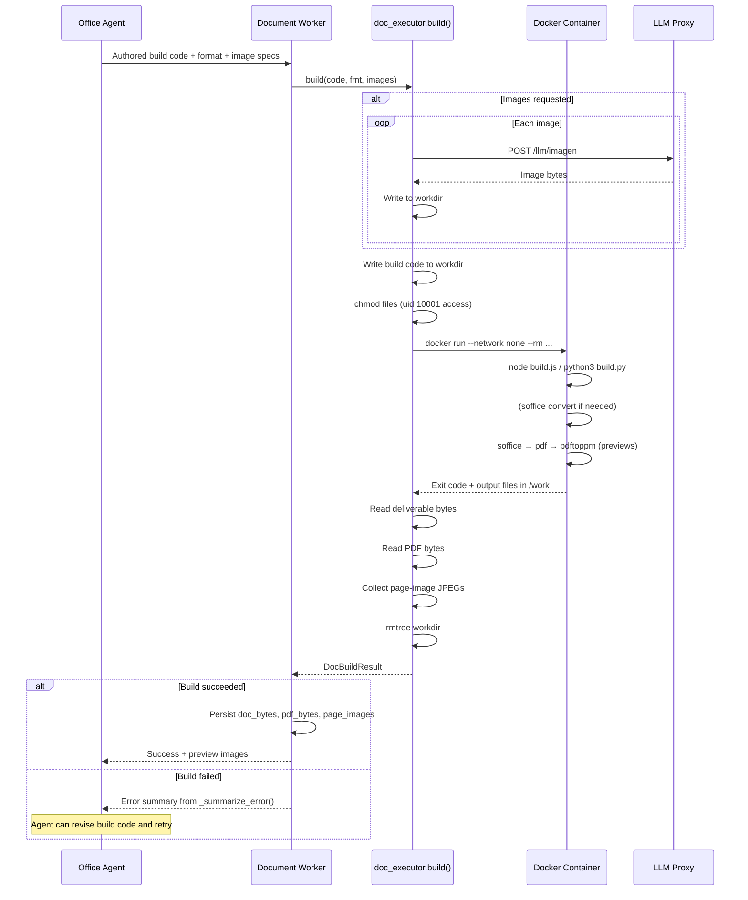

# Sandbox Document Execution

## Introduction

The **sandbox_document_execution** module provides a secure, isolated execution environment for rendering AI-authored document build code into downloadable office documents (DOCX, PPTX, XLSX, PDF). It is the document-specialised counterpart to the general-purpose code sandbox, running agent-generated build scripts inside a network-disabled, resource-capped Docker container (`ainxt-doc-sandbox`) and returning both the final document bytes and a rasterised page-image preview for in-app display.

The module lives within the broader [sandbox](#sandbox-subsystem) subsystem of the shared-core layer and is consumed by document-generation workers and API routes that serve office-document artifacts to end users.

---

## Architecture Overview



### Key Design Principles

| Principle | Implementation |
|---|---|
| **Network isolation** | Container launched with `--network none` — no outbound access during build |
| **Resource caps** | 1 GB memory, 1 CPU, 256 PID limit, 30-minute build timeout |
| **Read-only root FS** | `--read-only` with a single writable bind-mounted `/work` directory |
| **Non-root execution** | Container runs as `uid 10001` (USER sandbox) |
| **Image pre-generation** | AI images fetched *before* sandbox launch so the network-isolated container can embed them by filename |
| **Non-fatal image failures** | If an image generation fails, the document still builds without that image |
| **Byte-level return** | Returns artifact bytes (not container paths) so callers can persist/serve directly |

---

## Core Components

### `build(code, fmt, images)` — Primary Entry Point

The central function that orchestrates the entire document build lifecycle:

1. **Validates** the requested format against the supported set (`docx`, `pptx`, `xlsx`, `pdf`)
2. **Checks** Docker availability and sandbox image presence
3. **Pre-generates** any requested AI images via the LLM proxy's `/llm/imagen` endpoint
4. **Writes** the agent-authored build code to a temporary work directory
5. **Fixes permissions** on the work directory and files so the non-root sandbox user can access them
6. **Launches** the Docker container with the build script
7. **Collects** the deliverable file, an intermediate PDF, and page-image previews
8. **Cleans up** the temporary work directory



### `build_docx(code)` — Backward-Compatible Entry Point

A thin wrapper around `build(code, "docx")` retained for backward compatibility with the original docx-only implementation.

### `DocBuildResult` — Result Data Class

| Field | Type | Description |
|---|---|---|
| `ok` | `bool` | Whether the build succeeded |
| `error` | `str` | Human-readable error summary (empty on success) |
| `logs` | `str` | Truncated build logs (last 2000–4000 chars) |
| `doc_bytes` | `bytes` | The deliverable document file bytes |
| `ext` | `str` | File extension of the deliverable (`docx`, `pptx`, `xlsx`, `pdf`) |
| `pdf_bytes` | `bytes` | Intermediate PDF rendering (for preview/download) |
| `page_images` | `list[bytes]` | JPEG page-image previews in page order (up to 20 pages) |

### Helper Functions

| Function | Purpose |
|---|---|
| `_safe_image_name(name, idx)` | Sanitises agent-supplied image filenames — strips path traversal, enforces alphanumeric/`._-` characters, ensures image extension, caps at 64 chars |
| `_generate_doc_image(prompt, aspect_ratio, provider)` | Calls the LLM proxy's `/llm/imagen` endpoint to generate a single image; returns raw bytes |
| `_summarize_error(logs)` | Extracts the most useful error line from Node.js/Python/LibreOffice stderr for agent feedback |
| `docker_available()` | Checks if the Docker daemon is running |
| `image_present()` | Checks if the `ainxt-doc-sandbox` image is locally cached |
| `supported_formats()` | Returns the list of supported document formats |

---

## Format-Specific Build Recipes

Each format has a defined build recipe stored in the `_FORMATS` dictionary:



| Format | Interpreter | Build Source | Built File | Deliverable | Conversion |
|---|---|---|---|---|---|
| `docx` | Node.js | `build.js` | `output.docx` | `output.docx` | None |
| `pptx` | Node.js | `build.js` | `output.pptx` | `output.pptx` | None |
| `xlsx` | Python 3 | `build.py` | `output.xlsx` | `output.xlsx` | None |
| `pdf` | Node.js | `build.js` | `output.docx` | `output.pdf` | soffice docx→pdf |

The **PDF** format is notable: the agent authors a DOCX build script (using docx-js), and the sandbox then converts the resulting DOCX to PDF via LibreOffice headless mode. This leverages the rich DOCX authoring capabilities while delivering a PDF to the user.

---

## Preview Generation Pipeline

Page-image previews are generated inside the sandbox so users can see the rendered document in-app without downloading it:



- **Preview DPI**: 150 (configurable via `AINXT_DOC_PREVIEW_DPI`)
- **Max preview pages**: 20 (configurable via `AINXT_DOC_PREVIEW_PAGES`)
- Preview generation failures are non-fatal (`|| true`) — the document is still returned even if previews fail

---

## AI Image Embedding

The module supports embedding AI-generated images into documents. Because the sandbox is network-isolated, images must be generated *before* the container starts:



**Image generation constraints:**
- Maximum 8 images per document (`AINXT_DOC_MAX_IMAGES`)
- 120-second timeout per image (`AINXT_DOC_IMAGE_TIMEOUT_S`)
- Approved providers only: `gemini` or `openai` (Imagen / DALL-E)
- Default provider: `openai` (configurable via `AINXT_DOC_IMAGE_PROVIDER`)
- Image generation failures are non-fatal — the document builds without the failed image

---

## Configuration

All configuration is via environment variables:

| Variable | Default | Description |
|---|---|---|
| `AINXT_DOC_SANDBOX_IMAGE` | `ainxt-doc-sandbox:latest` | Docker image name for the document sandbox |
| `AINXT_DOC_BUILD_TIMEOUT_S` | `1800` (30 min) | Maximum build execution time |
| `AINXT_DOC_PREVIEW_DPI` | `150` | DPI for page-image preview rasterisation |
| `AINXT_DOC_PREVIEW_PAGES` | `20` | Maximum number of preview page images |
| `LLM_PROXY_URL` | `http://localhost:8003` | LLM proxy base URL for image generation |
| `AINXT_DOC_IMAGE_TIMEOUT_S` | `120` | Timeout for individual image generation |
| `AINXT_DOC_MAX_IMAGES` | `8` | Maximum AI-generated images per document |
| `AINXT_DOC_IMAGE_PROVIDER` | `openai` | Default image generation provider (`gemini` or `openai`) |

---

## Sandbox Container Security Model



The container script (`run_script`) executes in this order:
1. `set -e` — fail on any error
2. `cd /work` — switch to the writable bind mount
3. `export HOME=/tmp` — use tmpfs for HOME/profile
4. Run the interpreter (`node build.js` or `python3 build.py`)
5. Verify the built file exists (`test -f output.{ext}`)
6. If `convert=True`: run soffice to convert (e.g., docx→pdf)
7. Generate page-image previews (soffice→pdf→pdftoppm or direct pdftoppm)

---

## Dependencies & Related Modules



### Relationship to Other Sandbox Modules

| Module | Relationship |
|---|---|
| [sandbox_docker_execution](sandbox_docker_execution.md) | General-purpose code execution sandbox (`DockerExecutor`). The document executor is a **specialised** variant — it uses its own dedicated image (`ainxt-doc-sandbox`) with pre-installed Node.js, Python, LibreOffice, and pdftoppm, rather than the generic language images. The document executor calls `docker run` directly via subprocess rather than using the Docker SDK. |
| [sandbox_image_building](sandbox_image_building.md) | Builds per-repo Docker images for SDLC code execution. Not directly used by the document executor, but shares the same Docker-based isolation philosophy. |
| [sandbox_self_healing](sandbox_self_healing.md) | Automatically heals failing code via LLM re-generation. The document executor does **not** use self-healing — build failures are returned to the agent/caller for manual correction. |

### Relationship to Document Generation Tools

The [doc_generator](doc_generator.md) tool (`tools/doc_generator.py`) provides a simpler, template-based document generation path (`markdown_to_docx`, `slides_to_pptx`) that runs in-process using the `python-docx` and `python-pptx` libraries. The sandbox document executor is the more powerful alternative: it runs **agent-authored** build code that can produce arbitrarily complex documents with full formatting control, embedded AI-generated images, and multi-format output — at the cost of requiring Docker and the sandbox image.

---

## Data Flow: End-to-End Document Build



---

## Error Handling

The module provides graceful degradation at multiple levels:

| Failure Scenario | Behaviour |
|---|---|
| Unsupported format | Returns `DocBuildResult(ok=False)` with descriptive error |
| Docker not running | Returns `DocBuildResult(ok=False)` with "Docker is not running" |
| Sandbox image missing | Returns `DocBuildResult(ok=False)` with build instructions |
| Build timeout (30 min) | Returns `DocBuildResult(ok=False)` with timeout message |
| Build script failure | Returns `DocBuildResult(ok=False)` with `_summarize_error()` output — extracts the most relevant error line from logs |
| Image generation failure | Non-fatal — logged as warning, document builds without that image |
| Preview generation failure | Non-fatal — `|| true` in container script, document still returned |
| Permission issues | `chmod` applied proactively; failures logged as warnings but build continues |

The `_summarize_error()` function scans build logs in reverse for lines containing error keywords (`Error`, `error`, `Cannot`, `Traceback`, `Exception`, `throw`) and returns the first match (truncated to 300 chars), falling back to the last log line.

---

## Permission Handling

A critical operational detail: the host worker often runs under a restrictive umask (e.g., `0o077`), causing written files to be mode `0o600` (owner-only). The sandbox container runs as `uid 10001` (USER sandbox), which would get `EACCES` when trying to open these files. The module proactively fixes this:

```python
os.chmod(workdir, 0o777)       # Build can write output.* back
os.chmod(src_path, 0o644)      # Sandbox can read the build script
for p in image_paths:
    os.chmod(p, 0o644)          # Sandbox can read pre-generated images
```

Permission failures are logged as warnings but do not abort the build — the container may still succeed if the Docker daemon applies different default permissions.
