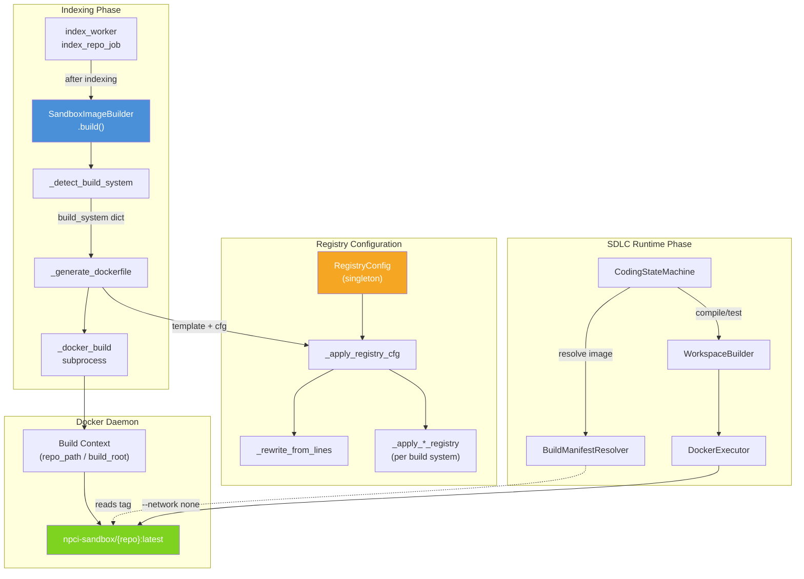
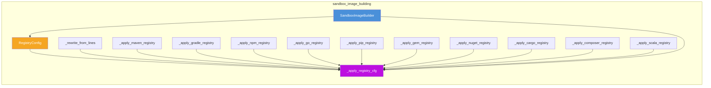
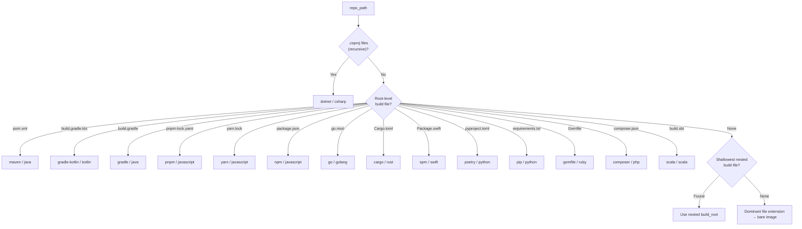
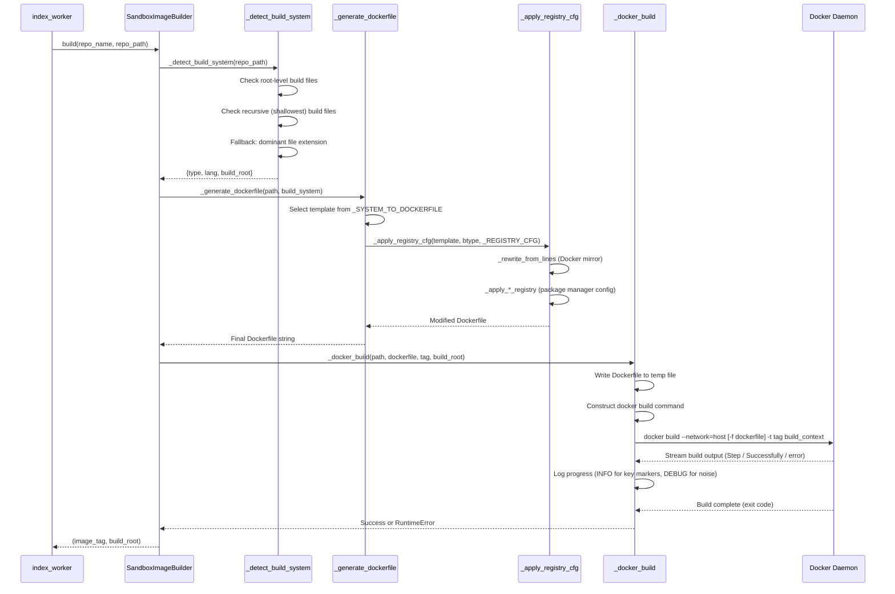
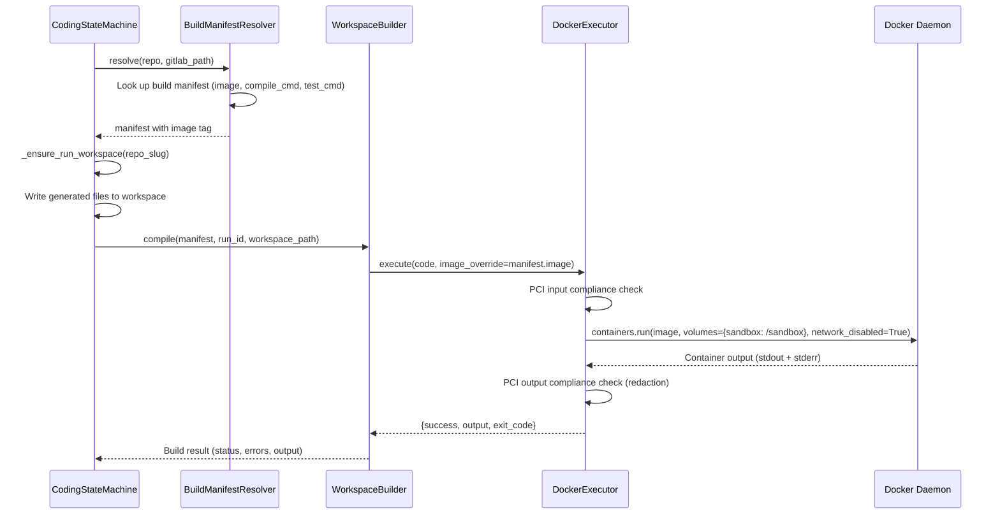

# Sandbox Image Building

## Overview

The **Sandbox Image Building** module is responsible for constructing per-repository Docker images that serve as isolated, dependency-pre-cached execution environments for the SDLC (Software Development Lifecycle) pipeline. Each image bundles a language toolchain (e.g., `javac`, `node`, `go`, `python`) along with all project dependencies pre-downloaded at **build time**, and an empty `/sandbox` directory that is volume-mounted with generated files at **runtime**.

The module lives within the broader `sandbox` subsystem alongside [sandbox_docker_execution](sandbox_docker_execution.md), [sandbox_self_healing](sandbox_self_healing.md), and [sandbox_document_execution](sandbox_document_execution.md). It is invoked during codebase indexing (by the `index_worker`) and the resulting images are consumed at SDLC runtime by the `CodingStateMachine` and `DockerExecutor`.

### Key Design Principles

| Principle | Implementation |
|---|---|
| **Network-enabled build, network-disabled runtime** | Docker build uses `--network=host` to download dependencies; runtime containers enforce `--network none` (PCI compliance) |
| **Additive registry injection** | Internal registry configuration is injected by writing config files / ENV vars / CLI flags — the project's own build files are never modified |
| **Fault-tolerant compilation** | Build steps use `\|\| true` so images build even if existing project source has errors — only the dependency layer is needed |
| **Air-gapped production support** | All registry endpoints are configurable via environment variables to target internal Nexus/Artifactory mirrors |

---

## Architecture



### Component Relationships



---

## Core Components

### `SandboxImageBuilder`

The primary class that orchestrates the entire image build lifecycle. It is instantiated as a module-level singleton (`sandbox_image_builder`).

**Key Methods:**

| Method | Purpose |
|---|---|
| `build(repo_name, repo_path, force_rebuild)` | Main entry point — detects build system, generates Dockerfile, invokes `docker build`. Returns `(image_tag, build_root)` |
| `get_image_tag(repo_name)` | Returns canonical tag: `npci-sandbox/{sanitized_name}:latest` |
| `image_exists(repo_name)` | Checks if image is locally cached via Docker SDK |
| `remove_image(repo_name)` | Removes image (called on re-index with `force_rebuild`) |
| `_detect_build_system(repo_path)` | Detects build system by checking for marker files (`pom.xml`, `package.json`, `go.mod`, etc.) |
| `_generate_dockerfile(repo_path, build_system)` | Selects the appropriate Dockerfile template and applies registry configuration |
| `_docker_build(...)` | Writes Dockerfile to temp file, runs `docker build` via subprocess with real-time log streaming |

**Build System Detection Order:**



### `RegistryConfig`

A configuration holder that reads all registry endpoint settings from environment variables at module import time. It is instantiated as a module-level singleton (`_REGISTRY_CFG`).

**Environment Variables:**

| Variable | Purpose | Default |
|---|---|---|
| `SANDBOX_DOCKER_REGISTRY` | Docker image pull-through cache (rewrites all `FROM` lines) | *(empty — no rewrite)* |
| `SANDBOX_MAVEN_REPO_URL` | Maven mirror (`<mirrorOf>*</mirrorOf>`) | `https://repo1.maven.org/maven2/` |
| `SANDBOX_NPM_REGISTRY_URL` | npm/yarn/pnpm registry | `https://registry.npmjs.org/` |
| `SANDBOX_GO_PROXY` | GOPROXY value | `https://proxy.golang.org,direct` |
| `SANDBOX_PIP_INDEX_URL` | pip index URL | `https://pypi.org/simple/` |
| `SANDBOX_GEM_SOURCE_URL` | RubyGems source | `https://rubygems.org` |
| `SANDBOX_NUGET_SOURCE_URL` | NuGet feed | `https://api.nuget.org/v3/index.json` |
| `SANDBOX_CARGO_REGISTRY_URL` | Cargo (Rust) registry *(optional)* | *(empty)* |
| `SANDBOX_COMPOSER_REPO_URL` | Composer/Packagist mirror *(optional)* | *(empty)* |
| `SANDBOX_MAVEN_REPO_USER` | Maven repo username | `ubuntufocal2004` |
| `SANDBOX_MAVEN_REPO_PWD` | Maven repo password | *(empty)* |

The `is_public(key)` method returns `True` when a setting still holds its public-internet default, allowing the `_apply_*` functions to short-circuit when no internal mirror is configured.

### Registry Injection Functions

Each `_apply_*_registry` function modifies a Dockerfile string to redirect package manager traffic through an internal mirror. All modifications are **additive** — they write configuration files, inject `ENV` variables, or add CLI flags without touching the project's own build files.

| Function | Build System | Injection Strategy |
|---|---|---|
| `_apply_maven_registry` | Maven | Base64-encodes a `settings.xml` with `<mirrorOf>*</mirrorOf>`, writes it to `/root/maven-settings.xml`, adds `-s` flag to every `mvn` command |
| `_apply_gradle_registry` | Gradle (Java & Kotlin) | Writes an init script to `/root/.gradle/init.d/npci-repos.gradle` that redirects all repositories globally |
| `_apply_npm_registry` | npm/yarn/pnpm | Writes `/root/.npmrc` with `registry=` line (honoured by all three package managers) |
| `_apply_go_registry` | Go | Sets `ENV GOPROXY`, `ENV GONOSUMCHECK=*`, `ENV GOFLAGS=-mod=mod` after the `FROM` line |
| `_apply_pip_registry` | pip/poetry | Writes `/root/.pip/pip.conf` with `index-url` and `trusted-host` |
| `_apply_gem_registry` | Ruby (Gemfile) | Writes `/root/.gemrc` replacing the default RubyGems source |
| `_apply_nuget_registry` | .NET | Adds `--source` flag to every `dotnet restore` command |
| `_apply_cargo_registry` | Rust | Writes `/root/.cargo/config.toml` replacing crates.io |
| `_apply_composer_registry` | PHP | Adds `composer config repositories.npci` before `composer install` |
| `_apply_scala_registry` | Scala | Adds `--repository` flag to `scala-cli compile` commands |

The orchestrator function `_apply_registry_cfg(dockerfile, btype, cfg)` performs two steps:
1. **Always**: rewrites all `FROM` lines via `_rewrite_from_lines` to use the Docker registry mirror
2. **Per build system**: dispatches to the appropriate `_apply_*` function based on the detected build type

### Dockerfile Templates

The module maintains a dictionary (`_SYSTEM_TO_DOCKERFILE`) mapping build system types to Dockerfile templates. Each template follows the same pattern:

```dockerfile
FROM <base_image>           # Language toolchain
WORKDIR /workspace
COPY <build_file> .          # Manifest only (fast layer cache)
RUN <install_deps> || true   # Download all dependencies (network enabled)
COPY <source> ./<source>     # Project source
RUN <compile> || true        # Compile (tolerates source errors)
RUN mkdir -p /sandbox        # Empty mount point for runtime
```

For JavaScript ecosystems (npm/yarn/pnpm), templates also include `check_jsx.js` and `check_vue.js` syntax validation scripts written to `/usr/local/bin/`.

When no build system is detected, a **bare image** template is used that only creates `/sandbox`:

```dockerfile
FROM {base_image}
RUN mkdir -p /sandbox
```

The `_LANG_BASE_IMAGES` dictionary maps language names to their base Docker images (e.g., `"python" → "python:3.11-slim"`, `"java" → "eclipse-temurin:21-jdk-alpine"`).

---

## Data Flow

### Build-Time Flow (Indexing)



### Runtime Flow (SDLC Execution)



> **Note:** The `CodingStateMachine` uses `BuildManifestResolver` (not `SandboxImageBuilder` directly) to resolve the image tag at runtime. The `SandboxImageBuilder` is responsible only for the build-time image creation. See [sandbox_docker_execution](sandbox_docker_execution.md) for details on the `DockerExecutor` runtime path.

---

## Integration Points

### Upstream: Codebase Indexing

The `SandboxImageBuilder.build()` method is called by the `index_worker` after a repository has been indexed into pgvector. The worker extracts build metadata and triggers image construction so that the image is ready before the first SDLC run.

```
index_repo_job → _do_index() → SandboxImageBuilder.build() → store tag in repo_index_status
```

### Downstream: SDLC Pipeline

The built images are consumed by:

| Consumer | Usage |
|---|---|
| `CodingStateMachine._build_check()` | Compiles generated implementation files using `WorkspaceBuilder` with the resolved builder image |
| `CodingStateMachine._execute_tests()` | Runs unit tests inside the builder image |
| `DockerExecutor.execute()` | Executes arbitrary code snippets in ephemeral containers (with `image_override` for per-repo images) |
| `SelfHealingEngine` | Uses the sandbox image for syntax validation and auto-fix loops |

### Sibling Modules

- **[sandbox_docker_execution](sandbox_docker_execution.md)**: `DockerExecutor` and `SubprocessExecutor` — runtime execution of code inside the images built by this module
- **[sandbox_self_healing](sandbox_self_healing.md)**: `SelfHealingEngine` — automated code repair using sandbox images for validation
- **[sandbox_document_execution](sandbox_document_execution.md)**: `build_docx` — document generation in sandboxed environments

---

## Build Process Details

### Docker Build Execution

The `_docker_build` method uses **subprocess** (not the Docker SDK) to avoid SDK timeout issues during long Maven/npm/Gradle builds. Key characteristics:

- **Build timeout**: 1200 seconds (20 minutes) — Maven cold starts can be slow
- **Network mode**: `--network=host` (dependencies must be downloadable)
- **Cache control**: `force_rebuild=True` adds `--no-cache`; `False` reuses Docker layer cache
- **Build context**: Uses `build_root` subdirectory within `repo_path` as the Docker build context (supports monorepo/nested projects)
- **Log streaming**: A daemon thread reads stdout line-by-line; key markers (`Step `, `Successfully`, `error`, `failed`) are logged at INFO level, everything else at DEBUG

### Image Tag Sanitization

The `_tag_safe(name)` function converts repository names to valid Docker image tag components:
- Lowercased
- Non-alphanumeric characters (except hyphens) replaced with hyphens
- Consecutive hyphens collapsed
- Leading/trailing hyphens stripped
- Falls back to `"repo"` if result is empty

### Monorepo / Nested Project Support

When a build file is not found at the repository root, the detection logic searches recursively and selects the **shallowest** match. The `build_root` (relative path from `repo_path` to the build file's directory) is returned and used as the Docker build context, ensuring `COPY` commands in Dockerfile templates work unchanged.

---

## Configuration Reference

### Environment Variables (Complete List)

```bash
# Docker registry mirror (rewrites all FROM lines)
SANDBOX_DOCKER_REGISTRY=your-registry.example.com

# Package manager mirrors
SANDBOX_MAVEN_REPO_URL=https://your-registry.example.com/repository/maven-public/
SANDBOX_NPM_REGISTRY_URL=https://your-registry.example.com/repository/npm-group/
SANDBOX_GO_PROXY=https://your-registry.example.com/repository/go-proxy/,direct
SANDBOX_PIP_INDEX_URL=https://your-registry.example.com/repository/pypi/simple/
SANDBOX_GEM_SOURCE_URL=https://your-registry.example.com/repository/rubygems/
SANDBOX_NUGET_SOURCE_URL=https://your-registry.example.com/repository/nuget/index.json
SANDBOX_CARGO_REGISTRY_URL=https://your-registry.example.com/repository/cargo/
SANDBOX_COMPOSER_REPO_URL=https://your-registry.example.com/repository/packagist/

# Maven authentication
SANDBOX_MAVEN_REPO_USER=ubuntufocal2004
SANDBOX_MAVEN_REPO_PWD=<password>
```

### Supported Build Systems

| Build System | Detection File | Base Image | Languages |
|---|---|---|---|
| Maven | `pom.xml` | `maven:3-eclipse-temurin-21` | Java |
| Gradle (Java) | `build.gradle` | `eclipse-temurin:21-jdk-alpine` | Java |
| Gradle (Kotlin) | `build.gradle.kts` | `eclipse-temurin:21-jdk-alpine` | Kotlin |
| npm | `package.json` | `node:20-alpine` | JavaScript |
| yarn | `yarn.lock` | `node:20-alpine` | JavaScript |
| pnpm | `pnpm-lock.yaml` | `node:20-alpine` | JavaScript |
| Go | `go.mod` | `golang:1.21-alpine` | Go |
| pip | `requirements.txt` | `python:3.11-slim` | Python |
| Poetry | `pyproject.toml` | `python:3.11-slim` | Python |
| Cargo | `Cargo.toml` | `rust:1.77-alpine` | Rust |
| Gemfile | `Gemfile` | `ruby:3.3-alpine` | Ruby |
| Composer | `composer.json` | `php:8.3-cli-alpine` | PHP |
| .NET | `*.csproj` (recursive) | `mcr.microsoft.com/dotnet/sdk:8.0-alpine` | C# |
| Scala | `build.sbt` | `virtuslab/scala-cli:latest` | Scala |
| Swift PM | `Package.swift` | `swift:5.10` | Swift |
| Bare | *(none detected)* | Language-specific base | All |

---

## Security Considerations

1. **Network isolation**: Images are built with network access (`--network=host`) but runtime containers enforce `--network none` — no outbound network calls are possible during code execution
2. **PCI compliance**: The `DockerExecutor` performs input/output compliance checks via `compliance_engine` before and after execution
3. **Resource limits**: Runtime containers are constrained to 512 MB RAM and 50% CPU
4. **No credential leakage**: Registry credentials are injected only into the build-time Dockerfile (as base64-encoded config files), never persisted in the image's environment
5. **Read-only filesystem**: Runtime containers use `security_opt=["no-new-privileges"]` with `/sandbox` as the only writable mount
