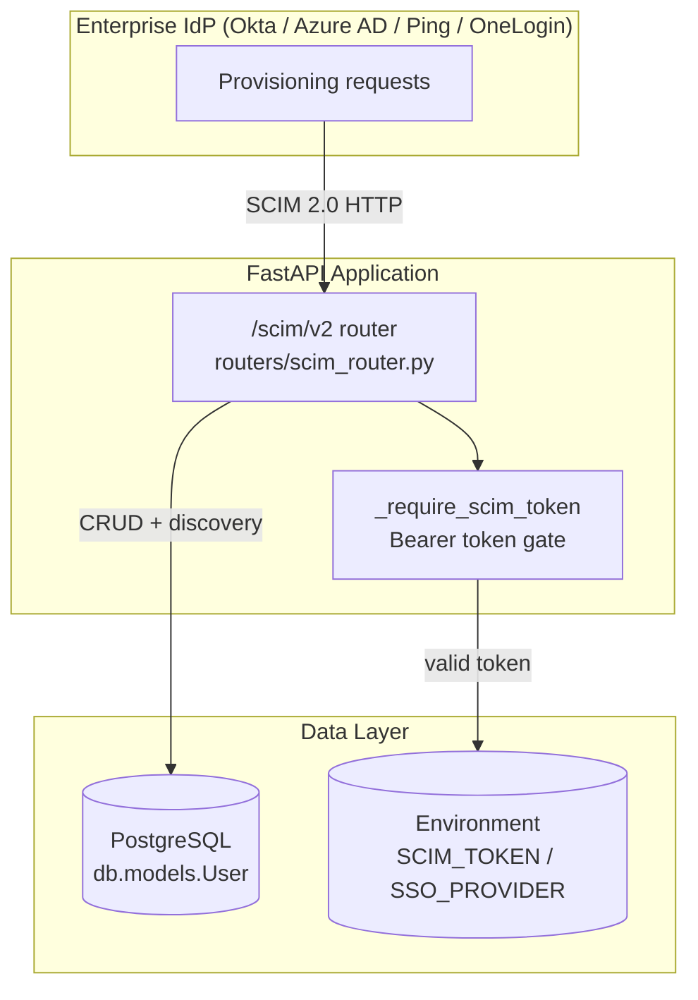
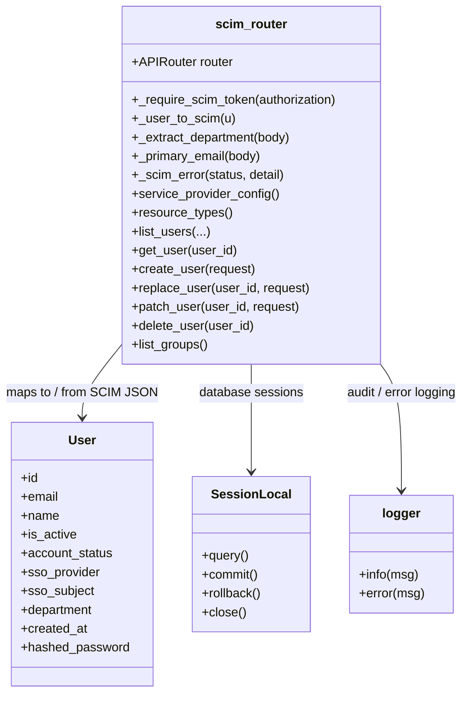
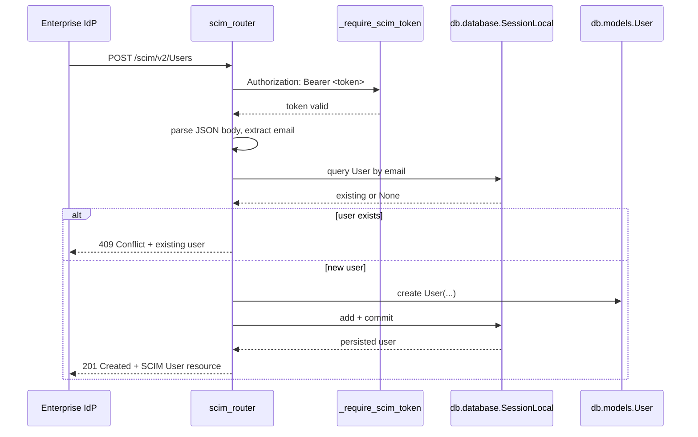
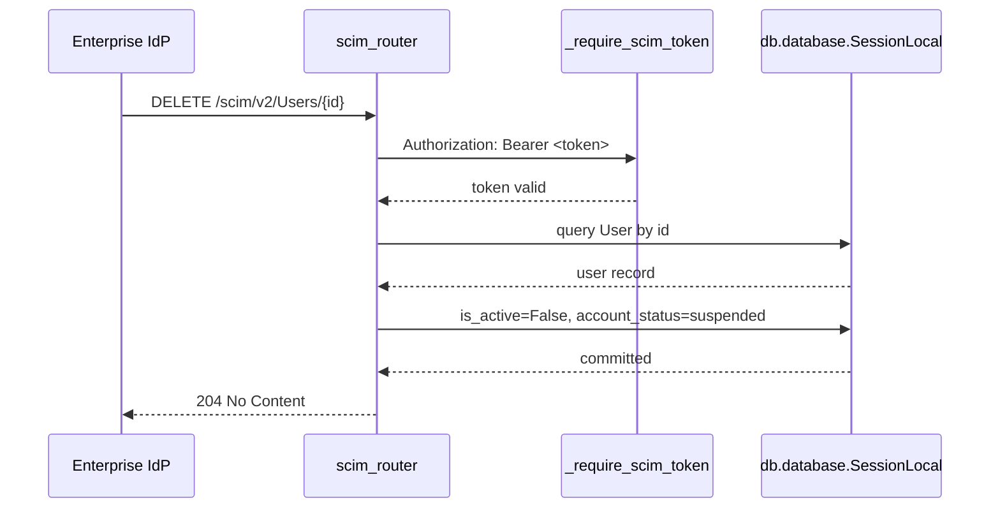
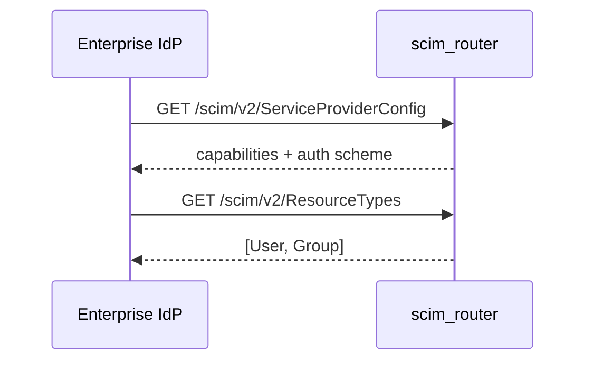
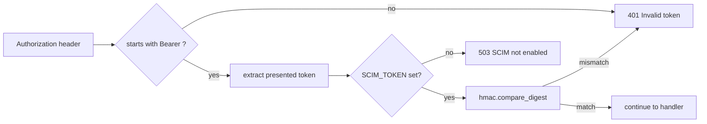
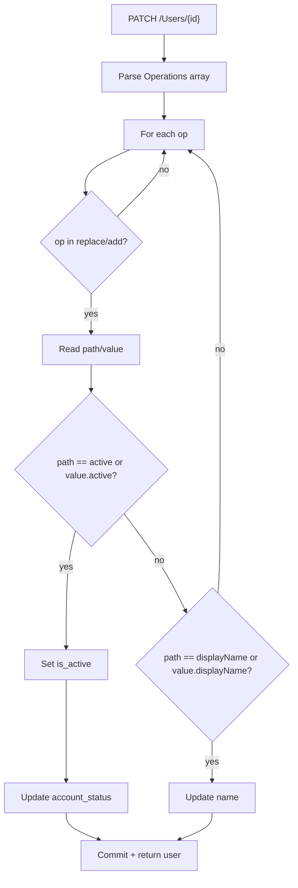
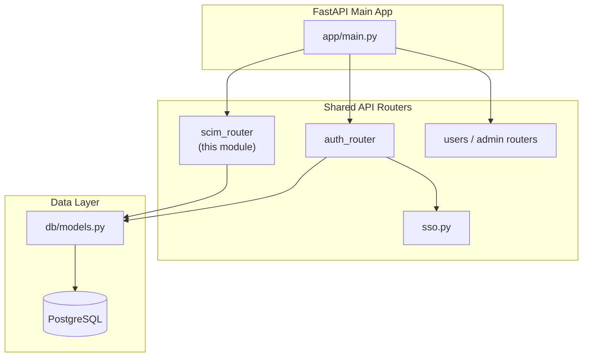

# SCIM Router

## Brief Introduction

The `scim_router` module exposes a **SCIM 2.0** (System for Cross-domain Identity Management) provisioning surface at `/scim/v2`. It allows enterprise Identity Providers (IdPs) such as Okta, Azure AD, Ping, or OneLogin to automatically provision, update, and de-provision users in the AiNxt / Claude Cowork platform.

SCIM users are SSO-provisioned: they have no local password and authenticate through the configured SSO provider. The router supports full CRUD on `User` resources and read-only discovery of `Group` resources derived from the `department` column on the `User` table.

---

## Core Functionality

### Supported SCIM Endpoints

| Method | Path | Handler | Purpose |
|--------|------|---------|---------|
| GET | `/scim/v2/ServiceProviderConfig` | `service_provider_config` | SCIM discovery: capabilities, auth scheme |
| GET | `/scim/v2/ResourceTypes` | `resource_types` | Lists supported resource types (`User`, `Group`) |
| GET | `/scim/v2/Users` | `list_users` | List users with pagination and basic `userName eq` filter |
| GET | `/scim/v2/Users/{user_id}` | `get_user` | Retrieve a single user |
| POST | `/scim/v2/Users` | `create_user` | Provision a new user |
| PUT | `/scim/v2/Users/{user_id}` | `replace_user` | Full replacement of a user record |
| PATCH | `/scim/v2/Users/{user_id}` | `patch_user` | Partial update, commonly used for activate/deactivate |
| DELETE | `/scim/v2/Users/{user_id}` | `delete_user` | Soft-deactivate a user (de-provision) |
| GET | `/scim/v2/Groups` | `list_groups` | Read-only groups derived from `User.department` |

### Security Model

- **Bearer token authentication** using a dedicated `SCIM_TOKEN` environment variable.
- If `SCIM_TOKEN` is unset, the entire surface returns **503 Service Unavailable**.
- Token comparison uses `hmac.compare_digest` to prevent timing attacks.
- The token is **never logged**.
- This is an automation/admin surface and does **not** use the user JWT path. For user-facing authentication and SSO flows, see [auth_router](auth_router.md).

### User Lifecycle Behavior

- **Create**: Inserts a `User` row with `hashed_password=None`, `sso_provider` from `SSO_PROVIDER` env (default `"scim"`), and `sso_subject` from `externalId` or email.
- **Duplicate email**: Returns **409 Conflict** with the existing user resource. If the existing user is inactive, it is reactivated.
- **Replace (PUT)**: Updates email, name, active status, and department.
- **Patch (PATCH)**: Supports `replace`/`add` operations for `active`, `displayName`, and object-style `value` blocks.
- **Delete**: Performs a **soft deactivation** (`is_active=False`, `account_status="suspended"`) for audit and data-retention compliance.

### Group Model

Groups are read-only and derived from distinct non-null `User.department` values. Membership is inferred from `User.department`; the endpoint does not expand individual members.

---

## Architecture



### Component Relationships



---

## Data Flow

### Provisioning a New User



### De-provisioning a User



### Discovery Flow



---

## Process Flows

### Authentication Gate



### PATCH User Activation / Deactivation



---

## Integration with the Overall System

The `scim_router` sits alongside the other shared API routers and is mounted into the main FastAPI application. It is intentionally isolated from the user-facing JWT authentication flow and uses its own environment-based bearer token.



### Related Modules

- **[auth_router](auth_router.md)**: Handles user login, registration, SSO callbacks, JWT sessions, and refresh tokens. SCIM-provisioned users authenticate through the SSO path configured there.
- **[db/models.py](db_models.md)** (referenced as `db.models.User`): Defines the `User` table schema that SCIM maps to and from.
- **[db/database.py](db_database.md)**: Provides `SessionLocal` used for transactional database access.
- **[core/logger.py](core_logger.md)**: Structured logging used for provisioning and de-provisioning audit events.
- **[sso.py](sso.md)** (in `auth/`): Implements the actual SSO provider integration for SCIM-provisioned users.

---

## Configuration

| Environment Variable | Purpose | Required |
|----------------------|---------|----------|
| `SCIM_TOKEN` | Shared bearer secret for IdP authentication | Yes (surface disabled if unset) |
| `SSO_PROVIDER` | Default SSO provider name for newly provisioned users | No (defaults to `"scim"`) |

---

## Error Handling

All errors are returned as SCIM-compliant JSON with the `urn:ietf:params:scim:api:messages:2.0:Error` schema:

```json
{
  "schemas": ["urn:ietf:params:scim:api:messages:2.0:Error"],
  "detail": "User not found",
  "status": "404"
}
```

Common status codes:

| Status | Meaning |
|--------|---------|
| 201 | User created |
| 204 | User de-provisioned |
| 401 | Invalid SCIM bearer token |
| 404 | User not found |
| 409 | User already exists (returns resource) |
| 503 | SCIM provisioning not enabled |

---

## Notes for Maintainers

- The router uses ad-hoc `SessionLocal()` imports inside handlers to avoid circular imports at module load time.
- Group membership is not expanded; IdPs should treat groups as informational department buckets.
- Filter support is intentionally minimal (`userName eq "value"`). Extend `_primary_email` / filter parsing if broader SCIM filter support is required.
- Deletion is always a soft deactivation. Hard deletion of financial-platform user records is intentionally not supported through this surface.
