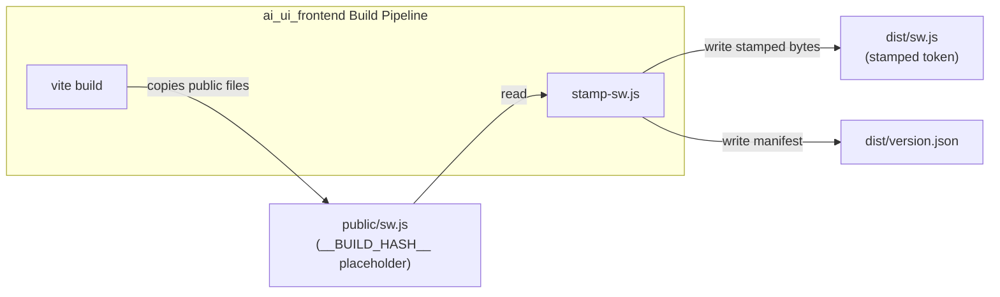
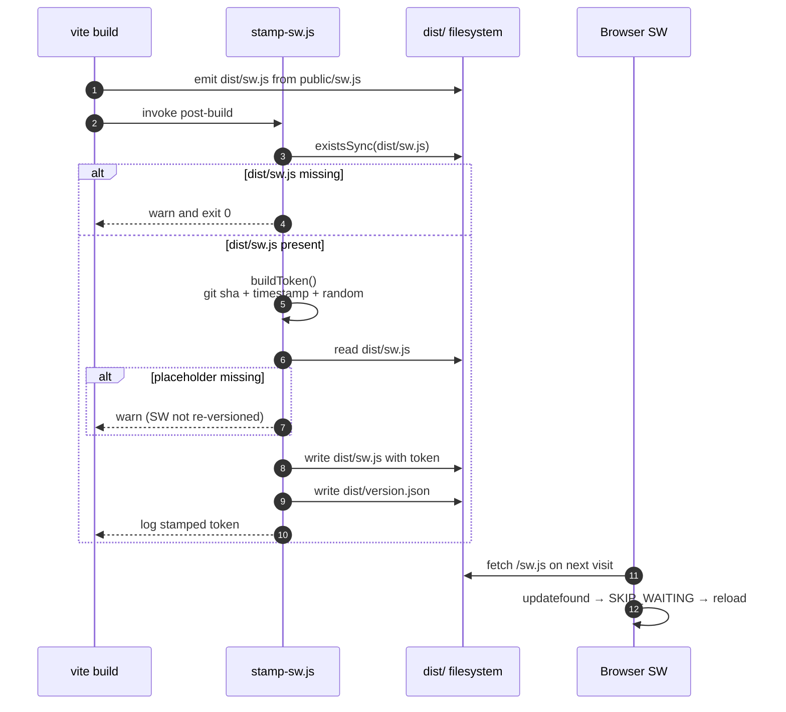
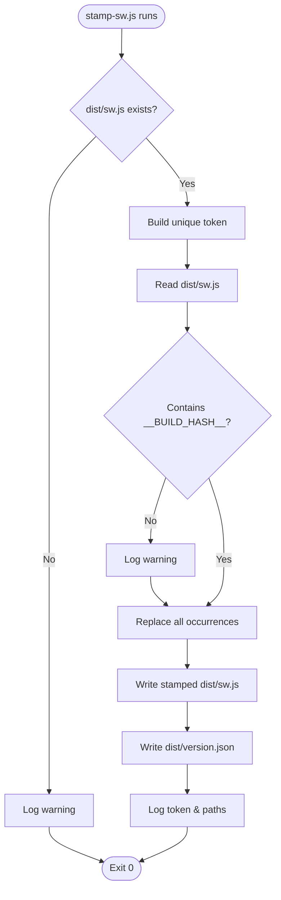

# scripts Module

## Brief Introduction

The `scripts` module is a tiny but critical post-build utility for the `ai_ui_frontend` application. It lives at `ai-ui/scripts/stamp-sw.js` and is responsible for busting the browser's service-worker cache after every production build.

Because Vite copies files from `public/` verbatim (without content hashing), the generated `dist/sw.js` would otherwise be byte-identical across deploys. Browsers detect service-worker updates by comparing the script bytes, so an unchanged `sw.js` means users keep running the old cached UI. This script solves that by replacing a `__BUILD_HASH__` placeholder with a unique per-build token and emitting a `dist/version.json` manifest for diagnostics.

The module is intentionally safe: if `dist/sw.js` is missing or the placeholder is absent, it logs a warning and exits successfully so it can never break a build pipeline.

---

## Core Components

| Component | File | Responsibility |
|---|---|---|
| `main` | `ai-ui/scripts/stamp-sw.js` | Entry point that stamps `dist/sw.js`, writes `dist/version.json`, and handles missing artifacts gracefully. |
| `buildToken` | `ai-ui/scripts/stamp-sw.js` | Generates a unique build token from git short SHA, base-36 timestamp, and random suffix. |

---

## Architecture

The module is a standalone Node.js script invoked after `vite build`. It has no runtime dependencies on the rest of the application; it only reads from and writes to the build output directory.



### Relationship to the System

- **Triggered by**: the `ai_ui_frontend` build process (typically via a `postbuild` npm script or CI step). See [ai_ui_frontend.md](ai_ui_frontend.md) for the broader frontend architecture.
- **Consumes**: the unhashed `dist/sw.js` produced by Vite.
- **Produces**: a uniquely versioned `dist/sw.js` and a `dist/version.json` diagnostic manifest.
- **Consumed by**: the browser's service-worker lifecycle and, optionally, the running `ai_ui_frontend` app for version polling.

---

## Data Flow



---

## Process Flow



---

## Token Generation

The build token is constructed to be unique per build while remaining human-readable:

```
<git-short-sha>-<base36-timestamp>-<random>
```

- **Git short SHA**: ties the build to a specific commit (falls back gracefully if git is unavailable).
- **Base-36 timestamp**: `Date.now().toString(36)` — millisecond precision.
- **Random suffix**: 6-character base-36 random value to avoid collisions in rapid rebuilds.

This token is injected into `dist/sw.js` by replacing every occurrence of `__BUILD_HASH__`, and is also stored in `dist/version.json` under the `version` key with an ISO `builtAt` timestamp.

---

## Error Handling & Safety

| Scenario | Behavior |
|---|---|
| `dist/sw.js` does not exist | Logs a warning and exits `0` — build is not broken. |
| `__BUILD_HASH__` placeholder is missing | Logs a warning, still writes the file unchanged, and exits `0`. |
| Git is unavailable or not a checkout | Token falls back to timestamp + random. |
| Multiple placeholders in `sw.js` | Replaces **all** occurrences to be safe. |

---

## Integration Example

The script is typically wired into the `ai_ui_frontend` package as a post-build step:

```json
{
  "scripts": {
    "build": "vite build",
    "postbuild": "node scripts/stamp-sw.js"
  }
}
```

For CI/CD pipelines, the same command can be invoked explicitly after `vite build` completes.

---

## References

- [ai_ui_frontend.md](ai_ui_frontend.md) — the parent frontend application that owns the build pipeline and service worker.
- [abstudio_frontend.md](abstudio_frontend.md) — the sibling frontend application (ABStudio) which uses a different build flow and does not share this stamper.

---

## Maintenance Notes

- Keep `__BUILD_HASH__` in sync between `public/sw.js` and this script's `PLACEHOLDER` constant.
- If the build output directory changes from `dist/`, update `distDir` in `stamp-sw.js`.
- The `version.json` file is optional for runtime use; the service-worker update mechanism relies solely on the changed bytes of `sw.js`.
