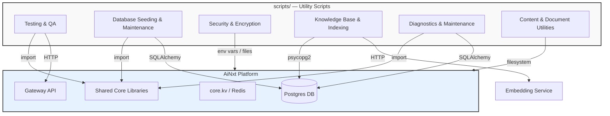
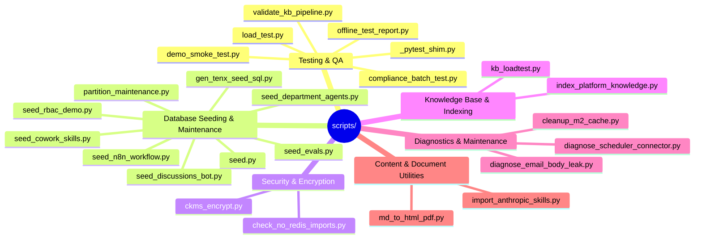

# scripts_utilities Module

## Overview

The `scripts_utilities` module is a collection of standalone command-line scripts and small utilities that support the development, deployment, operation, and maintenance of the AiNxt platform. These scripts are not part of the running application services; instead, they are executed on-demand by developers, operators, and CI/CD pipelines to perform tasks such as database seeding, security checks, diagnostics, load testing, offline test reporting, and content conversion.

The module is located under the `scripts/` directory at the repository root. Each script is typically self-contained, runnable with `python scripts/<name>.py`, and documents its own usage in the module docstring. The scripts interact with the rest of the system primarily through:

- Direct database access via `db.database` and SQLAlchemy models.
- HTTP calls to the gateway or microservices (e.g., embedding service, compliance API).
- File-system operations and environment variables.
- Shared core utilities such as `core.logger`, `core.structure_scorer`, and `services.cowork_roles`.

Because the scripts are independent, they can be grouped by purpose rather than by runtime dependency. The module is intentionally lightweight: it contains no long-running services, no event loops, and no shared runtime state beyond what is imported from the platform's core libraries.

## Architecture



### Design Principles

1. **Self-contained execution**: Each script can be run directly from the repository root with minimal setup, usually just a populated `.env` file.
2. **Idempotency where applicable**: Seeding and maintenance scripts use `INSERT ... ON CONFLICT` or upsert patterns so they can be re-run safely.
3. **Honest reporting**: Test and diagnostic scripts avoid false positives; limitations are reported explicitly (e.g., "blocked" tests in the offline runner).
4. **No production hot-path coupling**: Scripts are not imported by the gateway, workers, or routers at runtime. They may import shared core modules, but services do not depend on `scripts/`.

## Sub-modules

The module is organized into the following sub-modules. Detailed documentation for each is linked below.

| Sub-module | Purpose | Key Scripts |
|------------|---------|-------------|
| [scripts_utilities_testing_qa](scripts_utilities_testing_qa.md) | Offline test execution, compliance batch testing, load testing, and pipeline validation. | `_pytest_shim.py`, `offline_test_report.py`, `compliance_batch_test.py`, `validate_kb_pipeline.py`, `demo_smoke_test.py`, `load_test.py` |
| [scripts_utilities_database_seeding](scripts_utilities_database_seeding.md) | Bootstrap users, agents, skills, products, RBAC data, n8n workflows, and PostgreSQL partition maintenance. | `seed.py`, `seed_department_agents.py`, `seed_cowork_skills.py`, `seed_discussions_bot.py`, `seed_evals.py`, `seed_n8n_workflow.py`, `seed_rbac_demo.py`, `gen_tenx_seed_sql.py`, `partition_maintenance.py` |
| [scripts_utilities_security](scripts_utilities_security.md) | CKMS encryption helpers and lint guards for secure coding practices. | `ckms_encrypt.py`, `check_no_redis_imports.py` |
| [scripts_utilities_kb_indexing](scripts_utilities_kb_indexing.md) | Index platform source/docs into pgvector and load-test KB retrieval. | `index_platform_knowledge.py`, `kb_loadtest.py` |
| [scripts_utilities_diagnostics](scripts_utilities_diagnostics.md) | Troubleshoot scheduled-email leaks, connector token decryption, and cache cleanup. | `diagnose_email_body_leak.py`, `diagnose_scheduler_connector.py`, `cleanup_m2_cache.py` |
| [scripts_utilities_content_utils](scripts_utilities_content_utils.md) | Convert Markdown to print-ready HTML and import external skill libraries. | `md_to_html_pdf.py`, `import_anthropic_skills.py` |

## Interaction with Other Modules

- **[shared_core](shared_core.md)**: Many scripts import shared core modules (`db.database`, `db.models`, `core.logger`, `services.cowork_roles`, `agents.tools`, etc.) to reuse database sessions, logging, and business logic.
- **[gateway](gateway.md)**: Test and seed scripts call gateway endpoints (`/auth/login`, `/compliance/batch`, `/ask`, `/evals/summary`, webhooks) over HTTP.
- **[workers](workers.md)**: `demo_smoke_test.py` directly invokes document-pipeline helpers from `workers.doc_worker` to exercise the doc-generation path.
- **[embedding_service](embedding_service.md)**: `index_platform_knowledge.py` calls the embedding service (or Ollama directly) to generate vector embeddings for source-code chunks.
- **[abstudio_backend](abstudio_backend.md) / [shared_skills](shared_skills.md)**: `import_anthropic_skills.py` imports behavioral skills into the `SkillRecord` store used by ABStudio and Cowork.

## Common Usage Patterns

### Running a seed script

```bash
# Load .env, then seed default admin, agents, and skills
python scripts/seed.py

# Seed department-specific agents and skills
python scripts/seed_department_agents.py
```

### Running offline tests

```bash
# Generate an HTML test report without installing pytest
python scripts/offline_test_report.py
```

### Encrypting a secret for `.env`

```bash
python scripts/ckms_encrypt.py gen-dek
python scripts/ckms_encrypt.py encrypt --dek-file /run/secrets/key_creds.dek --plaintext-stdin
```

### Indexing platform knowledge

```bash
# Dry-run first, then index with --clear if needed
python scripts/index_platform_knowledge.py --dry-run
python scripts/index_platform_knowledge.py --clear
```

## Mermaid: Script Category Map


