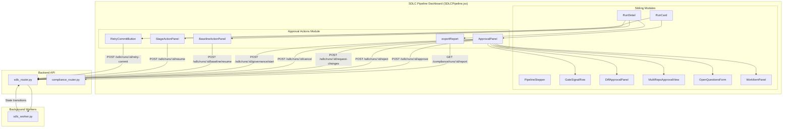
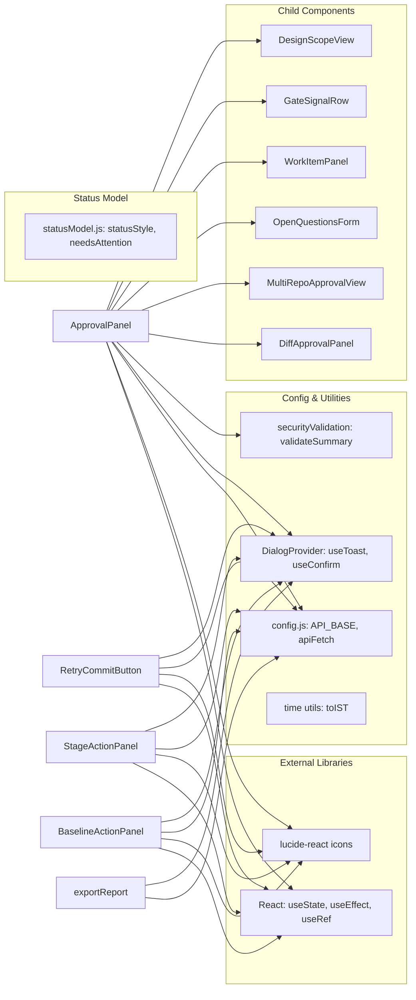
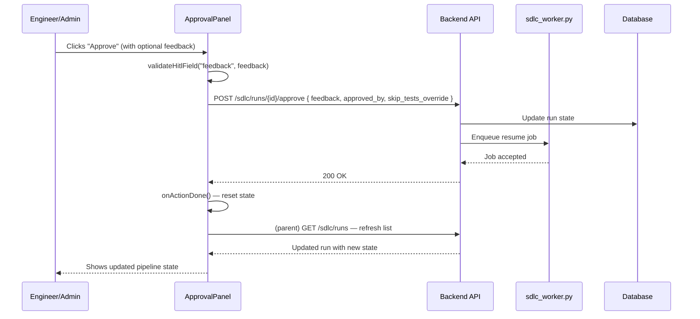
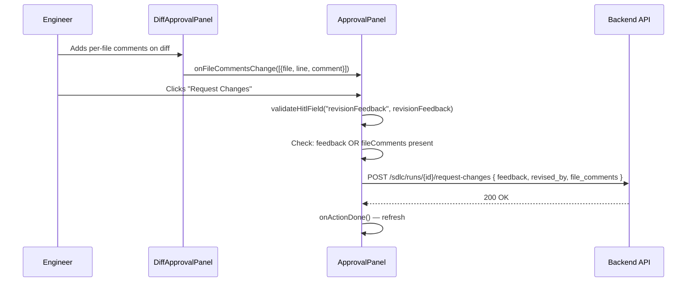
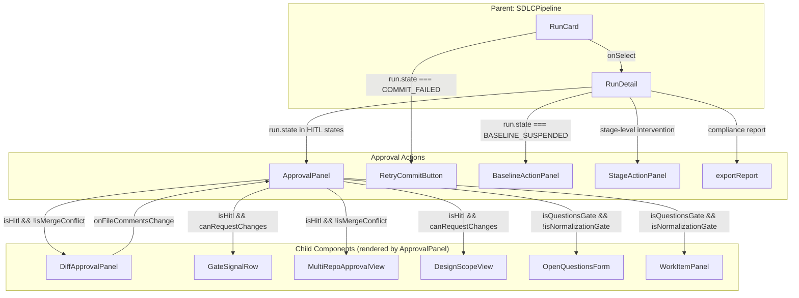

# Approval Actions Module

## Introduction

The **Approval Actions** module is a frontend React component group within the SDLC Pipeline Dashboard (`SDLCPipeline.jsx`) that provides the human-in-the-loop (HITL) approval, rejection, revision, cancellation, retry, and stage-resume interface for software development lifecycle pipeline runs. It is the primary UI surface where engineers, owners, and admins interact with pipeline runs that are paused at approval gates, baseline build failures, commit failures, or stage-level decision points.

The module bridges the gap between the automated SDLC agent pipeline (which generates code, commits, and creates merge requests) and the human decision-making process required before a run can proceed. Every action dispatches an API call to the backend SDLC router, which in turn enqueues background worker jobs to resume, revise, or terminate the pipeline.

---

## Architecture Overview



---

## Component Reference

### ApprovalPanel

The central HITL approval component. It renders when a pipeline run is in any approval-gate state and provides the full set of approval actions: approve, reject, request changes, cancel, and send to governance.

**Props:**

| Prop | Type | Description |
|------|------|-------------|
| `run` | `Object` | The full pipeline run object including `state`, `context`, `id`, `type`, `branch`, `pr_url`, `jira_key`, `created_by` |
| `onActionDone` | `Function` | Callback invoked after any action completes successfully; triggers a parent refresh of the run list/detail |
| `user` | `Object` | Current authenticated user object (`role`, `email`, `sub`, `id`) used for owner/admin gating |

**State Machine Awareness:**

The component detects and adapts to the following run states:

| State | Category | UI Behavior |
|-------|----------|-------------|
| `AWAITING_CODE_APPROVAL` | HITL | Approve / Request Changes (capped at 3) / Reject / Cancel; skip-tests toggle shown |
| `AWAITING_DESIGN_APPROVAL` | HITL | Same as above |
| `AWAITING_SOLUTION_APPROVAL` | HITL | Same as above |
| `AWAITING_PR_APPROVAL` | HITL (PR gate) | Approve / Request Changes (uncapped) / Reject / Cancel; Send to Governance (owner/admin) |
| `AWAITING_RE_REVIEW` | HITL | Approve / Reject / Cancel |
| `MERGE_CONFLICT` | HITL (conflict) | Shows conflict details + AI resolution proposal; Approve / Reject / Cancel |
| `AWAITING_USER_INPUT` | Questions gate | Renders `WorkItemPanel` (normalization) or `OpenQuestionsForm` (classify-raised) |
| `AWAITING_GOVERNANCE_APPROVAL` | Governance gate | Handled by [sdlc_governance_review](sdlc_governance_review.md) module |
| `COMMIT_FAILED` | Resumable | Handled by `RetryCommitButton` |
| `COMPLETE`, `MERGED`, `FAILED`, `CANCELLED` | Terminal | No actions shown |

**Key Internal Logic:**

- **Owner/Admin gating for "Send to Governance":** Mirrors the backend `_is_run_owner()` logic in `sdlc_router.py`. The button appears only at `AWAITING_PR_APPROVAL` for non-governance runs when the current user is either an admin or the run owner (matched by email, user-id, or `created_by`).
- **Revision cap:** Request Changes at design/solution gates is capped at 3 revisions (`revision_count` from context). At the PR-approval gate, revisions are uncapped.
- **Skip-tests override:** A checkbox at design/solution gates allows the engineer to opt out of tests + SLT on resume. The value is sent as `skip_tests_override` only at those gates; `null` at others.
- **Per-file comments:** The `DiffApprovalPanel` child bubbles up per-file `{ file, line, comment }` entries via `onFileCommentsChange`, which are included in the `request-changes` POST body as `file_comments`.

**Action Functions:**

#### doApprove

```javascript
POST /sdlc/runs/{run.id}/approve
Body: { feedback, approved_by: "engineer", skip_tests_override }
```

Sends optional feedback and the skip-tests override (design/solution gates only). On success, calls `onActionDone()` to refresh the parent.

#### doReject

```javascript
POST /sdlc/runs/{run.id}/reject
Body: { reason, rejected_by: "engineer" }
```

Requires a non-empty rejection reason (validated via `validateSummary`). Permanently terminates the run as `FAILED`.

#### doRequestChanges

```javascript
POST /sdlc/runs/{run.id}/request-changes
Body: { feedback, revised_by: "engineer", file_comments? }
```

Submits when either whole-run feedback or at least one per-file comment is present. The backend accepts file-comments-only submissions. At design/solution gates, this counts against the 3-revision cap; at the PR gate, it is uncapped.

#### doCancel

```javascript
POST /sdlc/runs/{run.id}/cancel
Body: { reason: "Cancelled by engineer", cancelled_by: "engineer" }
```

Available for all non-terminal states. Marks the run as `CANCELLED`.

#### doSendToGovernance

```javascript
POST /sdlc/runs/{run.id}/governance/start
```

Author-initiated governance end-gate. Available only at `AWAITING_PR_APPROVAL` for non-governance runs, gated by owner/admin check. On success, the run transitions to `GOVERNANCE_SCAN`, then either back to `AWAITING_PR_APPROVAL` (clean) or suspends at `AWAITING_GOVERNANCE_APPROVAL` (blocking findings).

---

### RetryCommitButton

A self-contained component shown exclusively when `run.state === "COMMIT_FAILED"`. This state is intentionally **not** terminal — the code changes are complete, only the GitLab commit/MR creation failed (e.g., token expiry, network blip).

**Props:**

| Prop | Type | Description |
|------|------|-------------|
| `run` | `Object` | Pipeline run object; must have `state === "COMMIT_FAILED"` |
| `onRetried` | `Function` | Optional callback after successful retry enqueue |

**Action:**

#### doRetry

```javascript
POST /sdlc/runs/{run.id}/retry-commit
```

Re-enqueues the commit and MR creation without regenerating code. Returns a `job_id` which is displayed to the user. The button is disabled after a successful enqueue to prevent duplicate submissions.

---

### BaselineActionPanel

Shown when the pipeline detects that the repository does not compile at HEAD **before** any code changes are applied (baseline build failure). Provides three recovery paths.

**Props:**

| Prop | Type | Description |
|------|------|-------------|
| `runId` | `string` | Pipeline run ID |
| `run` | `Object` | Full run object (used for `context.skip_tests` initialization) |
| `suspendReason` | `string` | The build error output that caused the suspension |
| `onClose` | `Function` | Close handler |
| `onDone` | `Function` | Success callback |

**Recovery Actions (via `submit()`):**

All actions POST to `POST /sdlc/runs/{runId}/baseline/resume` with varying parameters:

| Action | Parameters | Description |
|--------|-----------|-------------|
| **I'll fix the repo** | `{ agent_fix: false, skip_compile: false, skip_tests }` | Engineer fixes the repo manually; pipeline re-checks the baseline build |
| **Let the agent fix it** | `{ agent_fix: true, skip_compile: false, skip_tests }` | AI agent attempts to repair the baseline build; repair lands on the feature branch |
| **Skip compilation** | `{ agent_fix: false, skip_compile: true, skip_tests }` | Pipeline continues without building; code committed unverified |

The `skip_tests` checkbox is an explicit user opt-out of TESTING + SLT on resume, initialized from the stored context value. PCI/DSS default is tests ON.

---

### StageActionPanel

Provides stage-level resume controls when a specific stage in the pipeline needs intervention. Supports retry, go-back, and waive modes.

**Props:**

| Prop | Type | Description |
|------|------|-------------|
| `runId` | `string` | Pipeline run ID |
| `stage` | `string` | Current stage name |
| `runState` | `string` | Current run state |
| `runType` | `string` | Run type (`feature`, `bug`, `governance`, `pr_review`) |
| `onClose` | `Function` | Close handler |
| `onDone` | `Function` | Success callback |

**Modes:**

| Mode | Description | Mandatory Stages |
|------|-------------|-----------------|
| **Retry** | Re-run the current stage | Available for all stages |
| **Go Back** | Resume from an earlier stage (selectable dropdown) | Available when earlier stages exist |
| **Waive** | Skip the current gate with a required reason | Blocked for `CLASSIFYING`, `IMPLEMENT`, `COMMITTING` (mandatory stages) |

**Action:**

#### handleSubmit

```javascript
POST /sdlc/runs/{runId}/resume
Body: { target_stage, mode, feedback?, reason? }
```

- `target_stage`: The stage to resume from (current stage for retry/waive, selected earlier stage for go-back)
- `mode`: `"retry"` | `"go_back"` | `"waive"`
- `feedback`: Optional description (retry/go_back)
- `reason`: Required for waive mode

Validation:
- Waive mode requires a non-empty reason
- Go-back mode requires at least one earlier stage to exist

---

### exportReport

A utility function (not a component) that downloads a compliance report for a given run.

```javascript
GET /compliance/runs/{run.id}/report
```

Fetches the compliance report JSON, creates a Blob, and triggers a browser download as `compliance-report-{run.id.slice(0,8)}.json`. On failure, displays a toast error.

---

## Dependencies



### Key Dependencies

| Dependency | Source | Purpose |
|-----------|--------|---------|
| `apiFetch` | `config.js` | Authenticated API client; all action functions use this for backend calls |
| `useToast` | `DialogProvider.jsx` | Toast notifications for success/error feedback |
| `useConfirm` | `DialogProvider.jsx` | Confirmation dialogs (used in `RunCard.doCancel`) |
| `validateSummary` | `securityValidation.js` | Input validation for feedback/reason fields |
| `statusStyle` | `statusModel.js` | Status badge colors and labels (shared single source of truth) |
| `DiffApprovalPanel` | `DiffApprovalPanel.jsx` | Renders the verified diff and collects per-file comments |
| `GateSignalRow` | `sdlc/GateSignalRow.jsx` | Trust-calibrated signal row (coverage, grounding, manifest validation) |
| `MultiRepoApprovalView` | `MultiRepoApprovalView.jsx` | Multi-repo scope display |
| `OpenQuestionsForm` | `OpenQuestionsForm.jsx` | Classify-raised open questions gate |
| `WorkItemPanel` | `WorkItemPanel.jsx` | Normalization gate work-item display |

---

## Data Flow



### Request/Response Flow for Request Changes



---

## Component Interaction Diagram



---

## Process Flows

### HITL Approval Gate Flow

```mermaid
flowchart TD
    Start([Run reaches HITL state]) --> CheckState{What state?}

    CheckState|AWAITING_CODE/DESIGN/SOLUTION_APPROVAL| DesignGate
    CheckState|AWAITING_PR_APPROVAL| PRGate
    CheckState|AWAITING_RE_REVIEW| ReReviewGate
    CheckState|MERGE_CONFLICT| ConflictGate
    CheckState|AWAITING_USER_INPUT| QuestionsGate

    DesignGate[Show: GateSignalRow, DesignScopeView, DiffApprovalPanel]
    DesignGate --> DesignActions{User action?}
    DesignActions|Approve| DoApprove[POST /approve with skip_tests_override]
    DesignActions|Request Changes| DoRevise[POST /request-changes — capped at 3]
    DesignActions|Reject| DoReject[POST /reject — requires reason]
    DesignActions|Cancel| DoCancel[POST /cancel]

    PRGate[Show: PR details, branch, MR link, Jira link]
    PRGate --> PRActions{User action?}
    PRActions|Approve| DoApprove2[POST /approve]
    PRActions|Request Changes| DoRevise2[POST /request-changes — uncapped]
    PRActions|Send to Governance| DoGov[POST /governance/start — owner/admin only]
    PRActions|Reject| DoReject2[POST /reject]
    PRActions|Cancel| DoCancel2[POST /cancel]

    ReReviewGate[Show: Re-review notice]
    ReReviewGate --> ReReviewActions{User action?}
    ReReviewActions|Approve| DoApprove3[POST /approve]
    ReReviewActions|Reject| DoReject3[POST /reject]
    ReReviewActions|Cancel| DoCancel3[POST /cancel]

    ConflictGate[Show: Conflict details, AI resolution proposal]
    ConflictGate --> ConflictActions{User action?}
    ConflictActions|Approve| DoApprove4[POST /approve]
    ConflictActions|Reject| DoReject4[POST /reject]
    ConflictActions|Cancel| DoCancel4[POST /cancel]

    QuestionsGate{gate_kind?}
    QuestionsGate|normalization| WIP[WorkItemPanel]
    QuestionsGate|questions/absent| OQF[OpenQuestionsForm]
    WIP --> SubmitAnswers[POST /runs/:id/answer-questions]
    OQF --> SubmitAnswers

    DoApprove --> Refresh[onActionDone: refresh]
    DoReject --> Refresh
    DoRevise --> Refresh
    DoCancel --> Refresh
    DoGov --> Refresh
    DoApprove2 --> Refresh
    DoRevise2 --> Refresh
    DoReject2 --> Refresh
    DoCancel2 --> Refresh
    DoGov2 --> Refresh
    DoApprove3 --> Refresh
    DoReject3 --> Refresh
    DoCancel3 --> Refresh
    DoApprove4 --> Refresh
    DoReject4 --> Refresh
    DoCancel4 --> Refresh
    SubmitAnswers --> Refresh
```

### Baseline Build Failure Recovery Flow

```mermaid
flowchart TD
    Start([Run suspended: baseline build broken]) --> ShowPanel[BaselineActionPanel]
    ShowPanel --> ShowReason[Display suspend reason / build error]
    ShowReason --> SkipTestsOpt[Show skip-tests checkbox — default from context]
    SkipTestsOpt --> Choice{User chooses recovery path}

    Choice|I'll fix the repo| SelfFix[POST /baseline/resume<br/>agent_fix=false, skip_compile=false]
    Choice|Let the agent fix it| AgentFix[POST /baseline/resume<br/>agent_fix=true, skip_compile=false]
    Choice|Skip compilation| SkipCompile[POST /baseline/resume<br/>agent_fix=false, skip_compile=true]

    SelfFix --> Recheck[Pipeline re-checks baseline build]
    AgentFix --> AgentRepair[AI agent repairs build on feature branch]
    SkipCompile --> Continue[Pipeline continues without building<br/>code committed unverified]

    Recheck --> Done[onDone: refresh]
    AgentRepair --> Done
    Continue --> Done
```

### Stage-Level Resume Flow

```mermaid
flowchart TD
    Start([Stage needs intervention]) --> ShowPanel[StageActionPanel]
    ShowPanel --> CheckMandatory{Is stage mandatory?}

    CheckMandatory|Yes: CLASSIFYING/IMPLEMENT/COMMITTING| ModesRetry[Available: Retry, Go Back]
    CheckMandatory|No| ModesAll[Available: Retry, Go Back, Waive]

    ModesRetry --> SelectMode{Mode selected?}
    ModesAll --> SelectMode

    SelectMode|Retry| RetryFlow[target_stage = current stage<br/>POST /resume { mode: retry, feedback? }]
    SelectMode|Go Back| GoBackFlow[Select earlier stage from dropdown<br/>POST /resume { mode: go_back, target_stage, feedback? }]
    SelectMode|Waive| WaiveFlow[Reason required<br/>POST /resume { mode: waive, reason }]

    RetryFlow --> Enqueued[Job enqueued]
    GoBackFlow --> Enqueued
    WaiveFlow --> Enqueued

    Enqueued --> Done[onDone + onClose: refresh]
```

### Commit Failure Retry Flow

```mermaid
flowchart TD
    Start([run.state === COMMIT_FAILED]) --> ShowButton[RetryCommitButton rendered]
    ShowButton --> UserClick{User clicks retry?}
    UserClick --> POST[POST /sdlc/runs/:id/retry-commit]
    POST --> CheckResp{Response OK?}
    CheckResp|Yes| ShowJobId[Display job_id<br/>Disable button]
    CheckResp|No| ShowError[Display error<br/>Toast notification]
    ShowJobId --> OnRetried[onRetried callback]
    OnRetried --> Refresh[Parent refreshes run list]
```

---

## API Endpoint Summary

| Component | Method | Endpoint | Body Fields | Purpose |
|-----------|--------|----------|-------------|---------|
| `doApprove` | POST | `/sdlc/runs/{id}/approve` | `feedback`, `approved_by`, `skip_tests_override` | Approve current gate; resume pipeline |
| `doReject` | POST | `/sdlc/runs/{id}/reject` | `reason`, `rejected_by` | Permanently terminate run as FAILED |
| `doRequestChanges` | POST | `/sdlc/runs/{id}/request-changes` | `feedback`, `revised_by`, `file_comments?` | Request AI revision; return for re-approval |
| `doCancel` | POST | `/sdlc/runs/{id}/cancel` | `reason`, `cancelled_by` | Cancel pipeline run |
| `doSendToGovernance` | POST | `/sdlc/runs/{id}/governance/start` | — | Trigger pre-merge governance end-gate |
| `doRetry` (RCB) | POST | `/sdlc/runs/{id}/retry-commit` | — | Re-enqueue commit + MR creation |
| `submit` (BAP) | POST | `/sdlc/runs/{id}/baseline/resume` | `agent_fix`, `skip_compile`, `skip_tests` | Resume from baseline build failure |
| `handleSubmit` (SAP) | POST | `/sdlc/runs/{id}/resume` | `target_stage`, `mode`, `feedback?`, `reason?` | Stage-level resume (retry/go_back/waive) |
| `exportReport` | GET | `/compliance/runs/{id}/report` | — | Download compliance report JSON |

---

## Security & Validation

- **Input validation:** All free-text fields (feedback, reject reason, revision feedback) are validated via `validateSummary()` from `securityValidation.js` to prevent injection attacks.
- **Owner/admin gating:** The "Send to Governance" button performs a client-side check mirroring the backend `_is_run_owner()` logic, matching by email, user-id, and `created_by`. The backend enforces this independently.
- **Mandatory stage protection:** The `StageActionPanel` prevents waiving of mandatory stages (`CLASSIFYING`, `IMPLEMENT`, `COMMITTING`) both in the UI (disabled button) and via validation in `handleSubmit`.
- **PCI/DSS compliance:** Skip-tests toggles default to OFF (tests enabled) and require explicit user action. Warning text is displayed alongside the checkbox.

---

## Related Module Documentation

- [sdlc_pipeline](sdlc_pipeline.md) — Parent module containing the full SDLC Pipeline Dashboard
- [sdlc_governance_review](sdlc_governance_review.md) — Governance review panel for `AWAITING_GOVERNANCE_APPROVAL` state
- [sdlc_gate_signal](sdlc_gate_signal.md) — Gate signal row component (coverage, grounding, manifest validation)
- [sdlc_status_model](sdlc_status_model.md) — Shared status label/color/icon model
- [sdlc_pipeline_stepper](sdlc_pipeline_stepper.md) — Pipeline timeline stepper component
- [diff_approval](diff_approval.md) — Diff approval panel with per-file commenting
- [multi_repo_approval](multi_repo_approval.md) — Multi-repo approval view
- [open_questions](../reference/open_questions.md) — Open questions form for classify-raised gates
- [work_item_panel](../reference/work_item_panel.md) — Work item panel for normalization gates
- [sdlc_router](../api/sdlc_router.md) — Backend SDLC API router (all endpoints called by this module)
- [sdlc_pipeline_workers](../workers/sdlc_pipeline_workers.md) — Background workers that process enqueued resume/retry jobs
