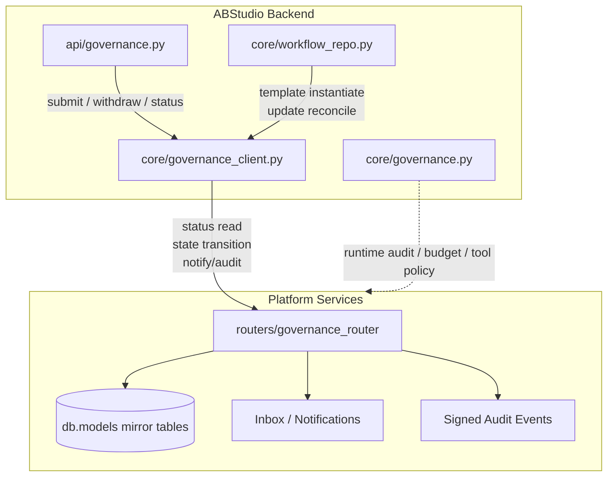
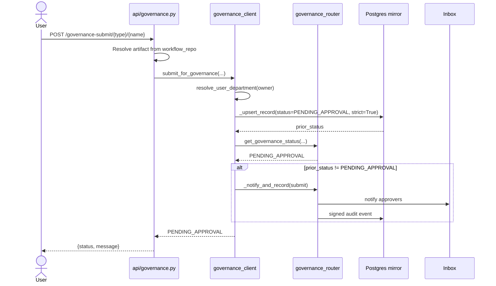
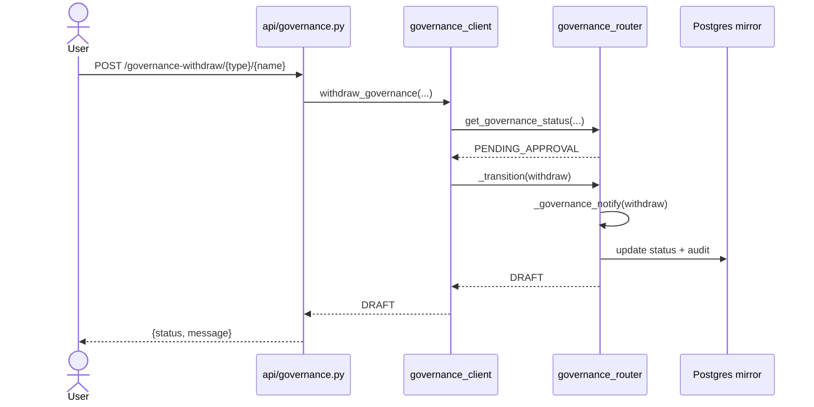
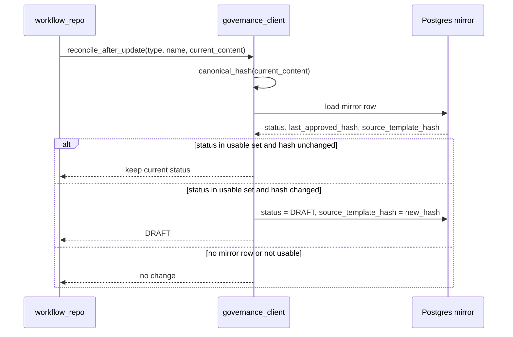
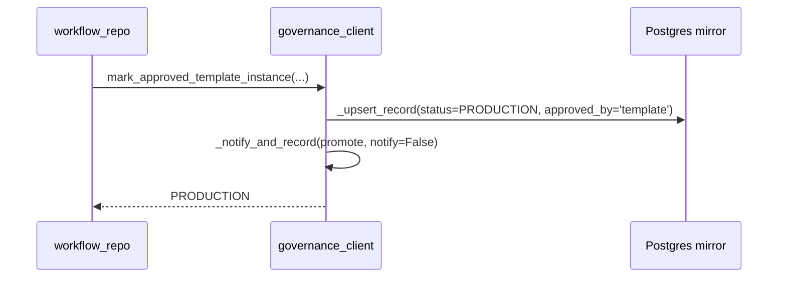
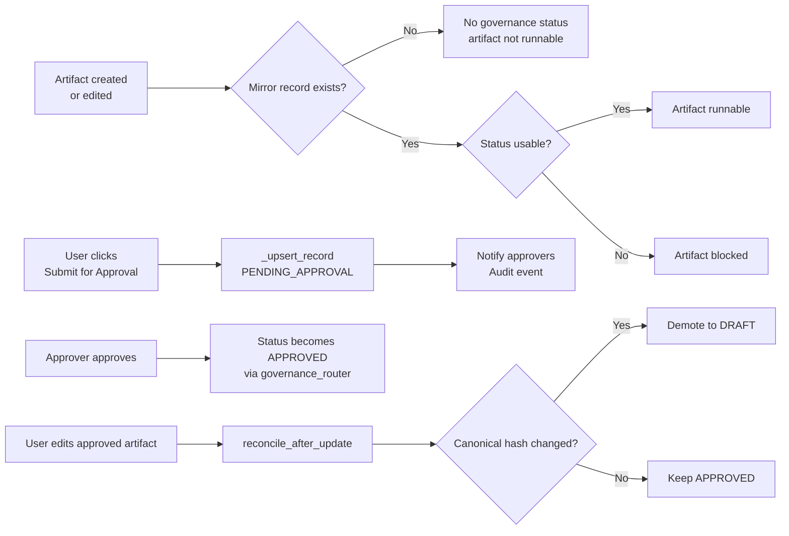

# core_governance_client

## Brief Introduction

`core_governance_client` is the bridge between **ABStudio's operational artifact store** (workflows, agents, skills) and the **platform-wide governance / approval lifecycle**. ABStudio keeps the runnable copy of each artifact in its own tables, while the mature governance system (sidebar Inbox, HOD approvals, audit trail) is keyed off mirror records in `agents_pg` / `skills_pg` / `workflows_pg` defined in `db.models`.

This module's single responsibility is to **create and transition those mirror records** without re-implementing any governance logic. It reuses the platform [`governance_router`](governance_router.md) for status reads, state transitions, notifications, and signed audit events. Every operation is designed to be **best-effort and fail-safe**: governance wiring must never break artifact creation or updates, but the submit path is intentionally strict so that users see real errors if the mirror row cannot be persisted.

The module is used by:

- [`api/governance.py`](../api/api_governance.md) — user-facing REST endpoints for submit, withdraw, and status.
- [`core/workflow_repo.py`](../workflows/core_workflow_repo.md) — template instantiation and artifact update hooks.
- [`core/governance.py`](core_governance.md) — sibling module that handles runtime audit, budget, and tool-policy concerns.

---

## Core Concepts

### Operational Copy vs. Governance Mirror

| Layer | Tables | Purpose |
|-------|--------|---------|
| Operational (ABStudio) | `workflows`, `agents`, `skills_catalog` | Editable graph/config used at runtime. |
| Governance mirror | `workflows_pg`, `agents_pg`, `skills_pg` | Approval status, department routing, audit trail, template provenance. |

The governance client copies just enough metadata (name, owner, department, description, content hash, template provenance) into the mirror record so that the existing platform approval flow can take over.

### Entity Types

The module recognizes three entity-type strings, which match the platform governance router:

- `"workflows"`
- `"agents"`
- `"skills"`

These map to the model classes `WorkflowRecord`, `AgentRecord`, and `SkillRecord` via `_MODEL_MAP`.

### Usable Statuses

An artifact is considered runnable only when its governance status is one of:

- `APPROVED`
- `PRODUCTION`
- `ACTIVE`

Any other status — including a missing record — is treated as **not usable** (fail-closed).

---

## Architecture

### Component Responsibilities

| Component | Responsibility |
|-----------|----------------|
| `core/governance_client.py` | Mirror-record CRUD, canonical hashing, status checks, submit/withdraw/reconcile, department resolution. |
| `api/governance.py` | HTTP routing, request validation, artifact lookup, visibility normalization. |
| `core/workflow_repo.py` | Calls `mark_approved_template_instance` on template use and `reconcile_after_update` on save. |
| `routers/governance_router` | Authoritative status cache (Redis → memory → Postgres), state-machine transitions, notifications, audit. |
| `db.models` | Mirror record schemas (`WorkflowRecord`, `AgentRecord`, `SkillRecord`). |
| `core/governance.py` | Runtime governance: token/cost tracking, budget checks, tool policy enforcement. |

---

## Data Flows

### Submitting an Artifact for Approval

Key design decisions:

- `_upsert_record` uses `strict=True` on submit so a missing migration or unreachable database surfaces as a real HTTP error instead of a silent no-op that later causes a 404 on approve.
- A post-write status check confirms the mirror row is readable by the same key the approve path uses.
- Re-submitting an already-pending artifact is idempotent and does not re-notify approvers.

### Withdrawing a Pending Request

If the platform router is unavailable (e.g. ABStudio standalone), the client falls back to a direct mirror-row write so the local state remains consistent.

### Reconciling After an Edit

Important: `reconcile_after_update` **never** submits or notifies. It only demotes an already-approved artifact to `DRAFT` when its semantic content changes, preventing silent edits to approved artifacts.

### Template Instantiation

Unmodified template instances are trusted and immediately usable. The source template hash is stored so later edits can be detected by `reconcile_after_update`.

---

## Canonical Hashing

`canonical_hash` produces a stable SHA-256 digest of an artifact's **semantic content**. It is used to detect whether a template instance has been modified from its source template, or whether an approved artifact's content changed after approval.

### Volatile Keys Stripped

The following keys are recursively removed before hashing so that cosmetic or runtime-only changes do not count as modifications:

- Identity / layout: `id`, `position`, `positionAbsolute`, `x`, `y`, `zIndex`, `width`, `height`, `measured`, `handleBounds`, `internals`, `__rf`
- Timestamps: `created_at`, `updated_at`, `createdAt`, `updatedAt`
- UI state: `selected`, `dragging`

This prevents node re-positioning on the React Flow canvas from demoting a workflow from `PRODUCTION` back to `DRAFT`.

---

## Public API

### Status & Usability

| Function | Purpose |
|----------|---------|
| `get_governance_status(entity_type, name, owner_id="")` | Read the current governance status, preferring the platform router's cached view and falling back to Postgres. |
| `is_usable(entity_type, name, owner_id="")` | Returns `True` only if status is `APPROVED`, `PRODUCTION`, or `ACTIVE`; missing records are treated as not usable. |

### Lifecycle Actions

| Function | Purpose |
|----------|---------|
| `submit_for_governance(...)` | Create/update the mirror record as `PENDING_APPROVAL` and notify approvers. |
| `withdraw_governance(...)` | Cancel a pending request and return the artifact to `DRAFT`. |
| `mark_approved_template_instance(...)` | Register an unmodified template instance as `PRODUCTION` without requiring approval. |
| `submit_skill_async(...)` | Off-thread skill submission used by the generation confirm path and zip importer. |

### Update & Reconciliation

| Function | Purpose |
|----------|---------|
| `reconcile_after_update(...)` | After an edit, demote an approved artifact to `DRAFT` only if its canonical hash changed. |
| `canonical_hash(payload)` | Stable semantic hash of an artifact payload. |

### Helpers

| Function | Purpose |
|----------|---------|
| `resolve_user_department(user_id)` | Look up a user's department from the `users` table for HOD routing. |
| `normalize_visibility(value)` | Coerce visibility to `public` or `private`. |

---

## Error Handling Philosophy

The module follows a **split fail-mode**:

- **Submit / strict paths** fail loudly. If the mirror row cannot be written, the user gets a real error so that orphan Inbox items and 404-on-approve bugs are avoided.
- **Read / reconcile / best-effort paths** fail silently and return safe defaults (usually `None` or `False`). This ensures governance unavailability never blocks normal artifact editing or running when governance is not configured.
- **Standalone ABStudio** gracefully degrades to direct Postgres reads/writes when `routers.governance_router` is not importable.

---

## Integration with Related Modules

- [`api/governance.py`](../api/api_governance.md) — exposes the client as REST endpoints under `/ainxt/v1/api/abs/governance-*`.
- [`core/workflow_repo.py`](../workflows/core_workflow_repo.md) — invokes the client during template use and artifact updates.
- [`core/governance.py`](core_governance.md) — sibling module focused on runtime audit, budget, and tool policy; does not manage approval lifecycle.
- [`routers/governance_router`](governance_router.md) — platform authority for governance status, transitions, notifications, and audit events.
- `db.models` — defines the mirror record schemas.

---

## Process Flow Summary

