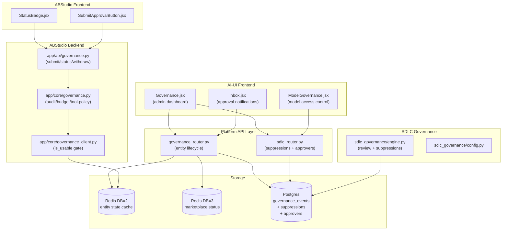
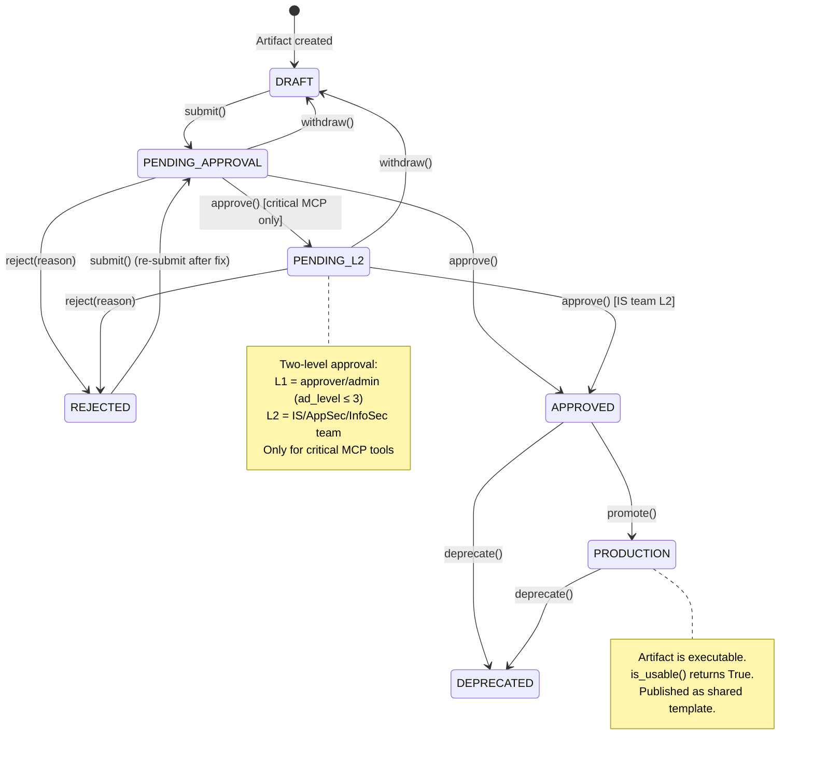
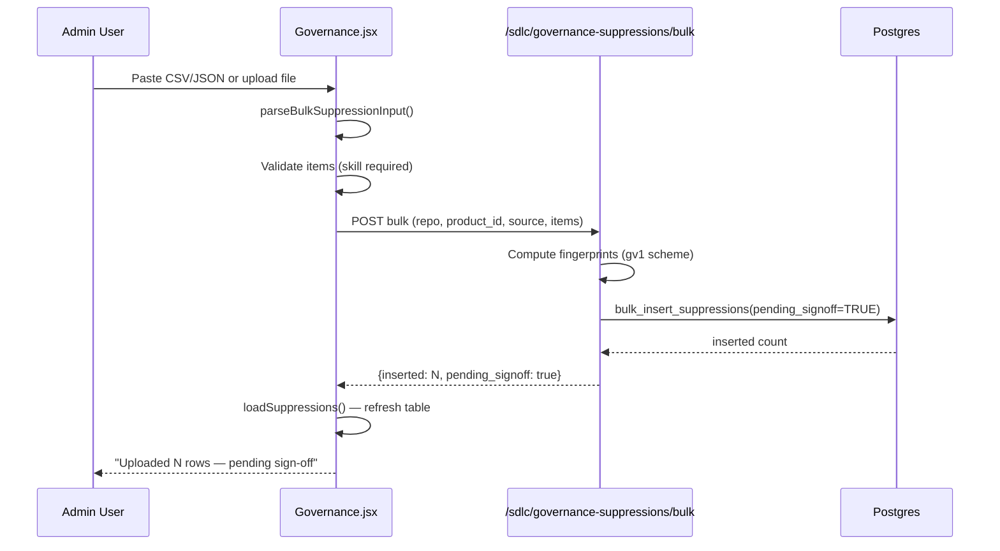
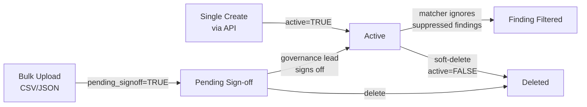
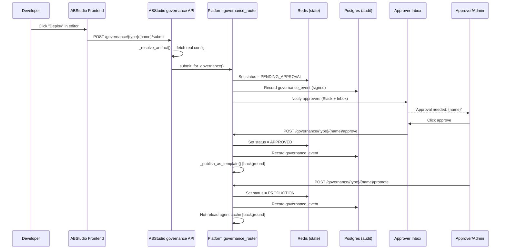
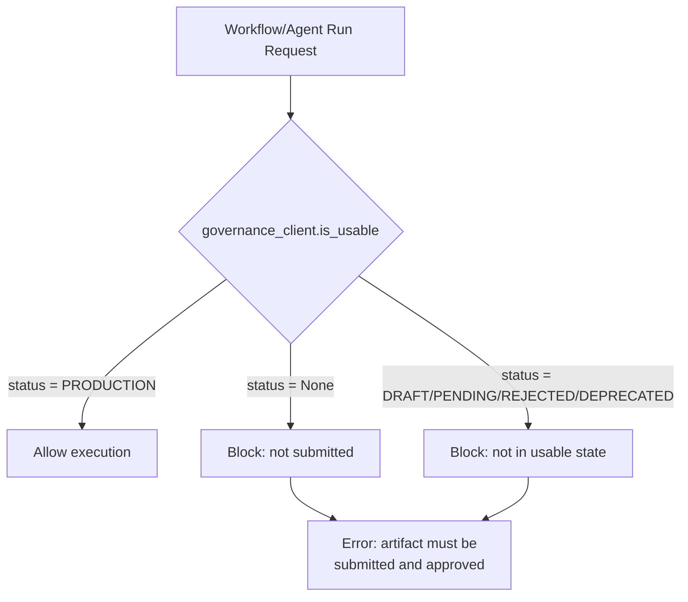

# Governance Module

## Overview

The Governance module provides a **maker-checker approval lifecycle** for all deployable artifacts in the platform — agents, skills, workflows, and MCP tools. It enforces segregation of duties between artifact creators (makers) and approvers (checkers), tracks every state transition in an immutable audit log, and integrates with the SDLC pipeline's governance review system to manage false-positive finding suppressions and domain-specific approver assignments.

The module spans three layers:

| Layer | Location | Responsibility |
|-------|----------|----------------|
| **AI-UI Frontend** | `ai-ui/src/components/Governance.jsx` | Admin/operator dashboard for entity lifecycle, suppression management, and domain approver configuration |
| **ABStudio Frontend** | `ABStudio/frontend/src/features/governance/` | Per-artifact inline status badges and deploy/withdraw buttons embedded in editors |
| **Platform Backend** | `routers/governance_router.py`, `routers/sdlc_router.py` | REST API for lifecycle transitions, suppressions, approvers, SLA tracking |
| **ABStudio Backend** | `ABStudio/backend/app/api/governance.py`, `ABStudio/backend/app/core/governance.py` | Build Studio artifact resolution, tool-policy enforcement, budget/audit integration |
| **SDLC Governance Engine** | `agents/sdlc_governance/engine.py` | Code review governance, finding fingerprinting, suppression matching |

---

## Architecture

### Entity Lifecycle State Machine

The governance lifecycle follows a strict state machine enforced server-side. All transitions are validated against the `_VALID_TRANSITIONS` table before being applied.

### Key States

| State | Description | Executable? |
|-------|-------------|:-----------:|
| `DRAFT` | Newly created or withdrawn; editable by owner | No |
| `PENDING_APPROVAL` | Submitted for manager/HOD approval | No |
| `PENDING_L2` | L1-approved critical MCP tool awaiting IS team L2 review | No |
| `APPROVED` | Approved but not yet promoted to production | No |
| `PRODUCTION` | Live and executable; published as shared template | Yes |
| `REJECTED` | Rejected with reason; can be re-submitted after fixes | No |
| `DEPRECATED` | Retired; can no longer be executed | No |

---

## Component Documentation

### AI-UI: Governance Dashboard (`Governance.jsx`)

The primary admin/operator interface for governance management. It provides three functional sections:

#### 1. Entity Lifecycle Table

Displays all governed artifacts (agents, skills, workflows, MCP tools) with their current status and context-appropriate action buttons.

**Visibility scoping:**
- Users with `security` permission (admins) see **all** submissions
- Other users see only their own submissions (filtered by `created_by` or `owner`)

**Role-based actions:**

| Action | Required Permission | Applicable States |
|--------|-------------------|-------------------|
| Submit | `developer` (any authenticated user) | `DRAFT`, `REJECTED` |
| Approve | `security` (admin/approver) | `PENDING_APPROVAL` |
| Reject | `security` (admin/approver) | `PENDING_APPROVAL` |
| Promote → PROD | `admin` | `APPROVED` |
| Deprecate | `admin` | `PRODUCTION` |

The component uses the `usePermission` hook to determine role-based UI visibility. Permission checks are **client-side UX only** — the server is the authoritative enforcement gate.

#### 2. Governance Suppressions Management

Manages false-positive suppressions for SDLC governance findings. This section has two sub-features:

**Bulk Upload (`submitBulkSuppressions`, `handleBulkFile`):**

Accepts CSV or JSON input containing suppression items. Each item requires a `skill` field and optionally includes `fingerprint`, `file`, `rule`, `snippet`, `title`, and `reason`. The parsing logic (`parseBulkSuppressionInput`) handles:
- JSON arrays: `[{"skill": "...", "fingerprint": "..."}]`
- JSON objects: `{"items": [...]}`
- CSV with header row: `skill,fingerprint` or `skill,file,rule,snippet,title`

Uploaded rows land with `pending_signoff=TRUE` — they are **inert** until a governance lead signs them off. This is a segregation-of-duties control: the person who uploads false-positives cannot be the one who activates them.

**Suppression Table:**

Displays all suppressions with search/filter capability. Each row shows:
- Repo, product, skill, source label
- Status: "Pending sign-off" (yellow) or "Active" (green)
- Actions: Sign off (admins/approvers only, for pending rows) and Delete

#### 3. Governance Domain Approvers (Admin Only)

Admin-only section for managing which users can approve governance findings for specific domains (IS, EA, DPDP, or custom).

**`addApprover`:** Validates domain (uppercase token regex) and email format client-side before POSTing to the server. The server performs authoritative validation.

**Approver table:** Lists all configured approvers with domain, email, user ID, who added them, and when. Approvers can be removed (soft-deleted) by admins.

### ABStudio Frontend: Inline Governance Controls

#### `StatusBadge.jsx`

A self-managing status pill that displays the current governance state of an artifact. Key behaviors:
- **Auto-polling:** Polls the status API every 15 seconds while the status is in a pending state (`PENDING_APPROVAL`, `PENDING_L2`), stops once resolved
- **Cache-aware:** Uses a Zustand store (`useGovernanceStore`) to cache status across components
- **Null handling:** Distinguishes "still loading" (undefined) from "fetched, no record" (null → shows "Not Submitted")

#### `SubmitApprovalButton.jsx`

Context-sensitive deploy/withdraw button embedded in agent and workflow editors. Key behaviors:
- **Deploy:** Opens a popover with visibility selector (public/department) and optional reason field
- **Cancel request:** Shown when status is in a cancellable state (`PENDING_APPROVAL`, `PENDING_L2`); returns artifact to editable `DRAFT`
- **State transitions:** Hides after submit while pending status settles; re-appears immediately after cancel
- **Redeploy:** Label changes to "Redeploy" when status is `REJECTED`

### Platform Backend: Governance Router (`governance_router.py`)

The authoritative governance lifecycle API. Key design principles:

**Storage strategy:**
- **Redis (DB=2):** Live entity state cache with per-type prefixes (`agent_builder:agent:`, `skill_store:`, `mcp:tool:`, `workflow_store:`)
- **Redis (DB=3):** Marketplace tool status sync
- **Postgres:** Durable audit log (`governance_events` table) with cryptographic signatures via `sign_event()`

**Two-level approval for critical MCP tools:**

When an MCP tool is marked `is_critical` in the marketplace KV, approval follows a two-stage process:
1. **L1 approval:** Any approver (admin, platform_engineer, security) or user with `ad_level ≤ 3` transitions `PENDING_APPROVAL → PENDING_L2`
2. **L2 approval:** Only IS/AppSec/InfoSec team members (configured via `IS_TEAM_DEPARTMENTS` env var) or admins can transition `PENDING_L2 → APPROVED`

**Publish-on-approval:**

When a workflow or agent is approved, a background thread (`_publish_as_template`) copies the artifact into the ABStudio shared templates catalog. For agents, the source agent row is deleted after successful publish so it lives only in the Templates catalog.

**SLA tracking:**

Items in `PENDING_APPROVAL` for more than 5 days are flagged as overdue. Admins can manually trigger SLA reminder notifications via `trigger_sla_reminders`.

### ABStudio Backend: Governance Adapter (`app/core/governance.py`)

Wraps platform-level audit, budget, and tool-policy services with ABStudio-specific context labels. Design principles:
- **Fail-open for audit/storage:** A DB hiccup must never break a user's workflow run
- **Fail-closed for tool-policy denies:** A denied tool call returns a structured error (`ToolPolicyDenied`), not a crash

**Key components:**
- `RunUsageTracker`: Per-run dataclass that observes SSE events, accumulates token/cost/latency, and writes audit + budget records on `finalize()`
- `estimate_model_cost()`: Uses the platform model registry pricing table; local models are cost-exempt
- Tool policy: Enforces blocked tools, sensitive tools, and hierarchy-based restrictions (mid-level users blocked from destructive tools, junior users restricted to a read-only allowlist)

### Governance Client (`app/core/governance_client.py`)

The `is_usable()` function is the **fail-closed execution gate**. It returns `True` only if the artifact's governance status is in `USABLE_STATUSES` (typically `PRODUCTION`). A missing governance record is treated as **not usable** — a freshly created but unsubmitted artifact cannot be run until it goes through the full approval lifecycle.

### SDLC Governance Suppressions

The SDLC pipeline's governance review engine (`agents/sdlc_governance/engine.py`) produces findings during code review. Suppressions allow teams to mark false positives so they don't block pipelines.

**Suppression lifecycle:**

**Fingerprinting:** Suppressions use a `gv1` line-independent fingerprint scheme computed from `(skill, file, rule, snippet, title)`. The matcher (`apply_suppressions()`) drops findings whose fingerprint matches an active, signed-off suppression.

**Authorization (`can_manage_suppression`):**
- Admins and governance leads: unrestricted
- Ordinary authors: may suppress only within their own repo/product scope (fail-closed)

---

## Data Flow

### Artifact Deploy Flow (Maker → Checker → Production)

### Execution Gate Check

---

## Dependencies

### Internal Module Dependencies

| Dependency | Relationship |
|------------|-------------|
| [auth](../security/auth.md) | RBAC permission checks (`is_admin`, `can_manage_suppression`, `require_admin`, `get_current_user`) |
| [inbox](../chat/inbox.md) | Governance approval notifications delivered via inbox store |
| [sdlc_pipeline](sdlc_pipeline.md) | SDLC governance review produces findings; suppressions filter them |
| [sdlc_governance_review](sdlc_governance_review.md) | Frontend review panel for governance findings and domain approvals |
| [core_infrastructure](../infrastructure/core_infrastructure.md) | Redis KV, Postgres, logger, audit signer |
| [database](../storage/database.md) | `GovernanceEvent`, `GovernanceSuppression` models |
| [agent_system](../agents/agent_system.md) | Agent builder integration for listing and hot-reloading agents |
| [mcp_system](../mcp/mcp_system.md) | MCP tool registry and marketplace status sync |
| [core_workflow_repo](../reference/core_workflow_repo.md) | Artifact resolution (agents, skills, workflows) for approval previews |

### External Dependencies

| Dependency | Purpose |
|------------|---------|
| Redis (DB=2) | Live governance entity state cache |
| Redis (DB=3) | Marketplace tool status sync |
| Postgres | Durable audit log, suppression table, approver table |
| Slack | Approver notifications on submit |

---

## API Reference

### Entity Lifecycle Endpoints

| Method | Path | Role | Description |
|--------|------|------|-------------|
| GET | `/governance/{entity_type}` | Any | List entities with governance fields + pagination |
| POST | `/governance/{entity_type}/{name}/submit` | Any authenticated | Submit for approval → `PENDING_APPROVAL` |
| POST | `/governance/{entity_type}/{name}/approve` | Approver | Approve → `APPROVED` (or `PENDING_L2` for critical MCP) |
| POST | `/governance/{entity_type}/{name}/reject` | Approver | Reject with reason → `REJECTED` |
| POST | `/governance/{entity_type}/{name}/promote` | Approver | Promote → `PRODUCTION` |
| POST | `/governance/{entity_type}/{name}/deprecate` | Approver | Deprecate → `DEPRECATED` |
| POST | `/governance/{entity_type}/{name}/withdraw` | Owner/Approver | Cancel pending request → `DRAFT` |
| GET | `/governance/{entity_type}/{name}/status` | Any | Current governance status |
| GET | `/governance/{entity_type}/{name}/config` | Approver | Preview agent config (instructions, tools, skills) |
| GET | `/governance/{entity_type}/{name}/source` | Approver | Preview skill source code |
| GET | `/governance/{entity_type}/{name}/graph` | Approver | Preview workflow graph |
| GET | `/governance/sla/overdue` | Admin/Operator | Items exceeding 5-day SLA |
| POST | `/governance/sla/reminders` | Admin | Trigger SLA reminder notifications |

### Suppression Endpoints

| Method | Path | Role | Description |
|--------|------|------|-------------|
| GET | `/sdlc/governance-suppressions` | Scoped | List active suppressions |
| POST | `/sdlc/governance-suppressions` | Scoped | Create single active suppression |
| POST | `/sdlc/governance-suppressions/bulk` | Scoped | Bulk upload (pending sign-off) |
| POST | `/sdlc/governance-suppressions/{id}/signoff` | Governance lead/Admin | Activate pending suppression |
| DELETE | `/sdlc/governance-suppressions/{id}` | Scoped | Soft-delete suppression |

### Domain Approver Endpoints

| Method | Path | Role | Description |
|--------|------|------|-------------|
| GET | `/sdlc/governance/domain-approvers` | Admin | List all approvers |
| POST | `/sdlc/governance/domain-approvers` | Admin | Add approver (domain + email) |
| DELETE | `/sdlc/governance/domain-approvers/{id}` | Admin | Remove approver (soft-delete) |

### ABStudio Endpoints

| Method | Path | Role | Description |
|--------|------|------|-------------|
| POST | `/api/governance/{entity_type}/{name}/submit` | Authenticated | Submit Build Studio artifact for approval |
| GET | `/api/governance/{entity_type}/{name}/status` | Authenticated | Current governance status |
| POST | `/api/governance/{entity_type}/{name}/withdraw` | Owner/Approver | Cancel pending deploy request |

---

## Configuration

### Environment Variables

| Variable | Default | Description |
|----------|---------|-------------|
| `IS_TEAM_DEPARTMENTS` | `IS,AppSec,InfoSec` | Departments eligible for L2 MCP approval |
| `ABSTUDIO_GOVERNANCE_AUDIT_ENABLED` | `true` | Enable ABStudio audit events |
| `ABSTUDIO_BUDGET_ENFORCEMENT_ENABLED` | `true` | Enable budget preflight checks |
| `ABSTUDIO_TOOL_POLICY_ENFORCEMENT_ENABLED` | `true` | Enable tool policy enforcement |
| `ABSTUDIO_BUDGET_PRODUCT_ID` | `abstudio` | Product ID for budget tracking |
| `ABSTUDIO_BLOCKED_TOOLS` | (empty) | Comma-separated blocked tool names |
| `ABSTUDIO_SENSITIVE_TOOLS` | (empty) | Comma-separated sensitive tool names |
| `ABSTUDIO_RESTRICTED_TOOLS_MID` | (empty) | Tools blocked for mid-level users (ad_level 4–5) |
| `ABSTUDIO_READONLY_TOOLS` | (empty) | Allowlist for junior users (ad_level 6) |

### Entity Types

The governance system manages four entity types:
- **`agents`** — Standalone AI agents from ABStudio
- **`skills`** — Reusable skill modules from the skill catalog
- **`workflows`** — Multi-step workflow definitions from ABStudio
- **`mcp`** — MCP tools from the marketplace registry

### Approver Domains

Predefined domains for SDLC governance finding approvers:
- **IS** — Information Security
- **EA** — Enterprise Architecture
- **DPDP** — Data Protection & Privacy

Custom domains can be added via the admin UI (validated as uppercase alphanumeric tokens).

---

## Security Considerations

1. **Fail-closed execution gate:** `is_usable()` returns `False` for any artifact without a `PRODUCTION` governance status, including missing records
2. **Segregation of duties:** Bulk-uploaded suppressions require a separate sign-off from a governance lead before becoming active
3. **Owner-scoped operations:** Withdraw is restricted to the original submitter or an approver; suppression management is scoped to the caller's repo/product
4. **Immutable audit trail:** Every governance transition is persisted to Postgres with a cryptographic signature (`sign_event()`)
5. **IDOR protection:** Suppression deletion returns 404 (not 403) on visibility misses to prevent information leakage
6. **Server-authoritative:** All client-side permission checks in the UI are UX-only; the server enforces RBAC on every endpoint
7. **Two-level approval:** Critical MCP tools require both L1 (approver) and L2 (IS team) approval before reaching `APPROVED` status
