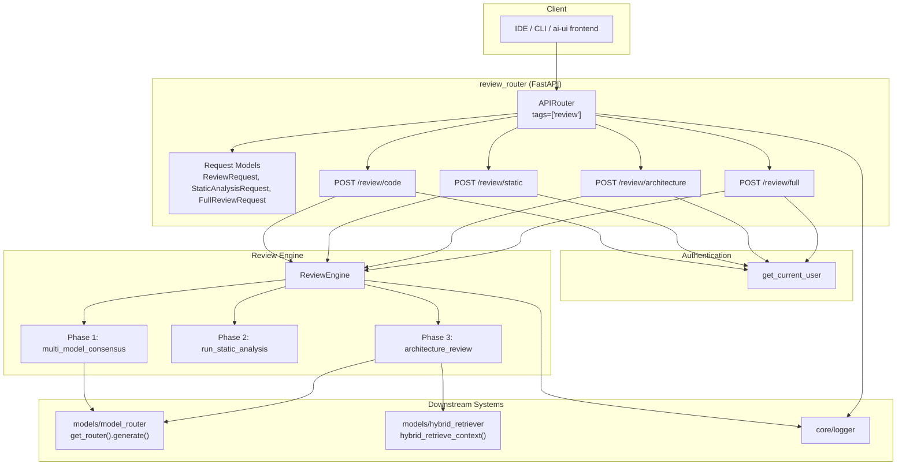
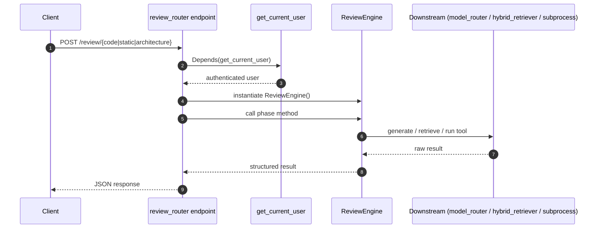
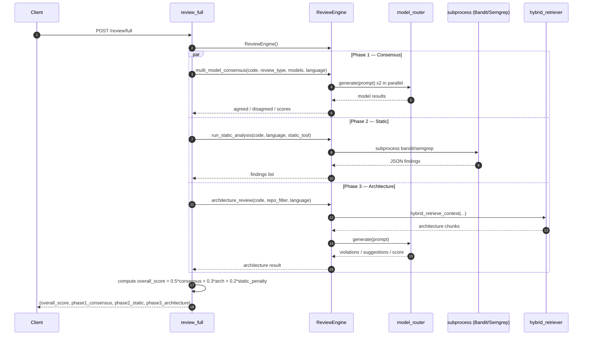

# review_router

## Brief Introduction

`review_router` exposes a REST API for automated code review. It is a thin FastAPI router layer that delegates all review logic to `agents/review_engine.py`. The module provides four endpoints covering three review phases: multi-model LLM consensus, static analysis (Bandit/Semgrep), and knowledge-base-driven architecture review. A composite `/review/full` endpoint orchestrates all three phases and returns a single weighted overall score.

All endpoints require an authenticated user via `auth.dependencies.get_current_user`.

---

## Module Purpose and Core Functionality

The router's only responsibility is to translate HTTP requests into calls on the `ReviewEngine` and shape the response payload. It does not contain business logic, model selection, or static-analysis tooling directly.

### Provided Endpoints

| Method | Path | Purpose |
|--------|------|---------|
| `POST` | `/review/code` | Run a multi-model consensus review on a snippet of source code. |
| `POST` | `/review/static` | Run Bandit (Python) or Semgrep (multi-language) static analysis. |
| `POST` | `/review/architecture` | Compare code against architecture patterns retrieved from the knowledge base. |
| `POST` | `/review/full` | Run all three phases and compute a weighted overall score. |

### Review Types Supported

The `review_type` field accepts:

- `security` — injection risks, auth issues, data exposure
- `quality` — maintainability, naming, complexity, duplication
- `performance` — bottlenecks, inefficient algorithms, memory leaks
- `general` — combined quality/security/performance review

### Static Analysis Tools

- `bandit` — Python security linter
- `semgrep` — multi-language static analysis

> Both tools are executed via subprocess inside the deployment container. If a tool is not installed, the endpoint returns an empty findings list rather than failing.

---

## Architecture and Component Relationships



### Component Responsibilities

| Component | Responsibility |
|-----------|----------------|
| `ReviewRequest` | Validates input for `/review/code` and `/review/architecture`. |
| `StaticAnalysisRequest` | Validates input for `/review/static`. |
| `FullReviewRequest` | Validates input for `/review/full`; combines fields from the other two models. |
| `review_code` | Calls `ReviewEngine.multi_model_consensus()` and flattens the `ConsensusResult`. |
| `review_static` | Calls `ReviewEngine.run_static_analysis()` and returns tool findings. |
| `review_architecture` | Calls `ReviewEngine.architecture_review()` and returns violations/suggestions/score. |
| `review_full` | Orchestrates all three phases, catches non-fatal failures, and computes an overall weighted score. |

---

## Data Flow

### Single-Phase Review Flow



### Full Review Flow



---

## Request / Response Models

### `ReviewRequest`

Used by `/review/code` and `/review/architecture`.

| Field | Type | Default | Description |
|-------|------|---------|-------------|
| `code` | `str` | required | Source code to review. |
| `language` | `str` | `"python"` | Programming language of the snippet. |
| `review_type` | `str` | `"general"` | `security`, `quality`, `performance`, or `general`. |
| `models` | `Optional[List[str]]` | `None` | Override the default two-model pair. |
| `repo_filter` | `Optional[str]` | `None` | Repo filter for architecture KB retrieval. |

### `StaticAnalysisRequest`

Used by `/review/static`.

| Field | Type | Default | Description |
|-------|------|---------|-------------|
| `code` | `str` | required | Source code to analyse. |
| `language` | `str` | `"python"` | Programming language. |
| `tool` | `str` | `"bandit"` | `bandit` or `semgrep`. |

### `FullReviewRequest`

Used by `/review/full`. Combines the fields above.

| Field | Type | Default | Description |
|-------|------|---------|-------------|
| `code` | `str` | required | Source code to review. |
| `language` | `str` | `"python"` | Programming language. |
| `review_type` | `str` | `"general"` | Review focus. |
| `static_tool` | `str` | `"bandit"` | Static analysis tool. |
| `repo_filter` | `Optional[str]` | `None` | Repo filter for architecture review. |
| `models` | `Optional[List[str]]` | `None` | Override default model pair. |

---

## Endpoint Details

### `POST /review/code`

Runs the same review prompt on two LLMs in parallel (default: Claude Haiku + Gemini Flash) and returns agreed and disagreed issues plus a consensus score.

**Response shape:**

```json
{
  "agreed": [...],
  "disagreed": [...],
  "consensus_score": 0.75,
  "combined_score": 0.82,
  "model_results": [
    {"model": "...", "issues": [...], "summary": "...", "score": 0.85},
    {"model": "...", "issues": [...], "summary": "...", "score": 0.79}
  ]
}
```

### `POST /review/static`

Executes Bandit or Semgrep against the provided code. Returns an empty list if the tool is not installed.

**Response shape:**

```json
{
  "tool": "bandit",
  "language": "python",
  "findings": [
    {"rule": "B105", "severity": "LOW", "line": 12, "message": "..."}
  ],
  "count": 1
}
```

### `POST /review/architecture`

Retrieves architecture patterns from the knowledge base and asks an LLM whether the code follows them.

**Response shape:**

```json
{
  "violations": [...],
  "suggestions": [...],
  "score": 0.9,
  "note": "..."
}
```

### `POST /review/full`

Runs all three phases. Failures in Phase 2 or Phase 3 are non-fatal and logged as warnings. Computes an overall score as:

```text
overall_score = 0.50 * consensus_score + 0.30 * arch_score + 0.20 * static_penalty
static_penalty = max(0.0, 1.0 - len(findings) * 0.05)
```

**Response shape:**

```json
{
  "overall_score": 0.85,
  "phase1_consensus": {...},
  "phase2_static": {...},
  "phase3_architecture": {...}
}
```

---

## Error Handling

- All endpoints depend on `get_current_user`; unauthenticated requests are rejected before reaching review logic.
- Unexpected exceptions in single-phase endpoints are logged and returned as HTTP 500 with the exception string as detail.
- In `/review/full`, Phase 2 and Phase 3 failures are caught and represented as `{ "error": str(e) }` inside the respective phase result so that the client still receives a complete payload.
- Static analysis returns an empty findings list when the requested tool is not installed, rather than raising an error.

---

## How It Fits into the Overall System

`review_router` is one of many routers mounted under the shared API layer. It is consumed by IDE plugins, the ai-ui frontend, and internal automation that needs programmatic code review. The router itself is stateless and relies on:

- `agents/review_engine.py` for all review logic.
- `auth.dependencies.get_current_user` for authentication.
- `core.logger` for structured logging.
- `models/model_router.py` and `models/hybrid_retriever.py`, which are used indirectly by `ReviewEngine` for LLM generation and KB retrieval.

Because the router delegates all substantive work to `ReviewEngine`, changes to model selection, consensus algorithms, static-analysis tooling, or KB retrieval should be made in the engine layer, not in this router.

---

## References

- `agents/review_engine.md` — underlying review engine that implements consensus, static analysis, and architecture review.
- `auth_dependencies.md` — authentication dependency used by all endpoints.
- `core_logger.md` — logging utilities.
- `models_model_router.md` — model routing used for LLM generation.
- `models_hybrid_retriever.md` — hybrid retrieval used for architecture patterns.
