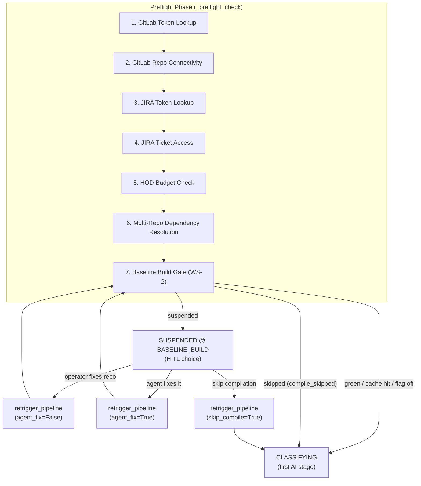
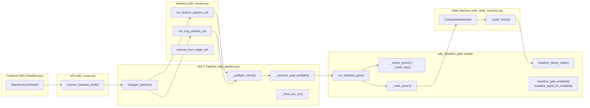
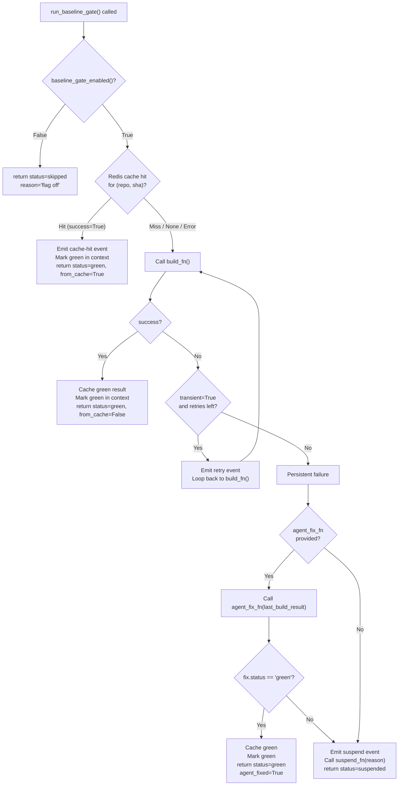
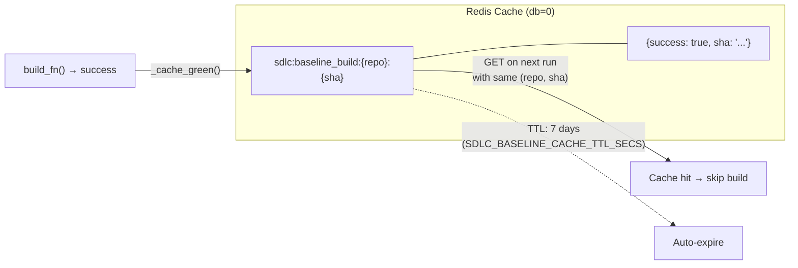
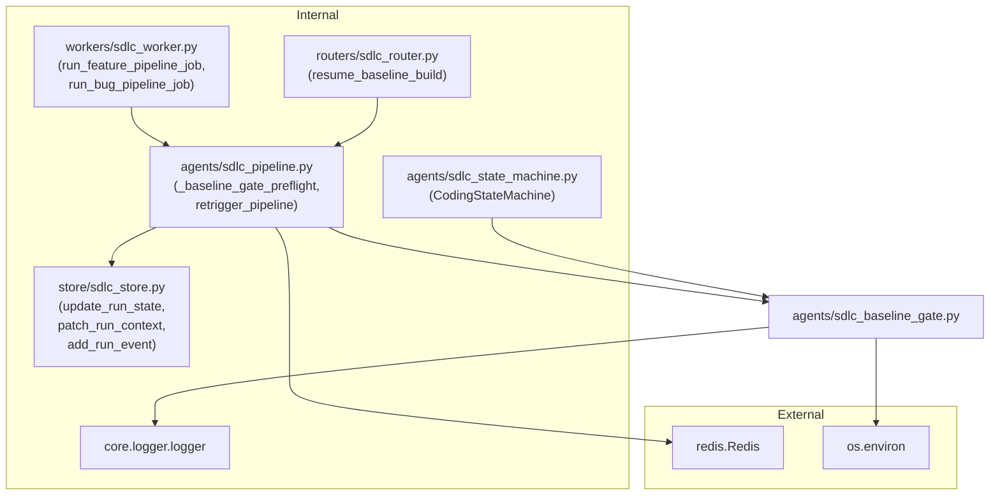

# SDLC Baseline Build Gate

## Overview

The **SDLC Baseline Build Gate** (`agents/sdlc_baseline_gate.py`) is a preflight quality gate — designated **WS-2** in the SDLC Agentic Loop RFD — that verifies a target repository compiles at HEAD *before* the AI coding agent makes any changes. It is the final step of the pipeline's preflight phase, running after credential checks, repo connectivity validation, HOD budget verification, and multi-repo dependency resolution, but before the `CLASSIFYING` stage begins.

### Why It Exists

SDLC pipeline runs frequently start against repositories that are already broken at HEAD. Without a baseline gate, these pre-existing failures surface *late* — at the `TESTING` stage, after `CODING`, `REVIEWING`, `CROSS_MODEL_REVIEW`, and `FIXING` have all completed — and get mis-attributed to the agent's diff. The baseline gate shifts this detection left: it builds HEAD as-is, and if the repo is broken, it **suspends** the run (never fails it) at `BASELINE_BUILD` with a clear reason and a human-in-the-loop choice for remediation.

### Key Design Principles

| Principle | Implementation |
|---|---|
| **Suspend-not-fail** | A persistent baseline-build failure transitions the run to `SUSPENDED` at `BASELINE_BUILD`. The run is never marked `FAILED`. |
| **Flag-gated default-off** | Controlled by `SDLC_ENABLE_BASELINE_GATE` (default `OFF`). When off, the gate is a complete no-op and the pipeline behaves identically to pre-WS-2. |
| **SHA-keyed warm cache** | Green baselines are cached in Redis keyed by `(repo, head_sha)` with a 7-day TTL, so repeated runs against the same commit skip the build entirely. |
| **Injected boundaries** | Every external dependency (`build_fn`, `redis_client`, `suspend_fn`, `event_fn`, `context_patch_fn`, `agent_fix_fn`) is injected, making the orchestration logic fully unit-testable on any platform. |
| **Telemetry attribution** | After a green baseline, the run context is stamped with `baseline_build.status = "green"`, enabling later build failures to be classified as `diff` (agent-caused) vs `baseline` (pre-existing). |

---

## Architecture

### Module Position in the SDLC Pipeline

The baseline gate sits at the end of the preflight phase, immediately before the first AI-driven stage (`CLASSIFYING`). It is invoked by `_preflight_check` → `_baseline_gate_preflight` within the main SDLC pipeline orchestrator.



### Component Relationships



---

## Core Components

### `run_baseline_gate()`

The primary entry point. Orchestrates the entire baseline build gate logic through a sequence of injected callbacks.

**Parameters:**

| Parameter | Type | Description |
|---|---|---|
| `run_id` | `str` | Unique run identifier for logging/events |
| `repo` | `str` | Namespace/project slug for the target repository |
| `head_sha` | `str` | Resolved HEAD commit SHA; used as cache key. Empty string disables caching. |
| `build_fn` | `Callable[[], dict]` | Builds HEAD as-is. Returns `{success, transient, errors, output}`. Server-side only. |
| `redis_client` | `redis.Redis` (optional) | SHA-keyed cache. `None` disables caching. Cache errors are non-fatal. |
| `suspend_fn` | `Callable[[str], None]` (optional) | Transitions the run to `SUSPENDED` at `BASELINE_BUILD`. |
| `event_fn` | `Callable[[str, str, dict], None]` (optional) | Run-event sink. Actor is a plain string. |
| `context_patch_fn` | `Callable[[dict], None]` (optional) | Persists a context marker on green. |
| `agent_fix_fn` | `Callable[[dict], dict]` (optional) | Agent-fix branch (RFD §4.2). Called once on persistent failure before suspending. |

**Return value:**

```python
{
    "status": "skipped" | "green" | "suspended",
    "from_cache": bool,
    "reason": str,
    "sha": str,
    # Additional fields when agent-fixed:
    "agent_fixed": True,
    "applied_files": [...],
    "rounds": int
}
```

### `baseline_failure_class()`

```python
def baseline_failure_class(run_context: Optional[dict]) -> str:
```

Classifies a build failure for telemetry purposes (RFD §4 WS-2.5). After a green baseline gate, the run context is stamped with `baseline_build.status = "green"`, so every later build failure can be labelled as:

- **`"diff"`** — the agent's change broke the build (baseline was green)
- **`"baseline"`** — the repo was already broken (baseline was never green or gate was skipped)

This keeps the "most failures are baseline" assumption falsifiable and enables accurate attribution of build failures to either pre-existing repo issues or the agent's changes.

### Environment Flag Helpers

| Function | Env Var | Default | Purpose |
|---|---|---|---|
| `baseline_gate_enabled()` | `SDLC_ENABLE_BASELINE_GATE` | `False` | Master switch for WS-2 |
| `baseline_agent_fix_enabled()` | `SDLC_BASELINE_AGENT_FIX` | `False` | Sub-switch for the agent-fix branch |
| `_retries()` | `SDLC_BASELINE_BUILD_RETRIES` | `2` | Max auto-retries for transient failures |
| `_cache_ttl()` | `SDLC_BASELINE_CACHE_TTL_SECS` | `604800` (7 days) | Redis cache TTL |

---

## Execution Flow

### Gate Decision Logic



### Detailed Phase Breakdown

#### Phase 1 — Warm-Cache Short-Circuit

When a Redis client is provided and `head_sha` is non-empty, the gate checks for a cached green result at key `sdlc:baseline_build:{repo}:{sha}`. A cache hit with `success=True` immediately returns `status="green"` with `from_cache=True`, stamps the run context, and emits a cache-hit event. Any Redis error is caught and logged as non-fatal — the gate continues to a live build.

#### Phase 2 — Build HEAD with Auto-Retry

The injected `build_fn` is called to compile HEAD as-is. The gate auto-retries transient failures (e.g., Docker daemon down, network blips) up to `SDLC_BASELINE_BUILD_RETRIES` times (default 2). A `build_fn` exception is treated as a transient infra failure so a flake never hard-suspends a healthy repo. On the first non-transient failure or when retries are exhausted, the gate proceeds to Phase 3.

#### Phase 3 — Persistent Failure Handling

On a persistent (non-transient, post-retry) build failure:

1. **Agent-fix branch (optional):** If `agent_fix_fn` is provided, it is called exactly once with the last build result. The function runs a code-profile loop against the build errors and returns `{"status": "green"|"failed", ...}`. On `"green"`, the gate caches the result, marks the context green, and returns `status="green"` with `agent_fixed=True`. On any other outcome, the gate falls through to suspend.

2. **Suspend (not fail):** The gate emits a suspend event with `build_failure_class="baseline"` and calls `suspend_fn(reason)`. The run transitions to `SUSPENDED` at `BASELINE_BUILD`. The reason string includes the first 5 error lines (or truncated output) and the SHA prefix for diagnostics.

---

## Integration Points

### Pipeline Integration (`_baseline_gate_preflight`)

The gate is wired into the SDLC pipeline through `_baseline_gate_preflight()` in `agents/sdlc_pipeline.py`. This helper:

- Resolves the HEAD SHA via GitLab API
- Creates a Redis client (db=0, 2s connect timeout)
- Constructs the `suspend_fn`, `event_fn`, and `context_patch_fn` closures that interact with `store.sdlc_store`
- Conditionally wires `agent_fix_fn` only when the operator chose "Let the agent fix it" AND both `SDLC_ENABLE_AGENTIC_LOOP` and `SDLC_BASELINE_AGENT_FIX` are enabled
- Short-circuits entirely when `compile_skipped` is set in run context (operator chose "Skip compilation & continue")

### Resume Flow (`retrigger_pipeline`)

When a run is suspended at `BASELINE_BUILD`, the operator has three choices surfaced through the UI:

| Action | `agent_fix` | `skip_compile` | `skip_tests` | Behaviour |
|---|---|---|---|---|
| "I'll fix the repo" | `False` | `False` | preserved | Re-runs the full pipeline; gate rebuilds HEAD |
| "Let the agent fix it" | `True` | `False` | preserved | Gate's agent-fix branch attempts autonomous repair |
| "Skip compilation & continue" | `False` | `True` | optional override | Bypasses baseline gate + all downstream compile points |

`retrigger_pipeline()` reconstructs the original issue dict from `context.original_issue`, stamps the chosen path, resets the run to `CREATED`, and re-enqueues the appropriate worker job (`run_feature_pipeline_job` or `run_bug_pipeline_job`). This is deliberately NOT `resume_from_stage` — `BASELINE_BUILD` is absent from `stage_sequence_for()` because it runs inside preflight, before any artifact-backed stage.

### API Endpoint

```
POST /sdlc/runs/{run_id}/baseline/resume
```

Handled by `resume_baseline_build()` in `routers/sdlc_router.py`. Accepts a `BaselineResumeRequest` body with `agent_fix`, `skip_compile`, and `skip_tests` fields. Delegates to `retrigger_pipeline()`.

### Frontend UI

The `BaselineActionPanel` component (in `ai-ui/src/components/SDLCPipeline.jsx`) renders when a run is suspended at `BASELINE_BUILD`. It displays:
- The suspend reason (build errors)
- A "Skip Tests + SLT" checkbox (explicit opt-out, never automatic)
- Three action buttons mapping to the three resume paths above

### Telemetry Consumption

The `baseline_failure_class()` function is consumed by `CodingStateMachine._build_check()` and related build/test phases to label build failures as `diff` or `baseline` in run events. This data feeds the SDLC pipeline's confidence scoring and the frontend's `GateSignalRow` component for review signal display.

---

## Caching Strategy



- **Key format:** `sdlc:baseline_build:{repo}:{head_sha}`
- **Value:** JSON `{"success": true, "sha": "..."}`
- **TTL:** 7 days (configurable via `SDLC_BASELINE_CACHE_TTL_SECS`)
- **Write:** Only on green builds (live or agent-fixed)
- **Read:** At gate entry; any Redis error is non-fatal (log + continue to live build)
- **Disable:** Pass `redis_client=None` or `head_sha=""` to always build live

---

## Agent-Fix Branch (RFD §4.2)

The agent-fix branch is an optional autonomous repair path that fires when a persistent baseline build failure occurs. It is gated by three independent conditions:

1. **Server flag:** `SDLC_BASELINE_AGENT_FIX=True`
2. **Master loop flag:** `SDLC_ENABLE_AGENTIC_LOOP=True` (the agentic loop master switch)
3. **Per-run flag:** `issue["baseline_agent_fix"]=True` (set by the operator's "Let the agent fix it" action)

When all three are satisfied, `_baseline_gate_preflight` wires an `agent_fix_fn` closure that invokes `_run_baseline_agent_fix()`. This function:

- Runs the code-profile agentic loop (see [sdlc_agent_loop](../agents/sdlc_agent_loop.md)) against the build errors
- Edits the run workspace and re-compiles as its exit oracle
- Returns `{"status": "green"|"failed", "applied_files": [...], "rounds": int, "reason": str}`

On `"green"`, the gate treats the baseline as repaired, caches the result, and proceeds. On any other outcome, it falls through to the normal suspend path — the agent-fix failure is non-fatal to the gate's suspend-not-fail contract.

---

## Dependencies



### Related Module Documentation

- **[sdlc_pipeline_core](sdlc_pipeline_core.md)** — Pipeline orchestration, preflight, and stage driving
- **[sdlc_state_machine](sdlc_state_machine.md)** — `CodingStateMachine` with build/test phases that consume `baseline_failure_class()`
- **[sdlc_agent_loop](../agents/sdlc_agent_loop.md)** — `AgentLoop` used by the agent-fix branch
- **[sdlc_pipeline_workers](../workers/sdlc_pipeline_workers.md)** — Worker jobs that trigger the pipeline
- **[sdlc_pipeline](sdlc_pipeline.md)** — Frontend `SDLCPipeline` and `BaselineActionPanel` components

---

## Environment Variables

| Variable | Default | Description |
|---|---|---|
| `SDLC_ENABLE_BASELINE_GATE` | `false` | Master switch for the baseline build gate (WS-2) |
| `SDLC_BASELINE_AGENT_FIX` | `false` | Sub-switch for the agent-fix autonomous repair branch |
| `SDLC_BASELINE_BUILD_RETRIES` | `2` | Max auto-retries for transient build failures |
| `SDLC_BASELINE_CACHE_TTL_SECS` | `604800` (7d) | Redis cache TTL for green baseline results |
| `SDLC_ENABLE_AGENTIC_LOOP` | `false` | Master switch for the agentic loop (required by agent-fix) |

---

## Testability

The module is designed for full unit-testability on any platform (including Windows, where Docker/Maven builds don't run). The actual build (`workspace clone + Docker/Maven compile`) only runs on Ubuntu via the injected `build_fn`. All orchestration logic — flag checking, Redis SHA cache, retry policy, suspend decision, baseline-vs-diff telemetry — is pure Python with every boundary injected:

| Boundary | Injection Point | Test Strategy |
|---|---|---|
| Build execution | `build_fn` | Mock returning `{success, transient, errors, output}` |
| Caching | `redis_client` | Mock or `None` to disable |
| State suspension | `suspend_fn` | Mock capturing the reason string |
| Event recording | `event_fn` | Mock capturing actor/message/data |
| Context marking | `context_patch_fn` | Mock capturing the patch dict |
| Agent repair | `agent_fix_fn` | Mock returning green/failed outcomes |
