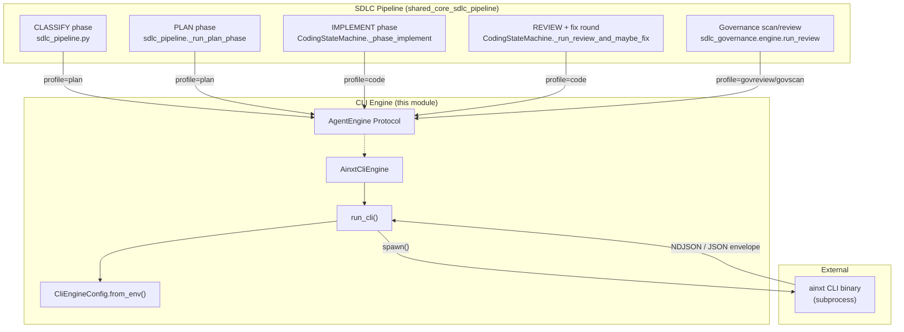
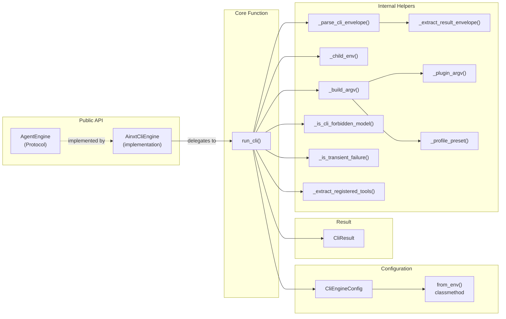
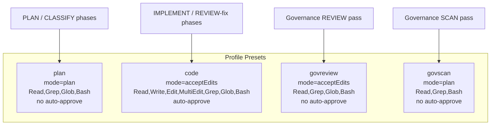
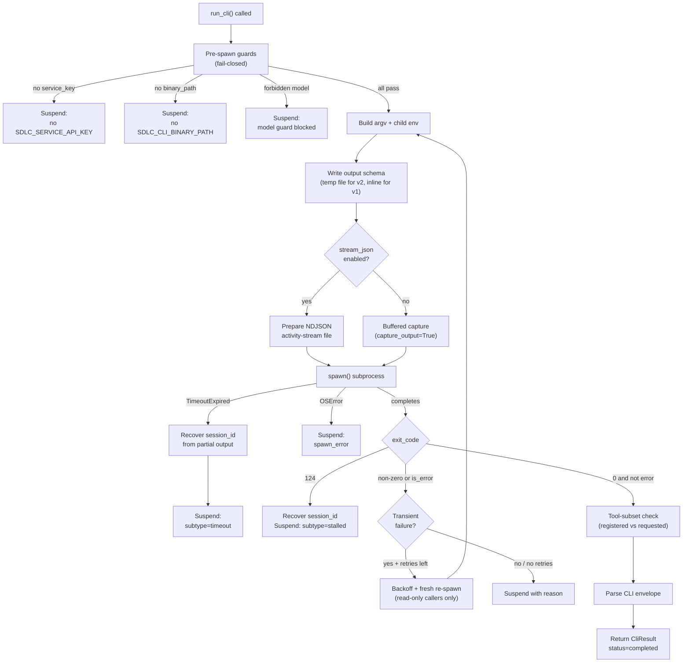
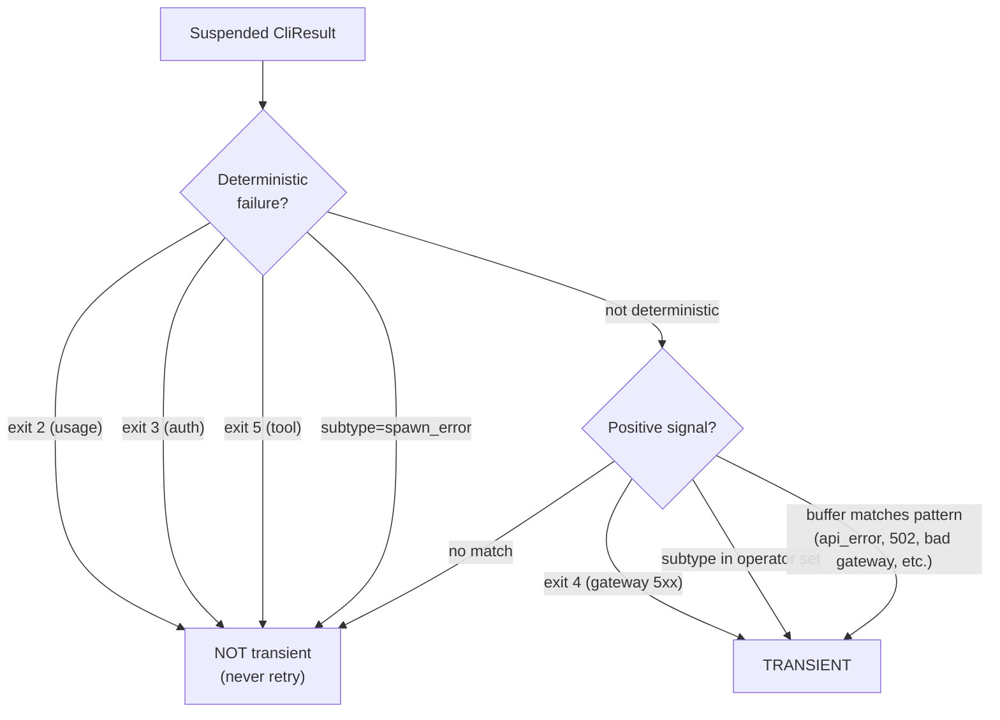
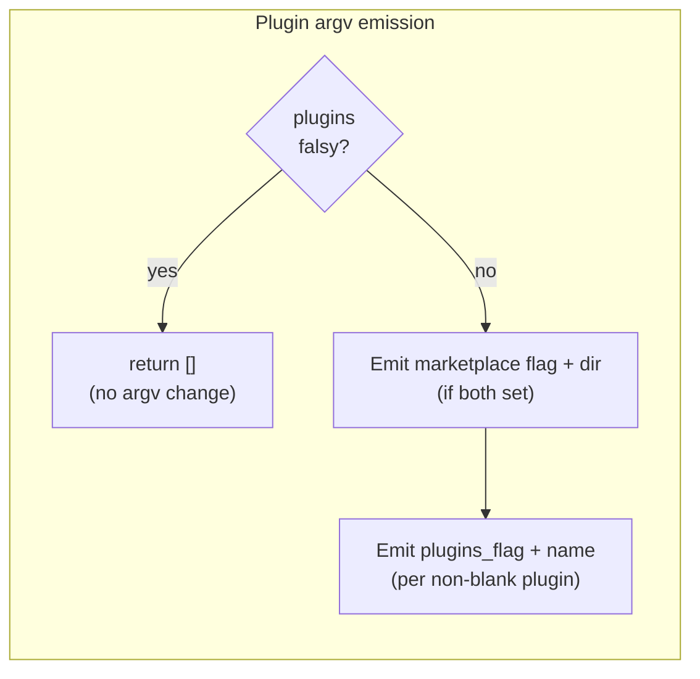
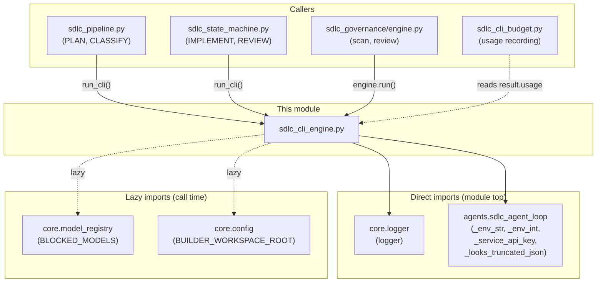

# SDLC CLI Engine

## Introduction

The `sdlc_cli_engine` module (`agents/sdlc_cli_engine.py`) is the **subprocess adapter and replaceable engine seam** for the SDLC pipeline's CLI-driven phases. It wraps invocation of the `ainxt` CLI binary behind a small `AgentEngine` protocol, so the concrete implementation (`AinxtCliEngine` / `run_cli`) can be swapped out later without touching call sites.

This module is the execution boundary between the platform's Python SDLC state machine and the external `ainxt` headless CLI binary. Every PLAN, IMPLEMENT, REVIEW-fix, and governance scan/review session that runs through the CLI passes through `run_cli`.

### Hard Constraints

The module enforces three non-negotiable design constraints:

| Constraint | Mechanism |
|---|---|
| **Import side-effect-free** | Only stdlib + `core.logger` at module import time. `core.model_registry` is imported lazily inside `_is_cli_forbidden_model`. No Postgres/Redis/Docker/network at import time. |
| **Env read at call time** | All configuration is read via `CliEngineConfig.from_env()` on every invocation, so a deploy-time env flip needs no process restart. |
| **Suspend-not-fail** | `run_cli` never raises on a normal failure (bad exit code, timeout, missing binary/key, blocked model). It always returns a `CliResult` with `status="suspended"` and a `reason`. |

---

## Architecture

### Module Position in the SDLC Pipeline



The CLI engine sits between the SDLC pipeline phases (which are Python-side state machine logic) and the external `ainxt` CLI binary (a headless coding agent). Each pipeline phase constructs a prompt, selects a **profile** (which determines the toolset and permission mode), and calls `run_cli` or `AinxtCliEngine.run()`.

### Component Relationships



---

## Core Components

### `AgentEngine` (Protocol)

The replaceable boundary. Defines the minimal contract any CLI engine must satisfy:

```python
class AgentEngine(Protocol):
    def run(
        self, *,
        workspace_root: str,
        prompt: str,
        profile: str,
        model: str,
        output_schema: Optional[dict] = None,
        max_turns: Optional[int] = None,
        run_id: str = "",
        plugins: Optional[list] = None,
        plugin_marketplace: str = "",
    ) -> CliResult: ...
```

Any future engine (e.g., a direct API-based engine replacing the subprocess CLI) implements this protocol and is dropped into the same call sites.

### `AinxtCliEngine`

The first `AgentEngine` implementation. Wraps `run_cli`. Config is resolved fresh (via `CliEngineConfig.from_env()`) on every `run()` call unless a config was supplied at construction, so env flips apply without a restart. The `spawn` callable is injectable for unit testing.

### `CliEngineConfig`

A dataclass holding all configuration for one `run_cli` invocation. Read at **call time** via `.from_env()` — never cached at import time.

| Field | Env Var | Default | Purpose |
|---|---|---|---|
| `binary_path` | `SDLC_CLI_BINARY_PATH` | `""` | Path to the `ainxt` binary |
| `gateway_url` | `SDLC_CLI_GATEWAY_URL` | `""` | Gateway URL for CLI's own settings/policy endpoints |
| `service_key` | `SDLC_SERVICE_API_KEY` | `""` | Gateway Bearer auth token (fail-closed if empty) |
| `timeout_secs` | `SDLC_CLI_TIMEOUT_SECS` | `1800` | Wall-clock cap for the subprocess |
| `flavor` | `SDLC_CLI_FLAVOR` | `"v2"` | CLI flavor: `"v2"` (default) or `"v1"` (older `--full` path) |
| `resume_enabled` | `SDLC_CLI_RESUME_ENABLED` | `true` | Whether `--resume` is emitted for session continuation |
| `resume_flag` | `SDLC_CLI_RESUME_FLAG` | `"--resume"` | The resume flag name |
| `no_review` | `SDLC_CLI_NO_REVIEW` | `true` | Skip the CLI's automatic post-change code review |
| `stream_json` | `SDLC_CLI_STREAM_JSON` | `true` | Run in stream-json + verbose mode with live NDJSON tee |
| `log_dir` | `SDLC_CLI_LOG_DIR` | `""` | Base dir for NDJSON activity-stream files |
| `stall_timeout_ms` | `SDLC_CLI_STALL_TIMEOUT_MS` | `0` | Idle/stall watchdog control (0 = disabled) |
| `plugins_flag` | `SDLC_CLI_PLUGIN_FLAG` | `"--plugin"` | Per-plugin flag name (governance seam) |
| `plugin_marketplace_flag` | `SDLC_CLI_PLUGIN_MARKETPLACE_FLAG` | `""` | Marketplace/plugins-dir flag |
| `plugins_settings_flag` | `SDLC_CLI_PLUGIN_SETTINGS_FLAG` | `""` | Settings-file variant (documented, not yet wired) |

### `CliResult`

The outcome of every `run_cli` call. Never raised — always returned.

| Field | Type | Description |
|---|---|---|
| `status` | `str` | `"completed"` or `"suspended"` |
| `reason` | `str` | Human-readable reason for suspension |
| `result_text` | `str` | Raw result text from the CLI envelope |
| `structured_output` | `Optional[dict]` | Parsed structured output (from `output_schema`) |
| `is_error` | `bool` | Whether the CLI reported an error |
| `subtype` | `str` | Error subtype (e.g., `"timeout"`, `"stalled"`, `"spawn_error"`) |
| `exit_code` | `int` | Subprocess exit code |
| `usage` | `dict` | Token usage from the CLI |
| `total_cost_usd` | `float` | Cost in USD |
| `session_id` | `str` | CLI session ID (for `--resume`) |
| `transient` | `bool` | Whether the failure is a retryable upstream/proxy blip |

Properties: `.completed` and `.suspended` are convenience booleans.

---

## Profile Presets

Profiles determine the **permission mode**, **allowed tools**, and **auto-approve** setting for a CLI session. They are the primary mechanism for scoping what the CLI can do in each pipeline phase.



| Profile | Permission Mode | Allowed Tools | Auto-Approve | Used By |
|---|---|---|---|---|
| `plan` | `plan` | `Read,Grep,Glob,Bash` | No | PLAN, CLASSIFY (read-only exploration) |
| `code` | `acceptEdits` | `Read,Write,Edit,MultiEdit,Grep,Glob,Bash` | Yes | IMPLEMENT, REVIEW fix round (full coding) |
| `govreview` | `acceptEdits` | `Read,Grep,Glob,Bash` | No | Governance REVIEW (reads diff, runs skill scripts, no tree mutation) |
| `govscan` | `plan` | `Read,Grep,Bash` | No | Governance SCAN (strictly read-only scan) |

**Key design rationale**: The `code` profile grants the same toolset a human gets in auto/acceptEdits mode. Restricting it to `Read,Edit,Bash` bought no safety (Bash in acceptEdits is already a superset) while forcing slow workarounds (shell-out `grep`/`find` instead of native Grep/Glob, `bash` heredocs instead of Write). Native tools let IMPLEMENT converge in far fewer turns.

Unknown profiles conservatively fall back to the `plan` preset (read-only, no auto-approve).

---

## `run_cli` — The Core Function

### Execution Flow



### Pre-Spawn Guards (Fail-Closed)

Three guards run before any subprocess is spawned. Each returns a suspended `CliResult` immediately:

1. **No service key** — refuses to spawn without `SDLC_SERVICE_API_KEY` (never a user JWT; mirrors `_service_api_key`'s fail-closed semantics).
2. **No binary path** — refuses to spawn without `SDLC_CLI_BINARY_PATH`.
3. **Forbidden model** — blocks Opus and any model in `BLOCKED_MODELS` (the platform's REVIEW gate uses Opus directly via `code_review`, NOT through this engine).

### Model Guard

`_is_cli_forbidden_model` lazily imports `core.model_registry.BLOCKED_MODELS` (keeping the module import side-effect-free). It blocks:
- Any model ID containing "opus" (case-insensitive)
- Any model in `BLOCKED_MODELS`
- Opus when `ENABLE_OPUS` is false (belt-and-suspenders)

### Argv Construction (`_build_argv`)

The argv builder handles two CLI flavors and several feature seams:

```mermaid
graph TD
    subgraph "argv construction order"
        A["binary_path"]
        B["--full (v1 only)"]
        C["--print prompt"]
        D["--output-format stream-json|json"]
        E["--model model"]
        F["--permission-mode mode"]
        G["--verbose (stream-json required)"]
        H["--include-hook-events --include-partial-messages (v1 only)"]
        I["--no-review (if enabled)"]
        J["--dangerously-skip-permissions (v1) / --yes (v2)"]
        K["--allowed-tools tool1 tool2 ... (variadic, split)"]
        L["--plugin name (per plugin, if any)"]
        M["--json-schema inline (v1) / --output-schema file (v2)"]
        N["--max-turns N"]
        O["--resume session_id (v2 only, if enabled + provided)"]
    end
    
    A --> B --> C --> D --> E --> F --> G --> H --> I --> J --> K --> L --> M --> N --> O
```



**Critical detail — `--allowed-tools` format**: The binary's flag is variadic (`--allowed-tools <tools...>`, each tool a separate argv token). Passing the preset as a single comma-joined token caused the binary to see one unknown tool name, ignore it, and fall back to its default `[Bash,Edit,Read]` — dropping MultiEdit/Grep/Glob/Write. The split into separate tokens lives in `_build_argv`.

### Child Environment (`_child_env`)

The child env is a copy of the current process env (preserving `HTTP(S)_PROXY` / `NO_PROXY`) plus:

| Env Var | Purpose |
|---|---|
| `AINXT_GATEWAY_URL` | CLI binary's settings/policy endpoint base |
| `AINXT_API_KEY` | Gateway Bearer auth token |
| `NO_COLOR` | Disable ANSI color (prevent escape codes in JSON) |
| `AINXT_BYPASS_ACK` | Auto-enable for v1 outside sandbox (allows `--dangerously-skip-permissions`) |
| `AINXT_STALL_TIMEOUT_MS` | Idle watchdog control (see below) |

**Stall watchdog semantics** (`stall_timeout_ms`):
- `>0` → export exactly this millisecond threshold
- `0` (default) → DISABLE: pin the watchdog just past the wall-clock cap so the binary never self-exits 124 before our timeout fires
- `<0` → leave the binary's own default (120s) untouched

### Stream JSON Activity Capture

When `stream_json=True` (default), the CLI runs in `stream-json` + `--verbose` mode and its stdout is redirected straight to a per-run NDJSON file **as it is written** (not buffered to the end). This file is the artifact to open when a run is stuck — its last lines are the last thing the CLI did before going silent.

Files land at `<log_dir>/<run_id>/<profile>-<ts>-<rand>.ndjson` (+ `.err` sidecar).

### Transient Failure Detection and Retry

`_is_transient_failure` detects retryable upstream/proxy blips (502/503/api_error/connection reset) by **exclusion**:



**Retry behavior**: Only read-only callers (PLAN/CLASSIFY, `profile="plan"`) opt into a bounded fresh re-spawn via `transient_retries`. IMPLEMENT (`profile="code"`) keeps `transient_retries=0` and instead reads `result.transient` at its call site to **continue the same session** on the untouched workspace (a fresh re-run is unsafe for a phase that mutated the workspace).

Backoff: exponential with jitter, base 2s, cap 30s.

### Envelope Parsing

`_extract_result_envelope` tolerates log lines, banners, NDJSON, and trailing text around the JSON envelope. Strategy (in order):
1. Whole-string parse
2. Per-line parse (envelope amid logs / NDJSON / stream-json)
3. String-aware brace-matched scan for balanced multi-line `{...}` blocks

Prefers the object with `type=="result"` (the documented envelope), else falls back to the last JSON object seen.

`_parse_cli_envelope` never raises — a missing/unparseable envelope is surfaced as a completed `CliResult` with `structured_output=None` and `is_error=True`.

### Tool-Subset Verification

After a successful spawn, `_extract_registered_tools` best-effort parses the CLI's `system`/`init` event (`{"type":"system","subtype":"init","tools":[...]}`) to verify that every tool requested via `--allowed-tools` was actually registered. A subset means MultiEdit/Grep/Glob/Write were dropped, so the coder falls back to one Edit round-trip per change. Returns `None` when no init event is present (unknown, not empty).

---

## Plugin Loading Seam

`_plugin_argv` builds the argv fragment that loads governance plugins into a headless CLI run. It is **additive**: returns `[]` when no plugins are requested, so every existing PLAN/IMPLEMENT/REVIEW caller (which passes no plugins) gets a byte-identical argv.



> **Note**: As of the current codebase, governance skills are loaded via **prompt text** (SKILL.md content inlined into the prompt + skill folders staged read-only in the workspace), NOT via the CLI plugin mechanism. The `plugins=` / `plugin_marketplace=` parameters are accepted for call-site compatibility but are not passed by governance callers. See [sdlc_governance](sdlc_governance.md) for details.

---

## v1 vs v2 Flavor

| Aspect | v1 (`--full`) | v2 (default) |
|---|---|---|
| Leading flag | `--full` required | None |
| Schema | Inline via `--json-schema` | File path via `--output-schema` |
| Unattended flag | `--dangerously-skip-permissions` | `--yes` |
| Resume | Not supported | `--resume session_id` |
| Stream extras | `--include-hook-events --include-partial-messages` | Standard stream-json |
| Bypass ack | `AINXT_BYPASS_ACK=1` auto-set | Not needed |

---

## How Callers Use This Module

### PLAN Phase (`sdlc_pipeline._run_plan_phase`)

```python
result = run_cli(
    config=CliEngineConfig.from_env(),
    workspace_root=workspace_root,
    prompt=prompt,
    profile="plan",              # read-only
    model=cli_model_for("plan"),
    output_schema=PLAN_SCHEMA,
    max_turns=max_turns,
    run_id=run_id,
    transient_retries=2,         # read-only: safe to re-spawn on 502
)
```

### IMPLEMENT Phase (`CodingStateMachine._phase_implement`)

```python
result = run_cli(
    config=CliEngineConfig.from_env(),
    workspace_root=self._run_workspace_path,
    prompt=self._build_implement_prompt(plan),
    profile="code",              # full coding toolset
    model=cli_model_for("coder"),
    max_turns=_max_turns,
    run_id=self.run_id,
    resume_session_id=_resume_sid,  # manual resume support
)
```

On `error_max_turns` / `timeout` / `stalled` / `transient` with a session_id, IMPLEMENT issues **one bounded auto-continue** (`--resume` the same session with a small turn budget and a STOP-focused continue prompt).

### Governance Review (`sdlc_governance.engine.run_review`)

```python
result = engine.run(
    workspace_root=workspace_root,
    prompt=_prompt,
    profile="govreview",         # read diff, run scripts, no tree mutation
    model=model,
    output_schema=GOVERNANCE_SCHEMA,
    max_turns=max_turns,
    run_id=run_id,
)
```

---

## Dependencies



### Related Module Documentation

- **[sdlc_agent_loop](../agents/sdlc_agent_loop.md)** — The bounded Anthropic tool-use loop (`AgentLoop`) used for recovery-on-red scenarios. Provides the env-reader helpers (`_env_str`, `_env_int`, `_service_api_key`, `_looks_truncated_json`) reused by this module.
- **[sdlc_state_machine](sdlc_state_machine.md)** — The persistent state machine (`CodingStateMachine`) that drives IMPLEMENT, REVIEW, APPLYING, TEST_VERIFY, and COMMITTING phases. The primary caller of `run_cli` for coding sessions.
- **[sdlc_pipeline](sdlc_pipeline.md)** — The pipeline orchestrator that runs CLASSIFY and PLAN phases via `run_cli`, plus governance scan/review dispatch.
- **[sdlc_governance](sdlc_governance.md)** — The governance engine that runs scan/review CLI sessions using `govreview` and `govscan` profiles.
- **[sdlc_coder_tools](sdlc_coder_tools.md)** — Tool dispatcher for the SDLC coder (read_file, search_symbols, find_callers, find_dependencies).
- **[sdlc_metrics](sdlc_metrics.md)** — Exploration metrics logging for CLI runs.

---

## Exit Code Reference

| Exit Code | Reason | Transient? |
|---|---|---|
| 0 | Success | N/A |
| 2 | Bad CLI usage | No |
| 3 | Auth: provision `~/.ainxt/credentials.json` | No |
| 4 | Gateway/network 5xx | Yes |
| 5 | Tool failure | No |
| 124 | Stalled — no progress within stall timeout (binary self-exit) | No |
| 130 | Interrupted | No |
| -1 | Timeout (our `subprocess.TimeoutExpired`) or spawn error | Timeout: context-dependent |

---

## Environment Variable Reference

| Variable | Default | Description |
|---|---|---|
| `SDLC_CLI_BINARY_PATH` | `""` | Path to the `ainxt` binary |
| `SDLC_CLI_GATEWAY_URL` | `""` | Gateway URL for CLI's own endpoints |
| `SDLC_SERVICE_API_KEY` | `""` | Service API key (fail-closed if empty) |
| `SDLC_CLI_TIMEOUT_SECS` | `1800` | Wall-clock timeout |
| `SDLC_CLI_FLAVOR` | `v2` | CLI flavor (`v1` or `v2`) |
| `SDLC_CLI_RESUME_ENABLED` | `true` | Enable `--resume` capability |
| `SDLC_CLI_RESUME_FLAG` | `--resume` | Resume flag name |
| `SDLC_CLI_NO_REVIEW` | `true` | Skip CLI's automatic post-change review |
| `SDLC_CLI_STREAM_JSON` | `true` | Enable stream-json + live NDJSON capture |
| `SDLC_CLI_LOG_DIR` | `""` | Base dir for NDJSON activity-stream files |
| `SDLC_CLI_STALL_TIMEOUT_MS` | `0` | Stall watchdog (0=disabled, >0=threshold, <0=binary default) |
| `SDLC_CLI_PLUGIN_FLAG` | `--plugin` | Per-plugin flag name |
| `SDLC_CLI_PLUGIN_MARKETPLACE_FLAG` | `""` | Marketplace/plugins-dir flag |
| `SDLC_CLI_PLUGIN_SETTINGS_FLAG` | `""` | Settings-file variant flag |
| `SDLC_CLI_TRANSIENT_SUBTYPES` | `""` | Comma-separated extra transient subtypes |
| `ENABLE_OPUS` | `true` | Whether Opus models are allowed (model guard) |
| `AINXT_BYPASS_ACK` | (auto for v1) | Allow `--dangerously-skip-permissions` outside sandbox |
| `AINXT_STALL_TIMEOUT_MS` | (derived) | Binary's idle watchdog threshold |
