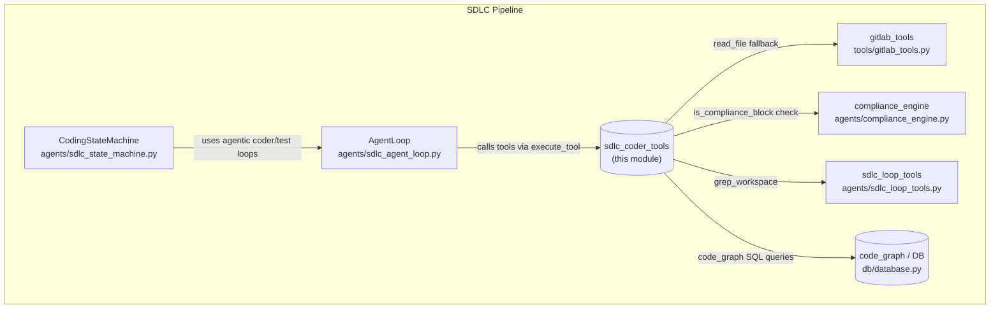
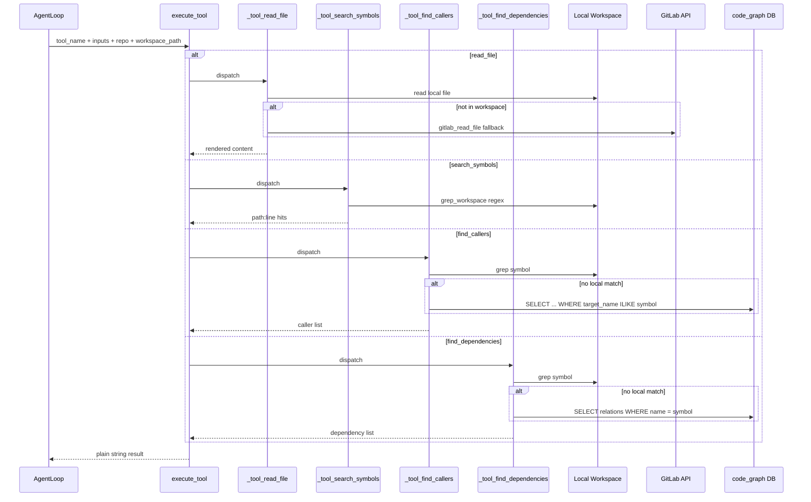
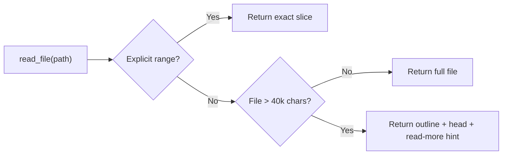

# SDLC Coder Tools

## Brief Introduction

`sdlc_coder_tools` is a lightweight, read-only tool dispatcher that gives the AI coding agent direct, deterministic access to the checked-out source tree during SDLC (Software Development Life Cycle) runs. It exposes four code-navigation tools—`read_file`, `search_symbols`, `find_callers`, and `find_dependencies`—in the Anthropic tool-use format, and routes each tool call to the correct implementation.

The module is intentionally scoped: it does **not** generate code, run builds, or mutate the workspace. Its only job is to help the agent understand the codebase so that downstream planning, coding, and test-fix loops can make grounded, surgical edits.

---

## Module Purpose and Core Functionality

### What Problem It Solves

During an SDLC run, the AI agent must reason about a repository it did not write. Stale RAG indexes, hallucinated file paths, and oversized file reads are common failure modes. `sdlc_coder_tools` solves these by:

1. **Reading from the live checkout first**, falling back to GitLab only when the local workspace is unavailable.
2. **Enforcing a region-read policy** so the model cannot accidentally pull in hundreds of thousands of characters in a single turn.
3. **Searching the workspace with `grep`-style regex** instead of relying on potentially stale vector indexes.
4. **Providing lightweight dependency/caller lookups** over the local checkout and the `code_graph` table.

### Core Components

| Component | Responsibility |
|-----------|----------------|
| `SDLC_CODER_TOOLS` | The tool schema array passed to the LLM (`run_tool_use_via_proxy`). |
| `execute_tool` | Central dispatcher invoked by the agent loop for every tool-use block. |
| `_tool_read_file` | Reads a file from the workspace or GitLab, with outline/head rendering for large files. |
| `_tool_search_symbols` | Regex search over the local workspace only. |
| `_tool_find_callers` | Reverse 1-hop lookup: who imports/calls/extends a symbol. |
| `_tool_find_dependencies` | Forward 1-hop lookup: what a symbol imports/calls/extends. |

### Tool Definitions

#### `read_file`

```python
{
    "name": "read_file",
    "description": "Read a file from the checked-out workspace...",
    "input_schema": {
        "type": "object",
        "properties": {
            "path": {"type": "string"},
            "start_line": {"type": "integer"},
            "end_line": {"type": "integer"},
        },
        "required": ["path"],
    },
}
```

- If `start_line`/`end_line` are provided, the exact range is returned (1-based, inclusive).
- If no range is provided and the file is larger than `_LARGE_READ_CHARS` (40,000 chars), the tool returns:
  - A deterministic outline of top-level signatures with line numbers.
  - The first `_HEAD_LINES` (150) lines.
  - Instructions to call again with a line range.
- Compliance-blocked content is rejected and returned as a tool error so the loop treats it as unreadable.

#### `search_symbols`

```python
{
    "name": "search_symbols",
    "description": "Regex search over the freshly-cloned workspace...",
    "input_schema": {
        "type": "object",
        "properties": {
            "query": {"type": "string"}
        },
        "required": ["query"],
    },
}
```

- Treats `query` as a Python regex matched per line.
- Searches **only** the local workspace; no vector/RAG fallback.
- Returns `path:line: text` hits or a refine-the-pattern message on no match.

#### `find_callers`

Reverse 1-hop traversal: returns classes/files that import, call, or extend the given symbol. Prefers a local `grep` over the checkout; falls back to the `code_graph` table.

#### `find_dependencies`

Forward 1-hop traversal: returns what a symbol extends, implements, imports, or calls. Also prefers local `grep` and falls back to `code_graph`.

---

## Architecture and Component Relationships

### Where It Sits in the System

`sdlc_coder_tools` is a leaf utility consumed by the agentic exploration/coding loops inside the SDLC pipeline. It is not a standalone service and does not own any persistent state.



### Internal Flow



### Region-Read Policy



---

## How the Module Fits into the Overall System

### Consumption Path

1. A Jira ticket or user trigger creates an SDLC run.
2. `CodingStateMachine` materializes a per-run workspace clone.
3. When agentic coding is enabled (post-gate recovery or exploration), `AgentLoop` invokes the tool schemas registered for the `code`/`explore` profile.
4. `execute_tool` is the `tool_executor` callback passed to `run_tool_use_via_proxy`.
5. The agent uses `read_file`/`search_symbols`/`find_callers`/`find_dependencies` to ground its edits.
6. Actual writes, builds, and tests are handled by other modules (`sdlc_loop_tools`, `sdlc_patch_engine`, `WorkspaceBuilder`).

### Related Modules

| Module | Relationship |
|--------|--------------|
| [sdlc_state_machine](sdlc_state_machine.md) | Owns the run lifecycle and decides when agentic loops fire. |
| [sdlc_agent_loop](../agents/sdlc_agent_loop.md) | Drives the tool-use loop; passes tool calls to `execute_tool`. |
| [sdlc_loop_tools](sdlc_loop_tools.md) | Provides `grep_workspace` and the broader code/test tool context. |
| [compliance_engine](../compliance_engine.md) | Supplies `is_compliance_block`; rejected content is surfaced as a tool error. |
| [gitlab_tools](../connectors/gitlab_tools.md) | Fallback remote file reader when the local workspace lacks a file. |
| [db/database](../db/database.md) | Source of the `code_graph` table for caller/dependency lookups. |

---

## Key Design Decisions

1. **Workspace-first reads**: Local checkout is always preferred over GitLab API and over any RAG index, because it reflects the exact branch and commit the run is targeting.
2. **No vector search in `search_symbols`**: The `document_embeddings` / pgvector index is deliberately not consulted because it is routinely stale relative to the cloned code.
3. **Deterministic outline rendering**: Large-file outlines are built with regex, not an LLM, so they are fast and reproducible.
4. **Fail-open tool errors**: Every tool catches exceptions and returns a plain `[tool error] ...` string so the LLM can recover instead of crashing the loop.
5. **Compliance guard on read**: If a file's content carries the compliance-block sentinel, it is rejected so the agent does not act on redacted/blocked source.

---

## Configuration and Tuning

The module uses hardcoded constants for the region-read policy:

```python
_LARGE_READ_CHARS = 40000   # threshold for outline + head rendering
_HEAD_LINES = 150           # lines shown in the head section
```

Earlier versions read these from environment variables (`SDLC_READ_OUTLINE_OVER_CHARS`, `SDLC_READ_HEAD_LINES`), but they were collapsed to constants to avoid per-deployment tuning drift.

No other runtime configuration is required.

---

## Error Handling and Observability

- All tool implementations wrap errors and return a string starting with `[tool error]`.
- `logger.warning` / `logger.error` is used for operational issues (GitLab fallback failure, compliance block, workspace missing).
- Structured logging includes `run_id`, `symbol`, `files_matched`, and `matches` for `search_symbols`.

---

## References

- [sdlc_state_machine](sdlc_state_machine.md) — run orchestration and phase transitions.
- [sdlc_agent_loop](../agents/sdlc_agent_loop.md) — bounded tool-use loop that consumes these tools.
- [sdlc_loop_tools](sdlc_loop_tools.md) — workspace grep and broader tool context.
- [compliance_engine](../compliance_engine.md) — content blocking and redaction.
- [gitlab_tools](../connectors/gitlab_tools.md) — remote file access fallback.
