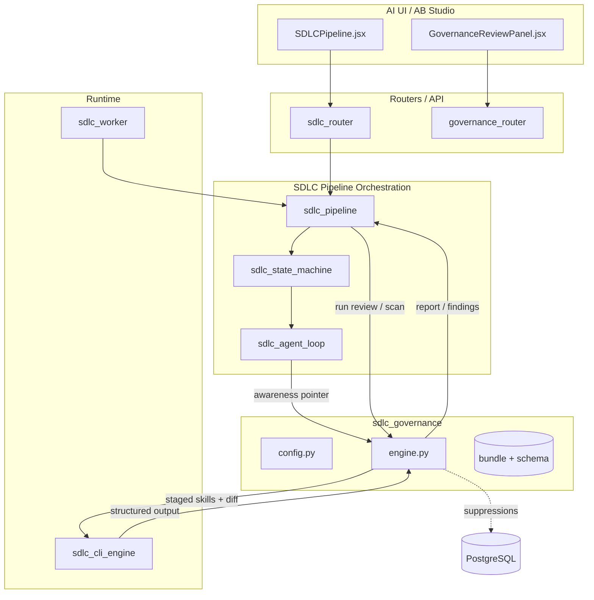
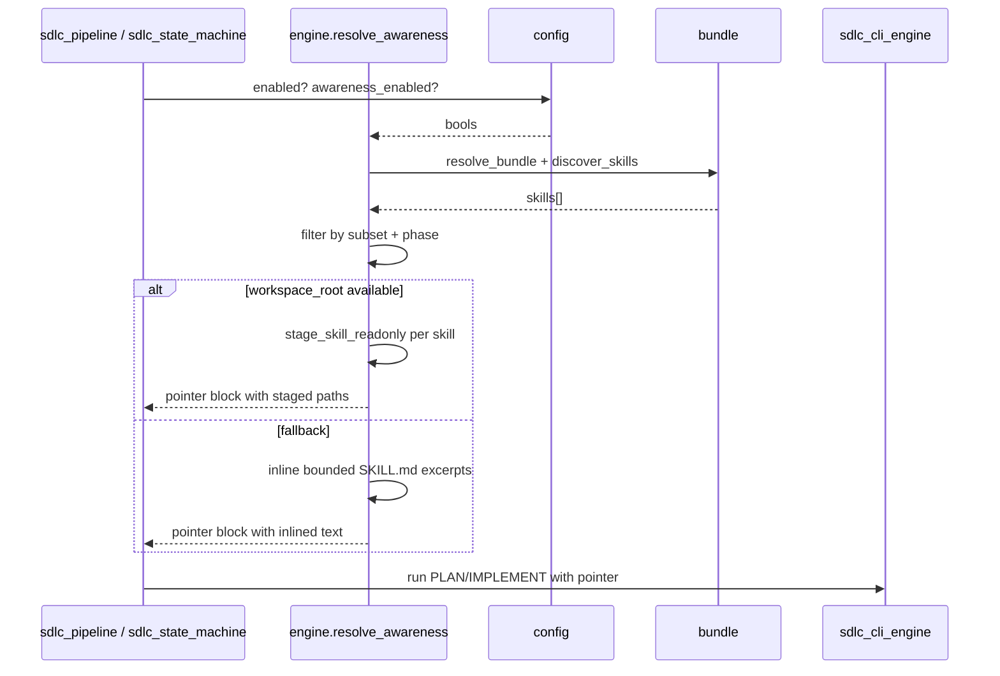
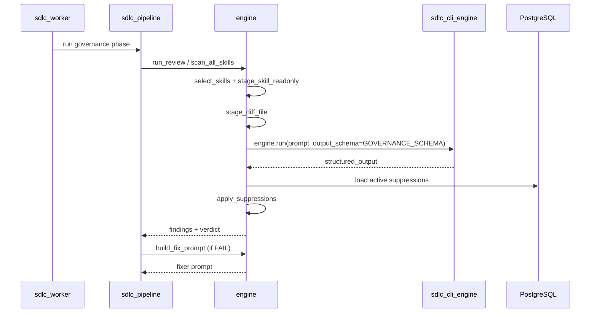

# SDLC Governance Module

## Purpose

The `sdlc_governance` module is the governance enforcement layer inside the broader [shared_core_sdlc_pipeline](shared_core_sdlc_pipeline.md). It makes enterprise standards (e.g., enterprise architecture, information security, data protection) actionable during AI-assisted software development by:

1. **Awareness** – injecting the right governance skill context into PLAN and IMPLEMENT CLI prompts so the coding agent knows which standards are binding for a change.
2. **Review / Scan** – running a dedicated governance review phase over a unified diff, using per-skill analyzer scripts and a structured output schema.
3. **Fix** – producing a minimal-diff fixer prompt for any open governance findings.
4. **Reporting** – rendering per-skill, per-domain verdicts and findings as markdown for MR notes, UI panels, and audit artifacts.

The module is intentionally **fail-closed**: a missing bundle, a CLI error, an unparseable result, or a missing analyzer binary is never treated as a pass. Instead it surfaces a synthetic blocking FAIL (or, for scan infrastructure errors, a `_scan_error` flag that lets the pipeline suspend rather than misclassify the failure).

---

## Where It Fits

- **Upstream callers**: [sdlc_pipeline](shared_core_sdlc_pipeline.md), [sdlc_state_machine](shared_core_sdlc_pipeline.md), [sdlc_agent_loop](shared_core_sdlc_pipeline.md), [sdlc_router](../core/shared_api_routers.md), and the front-end SDLCPipeline / GovernanceReviewPanel.
- **Downstream runtime**: [sdlc_cli_engine](shared_core_sdlc_pipeline.md) executes the actual LLM sessions; [sdlc_worker](sdlc_pipeline_workers.md) runs the jobs asynchronously.
- **Storage**: PostgreSQL holds `sdlc_governance_suppressions` and `product_repos`; the workspace filesystem holds staged skill folders and diff files.

---

## Architecture Overview

The module is split into two primary responsibilities:

| Sub-module | File | Responsibility |
|------------|------|----------------|
| **Configuration** | `config.py` | Call-time environment knobs (models, caps, phase routing, diff limits, binary requirements). |
| **Engine** | `engine.py` | Skill selection, read-only staging, prompt construction, CLI session dispatch, suppression filtering, fixer prompts, and report rendering. |
| **Bundle / Schema** | `bundle.py`, `schema.py` | Sibling helpers referenced by the engine: resolve the governance bundle, discover skills, define `GOVERNANCE_SCHEMA`, and parse findings. |

All configuration values are read **at call time**, not at import time, so operators can flip env vars without restarting workers.

### Key Design Decisions

- **No CLI plugin loading**: the deployed headless CLI does not support `--plugin` or `/skill` slash commands, so the engine stages each skill's full folder into the workspace and points the CLI at it.
- **Workspace-jailed file access**: the CLI's file tools are restricted to the workspace cwd, so skill materials and the diff must live inside it.
- **Filesystem-level read-only**: staged skill trees are `chmod`ed read-only because the CLI's permission-mode flag does not block writes on the deployed binary.
- **Diff staged to file**: large diffs are written to a workspace file and referenced by path, avoiding `ARG_MAX` overflows from embedding them in the `--print` argv token.
- **Parallel per-skill scans**: `scan_all_skills` runs one isolated CLI session per skill in a thread pool; each skill stages into its own slug-named subdirectory to avoid races.
- **Cost accounting**: every review and scan session records token/cost usage via `sdlc_cli_budget` so governance consumes HOD budget like any other SDLC CLI call — or, in flat/admin-only mode (`HOD_APPROVAL_ENABLED=false`, the default), the org-wide monthly cap instead. See `services/sdlc_budget_tracker.py::check_hod_budget`/`finalize_run_budget`: when the flag is off, department/HOD lookup is skipped entirely and the run is gated against `services/org_budget_governor.get_org_cap_status()` / charged via `reserve_org_spend("sdlc_run", ...)` — no HOD identity is involved. When the flag is on, this is byte-for-byte the existing HOD-cap behaviour, including the "no department/no HOD mapping" edge case.

---

## Governance Lifecycle

### 1. Awareness (PART 1)

Before PLAN/IMPLEMENT runs, `resolve_awareness()` selects the skills that apply to the current phase and either:

- stages each skill's full folder read-only into the workspace and points the CLI at it, or
- falls back to inlining a bounded excerpt from each skill's `SKILL.md`.

The resulting pointer block is appended to the PLAN/IMPLEMENT prompt so the coding agent treats the selected governance skills as binding.

### 2. Review / Scan (PART 2)

After a change exists, the governance review phase runs:

- `run_review()` – one CLI session evaluating **all** selected skills against the diff.
- `run_scan_session()` / `scan_all_skills()` – one CLI session **per skill** that can run the skill's own analyzer scripts via Bash.

Both paths stage skills and the diff into the workspace, dispatch through `sdlc_cli_engine`, and return a `GOVERNANCE_SCHEMA`-shaped dict.

### 3. Fix

If open findings remain, `build_fix_prompt()` produces a minimal-diff prompt that tells the fixer session to address **only** the listed governance findings without scope creep.

### 4. Report

`render_report()` converts the structured output into:

- a machine-readable dict with per-skill verdicts, open/suppressed counts, and findings;
- a `report_md` string grouped by domain (IS / EA / DPDP / Other) for MR notes and UI panels.

---

## Sub-module Documentation

- [sdlc_governance_config](sdlc_governance_config.md) – environment-driven configuration and guardrails.
- sdlc_governance_engine – skill resolution, staging, review/scan sessions, suppressions, fixer prompts, and reporting.

---

## Related Modules

- [shared_core_sdlc_pipeline](shared_core_sdlc_pipeline.md) – parent module containing the rest of the SDLC pipeline (state machine, agent loop, coder tools, patch engine, etc.).
- [sdlc_pipeline_workers](sdlc_pipeline_workers.md) – asynchronous workers that execute governance pipeline jobs.
- ai_ui_frontend_sdlc_pipeline – front-end SDLC pipeline view that triggers and displays governance runs.
- ai_ui_frontend_sdlc_governance_review – front-end governance review panel for findings and approvals.
- [shared_api_routers](../core/shared_api_routers.md) – API surface including `sdlc_router` and `governance_router`.
