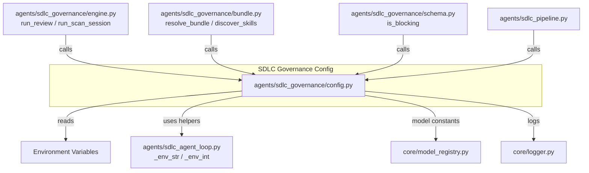
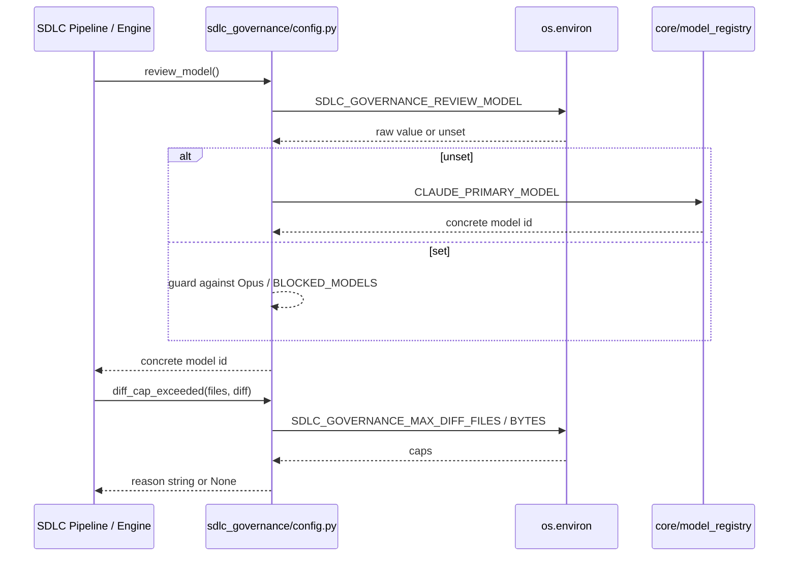
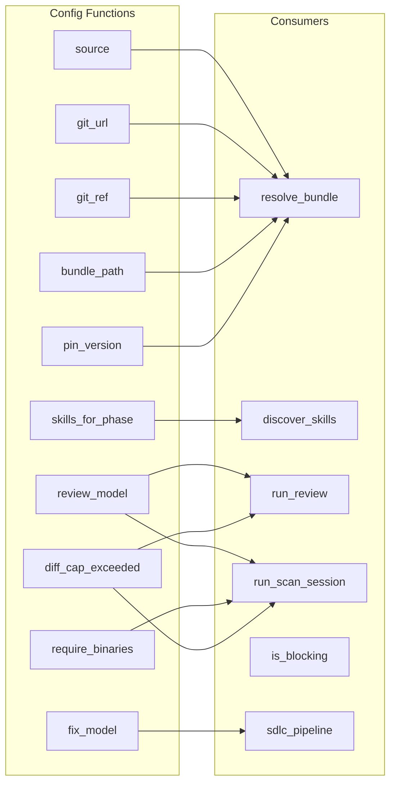
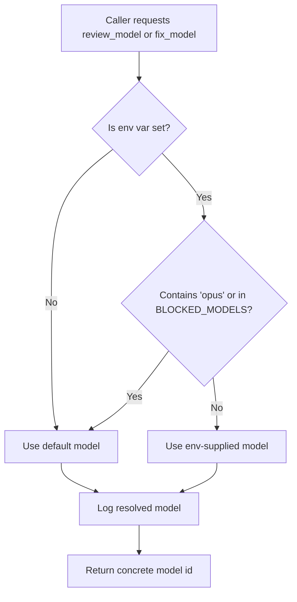
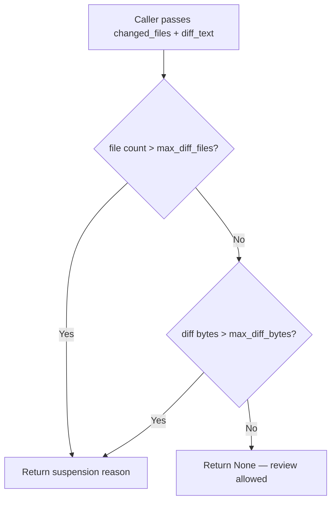

# SDLC Governance Config Module

## Brief Introduction

The `sdlc_governance_config` module (`agents/sdlc_governance/config.py`) is the runtime configuration layer for the SDLC governance subsystem. It provides call-time, environment-variable-driven knobs that control how governance bundles are resolved, which models perform governance scans and author-fix sessions, how large a diff may be reviewed automatically, and whether missing skill binaries should fail a scan. Every value is read fresh on each call, so deploy-time environment changes take effect without a process restart.

This module is intentionally lightweight: it imports only the standard library, `core.logger`, and `core.model_registry` (a constants-only module) at import time. It contains no Postgres, Redis, Docker, or network I/O, making it safe to import from any worker, CLI engine, or pipeline stage.

## Where This Module Fits

`sdlc_governance_config` sits at the bottom of the SDLC governance stack. It is consumed by:

- [`sdlc_governance_engine`](../sdlc_governance_engine.md) — `run_review()` and `run_scan_session()` read `review_turns()`, `scan_turns()`, `scan_profile()`, `review_model()`, and `fix_model()`.
- [`sdlc_governance_bundle`](../sdlc_governance_bundle.md) — `resolve_bundle()` and `discover_skills()` read `source()`, `git_url()`, `git_ref()`, `bundle_path()`, and `pin_version()`.
- [`sdlc_governance_schema`](../sdlc_governance_schema.md) — `is_blocking()` uses `block_severity()` as the default threshold.
- [`sdlc_pipeline`](sdlc_pipeline.md) — the broader SDLC pipeline calls into governance and respects `enabled()`, `max_iters()`, and `convergence_stall_limit()`.
- [`sdlc_agent_loop`](../agents/sdlc_agent_loop.md) — shares the `_env_str` / `_env_int` idiom for call-time env reading.

The module is part of the larger [`shared_core_sdlc_pipeline`](shared_core_sdlc_pipeline.md) family.

## Core Responsibilities

1. **Bundle source configuration** — choose whether governance skills are loaded from a local path, a Git URL, or auto-detected.
2. **Model selection** — resolve the concrete LLM used for governance review scans and author-fix CLI sessions, with guards that prevent expensive or blocked models from being selected.
3. **Iteration and convergence guards** — cap the number of auto-fix rounds and detect non-converging fix loops.
4. **Diff sizing limits** — suspend automated governance when a change is too large to review meaningfully.
5. **Skill execution policy** — decide whether missing helper binaries should suspend a scan (`require_binaries`).
6. **Per-phase skill routing** — allow operators to override which governance skills apply to PLAN, IMPLEMENT, and REVIEW phases.

## Component Reference

### `pin_version() -> bool`

Reads `SDLC_GOVERNANCE_PIN` (default `true`). When true, the bundle resolver records the exact resolved commit SHA or path state, ensuring reproducible governance runs. See [`sdlc_governance_bundle`](../sdlc_governance_bundle.md) for how the pinned reference is stored and used.

### `require_binaries() -> bool`

Reads `SDLC_GOVERNANCE_REQUIRE_BINARIES` (default `true`). When true, a governance skill whose `SKILL.md` references a binary that is absent on the worker host causes the scan session to **suspend** (fail-closed) rather than silently pass. This is enforced in [`sdlc_governance_engine`](../sdlc_governance_engine.md) during scan session setup.

## Configuration Environment Variables

| Variable | Default | Controlled by | Purpose |
|----------|---------|---------------|---------|
| `SDLC_GOVERNANCE_ENABLED` | `true` | `enabled()` | Master switch for the governance subsystem. |
| `SDLC_GOVERNANCE_SOURCE` | `auto` | `source()` | Bundle source: `git`, `path`, or `auto`. |
| `SDLC_GOVERNANCE_GIT_URL` | `""` | `git_url()` | Git URL for the governance bundle. |
| `SDLC_GOVERNANCE_GIT_REF` | `""` | `git_ref()` | Git ref to checkout; empty means default-branch HEAD. |
| `SDLC_GOVERNANCE_PATH` | `""` | `bundle_path()` | Local filesystem path to the governance bundle. |
| `SDLC_GOVERNANCE_PIN` | `true` | `pin_version()` | Whether to pin the resolved bundle reference. |
| `SDLC_GOVERNANCE_MAX_ITERS` | `3` | `max_iters()` | Max author-fix iterations per governance gate. |
| `SDLC_GOVERNANCE_CONVERGENCE_STALL_LIMIT` | `2` | `convergence_stall_limit()` | Max consecutive iterations where the open-fingerprint set does not strictly shrink before the loop stops. |
| `SDLC_GOVERNANCE_BLOCK_SEVERITY` | `high` | `block_severity()` | Minimum severity that blocks the pipeline. |
| `SDLC_GOVERNANCE_REVIEW_TURNS` | `40` | `review_turns()` | Max tool-call turns for a governance review session. |
| `SDLC_GOVERNANCE_SCAN_TURNS` | `60` | `scan_turns()` | Max tool-call turns for a governance scan session. |
| `SDLC_GOVERNANCE_SCAN_WORKERS` | `4` | `scan_workers()` | Max parallel scan sessions. |
| `SDLC_GOVERNANCE_SCAN_PROFILE` | `govscan` | `scan_profile()` | CLI profile used for scan sessions. |
| `SDLC_GOVERNANCE_REVIEW_MODEL` | `CLAUDE_PRIMARY_MODEL` | `review_model()` | Model used for governance review scans. |
| `SDLC_GOVERNANCE_FIX_MODEL` | `cli_model_for("coder")` | `fix_model()` | Model used for governance author-fix CLI sessions. |
| `SDLC_GOVERNANCE_REQUIRE_BINARIES` | `true` | `require_binaries()` | Fail-closed when skill binaries are missing. |
| `SDLC_GOVERNANCE_MAX_DIFF_FILES` | `100` | `max_diff_files()` | Hard cap on changed files for automated review. |
| `SDLC_GOVERNANCE_MAX_DIFF_BYTES` | `1_500_000` | `max_diff_bytes()` | Hard cap on diff byte size for automated review. |
| `SDLC_GOVERNANCE_AWARENESS` | `true` | `awareness_enabled()` | Enables governance awareness / context injection. |
| `SDLC_GOVERNANCE_PLAN_SKILLS` | `""` | `skills_for_phase("plan")` | CSV skill slugs for the PLAN phase. |
| `SDLC_GOVERNANCE_IMPLEMENT_SKILLS` | `""` | `skills_for_phase("implement")` | CSV skill slugs for the IMPLEMENT phase. |
| `SDLC_GOVERNANCE_REVIEW_SKILLS` | `""` | `skills_for_phase("review")` | CSV skill slugs for the REVIEW phase. |

## Architecture

## Data Flow

## Component Interaction

## Process Flow: Model Resolution

## Process Flow: Diff Size Guard

## Design Decisions

- **Call-time env reading**: Every public function reads `os.environ` when invoked. This mirrors the pattern in [`sdlc_agent_loop`](../agents/sdlc_agent_loop.md) and [`sdlc_cli_engine`](sdlc_cli_engine.md), allowing operators to flip governance behavior at deploy time without restarting workers.
- **Import side-effect-free**: The module avoids heavy imports so it can be imported by CLI engines, workers, and routers without triggering database or network connections.
- **Fail-closed defaults**: `require_binaries=True`, `block_severity=high`, and small diff caps default to conservative values so that governance does not silently pass risky changes.
- **Model guards**: Both `review_model()` and `fix_model()` explicitly prevent selection of Opus and blocked models. The fix-model guard replicates the predicate from `cli_model_for_tier()` rather than routing through it, because that helper expects a tier name rather than a concrete model id.

## Related Documentation

- [`sdlc_governance_engine`](../sdlc_governance_engine.md) — uses config to drive review and scan sessions.
- [`sdlc_governance_bundle`](../sdlc_governance_bundle.md) — uses config to resolve and discover governance skill bundles.
- [`sdlc_governance_schema`](../sdlc_governance_schema.md) — finding schema and blocking logic.
- [`sdlc_pipeline`](sdlc_pipeline.md) — orchestrates governance within the broader SDLC pipeline.
- [`sdlc_agent_loop`](../agents/sdlc_agent_loop.md) — shared call-time env-reading helpers.
- [`core/model_registry`](../core_model_registry.md) — model constants and tier resolution.
- [`shared_core_sdlc_pipeline`](shared_core_sdlc_pipeline.md) — parent module grouping.
