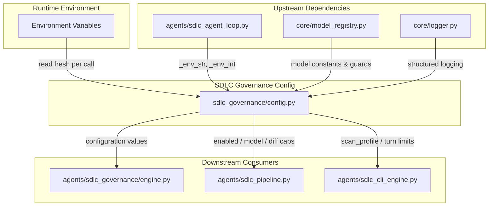
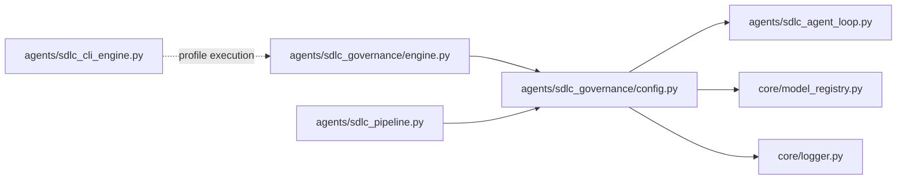
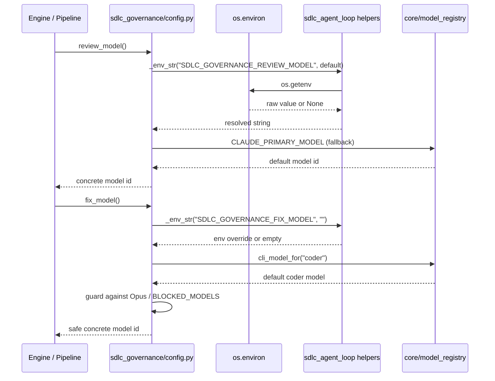
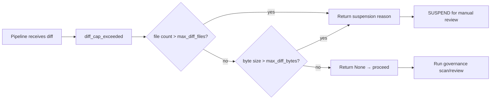
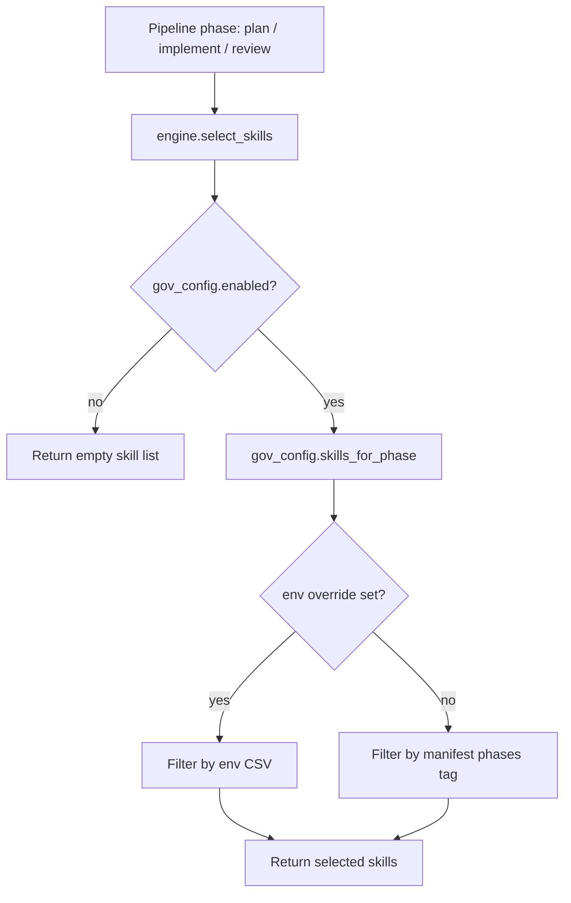

# SDLC Governance Configuration Module

## Brief Introduction

The `sdlc_governance_config_2` module (`agents/sdlc_governance/config.py`) is the runtime configuration layer for the SDLC governance subsystem. It exposes a set of call-time environment-variable readers that govern how governance skills are loaded, how review/scan/fix sessions behave, and which models are used for governance analysis. Every value is resolved fresh on each call, so deploy-time configuration changes take effect without requiring a process restart.

This module is intentionally lightweight and import-side-effect-free: it only imports the standard library, `core.logger`, `core.model_registry` (a constants-only module), and the `_env_str` / `_env_int` helpers from `agents.sdlc_agent_loop`. It does not perform any I/O, database access, or network calls at import time.

---

## Module Purpose and Core Functionality

The configuration module serves three primary purposes within the SDLC governance pipeline:

1. **Bundle Source Resolution** — Controls where governance skill bundles are loaded from (Git, local path, or auto-detection) and whether the resolved version should be pinned.
2. **Session Behavior Tuning** — Defines turn limits, parallelism, diff-size guards, convergence limits, and fail-closed policies for governance review, scan, and fix sessions.
3. **Model and Skill Routing** — Selects the concrete LLM models used for governance review and author-fix sessions, and provides per-phase skill routing overrides (`plan`, `implement`, `review`).

### Core Components

| Component | Type | Purpose |
|-----------|------|---------|
| `source` | env reader | Bundle source mode: `git`, `path`, or `auto`. |
| `git_url` / `git_ref` | env readers | Git origin and ref for the governance bundle. |
| `bundle_path` | env reader | Local filesystem path to the governance bundle. |
| `pin_version` | env reader | Whether to pin the resolved bundle commit/version. |
| `enabled` | env reader | Global kill-switch for the governance subsystem. |
| `awareness_enabled` | env reader | Kill-switch for governance awareness injected into PLAN/IMPLEMENT prompts. |
| `review_model` / `fix_model` | env readers | Concrete model IDs for review and fix sessions, with Opus/BLOCKED_MODELS guards. |
| `review_turns` / `scan_turns` | env readers | Max tool-call turns for review and scan CLI sessions. |
| `scan_workers` | env reader | Parallelism cap for per-skill scan sessions. |
| `scan_profile` | env reader | CLI profile name used for scan sessions. |
| `skills_for_phase` | function | Returns env-configured skill slugs for a given SDLC phase. |
| `parse_subset` | function | Normalizes CSV/list skill subset values. |
| `max_diff_files` / `max_diff_bytes` | env readers | Hard caps on diff size for automated governance. |
| `diff_cap_exceeded` | function | Checks a diff against the file-count and byte-size caps. |
| `max_iters` / `convergence_stall_limit` | env readers | Iteration limits for the author-fix convergence loop. |
| `block_severity` | env reader | Minimum severity that blocks a governance gate. |
| `require_binaries` | env reader | Fail-closed policy when skill analyzer binaries are missing. |

---

## Architecture and Component Relationships

### High-Level Architecture

### Dependency Graph

### Configuration Resolution Flow

### Data Flow: Diff Cap Guard

### Component Interaction: Per-Phase Skill Selection

---

## How the Module Fits into the Overall System

The `sdlc_governance_config_2` module sits at the boundary between the platform's environment-driven operational controls and the SDLC governance engine. It is not a standalone service; rather, it is a shared dependency consumed by the governance engine and the broader SDLC pipeline.

### Integration Points

1. **Governance Engine** (`agents/sdlc_governance/engine.py`)
   - `run_review` reads `review_turns()` and `review_model()`.
   - `run_scan_session` reads `scan_turns()`, `scan_profile()`, and `require_binaries()`.
   - `scan_all_skills` reads `scan_workers()` to cap parallel scan sessions.
   - `select_skills` reads `enabled()`, `skills_for_phase()`, and `parse_subset()`.
   - `resolve_awareness` reads `enabled()` and `awareness_enabled()`.
   - `build_fix_prompt` is consumed by `agents/sdlc_pipeline.py` which uses `fix_model()`.

   See [sdlc_governance_engine](../sdlc_governance_engine.md) for detailed engine behavior.

2. **SDLC Pipeline** (`agents/sdlc_pipeline.py`)
   - The pipeline calls `diff_cap_exceeded()` before launching automated governance.
   - It uses `fix_model()` when dispatching the author-fix CLI session.
   - It honors `enabled()` and `max_iters()` / `convergence_stall_limit()` during the fix loop.

   See [sdlc_pipeline](sdlc_pipeline.md) for pipeline orchestration details.

3. **SDLC Agent Loop** (`agents/sdlc_agent_loop.py`)
   - Provides the `_env_str` and `_env_int` primitives used by this module.
   - The same call-time env-reading idiom is shared across the SDLC agent stack.

   See [sdlc_agent_loop](../agents/sdlc_agent_loop.md) for the agent loop implementation.

4. **Model Registry** (`core/model_registry.py`)
   - Supplies `CLAUDE_PRIMARY_MODEL`, `CLAUDE_OPUS_MODEL`, `BLOCKED_MODELS`, and `cli_model_for()`.
   - The config module replicates the Opus/BLOCKED_MODELS guard for `fix_model()` to prevent governance fix sessions from using disallowed models.

   See [core_model_registry](../core_model_registry.md) for model resolution logic.

5. **CLI Engine** (`agents/sdlc_cli_engine.py`)
   - Executes the governance scan/review/fix sessions using the profiles and turn limits configured here.

   See [sdlc_cli_engine](sdlc_cli_engine.md) for CLI session execution details.

---

## Configuration Reference

### Environment Variables

| Variable | Default | Component | Description |
|----------|---------|-----------|-------------|
| `SDLC_GOVERNANCE_SOURCE` | `auto` | `source()` | Bundle source mode. |
| `SDLC_GOVERNANCE_GIT_URL` | `""` | `git_url()` | Git URL for the bundle. |
| `SDLC_GOVERNANCE_GIT_REF` | `""` | `git_ref()` | Git ref; empty means default-branch HEAD. |
| `SDLC_GOVERNANCE_PATH` | `""` | `bundle_path()` | Local path to the bundle. |
| `SDLC_GOVERNANCE_PIN` | `true` | `pin_version()` | Pin resolved bundle version. |
| `SDLC_GOVERNANCE_ENABLED` | `true` | `enabled()` | Global governance kill-switch. |
| `SDLC_GOVERNANCE_AWARENESS` | `true` | `awareness_enabled()` | Inject governance awareness into PLAN/IMPLEMENT. |
| `SDLC_GOVERNANCE_REVIEW_MODEL` | `CLAUDE_PRIMARY_MODEL` | `review_model()` | Model for governance review. |
| `SDLC_GOVERNANCE_FIX_MODEL` | `cli_model_for("coder")` | `fix_model()` | Model for author-fix sessions. |
| `SDLC_GOVERNANCE_REVIEW_TURNS` | `40` | `review_turns()` | Max turns per review session. |
| `SDLC_GOVERNANCE_SCAN_TURNS` | `60` | `scan_turns()` | Max turns per scan session. |
| `SDLC_GOVERNANCE_SCAN_WORKERS` | `4` | `scan_workers()` | Parallel scan workers. |
| `SDLC_GOVERNANCE_SCAN_PROFILE` | `"govscan"` | `scan_profile()` | CLI profile for scans. |
| `SDLC_GOVERNANCE_PLAN_SKILLS` | `None` | `skills_for_phase("plan")` | CSV skill slugs for plan phase. |
| `SDLC_GOVERNANCE_IMPLEMENT_SKILLS` | `None` | `skills_for_phase("implement")` | CSV skill slugs for implement phase. |
| `SDLC_GOVERNANCE_REVIEW_SKILLS` | `None` | `skills_for_phase("review")` | CSV skill slugs for review phase. |
| `SDLC_GOVERNANCE_MAX_DIFF_FILES` | `100` | `max_diff_files()` | Max changed files for automated governance. |
| `SDLC_GOVERNANCE_MAX_DIFF_BYTES` | `1,500,000` | `max_diff_bytes()` | Max diff bytes for automated governance. |
| `SDLC_GOVERNANCE_MAX_ITERS` | `3` | `max_iters()` | Max author-fix iterations. |
| `SDLC_GOVERNANCE_CONVERGENCE_STALL_LIMIT` | `2` | `convergence_stall_limit()` | Max stalled iterations before surfacing "not converging". |
| `SDLC_GOVERNANCE_BLOCK_SEVERITY` | `"high"` | `block_severity()` | Minimum blocking severity. |
| `SDLC_GOVERNANCE_REQUIRE_BINARIES` | `true` | `require_binaries()` | Suspend if skill binaries are missing. |

### Design Decisions

- **Call-time resolution**: All env vars are read on every function call. This mirrors the pattern in `agents/sdlc_agent_loop.py` and `agents/sdlc_cli_engine.py`, allowing operators to change behavior without restarting workers.
- **Fail-closed defaults**: Caps such as `max_diff_files` and `require_binaries` default to restrictive values so that oversized or under-resourced governance runs suspend rather than silently pass.
- **Model guards**: `fix_model()` explicitly blocks Opus and `BLOCKED_MODELS`, replicating the guard logic from `core/model_registry.py` because the existing tier helper operates on tier names, not concrete model IDs.
- **Phase routing**: Per-phase skill overrides take precedence over manifest `phases` tags, giving operators a simple lever to route different skills to PLAN, IMPLEMENT, and REVIEW.

---

## Related Documentation

- [sdlc_governance_engine](../sdlc_governance_engine.md) — Governance engine that consumes this configuration.
- [sdlc_pipeline](sdlc_pipeline.md) — SDLC pipeline orchestration and fix-loop integration.
- [sdlc_agent_loop](../agents/sdlc_agent_loop.md) — Shared environment-variable helper functions.
- [sdlc_cli_engine](sdlc_cli_engine.md) — CLI session execution engine.
- [core_model_registry](../core_model_registry.md) — Model constants and resolution helpers.
