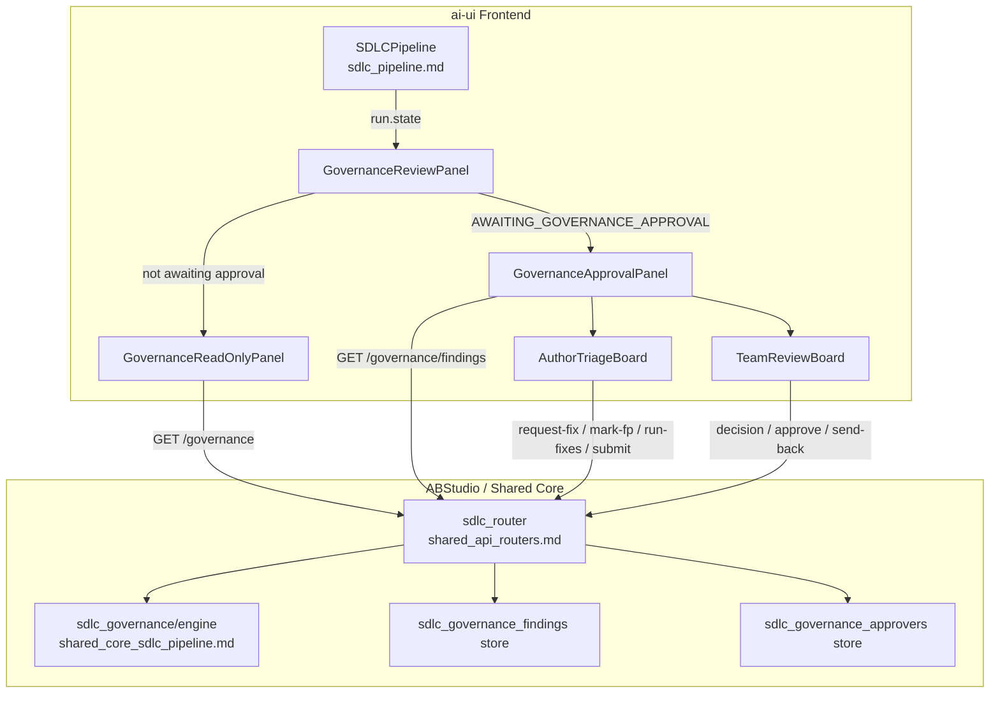
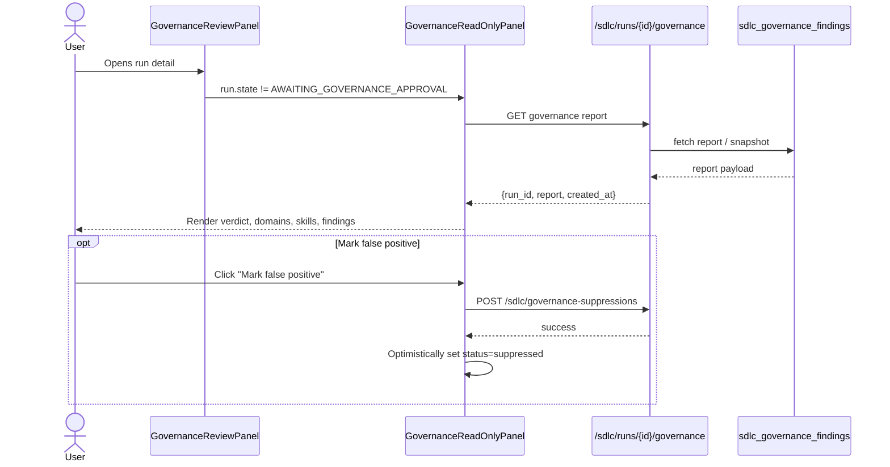
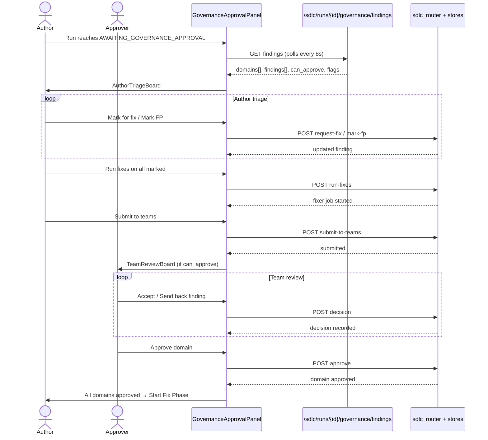
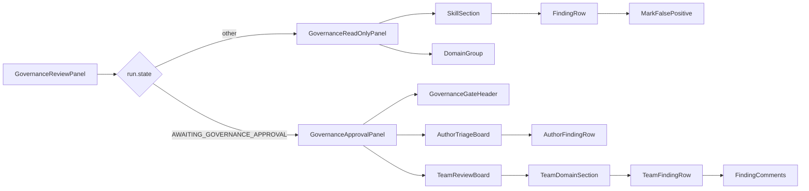
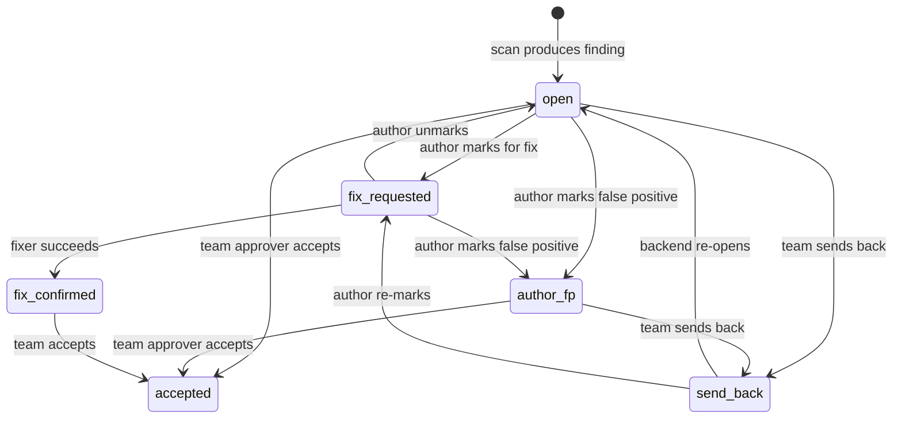

# SDLC Governance Review (Frontend)

## Brief Introduction

The **SDLC Governance Review** module is the React frontend surface for reviewing and approving AI-generated governance findings in the software development lifecycle (SDLC) pipeline. It renders the `GOVERNANCE_REPORT` artifact produced by the pluggable governance skills (EA, IS, DPDP, etc.) and provides a human-in-the-loop (HITL) approval workflow when a run reaches the `AWAITING_GOVERNANCE_APPROVAL` state.

The module lives in `ai-ui/src/components/sdlc/GovernanceReviewPanel.jsx` and is consumed by the [SDLCPipeline](sdlc_pipeline.md) detail view. It supports two primary modes:

1. **Read-only report mode** — displays governance scan results with per-domain, per-skill findings, severity/status badges, and export/download actions.
2. **Approval mode** — enables author triage (mark for fix / mark false positive / run fixer) and per-domain team review (accept / send back / approve domain) once findings are submitted to governance teams.

For the backend governance engine, skill execution, and API contract, see [shared_core_sdlc_pipeline](shared_core_sdlc_pipeline.md) and [shared_api_routers/sdlc_router](../core/shared_api_routers.md). For the parent UI that hosts this panel, see [sdlc_pipeline](sdlc_pipeline.md).

---

## Core Functionality

### 1. Dual-Mode Rendering

`GovernanceReviewPanel` is the entry component. It inspects `run.state` and switches between:

- `GovernanceReadOnlyPanel` — used when the run is not actively awaiting governance approval.
- `GovernanceApprovalPanel` — used when `run.state === "AWAITING_GOVERNANCE_APPROVAL"`.

This split keeps each component's hooks unconditional and avoids React rules-of-hooks violations.

### 2. Read-Only Report Mode

In this mode the panel:

- Fetches the governance report from `GET /sdlc/runs/{runId}/governance` (or accepts a pre-fetched `report` prop).
- Groups findings by domain (`IS`/`INFOSEC`, `EA`, `DPDP`, and `Other`).
- Renders per-skill sections with verdict badges, severity badges, status chips, file locations, fix hints, and code snippets.
- Allows users to mark an individual finding as a false positive, which POSTs to `/sdlc/governance-suppressions` and optimistically updates the finding status to `suppressed`.
- Exports the report as Markdown and the findings as CSV.

### 3. Approval Mode

When the run is awaiting governance approval, the panel fetches structured findings from `GET /sdlc/runs/{runId}/governance/findings` and polls every 8 seconds for live updates. It renders role-specific boards:

- **Author Triage Board** — shown to the run owner/admin. The author can:
  - Mark findings for fix (`POST .../request-fix`).
  - Mark findings as false positive (`POST .../mark-fp`).
  - Run the fixer on all marked findings (`POST .../run-fixes`).
  - Submit findings to governance teams (`POST .../submit-to-teams`).
  - Re-act on domains sent back by governance teams.

- **Team Review Board** — shown to per-domain approvers once submitted. Approvers can:
  - Accept individual findings (`POST .../decision` with `accept`).
  - Send back individual findings with a mandatory comment (`POST .../decision` with `send_back`).
  - Approve an entire domain once all visible findings are decisioned (`POST .../approve`).
  - Send back an entire domain with a mandatory comment (`POST .../send-back`).

- **Waiting State** — users who are neither owner/admin nor an approver see a read-only waiting message.

### 4. Visibility & Segregation of Duties

The backend scopes the `/governance/findings` response per caller:

- Run owners and admins see all domains.
- Domain approvers see only the domains they are authorized to approve.
- The client mirrors this with `can_approve` flags and `isTeamVisible` filtering.

### 5. Export

Both modes support CSV export. The approval-mode export uses the already-scoped `domains` payload, so the downloaded file respects the caller's visibility.

---

## Architecture & Component Relationships

### Component Hierarchy

```text
GovernanceReviewPanel (entry)
├── GovernanceReadOnlyPanel
│   ├── VerdictBadge
│   ├── SeverityBadge
│   ├── StatusChip
│   ├── SkillSection
│   │   └── FindingRow
│   │       └── MarkFalsePositive
│   ├── DomainGroup
│   ├── LoadingSkeleton
│   └── EmptyState
└── GovernanceApprovalPanel
    ├── GovernanceGateHeader
    ├── NotConvergingBanner
    ├── AuthorTriageBoard
    │   └── AuthorFindingRow
    ├── TeamReviewBoard
    │   └── TeamDomainSection
    │       ├── TeamFindingRow
    │       │   └── FindingComments
    │       └── DomainStatusChip
    ├── DispositionChip
    └── LoadingSkeleton / EmptyState
```

### Module Dependencies

| Dependency | Purpose |
|------------|---------|
| `ai-ui/src/config.js` | `API_BASE` and `apiFetch` for backend calls. |
| `ai-ui/src/components/ui/DialogProvider.jsx` | Toast notifications. |
| `ai-ui/src/hooks/usePermission.js` | Determines admin status from the current user. |
| `lucide-react` | Iconography. |

### Backend API Surface Used

| Endpoint | Method | Used By |
|----------|--------|---------|
| `/sdlc/runs/{runId}/governance` | GET | Read-only report fetch. |
| `/sdlc/runs/{runId}/governance/findings` | GET | Approval-mode findings + domain state. |
| `/sdlc/runs/{runId}/governance/findings/{fp}/request-fix` | POST | Author marks finding for fix. |
| `/sdlc/runs/{runId}/governance/findings/{fp}/unmark` | POST | Author unmarks finding. |
| `/sdlc/runs/{runId}/governance/findings/{fp}/mark-fp` | POST | Author marks false positive. |
| `/sdlc/runs/{runId}/governance/run-fixes` | POST | Batch-run the fixer on marked findings. |
| `/sdlc/runs/{runId}/governance/submit-to-teams` | POST | Author sends findings to domain teams. |
| `/sdlc/runs/{runId}/governance/domains/{domain}/findings/{fp}/decision` | POST | Team approver accepts/sends back a finding. |
| `/sdlc/runs/{runId}/governance/domains/{domain}/approve` | POST | Team approver approves a domain. |
| `/sdlc/runs/{runId}/governance/domains/{domain}/send-back` | POST | Team approver sends back a whole domain. |
| `/sdlc/runs/{runId}/governance/findings/{fp}/comments` | GET | Lazy-load comment thread for a finding. |
| `/sdlc/runs/{runId}/governance/resume` | POST | Resume the governance gate after all domains approved. |
| `/sdlc/governance-suppressions` | POST | Create a persistent suppression (false positive). |

---

## Mermaid Diagrams

### High-Level Architecture



### Data Flow: Read-Only Report



### Data Flow: Approval Workflow



### Component Interaction



### State Machine: Finding Disposition



---

## Key Design Decisions

1. **Fail-closed backend, optimistic frontend.** The backend governance engine returns a synthetic `FAIL` if the review session suspends or errors. The frontend only optimistically updates false-positive status; all approval decisions are server-authoritative.

2. **Role-based rendering, not mode-based.** The approval panel does not flip the entire UI into a single "submitted" mode. Instead, the author board and team board can both be visible to users who have both roles (e.g., admin), and the author continues to see send-backs after submission.

3. **Marked-for-fix is the selection.** There is no separate checkbox for batch fixer selection. The `fix_requested` disposition itself is the selection; the "Run fixes on all marked" button operates over all findings in that state.

4. **Mandatory comments on send-back.** Both per-finding and per-domain send-backs require a non-empty comment, enforced on the client and the server.

5. **Domain approval is blocked until all visible findings are decisioned.** The client disables the approve button when unresolved findings remain; the server also returns `409` if the guard is bypassed.

6. **CSV export respects visibility.** Approval-mode CSV is built from the already-scoped `domains` payload returned for the current user, so approvers cannot export findings outside their owned domains.

---

## How It Fits into the Overall System

The SDLC Governance Review panel is one of several HITL surfaces in the AI-driven engineering lifecycle:

- It is embedded in the [SDLCPipeline](sdlc_pipeline.md) detail view, which auto-surfaces it when `run.state === "AWAITING_GOVERNANCE_APPROVAL"`.
- It consumes reports produced by the governance skills executed by [agents/sdlc_governance/engine.py](shared_core_sdlc_pipeline.md) (part of the shared-core SDLC pipeline).
- It coordinates with the [sdlc_worker](../workers/workers.md) background jobs that run the governance scan, fixer loops, and resume operations.
- It shares visual language with other SDLC UI modules such as [sdlc_gate_signal](sdlc_gate_signal.md), [sdlc_pipeline_stepper](sdlc_pipeline_stepper.md), and [sdlc_status_model](sdlc_status_model.md).
- It is distinct from the generic [Governance](governance.md) component (entity-level governance for agents/skills/tools) and the [ModelGovernance](../llm/model_governance.md) component.

---

## References

- [sdlc_pipeline](sdlc_pipeline.md) — Parent SDLC pipeline UI that hosts this panel.
- [shared_core_sdlc_pipeline](shared_core_sdlc_pipeline.md) — Backend SDLC pipeline, including `agents/sdlc_governance/engine.py`.
- [shared_api_routers](../core/shared_api_routers.md) — FastAPI routers, including `sdlc_router.py`.
- [workers](../workers/workers.md) — Background workers, including `sdlc_worker.py`.
- [sdlc_gate_signal](sdlc_gate_signal.md) — Gate signal badges used elsewhere in the SDLC UI.
- [sdlc_pipeline_stepper](sdlc_pipeline_stepper.md) — Stage stepper shown above the review panel.
- [sdlc_status_model](sdlc_status_model.md) — Run state labels and badge styling.
- [governance](governance.md) — Entity-level governance UI (agents/skills/tools), not SDLC-specific.
