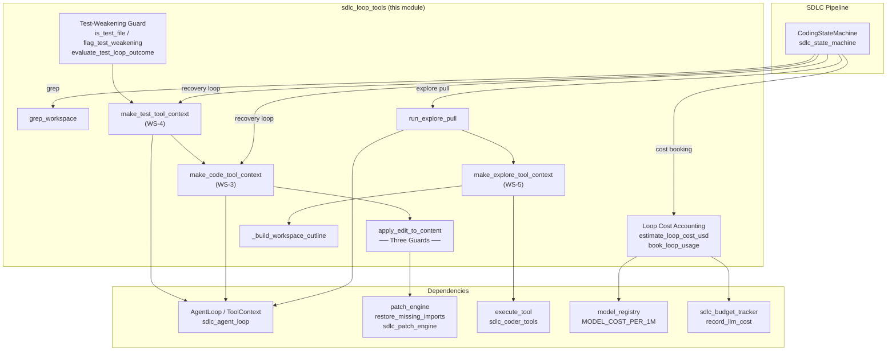
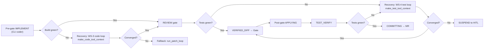
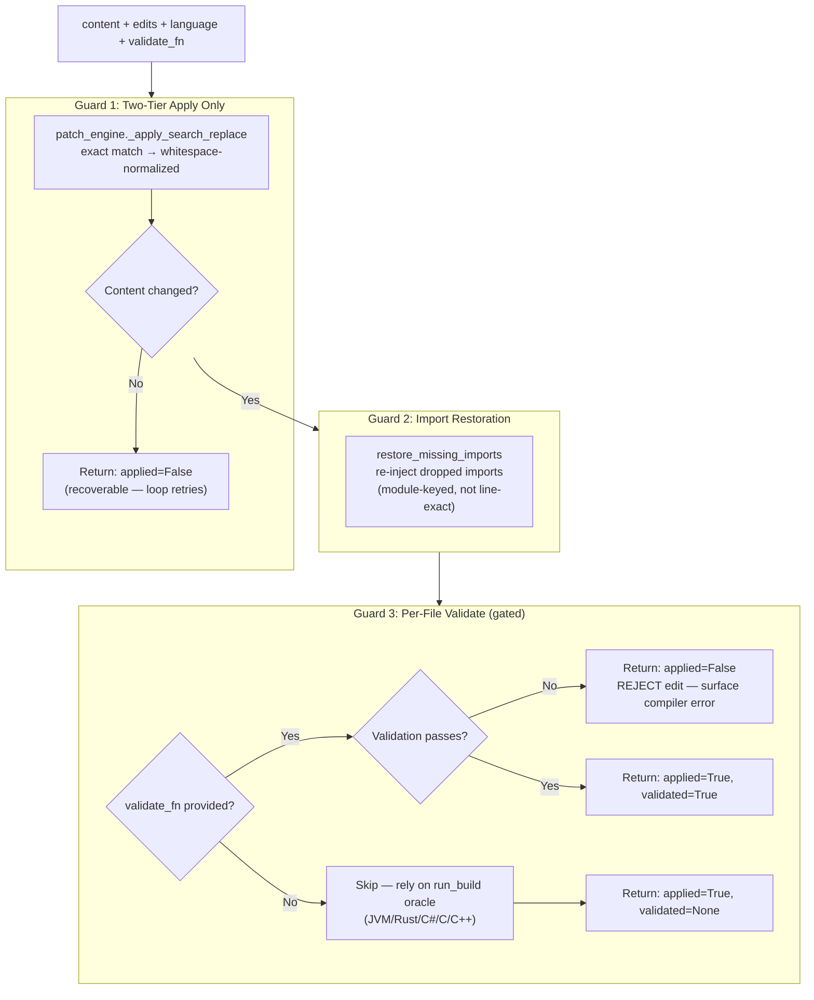
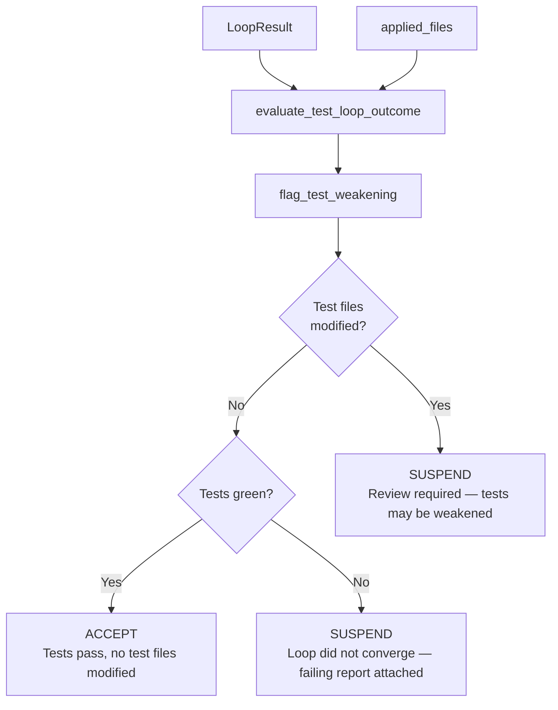
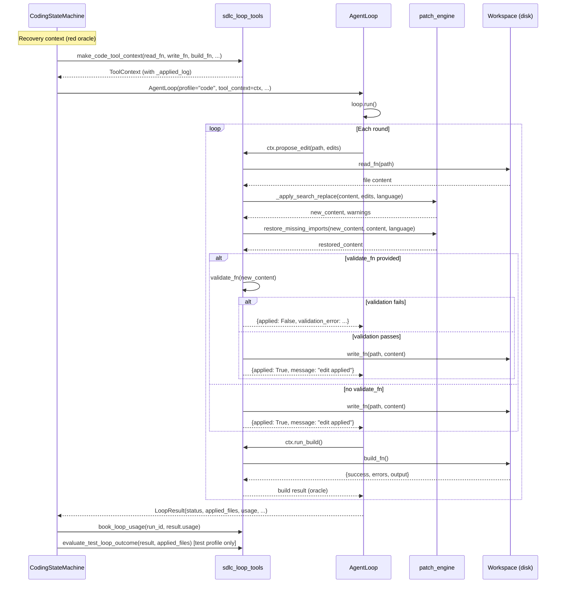
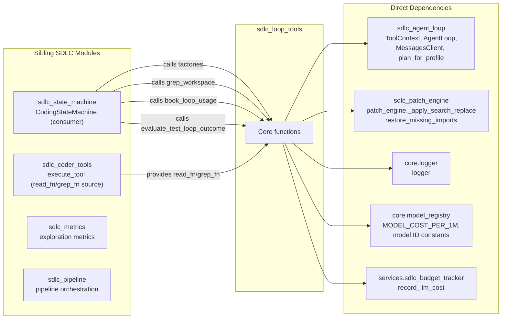

# SDLC Loop Tools

## Introduction

The `sdlc_loop_tools` module (`agents/sdlc_loop_tools.py`) is the **tool-wiring layer** that connects the generic WS-1 `AgentLoop` to the real SDLC machinery — the deterministic patch engine, the workspace build/test oracle, and the local run checkout. It sits between the abstract agentic loop (defined in [sdlc_agent_loop](sdlc_agent_loop.md)) and the concrete SDLC state machine (defined in [sdlc_state_machine](sdlc_state_machine.md)), providing factory functions that produce `ToolContext` instances for three loop profiles: **code** (WS-3 coder/fixer), **test** (WS-4 test-fixer), and **explore** (WS-5 agentic pull).

The module is the single home of the **Three Guards** — the choke-point through which every agentic edit passes, ensuring that no silent bad write ever reaches the workspace. It also provides workspace-local grep, test-weakening detection, loop cost accounting, and the explore-pull loop runner.

---

## Architecture Overview

### Where It Fits in the SDLC Pipeline

The module is invoked exclusively in **recovery contexts** — when the deterministic pipeline path encounters a red oracle (failed build or failed tests) and the operator has enabled the agentic loops. The state machine (`CodingStateMachine`) calls the factory functions to build a `ToolContext`, constructs an `AgentLoop`, and runs it. The loops are **never** on the happy path; they are bounded recovery mechanisms.

---

## Core Components

### 1. The Three Guards — `apply_edit_to_content`

This is the **single choke-point** every agentic edit passes through. It preserves three invariants in strict order:

**Design rationale:**

| Guard | Purpose | Failure Mode |
|-------|---------|--------------|
| **Two-tier apply** | Only exact or whitespace-normalized full-block matching. No looser tier is ever added. | A clean miss is recoverable (loop retries / falls back to `run_patch_loop`); a wrong silent edit is not. |
| **Import restoration** | Re-injects imports the edit may have dropped, using module-specifier keying (not exact-line matching) to avoid duplicate imports on legitimately modified imports. | Non-fatal — never blocks an otherwise-good edit. |
| **Per-file validate** | Syntax-check only for `_SYNTAX_CHECK_LANGUAGES` (Python, JS, TS, Go, Ruby, PHP, Bash) with a sandbox image. JVM/Rust/C#/C/C++ get `validate_fn=None` and rely on the workspace `run_build` oracle. | A failed validation means the edit is **rejected** (not written) and reported back to the loop as a warning. |

> **Testability:** `apply_edit_to_content` uses only the patch engine's pure string helpers (no LLM, no Docker), so it is unit-tested on Windows. The `ToolContext` factories take injected file-IO / build / test callables.

### 2. Workspace-Local Grep — `grep_workspace`

Searches the **freshly-cloned run checkout** — never the `document_embeddings` / pgvector index. The index may be a different branch and is only re-indexed periodically, so it is routinely stale relative to the code the loop is actually editing.

**Key characteristics:**
- Regex pattern with literal-substring fallback on invalid regex
- Skips binary, oversized (>1 MB), vendored, and build directories
- Output capped at 100 matches / 12,000 characters with deterministic middle truncation
- Optional `path_hint` to scope to a subdir or single file (bad hints are ignored)

### 3. ToolContext Factories

#### `make_code_tool_context` (WS-3 — Coder/Fixer Loop)

Builds a `ToolContext` for the `code` profile. The `propose_edit` tool:
1. Reads current workspace content via `read_fn`
2. Applies the edit through `apply_edit_to_content` (the Three Guards)
3. Writes back **only** on a successful, validated apply
4. `run_build` is the workspace compile oracle

Exposes `_applied_log` — the list of files successfully edited — for the caller to inspect.

#### `make_test_tool_context` (WS-4 — Test-Fix Loop)

Extends the code context with a `run_tests` oracle. Same write path (Three Guards), plus the test pass/fail oracle.

#### `make_explore_tool_context` (WS-5 — Agentic Pull)

Builds a `ToolContext` for the `explore` profile with:
- **Read cap enforcement** (≤ `max_reads` distinct file pulls, default 8)
- **Deny-list** filtering (archived/backup/scratch paths never pulled)
- **Read caching** — ranged slices cached separately from full reads; a slice never satisfies a later full-file read
- **Distinct-file accounting** keyed on path (not cache key) so reading different line ranges of the same file does not consume extra read slots
- Exposes `_reads` state: `{"count": int, "paths": [str], "contents": {}}`

### 4. Test-Weakening Guard (WS-4)

Three functions that prevent the test-fix loop from silently weakening tests to force a green run:

| Function | Purpose |
|----------|---------|
| `is_test_file(path)` | Heuristic: does this path look like a test file? |
| `flag_test_weakening(applied_paths)` | Returns the subset of applied paths that are test files |
| `evaluate_test_loop_outcome(loop_result, applied_files)` | Decides SM action: **accept** (tests green + no test files modified), **suspend** (tests green but test files modified → review required), or **suspend** (loop did not converge → suspend with failing report) |

### 5. Loop Cost Accounting

| Function | Purpose |
|----------|---------|
| `_resolve_hint_to_model(hint)` | Maps loop model hints (`haiku`/`complex`/`solution`/`medium`/`local`) to canonical model IDs |
| `estimate_loop_cost_usd(by_model)` | Best-effort cost from per-model token usage. In-house/local models are free. Unknown models contribute $0. |
| `book_loop_usage(run_id, usage)` | Accumulates a completed loop's token usage + estimated cost onto the SDLC run via the HOD-budget mechanism (`record_llm_cost`). Non-fatal. |

### 6. Workspace Outline — `_build_workspace_outline`

Produces a structural outline of a large file: imports, classes, functions, routes with line numbers. Returns fallback first-50-lines if no signatures found. **Pure string function** — no LLM, no network, testable on Windows.

### 7. Explore Pull Runner — `run_explore_pull`

Runs the WS-5 explore pull loop: a navigator model pulls ≤ `max_reads` files (full bodies accumulated in `ctx._reads["contents"]`), then produces the final answer.

**Key features:**
- **Seed components** (`seed_components`): optional pre-read affected components prepended to the initial user message and pre-populated in `ctx._reads` so the grounding verifier credits them at round 0
- **Artifact-planning-loop** wiring: `on_propose` (deterministic convergence verdict), `artifact` (PlanningArtifact handle), `artifact_emit` (assemble final JSON from artifact)
- **Complexity-scaled budgets**: `max_rounds` / `token_budget` are the complexity-scaled budgets
- **Expected files** (`expected_files`): drives the answerer coverage backstop

---

## Data Flow

---

## Dependency Map

### Dependency Details

| Dependency | Usage |
|------------|-------|
| **[sdlc_agent_loop](sdlc_agent_loop.md)** | Provides `ToolContext` (the dataclass the factories populate), `AgentLoop` (the loop runner), `MessagesClient` (LLM transport), and `plan_for_profile` (model plan resolution). |
| **[sdlc_patch_engine](sdlc_patch_engine.md)** | Provides `patch_engine._apply_search_replace` (Guard 1: two-tier apply) and `restore_missing_imports` (Guard 2: import restoration). Module-specifier-keyed to avoid duplicate imports. |
| **[sdlc_state_machine](sdlc_state_machine.md)** | The primary consumer. `CodingStateMachine` calls the factory functions from `_run_agentic_code_loop`, `_run_agentic_test_loop`, and `_loop_grep_fn`. It also calls `book_loop_usage` and `evaluate_test_loop_outcome` after each loop completes. |
| **[sdlc_coder_tools](sdlc_coder_tools.md)** | Provides `execute_tool`, which is the source of `read_fn` / `grep_fn` callables wired into the explore `ToolContext` by the pipeline. |
| **core.model_registry** | Provides `MODEL_COST_PER_1M` rate table and canonical model ID constants (`CLAUDE_HAIKU`, `CLAUDE_PRIMARY_MODEL`, `SOLUTION_MODEL`, etc.) for cost estimation. |
| **services.sdlc_budget_tracker** | Provides `record_llm_cost` for accumulating loop token usage and cost onto the SDLC run's budget. |
| **core.logger** | Structured logging throughout. |

---

## Integration with the State Machine

The `CodingStateMachine` (see [sdlc_state_machine](sdlc_state_machine.md)) is the sole production consumer of this module. The integration points are:

### WS-3: Agentic Code Loop (`_run_agentic_code_loop`)

Fires **only** in a post-gate recovery context (`_recovery_context = True`) when:
- `SDLC_AGENTIC_CODER` env flag is enabled
- `loop_enabled()` returns True
- The build oracle returned red after applying the approved VERIFIED_DIFF

The SM constructs a `ToolContext` via `make_code_tool_context`, passing:
- `_workspace_read` / `_workspace_write` for file I/O
- `_build_oracle` as the `build_fn` (wraps `_build_check()`)
- `_loop_grep_fn()` as the `grep_fn` (wraps `grep_workspace`)
- `_make_loop_validate_fn()` as the `validate_fn` (only for `_SYNTAX_CHECK_LANGUAGES` with a sandbox image)

On non-convergence, the SM falls back to `run_patch_loop` (the patch-only guard).

### WS-4: Agentic Test Loop (`_run_agentic_test_loop`)

Fires **only** in a post-gate recovery context when:
- `SDLC_AGENTIC_TEST` env flag is enabled
- `loop_enabled()` returns True
- Unit tests or SLTs failed on the applied tree

The SM constructs a `ToolContext` via `make_test_tool_context`, then calls `evaluate_test_loop_outcome` to decide whether to accept or suspend. A **suspend** with weakened test files triggers a `test-weakening-guard` event for human review.

### WS-5: Explore Pull (`run_explore_pull`)

Called by the pipeline (not directly by the SM) for the explore profile — the agentic pull loop that gathers context before producing analysis/design/diagnose artifacts. The navigator pulls ≤ `max_reads` files, then the answerer produces the final JSON.

---

## Configuration

### Environment Variables

| Variable | Default | Purpose |
|----------|---------|---------|
| `SDLC_AGENTIC_CODER` | `false` | Enable the WS-3 agentic coder loop (recovery only) |
| `SDLC_AGENTIC_TEST` | `false` | Enable the WS-4 agentic test loop (recovery only) |
| `SDLC_WORKSPACE_MAX_LINE_RANGE` | `300` | Controls result budgeting cap (`cap = value × 200`) |

### Constants

| Constant | Value | Purpose |
|----------|-------|---------|
| `_GREP_MAX_FILE_BYTES` | 1,000,000 | Skip files larger than ~1 MB in grep |
| `_GREP_MAX_MATCHES` | 100 | Cap matching lines returned |
| `_GREP_MAX_OUTPUT_CHARS` | 12,000 | Cap total grep output size |
| `_GREP_LINE_CLIP` | 300 | Clip each matched line |
| `_DEFAULT_DENY` | `old_scripts/`, `bkp_`, `/archive`, etc. | Explore loop deny-list |

---

## Key Design Principles

1. **Recovery-only scoping** — The agentic loops fire ONLY in post-gate recovery contexts (red oracle). On the pre-gate happy path, the deterministic patch engine is the sole code path.

2. **Three Guards in one place** — `apply_edit_to_content` is the single choke-point. No other code path applies agentic edits. This makes the guards auditable and testable.

3. **Local workspace only** — `grep_workspace` reads ONLY the on-disk workspace at `workspace_root`, never the pgvector index. Results always reflect the exact branch+commit cloned for this run.

4. **Testability** — All pure functions (`apply_edit_to_content`, `grep_workspace`, `_build_workspace_outline`, `is_test_file`, `flag_test_weakening`, `estimate_loop_cost_usd`) use no LLM, no Docker, no network. The `ToolContext` factories take injected callables so tests pass stubs.

5. **Never silently weaken tests** — The test-weakening guard ensures that a test-fix loop that modifies test files is always surfaced for human review, never silently accepted.

6. **Cost visibility** — Every loop's token usage and estimated cost is accumulated onto the SDLC run via `book_loop_usage`, providing full cost traceability.

---

## Related Documentation

- [sdlc_agent_loop](sdlc_agent_loop.md) — The `AgentLoop` and `ToolContext` that this module wires
- [sdlc_patch_engine](sdlc_patch_engine.md) — The patch engine and import restoration used by the Three Guards
- [sdlc_state_machine](sdlc_state_machine.md) — The `CodingStateMachine` that consumes this module's factories
- [sdlc_coder_tools](sdlc_coder_tools.md) — The `execute_tool` dispatcher that provides read/grep callables
- [sdlc_metrics](sdlc_metrics.md) — Exploration metrics logging
- [sdlc_pipeline](sdlc_pipeline.md) — Pipeline orchestration that invokes `run_explore_pull`
