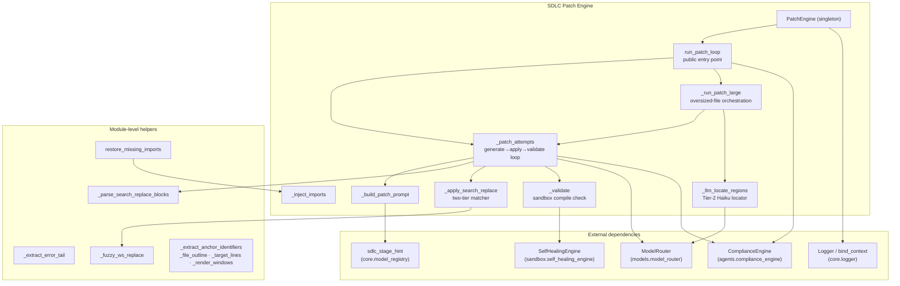
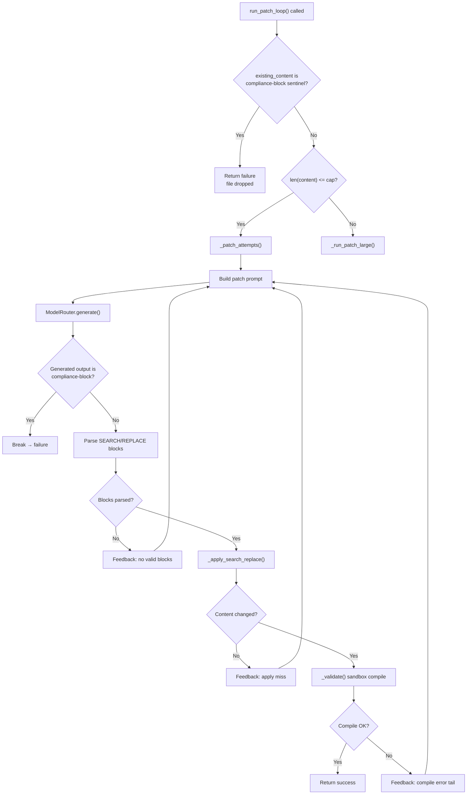
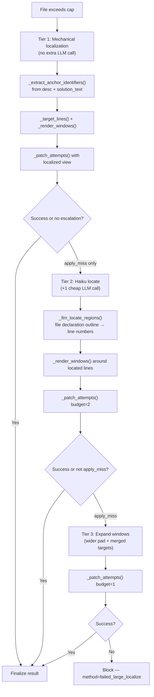
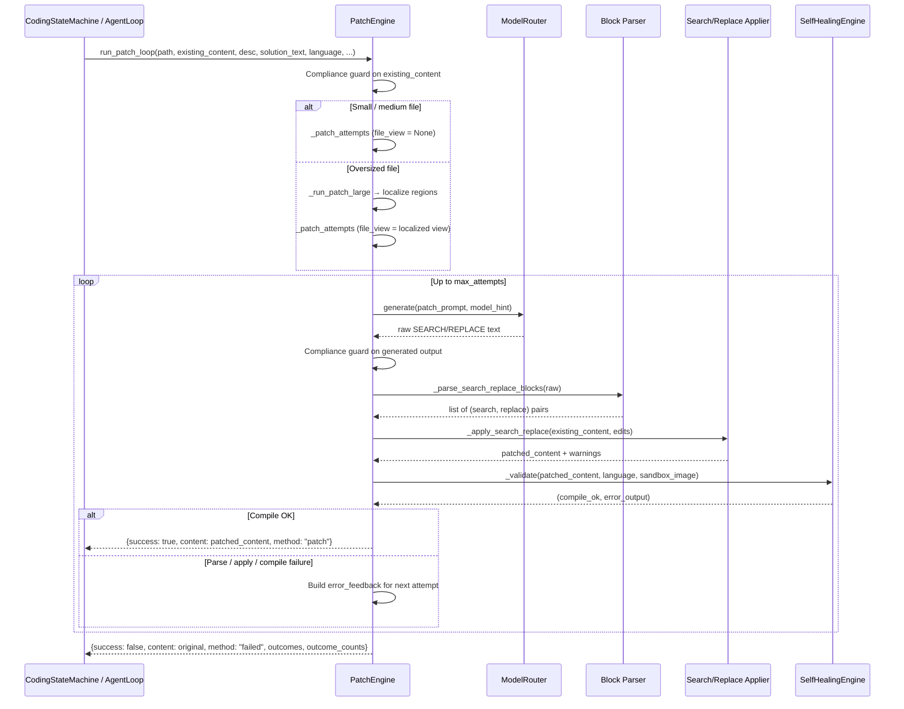
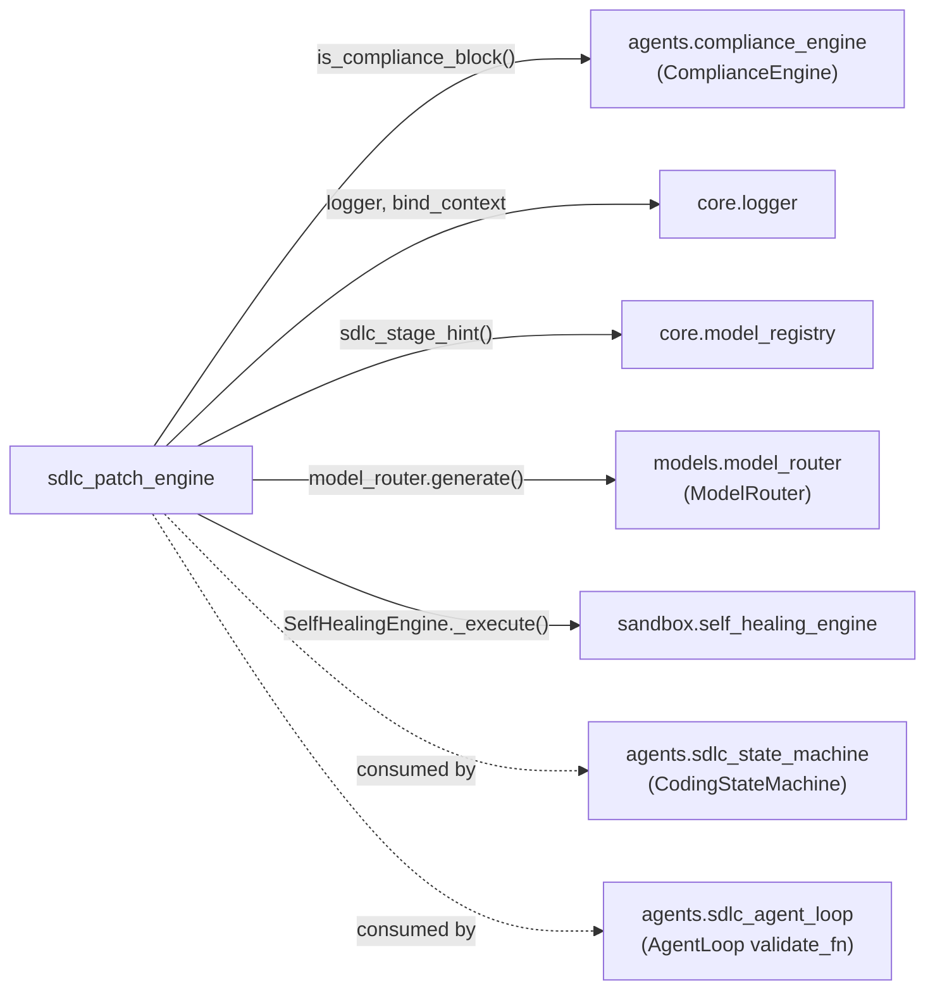

# SDLC Patch Engine

## Overview

The **SDLC Patch Engine** (`agents/sdlc_patch_engine.py`) is the surgical code-modification engine used by the SDLC developer loop.  Instead of regenerating an entire file from scratch, it asks an LLM to produce **SEARCH/REPLACE blocks** that target only the lines that must change, applies those blocks to the existing file content, and validates the result via a single-file sandbox compile.  Compile errors are fed back into the next attempt, creating a bounded generate → apply → validate retry loop.

Key responsibilities:

- **Surgical patching** of existing files using a git-style SEARCH/REPLACE format (no full-file regeneration).
- **Two-tier block matching** (exact → whitespace-normalized) that never silently edits the wrong region.
- **Oversized-file localization** — a three-tier escalation strategy that shows the LLM only the relevant regions of files too large to fit in a prompt.
- **Single-file compile validation** across 20+ languages using sandbox images.
- **Import restoration** — re-injects imports that a full-file LLM regeneration may have silently dropped.
- **Compliance guarding** — refuses to process or apply content that carries a compliance-block sentinel.

The engine is a singleton (`patch_engine = PatchEngine()`) and is consumed by the SDLC state machine, the agentic coding loop, and the post-gate verified-diff applier.  For the broader pipeline context see [sdlc_state_machine](sdlc_state_machine.md) and [sdlc_agent_loop](sdlc_agent_loop.md).

---

## Architecture



---

## Module Structure

| Component | Kind | Purpose |
|---|---|---|
| `PatchEngine` | Class | Main engine; owns the patch loop, prompt builder, applier, validator, and oversized-file orchestrator. |
| `patch_engine` | Singleton | Module-level instance consumed by callers. |
| `run_patch_loop()` | Method | Public entry point. Dispatches to small-file loop or oversized-file orchestration. |
| `_patch_attempts()` | Method | Bounded retry loop against a fixed view of the file. |
| `_run_patch_large()` | Method | Three-tier localization for files exceeding the prompt cap. |
| `_llm_locate_regions()` | Method | Tier-2 cheap LLM call (Haiku) that identifies line numbers to change. |
| `_build_patch_prompt()` | Method | Assembles the patch-generation prompt with file content, solution design, RAG context, and error feedback. |
| `_apply_search_replace()` | Method | Applies ordered SEARCH/REPLACE blocks with two-tier matching. |
| `_inject_imports()` | Method | Language-aware insertion of net-new import statements. |
| `_validate()` | Method | Single-file sandbox compile check. |
| `_parse_search_replace_blocks()` | Function | Tolerant regex parser for `<<<<<<< SEARCH … ======= … >>>>>>> REPLACE` blocks. |
| `_fuzzy_ws_replace()` | Function | Whitespace-normalized fallback matcher. |
| `_extract_error_tail()` | Function | Extracts the useful portion of a compiler traceback for feedback. |
| `_extract_anchor_identifiers()` | Function | Mines likely symbol names from change description / solution text for mechanical localization. |
| `_file_outline()` | Function | Builds a compact declaration outline of a large file. |
| `_target_lines()` | Function | Returns line indices containing anchor identifiers. |
| `_render_windows()` | Function | Renders a capped, localized view of a large file with omission markers. |
| `restore_missing_imports()` | Function | Re-injects dropped imports after full-file LLM generation (module-keyed dedup). |
| `_count_outcomes()` | Function | Rolls up per-attempt outcome records for telemetry. |

---

## Core Workflows

### 1. Patch Loop (Small / Medium Files)

When the existing file content fits within the prompt cap (`SDLC_PATCH_FILE_CHARS`, default 120 000 chars), the engine runs a straightforward retry loop.



**Retry budget** — `MAX_PATCH_ATTEMPTS = 3`. Callers may pass a lower `max_attempts` (e.g. `1` for low-value collateral files) to cap cost. The budget is clamped to `[1, MAX_PATCH_ATTEMPTS]`.

**Model selection** — defaults to `sdlc_stage_hint("coder")` (Sonnet by default, overridable via `SDLC_MODEL_CODER`). Callers can pass `model_hint` to select a different tier (e.g. the FIXING stage passes the `"fixer"` hint).

### 2. Oversized-File Localization

For files larger than the prompt cap, the engine cannot show the whole file. It localizes the regions most likely to need changes and shows only those, while apply and compile validation always run against the **full** file content.



Escalation happens **only** on `apply_miss` (the SEARCH block did not match the shown region). A `compile_fail` means the region was correctly shown but the replacement had a syntax error — no escalation needed, just retry within the same tier.

A capped budget (`max_attempts == 1`) runs Tier 1 only, preserving cost-narrowing for broadcast fix files.

### 3. SEARCH/REPLACE Application

The applier uses a strict two-tier matching strategy. Both tiers match the **full** search block, so the applier can never silently edit the wrong region.

| Tier | Strategy | Behaviour |
|---|---|---|
| 1 — Exact | Indentation-preserving substring match | If exactly 1 match → replace. If >1 match → **refuse** (ambiguous, ask for more context). |
| 2 — Fuzzy | Whitespace-normalized full-block match (`_fuzzy_ws_replace`) | Tolerates leading-indent / column-alignment drift. |
| Miss | Neither tier matches | Block left unapplied; warning reported for retry feedback. |

**SEARCH/REPLACE format** (consistent with `gitlab_apply_patch` and the agentic coding prompt):

```
<<<<<<< SEARCH
<lines copied VERBATIM from the existing file>
=======
<the replacement lines>
>>>>>>> REPLACE
```

The parser (`_parse_search_replace_blocks`) is tolerant of variable-length fence markers, trailing spaces on marker lines, wrapping markdown fences, and surrounding prose.

### 4. Compile Validation

`_validate()` compile-checks the patched content in a sandbox container. The engine maintains two lookup tables:

- `_COMPILE_COMMANDS` — language → compile command (mirrors `_SANDBOX_COMPILE_COMMANDS` in [sdlc_state_machine](sdlc_state_machine.md)).
- `_SANDBOX_FILENAMES` — language → canonical sandbox filename.

Key behaviours:

- **File extension override** — a `.jsx` file arriving with `language="javascript"` is remapped to the JSX checker (`check_jsx.js`) so Babel/TS syntax is handled correctly.
- **Non-code skip** — SQL, XML, YAML, JSON, Markdown, etc. have no compile step and return `(True, "")`.
- **Infra-fail-open** — if no sandbox image is available, no compile command exists, or the sandbox raises an exception, validation returns `(True, "")` so patching is not blocked by infrastructure gaps.
- **Java special case** — `public` is stripped from the top-level declaration to avoid the "class X is public, should be in file X.java" sandbox error.

Validation delegates to `SelfHealingEngine._execute()` (compile-only, no healing). For the full sandbox infrastructure see [sandbox](../sandbox/sandbox.md).

### 5. Import Restoration

`restore_missing_imports()` is called **after full-file LLM generation** (not after patching) to re-inject imports that existed in the original file but are absent from the generated content. It is used by:

- `CodingStateMachine._collect_workspace_edits()` — diff capture after CLI coding sessions.
- `CodingStateMachine._apply_verified_edits()` — post-gate deterministic apply.

Matching is by **module specifier**, not by exact line. An original import is only treated as "missing" when the new content imports nothing from the same module. This prevents duplicate imports when a legitimately modified import (e.g. `import { A } from "m"` → `import { A, B } from "m"`) would otherwise be re-injected.

---

## Data Flow



---

## Return Contract

`run_patch_loop()` returns a dictionary with the following shape:

| Field | Type | Description |
|---|---|---|
| `success` | `bool` | Whether the patch was applied and compiled successfully. |
| `content` | `str` | Patched content on success; original content on failure. |
| `attempts` | `int` | Number of attempts consumed. |
| `error` | `str \| None` | Last compile error or failure reason. |
| `method` | `"patch" \| "failed" \| "failed_large_localize"` | How the result was produced. |
| `outcomes` | `list[dict]` | Per-attempt outcome records (`{attempt, outcome, language, detail}`). |
| `outcome_counts` | `dict` | Roll-up of outcome tags for telemetry. |

Per-attempt `outcome` values: `success`, `parse_fail`, `apply_miss`, `compile_fail`, `llm_error`.

---

## Dependencies



| Dependency | Usage |
|---|---|
| `agents.compliance_engine.is_compliance_block` | Guards both existing content and LLM output against compliance-block sentinels. |
| `core.logger` (`logger`, `bind_context`) | Structured logging with run-scoped context. |
| `core.model_registry.sdlc_stage_hint` | Resolves model-tier hints for `coder` and `locate` stages. |
| `models.model_router.model_router` | LLM generation for patch prompts and Tier-2 region location. See [model_routing](../llm/model_routing.md). |
| `sandbox.self_healing_engine.SelfHealingEngine` | Compile-only sandbox execution (`_execute`). See [sandbox](../sandbox/sandbox.md). |

---

## Integration with the SDLC Pipeline

The patch engine is a building block within the larger SDLC pipeline. It is **not** invoked directly by API routes; instead, higher-level pipeline components call it.

| Caller | Usage |
|---|---|
| `CodingStateMachine._make_loop_validate_fn` | Wraps `patch_engine._validate()` as a per-file syntax-check function for the agentic coding loop. |
| `CodingStateMachine._apply_verified_edits` | Uses `patch_engine._apply_search_replace()` and `restore_missing_imports()` when re-applying an approved VERIFIED_DIFF onto a stale (moved) HEAD. |
| `CodingStateMachine._collect_workspace_edits` | Calls `restore_missing_imports()` on captured diffs after CLI coding sessions. |
| `AgentLoop` (code profile) | The agentic loop's `propose_edit` tool uses the same SEARCH/REPLACE format; the loop's `validate_fn` is often backed by `patch_engine._validate()`. See [sdlc_agent_loop](sdlc_agent_loop.md). |

For the full state-machine lifecycle (IMPLEMENT → REVIEW → APPLYING → TEST_VERIFY → COMMITTING) see [sdlc_state_machine](sdlc_state_machine.md). For the CLI-based coding engine see [sdlc_cli_engine](sdlc_cli_engine.md).

---

## Configuration

| Setting | Default | Description |
|---|---|---|
| `MAX_PATCH_ATTEMPTS` | `3` | Maximum retry attempts for the patch loop. Callers may pass a lower `max_attempts`. |
| `SDLC_PATCH_FILE_CHARS` | `120000` | Character cap above which a file is treated as oversized and routed to `_run_patch_large()`. |
| `SDLC_MODEL_CODER` | (via `sdlc_stage_hint`) | Model hint for patch generation (default Sonnet). |
| `SDLC_MODEL_LOCATE` | (via `sdlc_stage_hint`) | Model hint for Tier-2 Haiku region location. |
| `ENABLE_OPUS` | `true` | When `false`, `solution` hints degrade to `complex` (Sonnet). |

### Supported Compile Languages

The `_COMPILE_COMMANDS` table covers: Python, JavaScript/JSX/TypeScript/TSX, Vue, Java, Kotlin, Scala, Go, Rust, C#, Ruby, PHP, C/C++, Swift, Bash/Shell. Non-code file types (SQL, XML, YAML, JSON, Markdown, TOML, INI, CSV, etc.) are skipped.

---

## Design Principles

1. **Never silently edit the wrong region** — two-tier matching always matches the full search block; ambiguous matches (>1 occurrence) are refused, not guessed.
2. **Fail recoverable, not destructive** — a clean miss (no match) is reported as a warning and retried; the original content is never corrupted.
3. **Localize, don't regenerate** — oversized files are never head/tail-blind or full-regenerated; the engine shows only the relevant regions and patches those.
4. **Compliance-first** — compliance-block sentinels in either the existing content or the LLM output cause an immediate break, never a parse or apply.
5. **Infra-fail-open** — missing sandbox images or unsupported languages skip compilation rather than blocking the pipeline.
