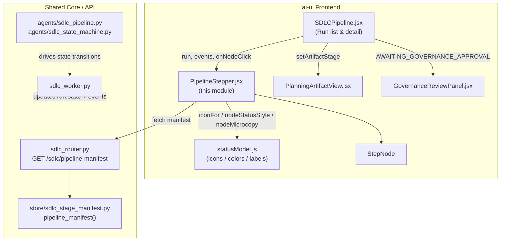
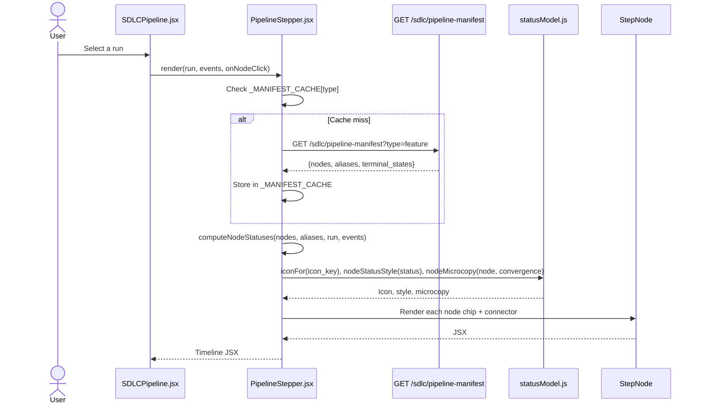
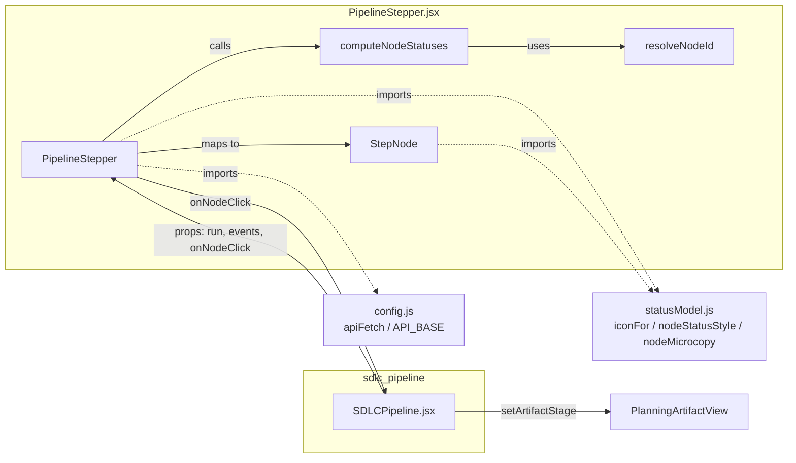
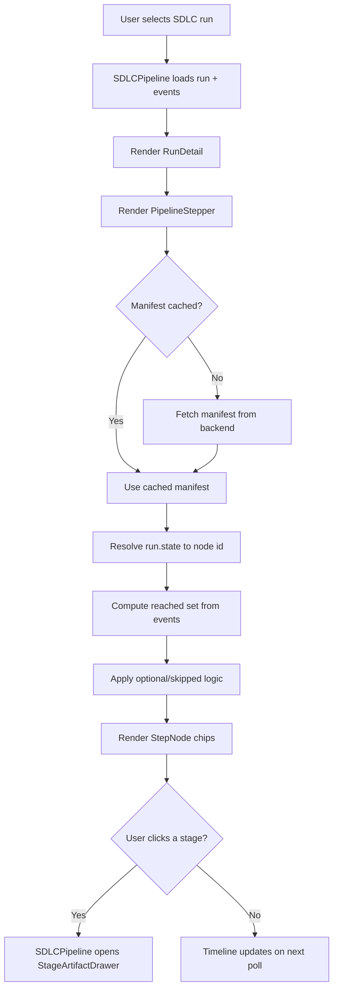

# SDLC Pipeline Stepper

## Brief Introduction

The **SDLC Pipeline Stepper** is a React component that renders the live stage timeline for an SDLC pipeline run. It replaces the earlier hand-maintained frontend stage models (`FEATURE_STAGES`, `BUG_STAGES`, `STATE_STYLE`, etc.) with a **backend-manifest-driven** approach: the canonical pipeline shape is fetched from the backend, and the component maps the run's current state plus event history onto that shape to produce a visual, interactive stepper.

By deriving everything from the backend manifest, the stepper stays automatically synchronized with pipeline evolution (new stages, renamed gates, optional governance tails, legacy-state aliases) without requiring coordinated frontend edits.

---

## Core Functionality

### 1. Manifest-Driven Timeline Rendering

`PipelineStepper` fetches the ordered stage manifest for a run type from:

```
GET {API}/sdlc/pipeline-manifest?type=<feature|bug|governance|pr_review>
```

The manifest contains:

| Field | Purpose |
|-------|---------|
| `run_type` | Normalized run type (`feature`, `bug`, `governance`, `pr_review`) |
| `nodes` | Ordered list of pipeline nodes (stages, gates, terminals) |
| `aliases` | Mapping from legacy/transient states to current node ids |
| `terminal_states` | List of terminal node ids |

Each node has: `id`, `label`, `group`, `kind` (`stage` | `gate` | `terminal`), `isGate`, `icon_key`, `optional`, and `description`.

### 2. Live Status Computation

The pure function `computeNodeStatuses(nodes, aliases, run, events)` derives a per-node status:

| Status | Meaning |
|--------|---------|
| `done` | Stage was reached and completed |
| `active` | Stage is currently executing |
| `gate` | Human-in-the-loop gate is waiting for input |
| `failed` | Run terminated in a failure state |
| `pending` | Stage not yet reached |
| `skipped` | Optional/opt-in stage that did not fire for this run |

Resolution rules:

1. **Active node resolution**: `run.state` is matched directly against node ids, then through `aliases`.
2. **Governance sub-phase re-pointing**: When `run.state === "AWAITING_GOVERNANCE_APPROVAL"`, context flags `governance_rescanning` and `governance_submitted_to_teams` re-point the active highlight to `GOVERNANCE_REVERIFY` or `GOVERNANCE_FIX` respectively.
3. **Reached-set construction**: Every `event.to_state`, `event.stage`, and `run.current_stage` is resolved and collected so previously visited nodes remain `done` even if the active pointer moved backward.
4. **Optional stage handling**: Nodes marked `optional: true` or in the client-side `OPTIONAL_STAGES` set (`GOVERNANCE_SCAN`, `GOVERNANCE_FIX`, `GOVERNANCE_REVERIFY`) that never ran are rendered as `skipped` rather than stuck `pending`.
5. **Terminal collapse**: On terminal runs, only the matching terminal node is highlighted (`done` for `COMPLETE`/`MERGED`, `failed` for others); preceding reached nodes are `done`.

### 3. Visual Node Rendering

`StepNode` renders each node as:

- An icon disc colored by status (green for done, blue pulsing for active, yellow pulsing for gate, red for failed, gray for pending/skipped).
- A label and, for active nodes, data-driven microcopy (e.g., planning convergence round info).
- A connector line to the next node (green if the source node is done).
- Click handling for non-terminal nodes to open the corresponding stage artifact drawer.

All colors, icons, labels, and microcopy come from [`sdlc_status_model.md`](sdlc_status_model.md); the stepper itself defines no styling.

### 4. Caching & Resilience

- A module-level `_MANIFEST_CACHE` keyed by run type avoids refetching the manifest across re-renders and remounts.
- Fetch cancellation and unmount guards prevent stale `setState` calls.
- Loading, error, and empty-manifest states degrade gracefully with skeletons or minimal messages rather than crashing.

---

## Architecture

### Component Hierarchy

```text
SDLCPipeline (ai-ui/src/components/SDLCPipeline.jsx)
└── RunDetail
    └── PipelineStepper (ai-ui/src/components/sdlc/PipelineStepper.jsx)
        ├── computeNodeStatuses  (pure status mapping)
        ├── resolveNodeId        (state → node id resolution)
        └── StepNode             (individual chip rendering)
            └── icon/style from statusModel.js
```

### Module Boundaries

| Concern | Owner |
|---------|-------|
| Canonical pipeline shape | Backend: [`store/sdlc_stage_manifest.py`](shared_core_sdlc_pipeline.md) |
| State colors, icons, labels, microcopy | [`sdlc_status_model.md`](sdlc_status_model.md) |
| Run/event data & polling | [`sdlc_pipeline.md`](sdlc_pipeline.md) |
| Governance approval UI | [`sdlc_governance_review.md`](sdlc_governance_review.md) |
| Gate signal badges | [`sdlc_gate_signal.md`](sdlc_gate_signal.md) |
| Planning artifact display | [`sdlc_planning_artifact.md`](sdlc_planning_artifact.md) |
| Backend pipeline execution | [`sdlc_pipeline_workers.md`](../workers/sdlc_pipeline_workers.md), [`shared_core_sdlc_pipeline.md`](shared_core_sdlc_pipeline.md) |
| API routing | [`sdlc_router.md`](../api/sdlc_router.md) |

---

## Mermaid Diagrams

### Architecture Diagram



### Data Flow: Manifest Fetch + Status Computation



### Status Computation Decision Flow

```mermaid
flowchart TD
    A[Start: computeNodeStatuses] --> B{run.state terminal?}
    B -->|Yes| C{node is terminal?}
    C -->|Yes & matches state| D[done / failed]
    C -->|Yes & not match| E[pending]
    C -->|No| F{idx <= maxReachedIdx?}
    F -->|Yes| G{optional & not reached?}
    G -->|Yes| H[skipped]
    G -->|No| I[done]
    F -->|No| J{optional?}
    J -->|Yes| H
    J -->|No| K[pending]

    B -->|No| L{activeIdx resolved?}
    L -->|Yes| M{idx === activeIdx?}
    M -->|Yes| N{isGateNode?}
    N -->|Yes| O[gate]
    N -->|No| P[active]
    M -->|No| Q{idx < activeIdx?}
    Q -->|Yes| R{optional & not reached?}
    R -->|Yes| H
    R -->|No| I
    Q -->|No| S{reached.has(node.id)?}
    S -->|Yes| I
    S -->|No| T{optional?}
    T -->|Yes| H
    T -->|No| K

    L -->|No| U{idx <= maxReachedIdx?}
    U -->|Yes| R
    U -->|No| T
```

### Component Interaction Diagram



### Process Flow: User Views a Run



---

## Key Design Decisions

1. **Backend owns the pipeline shape**: The frontend no longer hardcodes stage order or labels. Stage additions, renames, or reorderings are backend-only changes.
2. **Aliases preserve history**: Historical runs whose events contain removed stage names (e.g., `ANALYZING`, `CODING`, `REVIEWING`) still map onto the current manifest nodes, satisfying audit requirements.
3. **Pure status computation**: `computeNodeStatuses` is a pure function with no side effects, making it easy to test and reason about.
4. **No local styling**: All visual properties are imported from `statusModel.js`, ensuring consistency with badges, cards, and other SDLC panels.
5. **Graceful degradation**: Unmapped states, missing manifests, or network errors never crash the UI; they fall back to pending or a minimal message.

---

## Integration Points

### Props Interface

```jsx
<PipelineStepper
  run={run}               // SDLC run object (must include .type, .state, .context, .current_stage)
  events={events}         // Array of run events (optional; falls back to run.events)
  convergence={convergence} // Optional {round, cap, gapsLeft} for planning microcopy
  onNodeClick={(node) => { /* open stage artifact */ }}
/>
```

### Backend API Contract

- **Endpoint**: `GET /sdlc/pipeline-manifest?type=<feature|bug|governance|pr_review>`
- **Response shape**:
  ```json
  {
    "run_type": "feature",
    "planner_mode": "merged",
    "nodes": [
      { "id": "PLAN", "label": "Plan", "group": "planning", "kind": "stage", "isGate": false, "icon_key": "book-open", "optional": false, "description": "..." }
    ],
    "aliases": { "ANALYZING": "PLAN", "CODING": "IMPLEMENT" },
    "terminal_states": ["COMPLETE", "MERGED", "FAILED", "CANCELLED", "EXPIRED"]
  }
  ```

### Related Modules

- [`sdlc_pipeline.md`](sdlc_pipeline.md) — Parent dashboard that hosts the stepper.
- [`sdlc_status_model.md`](sdlc_status_model.md) — Shared status colors, icons, labels, and microcopy.
- [`sdlc_governance_review.md`](sdlc_governance_review.md) — Domain-approval gate panel.
- [`sdlc_gate_signal.md`](sdlc_gate_signal.md) — Gate signal badges shown at HITL gates.
- [`sdlc_planning_artifact.md`](sdlc_planning_artifact.md) — Planning artifact view opened via node click.
- [`shared_core_sdlc_pipeline.md`](shared_core_sdlc_pipeline.md) — Backend SDLC pipeline agents and state machine.
- [`sdlc_pipeline_workers.md`](../workers/sdlc_pipeline_workers.md) — Background workers that execute SDLC runs.
- [`sdlc_router.md`](../api/sdlc_router.md) — API router exposing the manifest endpoint.

---

## File Location

```
ai-ui/src/components/sdlc/PipelineStepper.jsx
```

Primary exports:

- `PipelineStepper` (default export) — Main timeline component.
- `StepNode` — Internal chip component (not exported publicly; kept module-private to maintain a single public surface).
