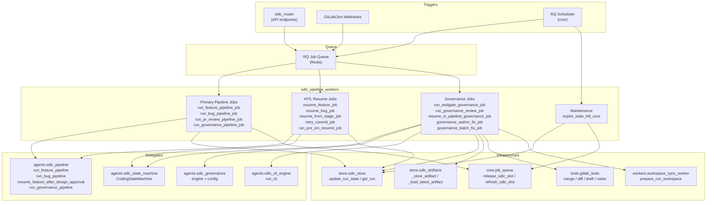
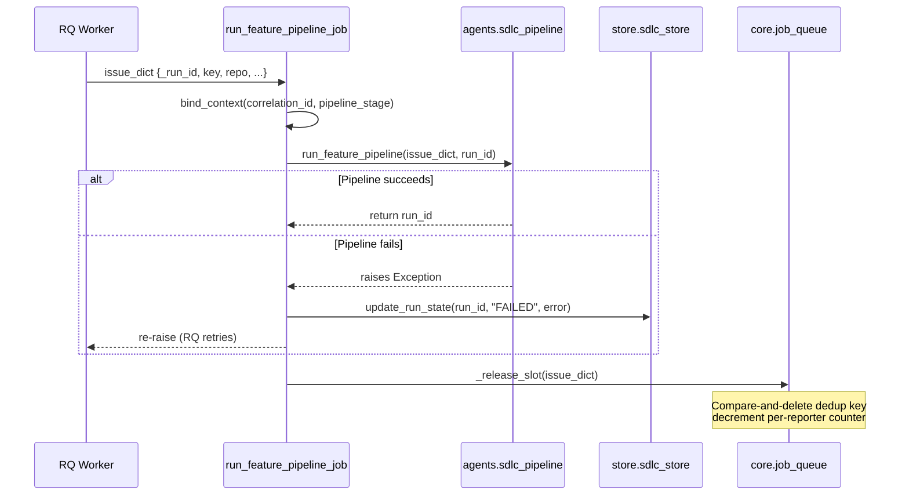
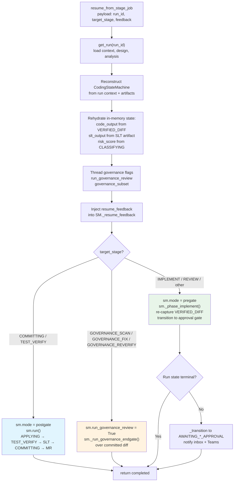
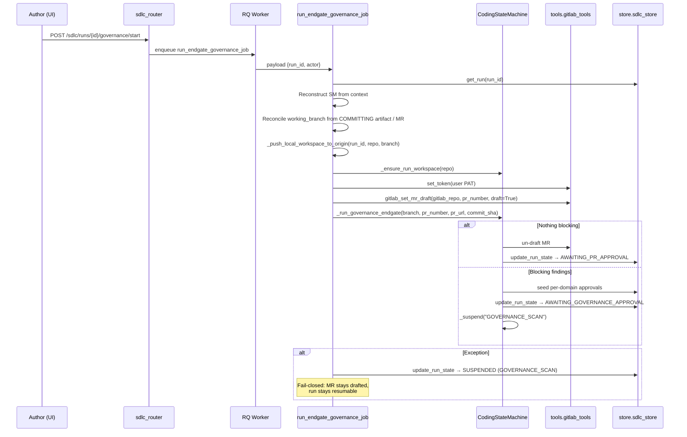
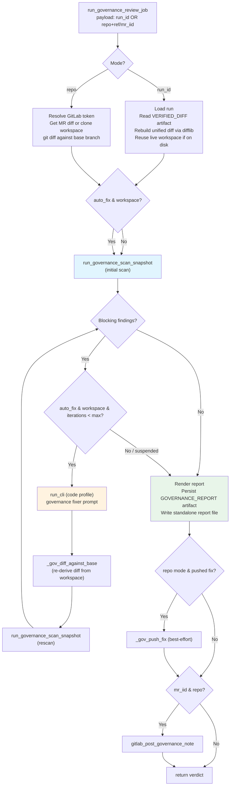
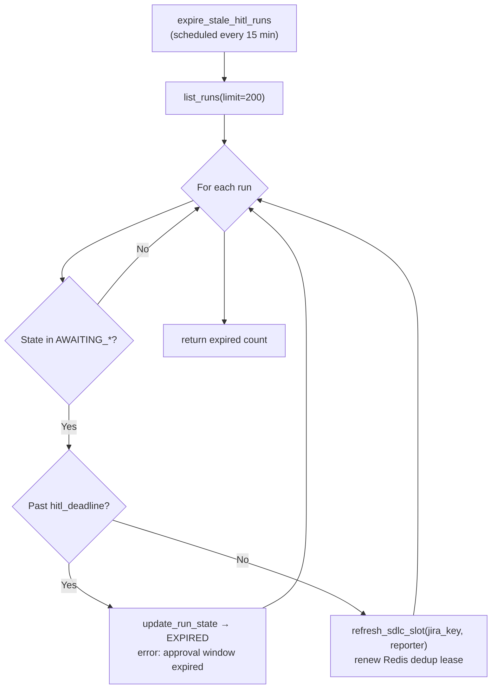
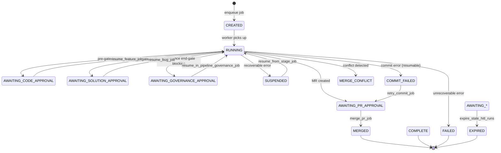
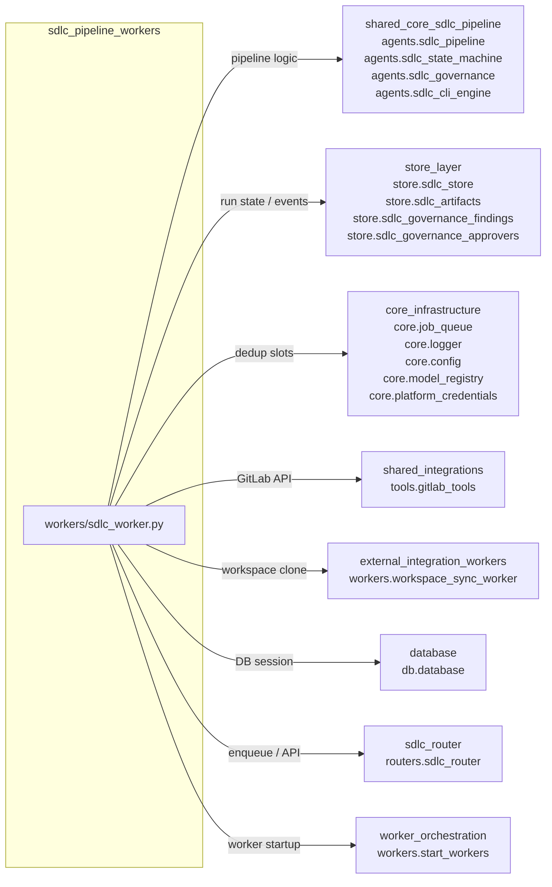

# SDLC Pipeline Workers

## Overview

The **sdlc_pipeline_workers** module (`workers/sdlc_worker.py`) is the asynchronous execution layer for the AI-driven Software Development Life Cycle (SDLC) automation system. It provides a set of **RQ (Redis Queue) job functions** that wrap the core SDLC pipeline logic, translating queued payloads into calls against the pipeline agents, state machine, governance engine, and GitLab tooling.

Every function in this module is designed to be:

- **Importable by RQ workers** — each is a top-level callable with a serializable payload.
- **Idempotent & resumable** — terminal-state bail-outs, dedup-slot release, and suspend-not-fail semantics ensure safe retries.
- **Context-aware** — structured logging via `bind_context` / `clear_bound_context` with `correlation_id` and `pipeline_stage`.
- **Fail-safe** — exceptions update the run state to `FAILED` (or `SUSPENDED` for recoverable phases) and re-raise so RQ can retry; `SDLCCancelled` is caught gracefully.

The workers do **not** contain business logic themselves — they are thin orchestration wrappers that delegate to the [shared_core_sdlc_pipeline](../sdlc/shared_core_sdlc_pipeline.md) agents and the [store_layer](../storage/store_layer.md) persistence layer.

---

## Module Architecture



---

## Core Responsibilities

| Responsibility | Description |
|---|---|
| **Pipeline execution** | Launch full feature, bug, PR-review, and governance-scan pipelines from queued jobs. |
| **HITL resume** | Resume pipelines after human-in-the-loop approval gates (design, solution, code, PR, governance). |
| **Stage-level resume** | Reconstruct the `CodingStateMachine` from durable artifacts and resume at a specific stage (pre-gate implement, post-gate apply, governance end-gate). |
| **Governance end-gate** | Run author-triggered governance scans over committed MR diffs, with bounded auto-fix loops and MR draft management. |
| **Commit retry & merge** | Replay the commit phase from durable artifacts; merge approved MRs. |
| **Stale HITL expiration** | Watchdog that expires runs past their approval deadline and renews dedup slots for active gates. |
| **Dedup slot lifecycle** | Release per-Jira-key and per-reporter concurrency slots after every pipeline outcome. |

---

## Component Reference

### Primary Pipeline Jobs

| Function | Payload | Delegates To | Description |
|---|---|---|---|
| `run_feature_pipeline_job` | `issue_dict` (Jira issue + `_run_id`) | `agents.sdlc_pipeline.run_feature_pipeline` | Full feature SDLC pipeline: preflight → baseline → normalize → classify → plan → implement → review → commit. |
| `run_bug_pipeline_job` | `issue_dict` | `agents.sdlc_pipeline.run_bug_pipeline` | Full bug-fix SDLC pipeline with solution-approval gate. |
| `run_pr_review_pipeline_job` | `pr_dict` (PR metadata + `_run_id`) | `agents.sdlc_pipeline.run_pr_review_pipeline` | PR review pipeline. Acquires a Redis lock (`pr_review:running:{run_id}`) to prevent double-execution with inline webhook threads. |
| `run_governance_pipeline_job` | `issue_dict` | `agents.sdlc_pipeline.run_governance_pipeline` | Standalone governance scan pipeline (not tied to a feature/bug run). |

### HITL Resume & Revision Jobs

| Function | Payload Keys | Delegates To | Description |
|---|---|---|---|
| `resume_feature_job` | `run_id`, `feedback` | `resume_feature_after_design_approval` | Resume feature pipeline after design approval. |
| `resume_bug_job` | `run_id`, `feedback` | `resume_bug_after_solution_approval` | Resume bug pipeline after solution approval. |
| `resume_feature_revision_job` | `run_id`, `feedback` | `run_feature_revision` | Run a requested feature revision cycle. |
| `resume_bug_revision_job` | `run_id`, `feedback` | `run_bug_revision` | Run a requested bug revision cycle. |
| `resume_pr_approval_job` | `run_id` | `resume_after_pr_approval` | Post-PR-approval cleanup: mark complete, notify. |
| `run_pre_sm_resume_job` | `run_id`, `start_at` | `resume_pre_sm_pipeline` | Re-entrant pre-state-machine resume (gate-reorder). Skips already-durable phases instead of restarting. |
| `resume_from_stage_job` | `run_id`, `target_stage`, `mode`, `feedback`, `actor`, `reason` | `CodingStateMachine` (reconstructed) | Generic stage resume. Rehydrates artifacts, reconstructs the SM, and routes to pre-gate implement, post-gate apply, or governance end-gate based on `target_stage`. |
| `retry_commit_job` | `run_id` | `CodingStateMachine.resume_commit` | Replay only the COMMITTING phase from durable `CODING`/`SLT` artifacts. Idempotent: branch reuse, create↔update flips, MR `_find_existing_mr`. |

### Governance Jobs

| Function | Payload Keys | Description |
|---|---|---|
| `run_endgate_governance_job` | `run_id`, `actor` | Author-triggered governance end-gate. Rehydrates the SM, reconciles the working branch, pushes local workspace to origin, re-drafts the MR, and runs `_run_governance_endgate` over the committed diff. |
| `run_governance_review_job` | `run_id` *or* `repo`+`ref`/`mr_iid`, `auto_fix`, `governance_skills`, `product_id` | Standalone governance review (report-first; optional bounded auto-fix). Two modes: **run_id mode** (diff from `VERIFIED_DIFF` artifact) and **repo mode** (diff from GitLab MR or fresh clone). Persists `GOVERNANCE_REPORT` artifact and standalone report file; posts MR note. |
| `resume_in_pipeline_governance_job` | `run_id`, `actor` | Resume a feature/bug run from `AWAITING_GOVERNANCE_APPROVAL` after all domains are approved. |
| `resume_governance_fix_job` | `run_id`, `actor` | Resume governance fix after all domains approved (standalone governance run). |
| `trigger_domain_fix_job` | `run_id`, `domain`, `actor`, `fix_instructions` | Run auto-fixer for one governance domain after author requests it. |
| `governance_author_fix_job` | `run_id`, `fingerprint`, `actor` | Bounded author remediation loop for a single finding (auto-fix + re-scan + convergence). |
| `governance_batch_fix_job` | `run_id`, `fingerprints`, `actor` | Bounded fixer session over a batch of findings the author explicitly asked to fix. |

### PR Comment & Merge Jobs

| Function | Payload Keys | Description |
|---|---|---|
| `address_pr_comments_job` | `run_id`, `repo`, `pr_number` | AI addresses reviewer comments on a PR via `address_pr_review_comments`. |
| `merge_pr_job` | `run_id`, `repo` (optional), `pr_number` (optional) | Merge an approved MR via `gitlab_merge_mr`. Looks up missing repo/PR from the run record. Transitions to `MERGED`. |

### Maintenance

| Function | Schedule | Description |
|---|---|---|
| `expire_stale_hitl_runs` | Every 15 min (RQ scheduler) | Scans all `AWAITING_*` runs. Expires those past `hitl_deadline` → `EXPIRED`. Renews Redis dedup/rate-limit slots for still-active gates via `refresh_sdlc_slot`. |

### Internal Helpers

| Function | Purpose |
|---|---|
| `_release_slot` | Releases the SDLC dedup + user-counter slot after any pipeline outcome. Compare-and-deletes by owner (`run_id` or job ID). |
| `_gov_bool` | Defensive bool coercion for JSONB-round-tripped values. |
| `_gov_resolve_and_set_gitlab_token` | Resolves and sets the per-thread GitLab token for standalone governance jobs. |
| `_gov_clone_workspace` | Materializes a throwaway workspace for standalone governance review/fix using `prepare_run_workspace`. |
| `_gov_diff_against_base` | `git diff` the current checkout against `origin/<base>`. Best-effort, never raises. |
| `_gov_push_fix` | Commit + push a governance fixer round's changes to the source branch. Best-effort. |
| `_push_local_workspace_to_origin` | Ensures the run's local workspace commits/edits are on `origin/<branch>` before the governance end-gate re-clones fresh. |

---

## Data Flow

### Feature / Bug Pipeline Job



### Stage-Level Resume (`resume_from_stage_job`)

This is the most complex worker function — it reconstructs the `CodingStateMachine` from durable artifacts and routes to different execution paths based on `target_stage`.



### Governance End-Gate Job



### Standalone Governance Review Job



### Stale HITL Expiration



---

## State Management & Error Handling

### Run State Transitions Driven by Workers



### Error Handling Patterns

| Pattern | Implementation | Example |
|---|---|---|
| **Suspend-not-fail** | Recoverable errors (commit, governance workspace) transition to `SUSPENDED` or `COMMIT_FAILED` instead of `FAILED`, keeping the run resumable. | `retry_commit_job` → `COMMIT_FAILED` on error |
| **Fail-closed governance** | Governance end-gate errors suspend at `GOVERNANCE_SCAN` with the MR staying drafted — never lets a change merge without sign-off. | `run_endgate_governance_job` exception handler |
| **Terminal-state bail** | Jobs that pick up a run already in a terminal state (`COMPLETE`, `MERGED`, `FAILED`, `CANCELLED`, `EXPIRED`) skip execution. | `retry_commit_job` terminal check |
| **SDLCCancelled** | Out-of-band cancellation raises `SDLCCancelled`, caught gracefully — state stays `CANCELLED`, no branch/MR created. | `resume_from_stage_job`, `run_governance_pipeline_job` |
| **Slot release** | `_release_slot` runs in `finally` blocks to guarantee dedup slots are freed regardless of outcome. | `run_feature_pipeline_job`, `run_bug_pipeline_job` |
| **Idempotent re-entry** | Branch reuse (409 → reuse), `gitlab_batch_commit` create↔update flips, `gitlab_create_mr` `_find_existing_mr`. | `retry_commit_job`, `merge_pr_job` |

---

## Dependencies



### Key Dependency Details

| Dependency | Module Reference | Usage |
|---|---|---|
| `agents.sdlc_pipeline` | [shared_core_sdlc_pipeline](../sdlc/shared_core_sdlc_pipeline.md) | All pipeline entry points: `run_feature_pipeline`, `run_bug_pipeline`, `run_pr_review_pipeline`, `resume_*`, `run_governance_*`, `address_pr_review_comments`, `_resolve_gitlab_repo`, `_gov_resolve_gitlab_token`, `run_governance_scan_snapshot` |
| `agents.sdlc_state_machine.CodingStateMachine` | [shared_core_sdlc_pipeline](../sdlc/shared_core_sdlc_pipeline.md) | Reconstructed in `resume_from_stage_job`, `retry_commit_job`, `run_endgate_governance_job` for stage-level resume and governance end-gate execution |
| `agents.sdlc_governance` (engine, config) | [shared_core_sdlc_pipeline](../sdlc/shared_core_sdlc_pipeline.md) | Governance skill selection, fix-prompt building, report rendering, `max_iters()`, `parse_subset()` |
| `agents.sdlc_cli_engine` | [shared_core_sdlc_pipeline](../sdlc/shared_core_sdlc_pipeline.md) | `run_cli` for governance fixer loops in standalone review |
| `store.sdlc_store` | [store_layer](../storage/store_layer.md) | `get_run`, `update_run_state`, `add_run_event`, `list_runs`, `SDLCCancelled` |
| `store.sdlc_artifacts` | [store_layer](../storage/store_layer.md) | `_store_artifact`, `_load_latest_artifact`, `compute_input_hash` for `GOVERNANCE_REPORT` persistence |
| `core.job_queue` | [core_infrastructure](../core/core_infrastructure.md) | `release_sdlc_slot`, `refresh_sdlc_slot` for dedup/concurrency control |
| `tools.gitlab_tools` | [shared_integrations](../skills/shared_integrations.md) | `gitlab_merge_mr`, `gitlab_get_mr_diff`, `gitlab_set_mr_draft`, `gitlab_post_governance_note`, `gitlab_get_project_clone_url`, `set_token` |
| `workers.workspace_sync_worker` | [external_integration_workers](../workers/external_integration_workers.md) | `prepare_run_workspace` for governance workspace materialization |
| `db.database` | [database](../storage/database.md) | `SessionLocal` for governance product-ID resolution |

---

## Integration Points

### Upstream: How Jobs Are Enqueued

Jobs are enqueued by the [sdlc_router](sdlc_router.md) API endpoints and webhook handlers. The router validates payloads, pre-creates run records, acquires dedup slots, and enqueues the appropriate worker function via `core.job_queue.enqueue_sdlc_job` or `enqueue_hitl_resume_job`.

| Router Endpoint | Worker Function |
|---|---|
| `POST /sdlc/feature` (`_bg_feature`) | `run_feature_pipeline_job` |
| `POST /sdlc/bug` (`_bg_bug`) | `run_bug_pipeline_job` |
| `POST /sdlc/pr-review` (`_bg_pr_review`) | `run_pr_review_pipeline_job` |
| `POST /sdlc/runs/{id}/resume` | `resume_feature_job` / `resume_bug_job` / `resume_from_stage_job` |
| `POST /sdlc/runs/{id}/retry-commit` | `retry_commit_job` |
| `POST /sdlc/runs/{id}/governance/start` | `run_endgate_governance_job` |
| `POST /sdlc/governance/review` | `run_governance_review_job` |
| `POST /sdlc/runs/{id}/governance/resume` | `resume_in_pipeline_governance_job` / `resume_governance_fix_job` |
| `POST /sdlc/runs/{id}/governance/domain-fix` | `trigger_domain_fix_job` |
| `POST /sdlc/runs/{id}/governance/author-fix` | `governance_author_fix_job` |
| `POST /sdlc/runs/{id}/governance/run-fixes` | `governance_batch_fix_job` |
| `POST /sdlc/runs/{id}/merge` | `merge_pr_job` |
| `POST /sdlc/runs/{id}/address-comments` | `address_pr_comments_job` |

### Downstream: Worker Orchestration

Worker processes are started by [worker_orchestration](../workers/worker_orchestration.md) (`workers/start_workers.py`), which spawns RQ worker processes that consume the SDLC queue. The `expire_stale_hitl_runs` function is registered as a scheduled cron job within the same orchestration layer.

### Event Consumption

SDLC state-change events produced by `store.sdlc_store.update_run_state` are consumed by the [kafka_event_consumer](../workers/kafka_event_consumer.md) (`_handle_sdlc_events`) for audit trails and secondary writes.

---

## Key Design Patterns

### 1. Thin Wrapper / Delegate Pattern

Every worker function follows the same structure:

```
bind_context → delegate to agents.sdlc_pipeline → catch SDLCCancelled → catch Exception (update_run_state FAILED) → finally (_release_slot)
```

This keeps business logic in the agent layer and makes workers testable in isolation.

### 2. Artifact-Driven Resume

The `CodingStateMachine` is **stateless across process boundaries** — all state is persisted as stage artifacts (`VERIFIED_DIFF`, `SLT`, `CLASSIFYING`, `COMMITTING`, `GOVERNANCE_REPORT`). Resume jobs reconstruct the SM and rehydrate in-memory fields from these artifacts:

- `code_output` ← derived from `VERIFIED_DIFF` edits
- `slt_output` ← `SLT` artifact
- `_risk_score` ← `CLASSIFYING` artifact
- Governance flags ← run context (`run_governance_review`, `governance_skills`)

### 3. Report-First Governance

`run_governance_review_job` never forces a pipeline suspend — it generates a report first, then optionally runs a bounded auto-fix loop. This separates governance *observation* from governance *enforcement* (which lives in `CodingStateMachine._run_governance_endgate`).

### 4. Per-User Credential Isolation

All GitLab operations use the triggering user's PAT via thread-local `set_token`, never mutating the global `GITLAB_TOKEN` env var. This is resolved via `core.platform_credentials.get_gitlab_token` and applied at the start of governance and commit jobs.

### 5. Empty-Diff Guard

The governance end-gate includes an explicit empty-diff guard: if the freshly-cloned working branch has no changes over its base (typically due to unpushed local commits), the job suspends with an actionable message rather than producing a false-green scan.

---

## References

- [shared_core_sdlc_pipeline](../sdlc/shared_core_sdlc_pipeline.md) — Core SDLC pipeline agents, state machine, governance engine, and CLI engine
- [store_layer](../storage/store_layer.md) — Run state persistence, stage artifacts, governance findings/approvers
- [core_infrastructure](../core/core_infrastructure.md) — Job queue, logging, config, model registry, platform credentials
- [shared_integrations](../skills/shared_integrations.md) — GitLab tools, Jira tools, and other connector adapters
- [external_integration_workers](../workers/external_integration_workers.md) — Workspace sync worker for per-run git clone management
- [database](../storage/database.md) — SQLAlchemy session management and SDLC run models
- [sdlc_router](sdlc_router.md) — API endpoints that enqueue these worker jobs
- [worker_orchestration](../workers/worker_orchestration.md) — RQ worker process startup and cron scheduling
- [kafka_event_consumer](../workers/kafka_event_consumer.md) — Consumes SDLC state-change events for audit
